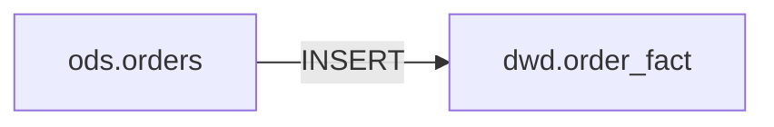

# SQL 血缘解析器

解析 SQL 语句和存储过程，提取表级和字段级数据血缘关系。

## 核心能力

| 能力       | 说明                                 |
| ---------- | ------------------------------------ |
| 多方言支持 | MySQL、Oracle、Hive（基于 sqlglot）  |
| 表级血缘   | 识别源表和目标表                     |
| 字段级血缘 | 追踪字段来源和转换逻辑               |
| 增量比对   | 对比两个版本的血缘差异               |
| 影响分析   | 评估变更对下游的影响                 |
| 多种输出   | JSON、Mermaid 图、Atlas/DataHub 格式 |

## 工作流

### 1. 解析 SQL 血缘

```python
# 使用 scripts/parse_lineage.py
from parse_lineage import parse_sql, parse_procedure, to_json

# 单条 SQL
result = parse_sql("""
    INSERT INTO dwd.order_fact 
    SELECT o.id, o.price * o.qty as amount 
    FROM ods.orders o
""", dialect="mysql")

print(to_json(result))

# 存储过程
results = parse_procedure(procedure_code, dialect="oracle")
```

命令行用法：
```bash
python scripts/parse_lineage.py input.sql mysql
python scripts/parse_lineage.py procedure.sql oracle
```

### 2. 生成可视化

```bash
# 表级血缘图
python scripts/visualize_lineage.py lineage.json table

# 字段级血缘图
python scripts/visualize_lineage.py lineage.json column

# 影响分析
python scripts/visualize_lineage.py lineage.json impact ods.orders
```

### 3. 增量比对

```python
from parse_lineage import parse_sql, compare_lineage

old = parse_sql(old_sql, "mysql")
new = parse_sql(new_sql, "mysql")
diff = compare_lineage(old, new)

# diff 包含: added_sources, removed_sources, added_columns, removed_columns
```

## 解析策略

1. **静态解析优先** - sqlglot 解析 AST 提取血缘
2. **降级处理** - 解析失败时按分号拆分逐句分析
3. **置信度评估** - 每个结果附带置信度 0-1
4. **LLM 辅助** - 复杂场景（动态 SQL）可提交 LLM 分析

## 复杂场景处理

- **子查询/CTE**: 递归展开
- **UNION**: 合并所有分支源表
- **CASE WHEN**: 标记 transform_type 为 CASE_WHEN
- **动态 SQL**: 标记低置信度，建议人工复核

详细参考:
- [dialect-patterns.md](references/dialect-patterns.md) - 各数据库方言特殊语法
- [complex-cases.md](references/complex-cases.md) - 复杂场景处理策略
- [output-schema.md](references/output-schema.md) - 输出格式规范

## 依赖

```bash
pip install sqlglot
```

## 输出格式

### JSON 结构
```json
{
  "statement_type": "INSERT",
  "target_table": "dwd.order_fact",
  "source_tables": ["ods.orders"],
  "column_lineages": [
    {
      "source_table": "ods.orders",
      "source_column": "id",
      "target_column": "order_id",
      "transform_type": "DIRECT"
    }
  ],
  "sql_hash": "a1b2c3d4",
  "confidence": 0.95
}
```

### Mermaid 表级图


### 影响分析报告
```json
{
  "changed_table": "ods.orders",
  "all_affected": ["dwd.order_fact", "ads.report"],
  "affected_count": 2,
  "risk_level": "LOW"
}
```

## LLM 辅助分析

当静态解析置信度 < 0.7 时，使用以下 prompt 模板请求 LLM 辅助：

```
分析以下 SQL 的数据血缘关系：

```sql
{sql_code}
```

请识别：
1. 所有源表和目标表
2. 字段级转换关系（DIRECT/EXPRESSION/AGGREGATE/CASE_WHEN/WINDOW）
3. 动态 SQL 或条件分支

输出 JSON 格式，包含 statement_type, target_table, source_tables, column_lineages
```
