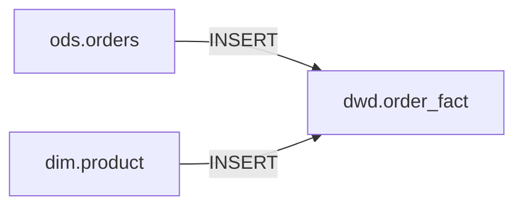
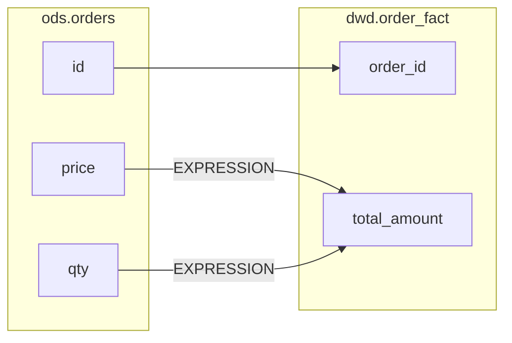

# 输出格式规范

本文档定义血缘分析的标准输出格式。

## 目录
- [JSON 输出格式](#json-输出格式)
- [平台集成格式](#平台集成格式)
- [Mermaid 图格式](#mermaid-图格式)

---

## JSON 输出格式

### 单条 SQL 血缘
```json
{
  "statement_type": "INSERT",
  "target_table": "dwd.order_fact",
  "source_tables": ["ods.orders", "dim.product"],
  "column_lineages": [
    {
      "source_table": "ods.orders",
      "source_column": "id",
      "target_column": "order_id",
      "transform_type": "DIRECT",
      "expression": null,
      "confidence": 1.0
    },
    {
      "source_table": "ods.orders",
      "source_column": "price",
      "target_column": "total_amount",
      "transform_type": "EXPRESSION",
      "expression": "price * qty",
      "confidence": 0.95
    }
  ],
  "sql_hash": "a1b2c3d4e5f6",
  "confidence": 0.95,
  "warnings": []
}
```

### 字段说明

| 字段              | 类型           | 说明                                                    |
| ----------------- | -------------- | ------------------------------------------------------- |
| `statement_type`  | string         | SQL 类型: SELECT, INSERT, UPDATE, DELETE, MERGE, CREATE |
| `target_table`    | string \| null | 目标表，SELECT 语句为 null                              |
| `source_tables`   | string[]       | 源表列表                                                |
| `column_lineages` | array          | 字段级血缘列表                                          |
| `sql_hash`        | string         | SQL 内容 MD5 哈希（用于增量比对）                       |
| `confidence`      | float          | 解析置信度 0-1                                          |
| `warnings`        | string[]       | 解析警告信息                                            |

### transform_type 枚举

| 值           | 说明                           |
| ------------ | ------------------------------ |
| `DIRECT`     | 直接映射，无转换               |
| `EXPRESSION` | 表达式计算（算术、字符串等）   |
| `AGGREGATE`  | 聚合函数（SUM, COUNT, AVG 等） |
| `CASE_WHEN`  | 条件逻辑                       |
| `WINDOW`     | 窗口函数                       |
| `UNKNOWN`    | 无法识别的转换                 |

---

## 平台集成格式

### Apache Atlas 格式
```json
{
  "typeName": "Process",
  "attributes": {
    "qualifiedName": "proc_order_fact_etl",
    "inputs": [
      {"typeName": "Table", "uniqueAttributes": {"qualifiedName": "ods.orders"}},
      {"typeName": "Table", "uniqueAttributes": {"qualifiedName": "dim.product"}}
    ],
    "outputs": [
      {"typeName": "Table", "uniqueAttributes": {"qualifiedName": "dwd.order_fact"}}
    ]
  }
}
```

### DataHub 格式
```json
{
  "lineage": {
    "upstreamType": "DATASET",
    "upstreams": [
      "urn:li:dataset:(urn:li:dataPlatform:mysql,ods.orders,PROD)",
      "urn:li:dataset:(urn:li:dataPlatform:mysql,dim.product,PROD)"
    ],
    "downstreamType": "DATASET", 
    "downstreams": [
      "urn:li:dataset:(urn:li:dataPlatform:mysql,dwd.order_fact,PROD)"
    ]
  }
}
```

### OpenLineage 格式
```json
{
  "eventType": "COMPLETE",
  "job": {"name": "order_fact_etl"},
  "inputs": [
    {"namespace": "mysql", "name": "ods.orders"},
    {"namespace": "mysql", "name": "dim.product"}
  ],
  "outputs": [
    {"namespace": "mysql", "name": "dwd.order_fact"}
  ]
}
```

---

## Mermaid 图格式

### 表级血缘图


### 字段级血缘图


---

## 影响分析报告

```json
{
  "changed_table": "ods.orders",
  "direct_downstream": ["dwd.order_fact", "dwd.order_summary"],
  "all_affected": ["dwd.order_fact", "dwd.order_summary", "ads.order_report", "ads.daily_kpi"],
  "affected_count": 4,
  "dependencies": ["src.order_raw", "dim.time"],
  "risk_level": "MEDIUM"
}
```

| risk_level | 条件              |
| ---------- | ----------------- |
| LOW        | 影响 ≤2 个下游表  |
| MEDIUM     | 影响 3-5 个下游表 |
| HIGH       | 影响 >5 个下游表  |
