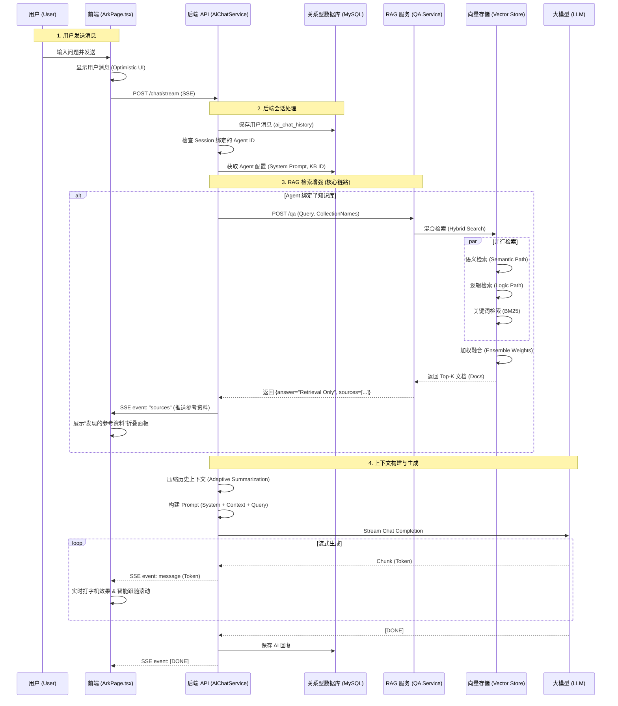

# Urgs Agent RAG System Flow

本文档详细描述了 Urgs 系统中 Agent 从前端交互到后端 API、RAG 服务再到向量数据库的完整调用链路。

## 1. 整体架构时序图 (Architecture Sequence)

## 2. 详细代码链路分析 (Code Walkthrough)

### 第一阶段：前端交互 (Frontend)
- **文件**: `urgs-web/src/components/ark/ArkPage.tsx`
- **动作**: 用户点击发送。
- **关键逻辑**:
    - `handleSubmit`: 创建临时的 User 和 Assistant 消息对象。
    - `streamChatResponse`: 发起 SSE 请求，监听 `onChunk` (内容) 和 `onSources` (RAG 源)。
    - **UI 特效**: 利用 `messagesEndRef` 和 `isAtBottom` 实现智能跟随滚动。

### 第二阶段：后端编排 (Backend API)
- **文件**: `urgs-api/.../ai/service/AiChatServiceImpl.java`
- **方法**: `streamChatWithPersistence`
- **关键逻辑**:
    1.  **Agent 识别**: 根据 `sessionId` 查找 `Agent` 配置。
    2.  **RAG 触发**: 如果 Agent 配置了 `KnowledgeBase`，调用 `ragService.query()`。
    3.  **源推送**: 收到 RAG 结果后，通过 `emitter.send(event().name("sources")...)` 立即推送到前端，让用户在等待生成时就能看到参考资料。
    4.  **上下文组装**: 将 RAG 返回的文本追加到 `userPrompt` 中，形成增强的 Prompt。
    5.  **LLM 生成**: 调用大模型进行流式回答。

### 第三阶段：RAG 服务 (Python Service)
- **文件**: `urgs-rag/app/services/qa_service.py`
- **方法**: `answer_question`
- **关键逻辑**:
    - 接收 Java 端的 `ragReq` (Query, CollectionNames)。
    - 调用 `vector_store_service.similarity_search`。
    - **优化点**: 此处不再调用 LLM 生成，仅返回检索结果 (`answer="Retrieval Only"`)，大幅降低延迟。

### 第四阶段：向量检索 (Vector Store)
- **文件**: `urgs-rag/app/services/vector_store.py`
- **方法**: `similarity_search` -> `ensemble_retriever`
- **关键逻辑 (混合检索策略)**:
    - **BM25 (40%)**: 关键词匹配，确保专有名词（如系统代码、特定术语）由于精确匹配而被召回。
    - **Semantic (30%)**: 向量语义匹配，理解问题的意图（Path 1: 语义路径）。
    - **Logic (30%)**: 逻辑推导匹配（Path 2: 逻辑/范式路径）。
    - **Top-K**: 最终返回前 10 个最相关的**父文档** (Parent Document) 给后端。
