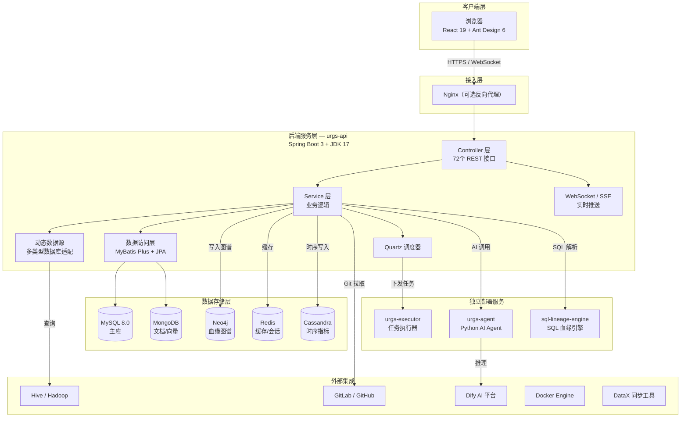
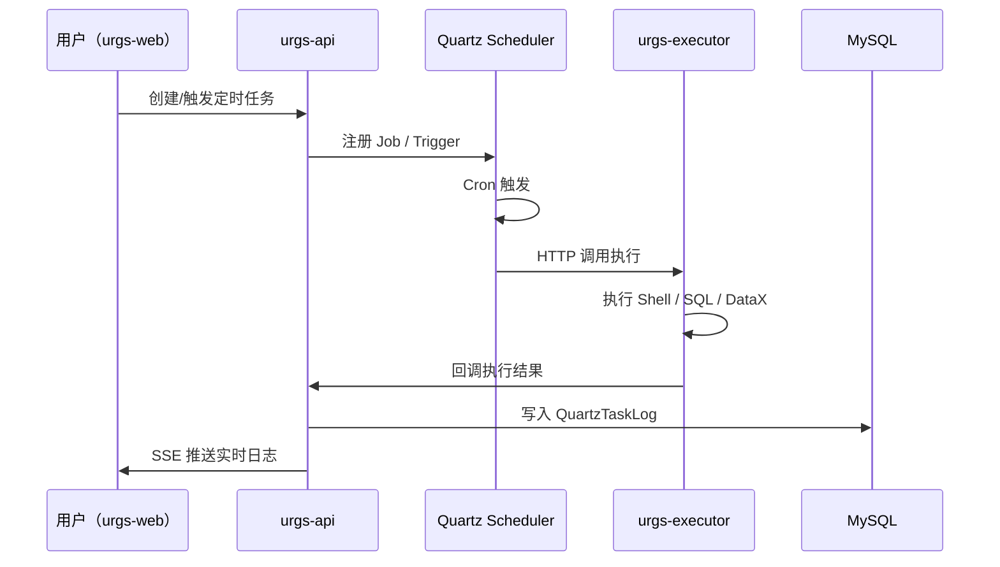
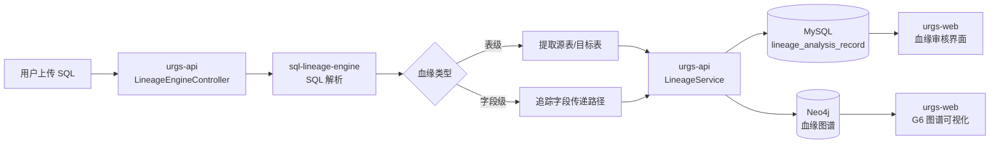
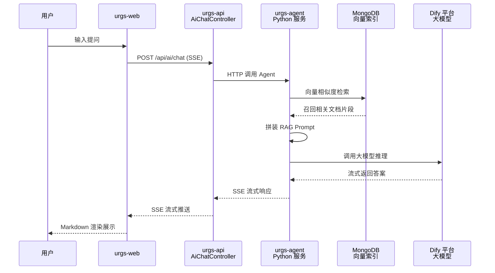
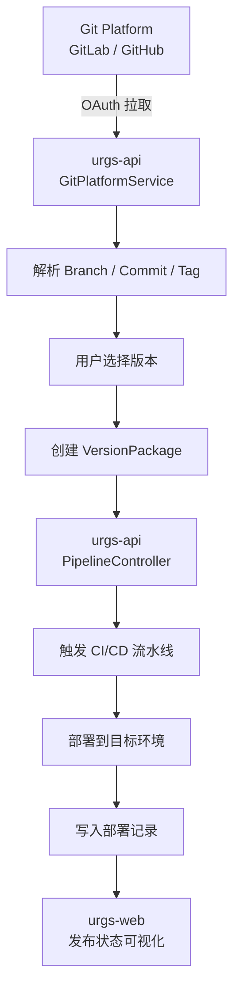
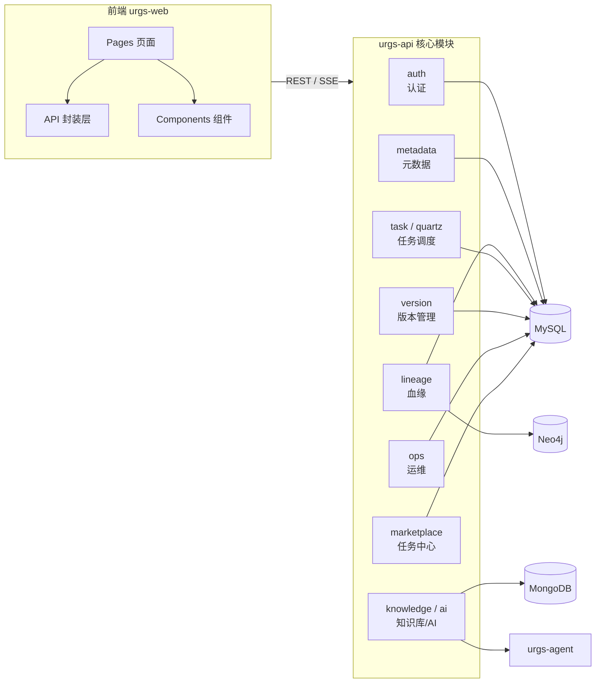

# URGS 系统架构图（Mermaid）

> 使用 Mermaid 绘制，可在 GitHub、VS Code、Obsidian 等工具中直接渲染。

---

## 1. 系统总体架构

---

## 2. 任务调度数据流

---

## 3. SQL 血缘分析数据流

---

## 4. AI 知识库问答数据流

---

## 5. 版本发布数据流

---

## 6. 模块依赖关系

---

## 7. 数据库 Schema 演进（Flyway 迁移）

```mermaid
graph LR
    V1["V1 Initial Schema<br/>基础表结构"]
    V13["V13 Knowledge Tables<br/>知识库表"]
    V20["V20 Lineage Record<br/>血缘分析记录"]
    V41["V41 Metric Tables<br/>指标管理"]
    V49["V49 Quartz Task Tables<br/>定时任务"]
    V54["V54 Lineage Review<br/>血缘审核"]
    V72["V72 Agent Build Mode<br/>Agent 构建模式"]
    V76["V76 Reg Asset Bindings<br/>资产物理绑定"]
    V77["V77 Infra System Manual<br/>基础设施手册"]

    V1 --> V13 --> V20 --> V41 --> V49 --> V54 --> V72 --> V76 --> V77
```

---

*以上图表使用 Mermaid 语法，在 GitHub README、VS Code 预览、Obsidian 等环境中可直接渲染。*
