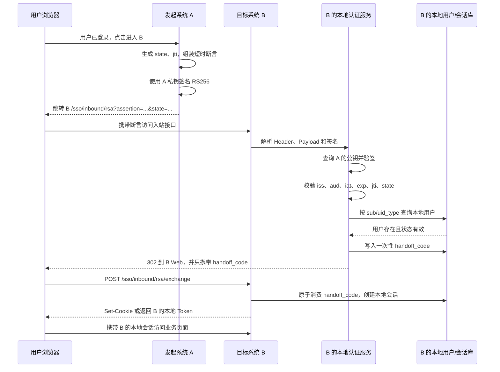

# 多系统 RSA 单点登录技术方案

## 1. 方案定位

本文设计一套统一的跨系统 RSA 单点登录协议，使每个接入系统都具备两种能力：

- 作为发起方：用户已登录本系统，点击菜单进入其他系统。
- 作为接收方：用户已登录其他系统，点击菜单免登录进入本系统。

本文以当前 URGS 的 RSA 入站能力为兼容基础，但不建议把“用公钥加密 `empId`”直接复制到所有生产系统。加密只能保证内容在传输过程中的保密性，不能证明 `ssoToken` 是哪个系统发出的。生产标准应采用 RSA 数字签名的短时身份断言，并配合一次性票据、用户映射和重放校验。

## 2. 建设目标与范围

### 2.1 建设目标

1. 统一系统间 SSO 请求、身份字段、密钥管理和错误规则。
2. 每个系统可以独立验证入站断言，不把其他系统的私钥交给第三方。
3. 支持浏览器菜单跳转和服务端接口换票两种模式。
4. 支持多环境、多节点、密钥轮换和一次性防重放。
5. 保留 URGS 当前 `/api/auth/sso/rsa` 方案，平滑迁移旧系统。
6. 让 Java、Node.js、Python 等技术栈可以按同一协议实现。

### 2.2 不在范围内

- 不共享各系统的用户名和密码。
- 不要求所有系统共用同一种本地 Session 或 JWT。
- 不把 URGS 业务权限直接复制到其他系统；每个系统仍负责本地权限判断。
- 不默认把入站 SSO 开放到公网；生产接入需要 HTTPS、网络访问控制和审计。

## 3. 核心概念和信任关系

| 概念 | 说明 |
| --- | --- |
| 发起系统 `issuer` | 用户当前已登录的系统，负责产生短时身份断言 |
| 目标系统 `audience` | 用户要进入的系统，负责验证断言、映射本地用户并建立本地会话 |
| `subject` | 跨系统用户唯一标识，URGS 当前使用 `empId` |
| `kid` | 公钥版本标识，用于密钥轮换 |
| `jti` | 本次登录断言的唯一编号，用于一次性防重放 |
| `state` | 发起方生成的随机状态值，用于回跳关联和 CSRF 防护 |
| 本地会话 | 目标系统自己的 Cookie、Session 或 Bearer Token，不跨系统直接复用 |

信任关系如下：

```text
发起系统 A
  A 的签名私钥只保存在 A
  A 的签名公钥登记到目标系统 B
        |
        |  A 使用私钥签名短时断言
        v
目标系统 B
  用 A 的公钥验签
  校验 iss / aud / exp / jti
  按 subject 映射本地用户并创建本地会话
```

如果需要对身份内容做额外保密，可以在 HTTPS 之外增加目标系统公钥加密；但“身份认证”必须以签名验证为核心，不能只依赖加密。

## 4. 协议版本设计

### 4.1 V1：兼容当前 URGS 的 RSA 加密模式

当前 URGS 支持：

```text
外部系统使用 URGS 公钥加密 empId
    -> GET/POST /api/auth/sso/rsa
    -> URGS 私钥解密
    -> 查询 sys_user.emp_id
    -> 签发 URGS 会话 Token
```

V1 的适用范围：

- 已经联调完成的可信内网系统。
- 只需要快速兼容现有 URGS 接口的系统。
- 迁移过渡期。

V1 的明确限制：

- 任何拿到目标系统公钥的调用方都能构造密文。
- 没有 `issuer`、`audience`、过期时间和 `jti`。
- 同一密文可以重复使用并重复签发本地会话。
- GET 模式会把 URGS Token 放入浏览器 URL 进行交接。

V1 不应作为新系统的长期生产标准。

### 4.2 V2：推荐的 RSA 签名断言模式

V2 使用 `RS256`（`SHA256withRSA`）签署短时身份断言。断言格式采用 JWS Compact Serialization，便于不同语言直接使用成熟库：

```text
base64url(header).base64url(payload).base64url(signature)
```

Header 示例：

```json
{
  "alg": "RS256",
  "typ": "JWT",
  "kid": "URGS-PROD-2026-01"
}
```

Payload 示例：

```json
{
  "iss": "URGS",
  "aud": "AML",
  "sub": "001001",
  "uid_type": "empId",
  "jti": "0f0c2d4b-3e6f-4a6b-9a0a-7c4c6f0b5d20",
  "iat": 1786300800,
  "exp": 1786300860,
  "nonce": "random-value",
  "state": "source-request-state"
}
```

约束：

- `iss` 必须是已登记的发起系统编码。
- `aud` 必须精确匹配当前目标系统编码。
- `sub` 必须是双方约定的用户唯一标识；URGS 默认按 `empId` 解释。
- `exp - iat` 默认不超过 60 秒，最多不超过 120 秒。
- `iat` 允许的时钟偏差默认不超过 30 秒。
- `jti` 必须全局随机且单次使用。
- `kid` 必须命中当前有效的公钥版本。
- 只允许 `RS256`；拒绝 `none`、动态算法降级和未知算法。
- `state` 必须回传给发起方或由发起方本地校验，不能由目标系统自行信任任意值。

这里的 JWS/JWT 只是跨系统的短时身份断言，不是目标系统的登录 Token。目标系统验签成功后，仍然要创建自己的本地登录态。

## 5. 推荐的端到端流程

### 5.1 浏览器菜单跳转



### 5.2 服务端换票模式

适合系统后端之间有稳定网络连接、且不希望把完整断言放入浏览器 URL 的场景：

1. 发起系统 A 的服务端生成并签名断言。
2. A 服务端调用 B 的服务端换票接口提交断言。
3. B 验签、校验防重、映射用户后生成一次性 `handoff_code`。
4. A 将短时 `handoff_code` 交给浏览器跳转 B Web。
5. B Web 使用 `handoff_code` 换取 B 的本地会话。

服务端换票接口必须使用 HTTPS，生产环境建议增加 mTLS 或服务间网络白名单。

## 6. 统一接口规范

各系统可以保留自己的 URL 前缀，但建议统一以下语义和字段。

### 6.1 入站断言接口

```http
GET /api/sso/inbound/rsa?assertion={JWS}&state={STATE}&target=dashboard
```

或：

```http
POST /api/sso/inbound/rsa
Content-Type: application/json
```

```json
{
  "assertion": "header.payload.signature",
  "state": "source-request-state",
  "target": "dashboard"
}
```

接口职责：

- 验证来源系统和目标系统。
- 验证 RSA 签名和断言时效。
- 原子记录并消费 `jti`。
- 解析用户唯一标识并完成本地用户映射。
- 生成一次性 `handoff_code`。
- 浏览器模式返回 302；接口模式返回 `handoff_code`，不直接返回长期登录 Token。

成功的接口响应建议：

```json
{
  "handoff_code": "one-time-code",
  "expires_in": 60,
  "target": "dashboard"
}
```

### 6.2 一次性交接接口

```http
POST /api/sso/inbound/rsa/exchange
Content-Type: application/json
```

```json
{
  "handoff_code": "one-time-code",
  "state": "source-request-state"
}
```

目标系统必须原子消费 `handoff_code`：

- 第一次消费成功，创建本地会话。
- 第二次消费必须失败。
- `handoff_code` 默认有效期 60 秒。
- 不能把 `handoff_code` 当作长期业务 Token。

浏览器系统优先通过 `Set-Cookie: HttpOnly; Secure; SameSite=Lax` 建立本地会话；如果系统现有架构只能使用 Bearer Token，也必须只返回目标系统自己的 Token，不能复用发起系统的 Token。

### 6.3 用户信息响应

目标系统创建本地会话后，可按自己的接口返回：

```json
{
  "user_id": "local-user-id",
  "subject": "001001",
  "display_name": "张三",
  "session_expires_in": 7200
}
```

跨系统协议只依赖 `sub` 和 `uid_type`，姓名、部门、角色等字段不作为授权依据；这些字段由目标系统自己的用户资料和权限系统决定。

## 7. 密钥管理方案

### 7.1 密钥职责

每个系统、每个环境至少维护一套签名密钥对：

| 密钥 | 保管方 | 用途 |
| --- | --- | --- |
| 签名私钥 | 发起系统自身 | 签署跨系统身份断言，绝不共享 |
| 签名公钥 | 目标系统或统一信任目录 | 验证发起系统断言 |

如果采用额外加密：

| 密钥 | 保管方 | 用途 |
| --- | --- | --- |
| 加密私钥 | 目标系统自身 | 解密发给本系统的内容 |
| 加密公钥 | 发起系统 | 加密只允许目标系统读取的内容 |

签名密钥和加密密钥建议分开，不要一把密钥同时承担两个用途。

### 7.2 密钥参数

- 新系统默认 RSA 2048 位或更高；生产长期运行建议评估 3072 位。
- 签名统一使用 `RS256` / `SHA256withRSA`。
- V1 兼容模式沿用 `RSA/ECB/PKCS1Padding`，仅作为过渡。
- 新增加密模式使用 RSA-OAEP-256；长报文采用 AES-GCM 加密正文，再用 RSA-OAEP 加密 AES 密钥，禁止用 RSA 直接加密长 JSON。
- 公钥通过受控配置、密钥目录或管理接口分发，不能依赖 HTTP Referer 或调用方自报公钥。

### 7.3 密钥轮换

每把公钥必须有 `kid` 和有效期：

1. 先发布新公钥，并让目标系统进入“双公钥验签”状态。
2. 发起系统开始使用新 `kid` 签名。
3. 等待旧断言最大有效期加时钟偏差后，停止旧公钥。
4. 保留撤销记录和审计记录。

绝不通过修改同一个 `kid` 的公钥内容实现轮换，否则旧断言、缓存和审计无法解释。

## 8. 信任目录和配置模型

点对点交换公钥在系统数量增加后会形成复杂的 N×N 配置。建议由 URGS 维护“公钥信任目录”，但只管理公钥元数据，不保存任何系统的私钥。

建议配置实体：

| 字段 | 说明 |
| --- | --- |
| `source_system_code` | 发起系统编码 |
| `target_system_code` | 目标系统编码 |
| `environment_code` | 测试、预生产、生产 |
| `key_id` | 公钥版本 `kid` |
| `algorithm` | 例如 `RS256` |
| `public_key_pem` | 发起系统签名公钥 |
| `valid_from` / `valid_to` | 密钥有效期 |
| `status` | `active`、`pending`、`revoked` |
| `allowed_subject_type` | 例如 `empId` |
| `allowed_target_routes` | 可进入的内部路由白名单 |

目标系统应缓存已审核的公钥目录，即使 URGS 临时不可用，也可以继续验签；目录更新必须有版本号、审核人和发布时间。

如果落地到 URGS 数据库，建议新建独立的认证信任表，不要把签名公钥、密钥用途和有效期硬塞进现有 `sys_system.callback_url` 等出口字段。具体表名、Entity 和 Flyway 版本需要在实施阶段按仓库数据库规范单独设计。

## 9. 用户映射和账户规则

### 9.1 映射原则

每个目标系统都必须有本地用户映射：

```text
(source_system_code, uid_type, subject)
    -> local_user_id
    -> local account status / roles
```

URGS 的默认映射是：

```text
uid_type = empId
subject = sys_user.emp_id
```

### 9.2 账户处理规则

- 找不到本地用户：拒绝登录并记录 `user_not_found`。
- 本地用户已停用：拒绝登录并记录 `user_inactive`。
- 首次登录是否自动创建：由目标系统单独配置，默认关闭。
- 自动创建时只创建最小本地账号，不自动赋予管理员权限。
- 姓名、手机号、部门、角色等外部属性不能覆盖本地高权限字段，除非有明确的同步规则和审批记录。
- 用户登出本系统只清理本地会话，不默认强制退出其他系统；统一单点退出需要单独设计。

## 10. 目标系统通用实现结构

每个系统实现一个本地适配层，不让业务 Controller 直接处理 RSA 细节：

```text
InboundSsoController
    -> SsoAssertionVerifier
        -> TrustKeyProvider
        -> ClaimValidator
        -> ReplayStore
    -> LocalUserResolver
    -> HandoffCodeService
    -> LocalSessionService
```

建议提供跨语言 SDK 或模板：

- `RsaSsoIssuer`：组装断言、签名、生成 `jti/state`。
- `RsaSsoVerifier`：解析 JWS、选择 `kid`、验签、校验声明。
- `ReplayStore`：Redis `SETNX` 或等价原子存储。
- `UserResolver`：按 `source + uid_type + subject` 查本地用户。
- `HandoffService`：生成、消费一次性交接码。
- `SsoAuditLogger`：统一成功、失败、拒绝原因和追踪号。

Java/Spring 系统可先提供一个公共 starter；Node.js、Python 系统按同一 JWS 和接口契约实现对应 SDK。SDK 不负责业务权限和本地用户创建策略。

## 11. URGS 的落地改造建议

### 11.1 保留现有 V1

保留：

- `GET /api/auth/sso/rsa`
- `POST /api/auth/sso/rsa`
- `URGS_INBOUND_SSO_RSA_PRIVATE_KEY`

继续服务已接入的旧系统，并在文档中标记为 V1 兼容模式。

### 11.2 新增 V2

在不改变 V1 行为的前提下新增：

- `RsaSsoAssertionService`：RS256 断言生成/验证。
- `SsoTrustKeyService`：按 `iss`、`aud`、环境和 `kid` 选择公钥。
- `SsoReplayService`：基于 Redis 或共享数据库的一次性 `jti` 校验。
- `SsoHandoffService`：短 TTL、原子消费的浏览器交接码。
- `InboundSsoV2Controller`：统一 GET/POST 入站接口。
- 前端 SSO 回调页：只接收 `handoff_code`，不接收长期 URGS Token。

建议接口：

```text
GET  /api/auth/sso/rsa/v2
POST /api/auth/sso/rsa/v2
POST /api/auth/sso/rsa/v2/exchange
```

### 11.3 迁移原则

1. 先上线 V2 验签和防重能力，不删除 V1。
2. 先让一个测试系统同时支持 V1/V2。
3. 通过监控确认 V2 的验签、用户映射和重放拒绝均正常。
4. 新接入系统只允许 V2；旧系统按计划迁移。
5. 所有系统迁移完成后，再评估关闭 V1；关闭前保留明确的错误提示和回滚开关。

## 12. 其他系统的实施步骤

### 阶段一：协议和信任准备

- 确认系统编码、环境编码和用户唯一标识。
- 为每个系统生成独立的签名密钥对。
- 登记公钥、`kid`、有效期、联系人和用途。
- 确认目标系统入站地址、回调页面和本地用户映射规则。

### 阶段二：接收方改造

- 新增入站 Controller/路由。
- 接入公钥信任目录。
- 实现 RS256 验签、声明校验和 `jti` 防重。
- 实现本地用户解析、停用校验和本地会话创建。
- 使用一次性 `handoff_code`，禁止 URL 直接携带长期 Token。

### 阶段三：发起方改造

- 在本地登录态确认后生成 `state`、`jti` 和断言。
- 使用本系统签名私钥签名。
- 按目标系统编码选择 `aud` 和对应 URL。
- 失败时回到本系统并展示明确错误，不把断言原文输出到页面。

### 阶段四：联调和上线

- 先测试单个系统的 A → B，再测试 B → A。
- 验证两节点或多节点部署共享信任目录、重放缓存和会话存储。
- 验证密钥轮换、旧 `kid` 失效和回滚。
- 通过监控确认成功率、拒绝原因和异常来源。

## 13. 安全规则和禁止项

### 13.1 必须执行

- 全链路 HTTPS。
- `iss`、`aud`、`kid` 精确匹配登记配置。
- 校验 `exp`、`iat`、时钟偏差和最大有效期。
- `jti` 原子防重，不能只在单机内存中保存。
- 断言验证前不能查用户、签发会话或执行任何业务动作。
- 目标路由使用白名单。
- 日志记录摘要引用或 `jti`，不记录私钥、完整断言、完整 Token。
- 私钥放入密钥管理系统或受保护环境变量，禁止进入 Git、前端包和普通配置页面。

### 13.2 禁止执行

- 禁止把目标系统的私钥发给发起系统。
- 禁止只校验 `empId` 而不校验签名来源。
- 禁止信任 `Referer`、前端传入的 `systemCode` 或可任意修改的 `role`。
- 禁止接受 `alg=none` 或根据请求头动态决定验签算法。
- 禁止把发起系统的 Token 当作目标系统 Token。
- 禁止把长期 Token 放进 URL、日志、二维码或前端埋点。
- 禁止使用姓名、手机号或角色名作为跨系统唯一身份键。

## 14. 验收用例

### 14.1 正常用例

- A 的有效用户可以进入 B。
- `empId` 正确映射到 B 的本地用户。
- B 创建本地会话后可以访问业务页面。
- `state` 原样关联，目标路由只进入白名单页面。

### 14.2 认证失败用例

- 签名被修改：拒绝，`invalid_signature`。
- `iss` 未登记：拒绝，`unknown_issuer`。
- `aud` 不匹配：拒绝，`invalid_audience`。
- `kid` 已撤销：拒绝，`key_revoked`。
- `exp` 已过期：拒绝，`assertion_expired`。
- `iat` 超出时钟偏差：拒绝，`invalid_issued_at`。
- 同一个 `jti` 第二次提交：拒绝，`replay_detected`。
- 用户不存在：拒绝，`user_not_found`。
- 用户停用：拒绝，`user_inactive`。
- `state` 不匹配：拒绝，`state_mismatch`。
- `handoff_code` 第二次消费：拒绝，`handoff_consumed`。

### 14.3 运维用例

- 两个 API 节点同时处理同一个 `jti`，只能一个成功。
- Redis/共享存储短暂不可用时，系统 fail-closed，不签发会话。
- 新旧密钥并行期间，两种 `kid` 都能正确验签。
- 旧密钥撤销后，旧断言不能继续登录。
- 日志和链路追踪中不存在私钥、完整断言和长期 Token。

## 15. 交付物和责任边界

| 交付物 | 责任方 |
| --- | --- |
| RSA SSO 协议和字段规范 | 统一认证/平台方 |
| 公钥信任目录和密钥轮换记录 | 平台方 + 各系统安全负责人 |
| 发起方 SDK/菜单跳转 | 发起系统 |
| 接收方验签、用户映射、本地会话 | 目标系统 |
| 本地角色和业务权限 | 目标系统 |
| 联调测试和异常监控 | 双方共同负责 |
| 私钥保管、轮换和吊销 | 私钥所属系统 |

## 16. 推荐结论

建议采用“双轨方案”：

1. 现有 URGS `/api/auth/sso/rsa` 作为 V1 兼容接口，服务已接入系统。
2. 新建统一 V2 RSA SSO 协议，以 RS256 签名断言、`iss/aud/exp/jti/state` 校验、一次性交接码和本地会话为标准。
3. 每个系统既实现 `Issuer`，也实现 `Inbound Verifier`，但只保管自己的私钥。
4. URGS 维护公钥信任目录和协议版本，其他系统本地完成验签和权限落地。
5. 新系统禁止直接复制 V1 的“加密 `empId` 即登录”模式，必须按 V2 接入。
