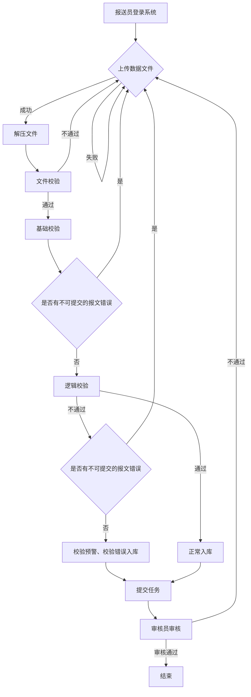

# 金融基础数据统计报送：总要求与目录（原文整理）

> 来源：[[01-资料库/金融基础数据系统/2026-07-13-金融基础数据统计报送指引与典型案例汇编-原文|金融基础数据统计报送指引与典型案例汇编]]。以下按报送表整理，正文片段保持原文；行号范围仅用于入库核对。

---

# 金融基础数据统计报送指引与典型案例汇编

国家金融基础数据库应用系列丛书

金融基础数据统计
报送指引与典型案例汇编

中国人民银行金融基础数据中心编写组 编

中国金融出版社

责任编辑：贾 真
责任校对：孙 蕊
责任印制：王效端

图书在版编目（CIP）数据
金融基础数据统计报送指引与典型案例汇编/中国人民银行金融基础数据
中心编写组编. -- 北京 : 中国金融出版社, 2024. 12. -- ISBN 978-7-
5220-2251-2
Ⅰ. F830.2
中国国家版本馆 CIP数据核字第2024QC8673号

JINRONG JICHU SHUJU TONGJI BAOSONG ZHIYIN YU DIANXING ANLI HUIBIAN
出版 中国金融出版社
发行
社址 北京市丰台区益泽路2号
市场开发部 (010)66024766, 63805472, 63439533(传真)
网上书店 www.cfph.cn
(010)66024766, 63372837(传真)
读者服务部 (010)66070833, 62568380
邮编 100071
经销 新华书店
印刷 北京七彩京通数码快印有限公司
尺寸 185毫米×260毫米
印张 18.25
字数 295千
版次 2024年12月第1版
印次 2025年5月第3次印刷
定价 56.00元
ISBN 978-7-5220-2251-2
如出现印装错误本社负责调换 联系电话(010)63263947

## 序 言

习近平总书记在第五次全国金融工作会议上提出，要推进金融业综合统计和监管信息共享，建立统一的国家金融基础数据库，解决数据标准不统一、信息归集和使用难等问题。2018年4月，国务院发布《国务院办公厅关于全面推进金融业综合统计工作的意见》（以下简称18号文），进一步明确金融业综合统计工作的总体目标，"建成覆盖所有金融机构、金融基础设施和金融活动的金融业综合统计"。为落实党中央决策部署和习近平总书记指示精神，落实18号文的工作要求，2020年7月中国人民银行正式建立金融基础数据统计制度，开展标准化逐笔全量统计，涵盖贷款、存款、债券、股权和特定目的载体投资等主要金融工具和客户信息。

为指导和规范金融机构开展金融基础数据统计工作，2021年中国人民银行调查统计部门编写了《金融基础数据统计工作指引》（以下简称《指引》）一书，内容包括统计制度、采集规范、指标口径、填报要求、特殊问题的处理方式等指引性材料，成为金融机构开展金融基础数据统计工作的重要参考资料。

《指引》出版至今已三年有余，期间委托贷款、同业业务、债券业务、股权投资和特定目的载体投资、票据业务、单位存款、个人存款等基础数据统计制度有序实施，《指引》相关内容需要调整和增加。为进一步加强对金融机构关于金融基础数据的报送指导，中国人民银行金融基础数据中心（以下简称金融基础数据中心）在中国人民银行调查统计司的指导下，以《指引》为基础，聚焦数据报送，编写了《金融基础数据统计报送指引

与典型案例汇编》一书。本书内容主要分为四个部分，分别是贷款基础数据报送、存款基础数据报送、债券业务基础数据报送、股权投资和特定目的载体投资基础数据报送，每个部分包含报送指南、常见问题及解答和典型案例分析，全书合计十四章。

本书的主要特点：一是内容全面，指导性强。本书涵盖了金融基础数据统计各项业务的报送要点及常见问题，方便金融机构报送人员查阅参考。二是案例丰富，专题突出。本书包含了金融机构有代表性的业务场景和较难处理的典型业务，重点分析报送错误产生原因并给出相应的处理方式，实践操作性强。

金融基础数据中心王春红主任、石冬副主任、胡震宇副主任、张琳琳副主任亲自指导了本书的编写。金融基础数据中心和中国人民银行部分省分行的工作人员参与了本书的编写，其中胡新杰（金融基础数据中心）对全书的内容进行了规划、审核和统稿，方熹（金融基础数据中心）、范念龙（陕西省分行）编写了第一章至第四章，金莉娜（金融基础数据中心）、姚立鑑（山西省分行）编写了第五章至第八章，周路奕（金融基础数据中心）、黎雨希（广西壮族自治区分行）编写了第十章至第十二章，封赫（金融基础数据中心）、付秋虹（江西省分行）、谢岚岚（福建省分行）编写了第九章、第十三章和第十四章。中国人民银行调查统计条线的其他同事对本书的编撰也颇有贡献，在此谨向为本书出版付出辛勤劳动、提供宝贵意见和帮助的人员表示由衷的感谢。本书在编写过程中历经反复研讨、修改和校对，力求内容表达准确明晰，但限于水平，不足和错误之处在所难免，恳请广大读者不吝批评指正。

中国人民银行金融基础数据中心编写组
2024年11月

# 目录

## 第一部分 贷款基础数据报送

- [第一章 数据报送总体要求](#第一章-数据报送总体要求)

- [第二章 单位贷款基础数据](#第二章-单位贷款基础数据)
  - [第一节 报送指南](#第二章-第一节-报送指南)

- [第三章 个人贷款基础数据](#第三章-个人贷款基础数据)
  - [第一节 报送指南](#第三章-第一节-报送指南)
  - [第二节 常见问题及解答](#第三章-第二节-常见问题及解答)
  - [第三节 典型案例分析](#第三章-第三节-典型案例分析)

- [第四章 专项贷款基础数据](#第四章-专项贷款基础数据)
  - [第一节 报送指南](#第四章-第一节-报送指南)

- [第五章 委托贷款基础数据](#第五章-委托贷款基础数据)
  - [第一节 报送指南](#第五章-第一节-报送指南)

- [第六章 票据业务基础数据](#第六章-票据业务基础数据)
  - [第一节 报送指南](#第六章-第一节-报送指南)

- [第七章 同业借贷基础数据](#第七章-同业借贷基础数据)

- [第八章 收购处置收购重组业务基础数据](#第八章-收购处置收购重组业务基础数据)
  - [第一节 报送指南](#第八章-第一节-报送指南)
  - [第二节 常见问题及解答](#第八章-第二节-常见问题及解答)
  - [第三节 典型案例分析](#第八章-第三节-典型案例分析)

- [第九章 金融机构基础信息](#第九章-金融机构基础信息)
  - [第一节 报送指南](#第九章-第一节-报送指南)

## 第二部分 存款基础数据报送

- [第十章 非同业单位存款基础数据](#第十章-非同业单位存款基础数据)
  - [第一节 报送指南](#第十章-第一节-报送指南)
  - [第三节 典型案例分析](#第十章-第三节-典型案例分析)

- [第十一章 个人存款基础数据](#第十一章-个人存款基础数据)
  - [第一节 报送指南](#第十一章-第一节-报送指南)

- [第十二章 同业存款基础数据](#第十二章-同业存款基础数据)
  - [第一节 报送指南](#第十二章-第一节-报送指南)

## 第三部分 债券业务基础数据报送

- [第十三章 债券业务基础数据](#第十三章-债券业务基础数据)
  - [第一节 报送指南](#第十三章-第一节-报送指南)
  - [第三节 典型案例分析](#第十三章-第三节-典型案例分析)

## 第四部分 股权投资和特定目的载体投资基础数据报送

- [第十四章 股权投资和特定目的载体投资基础数据](#第十四章-股权投资和特定目的载体投资基础数据)
  - [第一节 报送指南](#第十四章-第一节-报送指南)

# 第一章 数据报送总体要求

一、报送机构及范围

（一）报送机构

国家开发银行、政策性银行、国有商业银行、中国邮政储蓄银行、股份制商业银行、金融资产管理公司、理财公司、金融资产投资公司和政策性开发性专项基金，城市商业银行、农村商业银行、农村合作银行、农村信用社、村镇银行、外资银行、民营银行、企业集团财务公司、农村资金互助社、信托投资公司、金融租赁公司、汽车金融公司、贷款公司、消费金融公司、货币经纪公司。

（二）报送范围

1. 贷款基础数据
（1）存量同业借贷信息；
（2）同业借贷发生额信息；
（3）存量单位贷款信息；
（4）单位贷款发生额信息；
（5）存量个人贷款信息；
（6）个人贷款发生额信息；
（7）存量专项贷款信息（含一批、二批报文）；
（8）担保合同信息；
（9）担保物信息；
（10）存量委托贷款信息；
（11）委托贷款发生额信息；

(12) 金融机构（法人）基础信息（季度）；
(13) 金融机构（分支机构）基础信息（季度）；
(14) 同业客户基础信息；
(15) 非同业单位客户基础信息；
(16) 个人客户基础信息；
(17) 存量票据融资信息；
(18) 票据融资发生额信息；
(19) 存量再贴现信息；
(20) 再贴现发生额信息；
(21) 存量银行承兑汇票信息；
(22) 银行承兑汇票发生额信息；
(23) 存量收购处置信息（金融资产管理公司适用）；
(24) 收购处置发生额信息（金融资产管理公司适用）；
(25) 存量收购重组信息（金融资产管理公司适用）；
(26) 收购重组发生额信息（金融资产管理公司适用）；
(27) 单位贷款置换旧债发生额信息。

2. 存款基础数据
(1) 存量同业存款信息；
(2) 同业存款发生额信息；
(3) 存量非同业单位存款信息；
(4) 非同业单位存款发生额信息；
(5) 存量个人存款信息；
(6) 个人存款发生额信息。

3. 债券业务基础数据
(1) 存量债券投资信息；
(2) 债券投资发生额信息；
(3) 存量债券发行信息；
(4) 债券发行发生额信息。

4. 股权投资和特定目的载体投资基础数据
(1) 存量股权投资信息；

(2) 股权投资发生额信息；
(3) 存量特定目的载体投资信息；
(4) 特定目的载体投资发生额信息。

二、报送方式和流程

（一）报送方式

金融机构通过国家金融基础数据库大数据平台金融基础数据逐笔统计系统、金融基础数据报表采集系统报送金融基础数据，分为网页版报送和客户端报送两种方式。金融机构报送员需要通过本机构的机构管理员进行角色配置后，方可访问统计系统进行数据报送。

（二）报送流程

金融基础数据逐笔统计系统的数据报送流程主要包括上传数据文件、解压文件、数据校验、数据提交、数据审核五步，如图 1-1 所示。
(1) 报送员登录系统后，在工作台中打开需要完成报送的任务并选择准备好的数据文件，系统将自动检查数据文件命名是否符合采集规范，检查通过后系统将开始上传数据文件。
(2) 数据文件上传成功后，系统将自动进行解压，解压成功系统将进入数据校验环节，解压失败系统会提示报送员重新上传数据文件。
(3) 数据校验共分为文件校验、基础校验、逻辑校验三个环节。其中，文件校验主要校验 dat 文件名称、文件大小以及文件的 md5 码是否和 log 文件保持一致等。如果文件校验不通过，报送员必须重新上传数据文件。文件校验通过后，进入基础校验环节。基础校验主要校验字段类型、字段长度、系统级特殊字符、字段报送码值等。逻辑校验主要针对数据填报逻辑进行校验，校验单笔数据和整体数据是否符合采集规范要求。
(4) 逻辑校验通过后，报送员可发起核查计算、签字确认并提交任务，审核员审核通过即完成报送；当基础校验或逻辑校验未通过且触发有不可提交的报文错误时，报送员必须重新上传数据文件；当逻辑校验未通过，但没有不可提交的报文错误时，该数据可先行入库，报送员需针对触发规则的数据填写说明信息，

### 正常报送流程

图1-1 金融基础数据逐笔统计系统的数据报送流程

图1-1 金融基础数据逐笔统计系统的数据报送流程
发起核查计算，系统判断任务报送说明完备率满足系统的说明完备率要求且已完成核查计算时，才允许用户进行签字确认、提交任务数据。

(5) 对于填写说明的任务，需由审核员审核通过后方可完成报送任务。如审核不通过，审核员将任务打回至报送机构，报送员可根据打回意见，按照流程重新报送数据文件。

三、报送时间

单位贷款基础数据信息、个人贷款基础数据信息和存量专项贷款一批报文采用"初报+复报"方式。初报阶段，各金融机构应于每月8日17:00前完成全部数据的报送工作，逢国家法定节假日及双休日顺延。如经核对确认数据存在问题，则启动复报，复报锁库时间为每月10日17:00前，逢国家法定节假日及双休日顺延。

委托贷款基础数据信息、票据业务基础数据信息、存量专项贷款二批报文、收购处置收购重组业务基础数据信息、单位贷款置换旧债发生额信息应于每月12日17:00前完成全部数据的报送工作，债券业务基础数据信息、股权投资和特定目的载体投资基础数据信息应于每月15日17:00前完成全部数据的报送工作，同业业务基础数据信息、非同业单位存款基础数据信息应于每月18日17:00前完成全部数据的报送工作，存量个人存款基础数据信息应于每月22日17:00前完成全部数据的报送工作，逢国家法定节假日及双休日顺延。

金融机构（法人）基础信息、金融机构（分支机构）基础信息应于季度后21日17:00前完成全部数据的报送工作，逢国家法定节假日及双休日顺延。

四、报送要求

(一) 统计事项报备机制

建立金融基础数据统计事项报备机制，对于统计工作及统计数据上的重大变动事项做好事前报备审核。对于机构重大变动、统计人员变更、大额数据变动、开库修改历史数据、延期报送当期数据以及其他需要报备的重大事项，如系统切换、口径说明等，金融机构应提交金融基础数据统计事项报备表，由审核人员评估事项对统计数据的影响情况，明确处理方案，以保证统计工作的延续性和统计数据的稳定性。

（二）提高数据报送、核查及时性

金融机构应保证数据生产、传输效率，当期采集的数据应及时、准确报送，尽量在截止前一日完成数据首次提交，为数据审核、修改预留时间。对于审核人员反馈的问题，应及时核查并反馈原因，如核实无误，应根据审核人员要求对相应问题进行补充说明、情况反馈；如确认为报送数据错误，应尽快修正，涉及历史数据报送错误的，需提交报备后开库修改；如受内外部条件约束，暂无法及时修正或补充报送的，应根据审核人员要求提交报备或补充说明问题原因、整改计划等，后续逐步治理完善。

（三）强化源头数据质量管理

金融机构作为金融统计源头数据质量管理的责任主体，应落实好《中国人民银行办公厅关于金融统计源头数据质量核查的指导意见》（银办发〔2023〕86号），持续加强源头数据质量核查，规范源头数据质量；努力保障统计指标的正确采集，不断夯实提高基础数据质量。具体来说，应按照金融基础数据统计制度和采集规范的要求，结合自身业务特点，统一数据来源和加工方法，综合采用计算机程序自动核查、相关数据比对核查、综合数据校验核查等方式，探索运用大数据技术，覆盖源头数据加工生产全过程，同时加强统计数据报送与源头数据核查环节的协调配合，确保源头数据真实可靠。金融机构应建立本单位全流程、可溯源的金融基础数据统计质量管理体系，明确任务分工，落实工作责任，优化业务流程，加强对一线业务人员的统计培训，建立健全齐抓共促、上下联动的数据治理长效机制。对于一些受外部条件约束，仅靠金融机构自身无法完全解决的难点问题，如客户自行填报的信息、依赖第三方才能获取的信息等，金融机构可以采取积极联系交易对手、引导客户主动填报信息等方式逐步解决。

