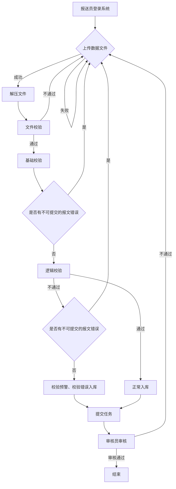

# 金融基础数据统计报送指引与典型案例汇编

国家金融基础数据库应用系列丛书

金融基础数据统计
报送指引与典型案例汇编

中国人民银行金融基础数据中心编写组 编

中国金融出版社

责任编辑：贾 真
责任校对：孙 蕊
责任印制：王效端

图书在版编目（CIP）数据
金融基础数据统计报送指引与典型案例汇编/中国人民银行金融基础数据
中心编写组编. -- 北京 : 中国金融出版社, 2024. 12. -- ISBN 978-7-
5220-2251-2
Ⅰ. F830.2
中国国家版本馆 CIP数据核字第2024QC8673号

JINRONG JICHU SHUJU TONGJI BAOSONG ZHIYIN YU DIANXING ANLI HUIBIAN
出版 中国金融出版社
发行
社址 北京市丰台区益泽路2号
市场开发部 (010)66024766, 63805472, 63439533(传真)
网上书店 www.cfph.cn
(010)66024766, 63372837(传真)
读者服务部 (010)66070833, 62568380
邮编 100071
经销 新华书店
印刷 北京七彩京通数码快印有限公司
尺寸 185毫米×260毫米
印张 18.25
字数 295千
版次 2024年12月第1版
印次 2025年5月第3次印刷
定价 56.00元
ISBN 978-7-5220-2251-2
如出现印装错误本社负责调换 联系电话(010)63263947

## 序 言

习近平总书记在第五次全国金融工作会议上提出，要推进金融业综合统计和监管信息共享，建立统一的国家金融基础数据库，解决数据标准不统一、信息归集和使用难等问题。2018年4月，国务院发布《国务院办公厅关于全面推进金融业综合统计工作的意见》（以下简称18号文），进一步明确金融业综合统计工作的总体目标，"建成覆盖所有金融机构、金融基础设施和金融活动的金融业综合统计"。为落实党中央决策部署和习近平总书记指示精神，落实18号文的工作要求，2020年7月中国人民银行正式建立金融基础数据统计制度，开展标准化逐笔全量统计，涵盖贷款、存款、债券、股权和特定目的载体投资等主要金融工具和客户信息。

为指导和规范金融机构开展金融基础数据统计工作，2021年中国人民银行调查统计部门编写了《金融基础数据统计工作指引》（以下简称《指引》）一书，内容包括统计制度、采集规范、指标口径、填报要求、特殊问题的处理方式等指引性材料，成为金融机构开展金融基础数据统计工作的重要参考资料。

《指引》出版至今已三年有余，期间委托贷款、同业业务、债券业务、股权投资和特定目的载体投资、票据业务、单位存款、个人存款等基础数据统计制度有序实施，《指引》相关内容需要调整和增加。为进一步加强对金融机构关于金融基础数据的报送指导，中国人民银行金融基础数据中心（以下简称金融基础数据中心）在中国人民银行调查统计司的指导下，以《指引》为基础，聚焦数据报送，编写了《金融基础数据统计报送指引

与典型案例汇编》一书。本书内容主要分为四个部分，分别是贷款基础数据报送、存款基础数据报送、债券业务基础数据报送、股权投资和特定目的载体投资基础数据报送，每个部分包含报送指南、常见问题及解答和典型案例分析，全书合计十四章。

本书的主要特点：一是内容全面，指导性强。本书涵盖了金融基础数据统计各项业务的报送要点及常见问题，方便金融机构报送人员查阅参考。二是案例丰富，专题突出。本书包含了金融机构有代表性的业务场景和较难处理的典型业务，重点分析报送错误产生原因并给出相应的处理方式，实践操作性强。

金融基础数据中心王春红主任、石冬副主任、胡震宇副主任、张琳琳副主任亲自指导了本书的编写。金融基础数据中心和中国人民银行部分省分行的工作人员参与了本书的编写，其中胡新杰（金融基础数据中心）对全书的内容进行了规划、审核和统稿，方熹（金融基础数据中心）、范念龙（陕西省分行）编写了第一章至第四章，金莉娜（金融基础数据中心）、姚立鑑（山西省分行）编写了第五章至第八章，周路奕（金融基础数据中心）、黎雨希（广西壮族自治区分行）编写了第十章至第十二章，封赫（金融基础数据中心）、付秋虹（江西省分行）、谢岚岚（福建省分行）编写了第九章、第十三章和第十四章。中国人民银行调查统计条线的其他同事对本书的编撰也颇有贡献，在此谨向为本书出版付出辛勤劳动、提供宝贵意见和帮助的人员表示由衷的感谢。本书在编写过程中历经反复研讨、修改和校对，力求内容表达准确明晰，但限于水平，不足和错误之处在所难免，恳请广大读者不吝批评指正。

中国人民银行金融基础数据中心编写组
2024年11月

# 目录

## 第一部分 贷款基础数据报送

- [第一章 数据报送总体要求](#第一章-数据报送总体要求)

- [第二章 单位贷款基础数据](#第二章-单位贷款基础数据)
  - [第一节 报送指南](#第二章-第一节-报送指南)

- [第三章 个人贷款基础数据](#第三章-个人贷款基础数据)
  - [第一节 报送指南](#第三章-第一节-报送指南)
  - [第二节 常见问题及解答](#第三章-第二节-常见问题及解答)
  - [第三节 典型案例分析](#第三章-第三节-典型案例分析)

- [第四章 专项贷款基础数据](#第四章-专项贷款基础数据)
  - [第一节 报送指南](#第四章-第一节-报送指南)

- [第五章 委托贷款基础数据](#第五章-委托贷款基础数据)
  - [第一节 报送指南](#第五章-第一节-报送指南)

- [第六章 票据业务基础数据](#第六章-票据业务基础数据)
  - [第一节 报送指南](#第六章-第一节-报送指南)

- [第七章 同业借贷基础数据](#第七章-同业借贷基础数据)

- [第八章 收购处置收购重组业务基础数据](#第八章-收购处置收购重组业务基础数据)
  - [第一节 报送指南](#第八章-第一节-报送指南)
  - [第二节 常见问题及解答](#第八章-第二节-常见问题及解答)
  - [第三节 典型案例分析](#第八章-第三节-典型案例分析)

- [第九章 金融机构基础信息](#第九章-金融机构基础信息)
  - [第一节 报送指南](#第九章-第一节-报送指南)

## 第二部分 存款基础数据报送

- [第十章 非同业单位存款基础数据](#第十章-非同业单位存款基础数据)
  - [第一节 报送指南](#第十章-第一节-报送指南)
  - [第三节 典型案例分析](#第十章-第三节-典型案例分析)

- [第十一章 个人存款基础数据](#第十一章-个人存款基础数据)
  - [第一节 报送指南](#第十一章-第一节-报送指南)

- [第十二章 同业存款基础数据](#第十二章-同业存款基础数据)
  - [第一节 报送指南](#第十二章-第一节-报送指南)

## 第三部分 债券业务基础数据报送

- [第十三章 债券业务基础数据](#第十三章-债券业务基础数据)
  - [第一节 报送指南](#第十三章-第一节-报送指南)
  - [第三节 典型案例分析](#第十三章-第三节-典型案例分析)

## 第四部分 股权投资和特定目的载体投资基础数据报送

- [第十四章 股权投资和特定目的载体投资基础数据](#第十四章-股权投资和特定目的载体投资基础数据)
  - [第一节 报送指南](#第十四章-第一节-报送指南)

# 第一章 数据报送总体要求

一、报送机构及范围

（一）报送机构

国家开发银行、政策性银行、国有商业银行、中国邮政储蓄银行、股份制商业银行、金融资产管理公司、理财公司、金融资产投资公司和政策性开发性专项基金，城市商业银行、农村商业银行、农村合作银行、农村信用社、村镇银行、外资银行、民营银行、企业集团财务公司、农村资金互助社、信托投资公司、金融租赁公司、汽车金融公司、贷款公司、消费金融公司、货币经纪公司。

（二）报送范围

1. 贷款基础数据
（1）存量同业借贷信息；
（2）同业借贷发生额信息；
（3）存量单位贷款信息；
（4）单位贷款发生额信息；
（5）存量个人贷款信息；
（6）个人贷款发生额信息；
（7）存量专项贷款信息（含一批、二批报文）；
（8）担保合同信息；
（9）担保物信息；
（10）存量委托贷款信息；
（11）委托贷款发生额信息；

(12) 金融机构（法人）基础信息（季度）；
(13) 金融机构（分支机构）基础信息（季度）；
(14) 同业客户基础信息；
(15) 非同业单位客户基础信息；
(16) 个人客户基础信息；
(17) 存量票据融资信息；
(18) 票据融资发生额信息；
(19) 存量再贴现信息；
(20) 再贴现发生额信息；
(21) 存量银行承兑汇票信息；
(22) 银行承兑汇票发生额信息；
(23) 存量收购处置信息（金融资产管理公司适用）；
(24) 收购处置发生额信息（金融资产管理公司适用）；
(25) 存量收购重组信息（金融资产管理公司适用）；
(26) 收购重组发生额信息（金融资产管理公司适用）；
(27) 单位贷款置换旧债发生额信息。

2. 存款基础数据
(1) 存量同业存款信息；
(2) 同业存款发生额信息；
(3) 存量非同业单位存款信息；
(4) 非同业单位存款发生额信息；
(5) 存量个人存款信息；
(6) 个人存款发生额信息。

3. 债券业务基础数据
(1) 存量债券投资信息；
(2) 债券投资发生额信息；
(3) 存量债券发行信息；
(4) 债券发行发生额信息。

4. 股权投资和特定目的载体投资基础数据
(1) 存量股权投资信息；

(2) 股权投资发生额信息；
(3) 存量特定目的载体投资信息；
(4) 特定目的载体投资发生额信息。

二、报送方式和流程

（一）报送方式

金融机构通过国家金融基础数据库大数据平台金融基础数据逐笔统计系统、金融基础数据报表采集系统报送金融基础数据，分为网页版报送和客户端报送两种方式。金融机构报送员需要通过本机构的机构管理员进行角色配置后，方可访问统计系统进行数据报送。

（二）报送流程

金融基础数据逐笔统计系统的数据报送流程主要包括上传数据文件、解压文件、数据校验、数据提交、数据审核五步，如图 1-1 所示。
(1) 报送员登录系统后，在工作台中打开需要完成报送的任务并选择准备好的数据文件，系统将自动检查数据文件命名是否符合采集规范，检查通过后系统将开始上传数据文件。
(2) 数据文件上传成功后，系统将自动进行解压，解压成功系统将进入数据校验环节，解压失败系统会提示报送员重新上传数据文件。
(3) 数据校验共分为文件校验、基础校验、逻辑校验三个环节。其中，文件校验主要校验 dat 文件名称、文件大小以及文件的 md5 码是否和 log 文件保持一致等。如果文件校验不通过，报送员必须重新上传数据文件。文件校验通过后，进入基础校验环节。基础校验主要校验字段类型、字段长度、系统级特殊字符、字段报送码值等。逻辑校验主要针对数据填报逻辑进行校验，校验单笔数据和整体数据是否符合采集规范要求。
(4) 逻辑校验通过后，报送员可发起核查计算、签字确认并提交任务，审核员审核通过即完成报送；当基础校验或逻辑校验未通过且触发有不可提交的报文错误时，报送员必须重新上传数据文件；当逻辑校验未通过，但没有不可提交的报文错误时，该数据可先行入库，报送员需针对触发规则的数据填写说明信息，

### 正常报送流程

图1-1 金融基础数据逐笔统计系统的数据报送流程

图1-1 金融基础数据逐笔统计系统的数据报送流程
发起核查计算，系统判断任务报送说明完备率满足系统的说明完备率要求且已完成核查计算时，才允许用户进行签字确认、提交任务数据。

(5) 对于填写说明的任务，需由审核员审核通过后方可完成报送任务。如审核不通过，审核员将任务打回至报送机构，报送员可根据打回意见，按照流程重新报送数据文件。

三、报送时间

单位贷款基础数据信息、个人贷款基础数据信息和存量专项贷款一批报文采用"初报+复报"方式。初报阶段，各金融机构应于每月8日17:00前完成全部数据的报送工作，逢国家法定节假日及双休日顺延。如经核对确认数据存在问题，则启动复报，复报锁库时间为每月10日17:00前，逢国家法定节假日及双休日顺延。

委托贷款基础数据信息、票据业务基础数据信息、存量专项贷款二批报文、收购处置收购重组业务基础数据信息、单位贷款置换旧债发生额信息应于每月12日17:00前完成全部数据的报送工作，债券业务基础数据信息、股权投资和特定目的载体投资基础数据信息应于每月15日17:00前完成全部数据的报送工作，同业业务基础数据信息、非同业单位存款基础数据信息应于每月18日17:00前完成全部数据的报送工作，存量个人存款基础数据信息应于每月22日17:00前完成全部数据的报送工作，逢国家法定节假日及双休日顺延。

金融机构（法人）基础信息、金融机构（分支机构）基础信息应于季度后21日17:00前完成全部数据的报送工作，逢国家法定节假日及双休日顺延。

四、报送要求

(一) 统计事项报备机制

建立金融基础数据统计事项报备机制，对于统计工作及统计数据上的重大变动事项做好事前报备审核。对于机构重大变动、统计人员变更、大额数据变动、开库修改历史数据、延期报送当期数据以及其他需要报备的重大事项，如系统切换、口径说明等，金融机构应提交金融基础数据统计事项报备表，由审核人员评估事项对统计数据的影响情况，明确处理方案，以保证统计工作的延续性和统计数据的稳定性。

（二）提高数据报送、核查及时性

金融机构应保证数据生产、传输效率，当期采集的数据应及时、准确报送，尽量在截止前一日完成数据首次提交，为数据审核、修改预留时间。对于审核人员反馈的问题，应及时核查并反馈原因，如核实无误，应根据审核人员要求对相应问题进行补充说明、情况反馈；如确认为报送数据错误，应尽快修正，涉及历史数据报送错误的，需提交报备后开库修改；如受内外部条件约束，暂无法及时修正或补充报送的，应根据审核人员要求提交报备或补充说明问题原因、整改计划等，后续逐步治理完善。

（三）强化源头数据质量管理

金融机构作为金融统计源头数据质量管理的责任主体，应落实好《中国人民银行办公厅关于金融统计源头数据质量核查的指导意见》（银办发〔2023〕86号），持续加强源头数据质量核查，规范源头数据质量；努力保障统计指标的正确采集，不断夯实提高基础数据质量。具体来说，应按照金融基础数据统计制度和采集规范的要求，结合自身业务特点，统一数据来源和加工方法，综合采用计算机程序自动核查、相关数据比对核查、综合数据校验核查等方式，探索运用大数据技术，覆盖源头数据加工生产全过程，同时加强统计数据报送与源头数据核查环节的协调配合，确保源头数据真实可靠。金融机构应建立本单位全流程、可溯源的金融基础数据统计质量管理体系，明确任务分工，落实工作责任，优化业务流程，加强对一线业务人员的统计培训，建立健全齐抓共促、上下联动的数据治理长效机制。对于一些受外部条件约束，仅靠金融机构自身无法完全解决的难点问题，如客户自行填报的信息、依赖第三方才能获取的信息等，金融机构可以采取积极联系交易对手、引导客户主动填报信息等方式逐步解决。

# 第一部分

## 贷款基础数据报送

# 第二章 单位贷款基础数据

贷款作为最广泛使用的金融工具之一，是当前我国实体经济最主要的融资方式，是金融服务国民经济发展的重要载体。资金融入方、资金融出方、担保方是贷款业务的主要参与机构。单位贷款基础数据信息涉及内容多、分类细，结合金融机构实际业务开展情况，有针对性地梳理常见业务的报送处理方式，有助于全面、准确地统计单位贷款的资金分布、客户信息、担保情况，有助于全链条、清晰地把握资金在不同行业、地区、部门间的流动及分布情况，为金融精准服务重点领域和薄弱环节、全面深化供给侧结构性改革、推动社会经济高质量发展提供信息支撑，为货币政策决策和宏观审慎管理提供支持。

## 第二章 第一节 报送指南

### 一、存量单位贷款信息

#### （一）报送范围及总体报送要求

（1）报告期末存续的、在资产负债表内核算的非同业单位贷款，不含历史已核销、剥离、转出的贷款。以贷款合同下单笔借据为单位逐笔报送。

（2）个体工商户和小微企业主贷款应在个人贷款基础数据中报送，不在单位贷款中报送。

（3）单位贷款和同业借贷之间的划分主要根据借款人性质来划分，与金融机构开展的借贷业务应纳入同业借贷基础数据中报送，如单位贷款基础数据中借款人国民经济部门为金融机构应重点核实。但部分贷款产品类别需结合业务属性来

判断，如借款人为证券公司的券商收益凭证（其他债权），借款人为金融机构的单位信用卡（透支），借款人为金融租赁公司的融资租赁保理业务（贸易融资）等，相关贷款业务信息在单位贷款基础数据中报送，借款人信息在同业客户基础信息中报送。

（二）字段信息

1. 金融机构代码
（1）填报该笔贷款业务经办机构的统一社会信用代码。
（2）每一笔贷款都可以划分到金融机构的某个分支机构、总行营业部或者是总行的某一个部门。对于贷款经办机构是分支机构的，填报分支机构的统一社会信用代码。对于贷款经办机构是与总行共用一个统一社会信用代码的总行营业部、总行某部门的，填报总行的统一社会信用代码。
（3）对于没有分支机构的情况，则直接填报总行或法人的统一社会信用代码。

2. 金融机构地区代码
（1）填报该笔贷款业务经办机构注册地的行政区划代码。采用《中华人民共和国行政区划代码》（GB/T 2260）最新标准的 6 位县（区）级数字码。
（2）由于我国仍处在城镇化推进的进程中，每年都会有一些县级地区改为城市行政区，或撤县建市，甚至还有一些地区撤销归并入不同的地区。在数据报送中，若发现报送地区代码信息无法对应到系统校验中行政区划代码的情况，这可能是由于金融机构未及时维护更新业务系统或信贷台账中涉及的地区信息。
（3）系统校验中行政区划代码定期更新，在数据报送中如确实存在地区代码按最新标准正确报送但系统校验未通过的现象，建议及时反馈至中国人民银行数据审核人员。

3. 借款人证件类型、借款人证件代码
（1）按照《金融基础数据统计制度》关于证件代码的统一要求，境内机构应填报统一社会信用代码。目前，大部分法人单位都已经更换或新发统一社会信用代码，仅有少数企业未进行三证合一暂无统一社会信用代码，可填报组织机构代码。
（2）对单位类机构，除统一社会信用代码、组织机构代码、全球法人识别编

码（LEI 码）外，由境内外其他主管机构赋予的身份证明文件类型填报 A03 - 其他。

(3) 境外机构填报该机构的全球法人识别编码（LEI 码）。暂无全球法人识别编码的，借款人证件类型可以填报 Z99 - 自定义码，借款人证件代码填报金融机构自行设定的唯一编码。

(4) 借款人证件代码是唯一确定借款人身份的关键信息，对于仍存在少数境内借款人填报非统一社会信用代码的金融机构，应加快数据治理节奏。一般而言，金融机构可以通过查询第三方数据获取借款人的统一社会信用代码，也可以与借款人直接取得联系进行获取。

(5) 借款人证件代码应与借款人证件类型相匹配，即证件类型填报 A01 - 统一社会信用代码的，其证件代码应符合统一社会信用代码编码规范；证件类型填报 A02 - 组织机构代码的，其证件代码长度应为 9 位。在数据报送中如确实存在借款人统一社会信用代码核实无误但不符合编码规范导致系统校验未通过的情况，填写提交说明即可。

4. 借款人国民经济部门

(1) 必须填报至最底层类别。如某某公司的国民经济部门应为非金融企业部门下的 C01 - 公司。

(2) 金融机构是货币当局和金融监督管理部门对所管理对象的一个总称，对应着国际货币基金组织发布的《货币与金融统计手册》中的金融公司部门，包括货币当局、监管当局，以及其他从事金融媒介及与金融媒介密切相关的辅助金融活动的常住单位。在统计实践中，金融机构包括以下两类：一是持有境内监管部门颁发的金融牌照，主要包括银行业存款类金融机构、银行业非存款类金融机构、证券业金融机构、保险业金融机构、金融控股公司等。二是未持有金融牌照，但经党中央、国务院或中国人民银行、国家金融监督管理总局、中国证监会等中央金融管理部门批准设立、予以从事与金融业务相关的机构，主要包括结算清算类金融机构、其他金融机构等。部分未取得监管部门颁发的金融牌照但从事金融业务的企业（包括地方政府负责管理的地方金融组织），如融资租赁公司、典当行、担保公司、网络借贷服务公司等，仍然在非金融企业部门统计。

(3) 一般情况下，公立的医院和学校划入 A04 - 机关团体部门，私立的学校和医院划入 C99 - 其他非金融企业部门。事业单位是典型的机关团体，村委会和

居委会等基层组织划入机关团体部门。
(4) 私人 (个人) 独资企业和合伙企业属于非金融企业部门。
(5) 个体工商户和小微企业主属于住户部门，其贷款应在个人贷款中报送，不在单位贷款中报送。
(6) 非居民部门是指所有不具有常住性的机构单位。单位贷款中仅需报送 E01 - 国际组织、E02 - 外国政府和 E04 - 境外非金融企业部门的贷款。借款人民经济部门为非居民部门的，原则上行业、地区等相关字段需对应填报，如对应的借款人行业应为 200 - 境外，地区代码应为 000 开头的境外地区代码。若国际组织总部所在地为境内，则客户国民经济部门填报 E01 - 国际组织，行业可填报 T97 - 国际组织，地区代码可填报中华人民共和国行政区划代码。
(7) 单位贷款借款人国民经济部门应多为广义政府、非金融企业部门、非居民部门，一般情况下不应为住户部门，部分产品类别的借款人可能为金融机构。

5. 借款人行业
行业采用《国民经济行业分类》 (GB/T 4754) 最新标准的大类。境外借款人填报 200 - 境外，不再划分行业。100 - 个人不适用于单位贷款。

6. 借款人地区代码
(1) 填报借款人注册地的行政区划代码。境内客户，采用《中华人民共和国行政区划代码》 (GB/T 2260) 最新标准的 6 位县 (区) 级数字码。境外客户，前 3 位用 "000" 填充，后 3 位采用《世界各国和地区名称代码》 (GB/T 2659) 最新标准的 3 位国别阿拉伯数字代码。
(2) 客户注册地为港澳台的，应按境外客户填报地区代码，不得填报行政区划代码 (如 810000、820000 等)。

7. 借款人经济成分
(1) 按照国家统计局《关于统计上划分经济成分的规定》 (国统字〔1998〕204 号) 和《关于统计上对公有和非公有控股经济的分类办法》 (国统字〔2005〕79 号) 的要求，根据企业实收资本中某种经济成分的出资人实际出资情况进行分类，并按出资人对企业的控股程度，分为绝对控股和相对控股。
(2) 单位贷款中，借款人为境外非居民的不需填报经济成分。
(3) 国民经济部门为广义政府的机关、事业单位和社会团体，主要按其经费来源和管理方式划分经济成分。

(4) 应填写值域树形结构的叶节点类别，即最小类别。如受实际情况所限不能确定最底层类别的，允许回溯一级。例如，若不能确定一个国有控股企业是 A0101 - 国有相对控股或 A0102 - 国有绝对控股，可填写 A01 - 国有控股，不可填 A - 公有控股经济。

8. 借款人企业规模
(1) 根据现行法律法规，企业是指在中华人民共和国境内，依据《中华人民共和国公司法》《中华人民共和国合伙企业法》《中华人民共和国外商投资法》等法律法规依法设立，并按《中华人民共和国市场主体登记管理条例》等规定在市场监督管理部门登记注册，实行自主经营、自负盈亏的各种经济组织，包括有限责任公司、股份有限公司、非公司企业法人、合伙企业、个人独资企业及其他经营单位，依法设立的民办非企业法人和农民专业合作组织也归入企业部门，但不包括行政机关、事业单位、社会团体、个体工商户等。
(2) 非金融企业规模分类标准采用《统计上大中小微型企业划分方法 (2017)》，金融企业的规模分类标准采用《金融业企业划型标准规定》（银发〔2015〕309 号）。当划型标准有变更时，以中国人民银行最新通知要求填报。
(3) 单位贷款中，借款人为境外非居民的不需填报企业规模。
(4) 非企业类单位，企业规模应填报 CS05 - 其他，不得为空，也不得将其企业规模归入大、中、小、微等类型。
(5) 民办非企业法人、农民专业合作组织等从事经营的单位归入企业部门，应划分为 CS01 - 大型、CS02 - 中型、CS03 - 小型或 CS04 - 微型，不能简单填报为 CS05 - 其他。如因缺乏企业分类信息确无法判断企业规模，可先空置处理并填写提交说明，后期掌握相关信息后再划分企业规模。

9. 贷款借据编码
(1) 金融机构向借款人发放贷款时签订的借款凭证的编码。金融机构依据贷款合同发放贷款时未签订借据的，应填报贷款提款书等载明贷款发放指令的凭证编码。
(2) 贷款借据编码要求唯一。如果不唯一，有两种处理方式，任选其一进行处理：一是填写该笔贷款在本机构的唯一识别码；二是在相同的贷款借据编码后加 "_1""_2" 等后缀编号，其中 "_" 为英文半角下划线。需要保证该编码在后续各期的数据报文中保持不变，且与单位贷款发生额信息中贷款借据编码保持

一致。
10. 贷款产品类别
(1) 贷款产品是最为常见的一类金融工具，根据金融机构业务开展的实际情况，结合中国人民银行"金融机构资产负债项目月报表"(A1411/A2411)对应贷款产品，再贷款、黄金借贷、打包信贷受让资产及其他贷款明确不在贷款基础数据统计的报送范围，经营贷款、固定资产贷款、透支、计入表内的证券借贷、贸易融资、融资租赁、并购贷款、垫款属于单位贷款基础数据报送范围。其他债权虽不在各项贷款的统计范围内，但按照统计实际需要，在单位贷款中报送。由于单位贷款报送与非金融机构的单位客户开展的贷款业务，消费贷款、拆借、回购/返售一般不应在单位贷款中出现。
(2) 中国人民银行向金融机构提供的再贷款、再贴现等资金支持，在金融机构资产负债表中属于负债，在中国人民银行资产负债表中属于资产，因此，金融基础数据统计制度规定，再贷款不纳入金融机构贷款基础数据的报送范围，再贴现业务纳入票据业务基础数据统计制度的报送范围。金融机构获得再贷款、再贴现资金支持后又发放的贷款，属于金融机构正常发放的贷款，应根据借款对象、用途、业务实质等划分贷款产品类别，并根据制度要求将相关贷款产品类别纳入贷款基础数据统计制度报送范围。
11. 贷款实际投向
行业采用《国民经济行业分类》(GB/T 4754)最新标准的中类。境外借款主体填报2000-境外，不再划分行业。1000-个人不适用于单位贷款。
12. 贷款发放日期
贷款发放日期填报贷款借据中约定的贷款发放日期。
13. 贷款到期日期
贷款到期日期填报贷款借据中约定的贷款到期日期。若一笔借据约定分期还款，则填报最后一次还款日期。
14. 贷款展期到期日期
贷款展期到期日期，对于贷款状态为展期的指展期后到期日，对于贷款状态为缩期的指缩期后到期日。如贷款状态为展期，贷款展期到期日期为必填项，且应大于贷款到期日期；如贷款状态为缩期，贷款展期到期日期为必填项，且应小于贷款到期日期。

15. 贷款余额、贷款余额折人民币
(1) 贷款余额填报报告日贷款合同下单笔借据的余额，与字段"币种"的货币计量单位保持一致，仅报送本金，不包含利息。对于贸易融资、融资租赁等涉及应计利息会计调整的贷款产品，以及其他债权等涉及公允价值变动的贷款产品，贷款余额填报报告日的账面余额。
(2) 存量单位贷款中仅报送报告期末存续的业务，因此贷款余额应大于零。对于因计提减值导致贷款账面余额降为零的情况，贷款余额应报送减值前的实际本金余额。
(3) 贷款余额折人民币必填。如币种为外币，填折人民币余额，汇率按金融机构会计核算使用汇率折算。如币种为人民币，直接填写人民币余额。

16. 利率是否固定
(1) 固定利率，指金融合约交易双方明确约定在该合约持续期间执行固定不变的利率。浮动利率，指依据金融合约交易双方约定或法律法规规定，在合约存续期间，可根据特定条件一次或多次变更利率。贷款是一种典型的金融合约。贷款的金融合约，一般指贷款合同。利率是否固定，要根据贷款合同中金融机构与借款人的约定填报，而非根据客户经理或者报送人员的主观判断。
(2) 在贷款存续期内，只要贷款利率有可能发生变化（挂钩某一基准利率等），无论其实际是否变动，均应填报为 RF02 - 浮动利率。只有在存续期内一直保持约定的固定利率水平、不随任何外部条件变化而变化的，才填报为 RF01 - 固定利率。

17. 利率水平
填报报告日贷款实际执行的年利率水平，如实际执行 5% 的年化利率，则填报 5.00000，不带百分号（%），且小数点后面保留 5 位小数。一般情况下，贷款利率应大于 1%，小于相应期限下贷款市场报价利率（LPR）的 4 倍。部分金融机构填报利率水平时，可能会出现未折算为百分数的情况，如填报 0.05000，造成整体的利率水平过低。金融机构应当在数据报送前进行最大值和最小值的核查，对一些利率异常值（过大或过小）进行核实，防止出现上述错误。

18. 贷款定价基准类型
(1) 浮动利率、固定利率贷款，均要填报贷款定价基准类型。
(2) 个别存量贷款发放时使用的是"贷款基准利率"，至今未转换成按 LPR

定价，则按贷款发放时的定价基准填报。但根据中国人民银行最新公布的 LPR 使用情况，绝大部分的贷款都已经转换成了 LPR 定价，金融机构如果存在大量的以贷款基准利率为定价基准的贷款，则应该重点核查业务的真实性。
（3）参考担保隔夜融资利率（SOFR）的，综合参考 Shibor、Libor、Hibor 等一揽子利率的，或单位信用卡透支业务无明确定价基准类型的，可填报 TR99 - 其他。

19. 基准利率
（1）固定利率贷款不需要填报基准利率字段。
（2）浮动利率贷款需要报送贷款利率挂钩的最近一期 LPR、贷款基准利率、Shibor 等基准利率值。
（3）基准利率填报的格式参照利率水平字段填报。

20. 贷款利率重新定价日
（1）对于浮动利率贷款，填报利率最近可重新定价的日期；若下一个可重新定价的日期晚于贷款到期日，贷款利率重新定价日按贷款到期日期填报。逾期浮动利率贷款的利率重新定价日，填报逾期之后下一个浮动日期，因贷款利率重新定价日大于贷款到期日期导致系统校验未通过的情况，填写提交说明即可。
（2）对于固定利率贷款，填报贷款的原始到期日期。展期的固定利率贷款填报展期后的到期日期。逾期固定利率贷款按原贷款到期日报填。展期后逾期的固定利率贷款按贷款展期到期日期填报。

21. 贷款财政扶持方式
（1）一笔贷款若未获得财政扶持，则该字段为空。
（2）一笔贷款若获得财政扶持，则必须填报贷款财政扶持方式且必须填写最底层类别。
（3）以再贷款、再贴现资金发放的贷款虽然具有一定优惠的资金，但属于货币政策支持范畴，不属于财政政策扶持范畴，此类贷款的财政扶持方式应空置。
（4）在贷款财政扶持方式中，一笔贷款属于财政扶持，但同时享受国家、省级、地方多级贴息补贴，填报 C - 联合贴息。
（5）一笔贷款如果既涉及 A - 贴息又涉及 B - 税前提取准备，按照数额占比较大的主要方式报送。
（6）贷款财政扶持方式中的 Z - 其他填报除 A、B、C 三种扶持方式以外的财

政扶持方式，如不良贷款由政府补贴本金、财政现金奖励等情况。免收印花税和
小微企业免税属于财政扶持，是除贴息方式以外的财政扶持方式，填报 Z - 其他。
（7）一笔贷款可能在开始发放时不属于财政扶持贷款，则不需填报，何时发
生财政扶持，则何时填报，包括存量贷款和贷款发生额中的收回信息。

22. 贷款担保方式
（1）担保方式需要报送至每一类担保方式的最底层类别。
（2）一笔贷款，同时含有房地产抵押和其他抵押且无其他担保方式时，按
B01 - 房地产抵押填报；同时含有联保保证和其他保证且无其他担保方式时，按
担保数额占比较大的主要方式报送。
（3）一笔贷款，在抵押、质押、保证三种担保方式中含有两种或两种以上，
填报 E - 组合担保。
（4）含房地产抵押的组合担保，统一填报 E01 - 其中：含房地产抵押的组合
担保；不含房地产抵押的组合担保，统一填报 E - 组合担保。
（5）一笔贷款，既有信用/免担保，又仅有保证/抵押/质押中一种担保的情
况，贷款担保方式填报保证/抵押/质押，不得填报 E - 组合担保。
（6）对于填报 Z - 其他的贷款，要重点核查，并详细说明情况。

23. 是否首次贷款
存量单位贷款信息不再区分是否首次贷款，"是否首次贷款"字段空置，且
无须作出说明。

24. 贷款质量
贷款质量的五级标准分类，与报送金融监管部门口径保持一致。

25. 贷款状态
（1）若一笔贷款先逾期，后展期，贷款状态应按展期报送。若一笔贷款先展
期，在展期期间（尚未到展期到期日）发生逾期，贷款状态应按逾期报送，但若
逾期后正常还款又不逾期了，则贷款状态应报展期。
（2）金融机构对贷款进行了延期（如延期还本付息），与客户签订了延期协
议，未签订展期合同，这种情况根据延期后的到期日报到期日字段，相应贷款
状态按照正常报送。如一笔贷款，原始到期日为 2020 年 9 月 15 日，2020 年 8 月
16 日对贷款进行延期，延期后到期日为 2020 年 12 月 15 日，则在报送 8 月 31 日
数据时，该笔贷款到期日报填 2020 年 12 月 15 日，贷款状态为正常。

26. 逾期类型
(1) 如贷款状态为"逾期"，应填报逾期的类型。
(2) 一笔单位贷款是分期付息一次性还本，若贷款尚未到期时出现利息逾期，则填报利息逾期。
(3) 一笔贷款是分期还款，每期包含本金和利息，逾期时按实际逾期情况报送（本金及利息均有可能逾期）。

27. 贷款用途
(1) 贷款的实际用途，按贷款合同中约定的用途填报，如"发放工资""修建厂房""采购粮食""修筑铁路"等。该字段的文字描述应该在3000个字节以内，金融机构应该择要填报此字段。
(2) 贷款用途字段中，不应出现"?""!""^""|""%"等系统不易处理的特殊符号。

28. 登记交易场所代码
(1) 当贷款产品类别为其他债权时，报送进行债权登记交易场所的统一社会信用代码。登记交易场所包括但不限于地方金融资产交易所、银行业信贷资产登记流转中心有限公司、银行理财登记托管中心有限公司、中证机构间报价系统股份有限公司。
(2) 如其他债权业务不涉及公开市场交易，无登记交易场所，登记交易场所代码可空置，并填写提交说明。

二、单位贷款发生额信息

（一）报送范围及总体报送要求

(1) 单位贷款发生额指金融机构报告期内发放、收回、发放又收回的非同业单位贷款，包括报告期内核销、剥离、转让的贷款。与存量单位贷款一样，以贷款合同下单笔借据为单位逐笔报送。同一笔借据有多笔放款或者收款，可以通过交易流水号判断每一笔放款的唯一性，应逐笔交易报送，交易流水号不得重复。
(2) 报告期内仅收回利息的贷款不需要报送。贷款延期、展期不视为新发放。

（二）字段信息

对于大部分字段来讲，单位贷款发生额的填报要求与存量单位贷款一致，只

有个别字段存在特殊的要求。同一笔业务的贷款借据编码、贷款合同编码、贷款产品类别以及借款人相关字段信息应与存量单位贷款中的信息相匹配。

1. 贷款发放日期
（1）贷款发放日期填报贷款借据中约定的贷款发放日期。
（2）一般情况下，对于金融机构当月正常发放的贷款，贷款发放日期应在报告期当月。对于当月转入的贷款，贷款发放日期填报该转入贷款原始贷款发放日期，并非填报贷款转入日期。
（3）冲正交易贷款发放日期填报原始贷款发放日期，并非填报冲正交易日期，若原始贷款发放日期不在当月导致系统校验未通过的情况，填写提交说明即可。

2. 贷款到期日期
（1）贷款到期日期是指贷款借据中约定的贷款到期日期。
（2）一般情况下，对于金融机构当月结清的贷款，贷款到期日期应在报告期当月。若一笔借据约定分期还款，当发生分期还款时，贷款到期日期还是按原借据约定的到期日期报送，并非填报分期还款日。

3. 贷款实际终止日期
（1）贷款借据的实际终止日期，填报贷款正常清偿、核销、剥离、转出、重组、以物抵债、资产证券化、债转股的日期。
（2）当贷款为分期还款时，最后一笔还款清偿前，贷款实际终止日期为空。当贷款状态为核销、剥离、转让、重组、以物抵债、资产证券化、债转股且发放/收回标识为收回时，贷款实际终止日期不能为空，且应在报告期当月。若为部分核销或者部分以物抵债业务，贷款借据下仍有贷款余额的，贷款实际终止日期为空。也就是说，只有当该笔贷款借据贷款余额为零，即贷款结清时，该笔借据对应的最后一笔收回方向的发生额需填报贷款实际终止日期，其余发生额的实际终止日期为空。一般情况下，对于金融机构当月结清的贷款，贷款实际终止日期应在报告期当月。

4. 贷款发生金额、贷款发生金额折人民币
（1）单位贷款发生额信息中贷款到期、卖出、分期还本付息等业务变化均按照本金进行填报，不包含利息。
（2）发放贷款时未签订任何形式借款凭证的，则填报贷款合同的实际发放贷

款金额。

(3) 贷款发生金额应大于零。冲正交易应按错账交易的发放/收回反方向报送，贷款发生金额不得填报负值。

(4) 贷款发生金额折人民币必填。如币种为外币，填折人民币余额，汇率按金融机构会计核算使用汇率折算。如币种为人民币，直接填写人民币余额。

5. 是否首次贷款

(1) 在单位贷款发生额中，"发放"标识需填报是否首次贷款，"收回"标识不做强制要求。

(2) 是否首次贷款是指借款人是否首次与报送机构（法人）发生信贷关系，是指该笔贷款是否是借款人首次从报送机构（法人）获得的贷款。应同时从三个角度来判断一笔贷款是否是首贷，一是以法人为基准；二是贷款产品在首贷判定业务范围内；三是获得信贷资金的第一笔借据。

法人层面：是否首次贷款是指以法人为基准首次获得贷款，在金融机构法人层面第一次向借款人贷款的，算作首次贷款。某法人金融机构 A 分支机构第一次向借款人借款，但该借款人在该机构 B 分支机构借过款，A 分支机构上报该笔贷款时不算首次贷款。

业务层面：是否首次贷款中信贷关系指的是表内贷款业务，不含银行承兑汇票、委托贷款等表外业务。在判定首贷户时，其他债权、票据融资、信用卡及账户透支不纳入首贷的判定业务范围。经营性贷款、固定资产贷款、垫款、贸易融资、并购贷款纳入首贷的判定业务范围。

借据层面：首次贷款是首次建立信贷关系，是指借据已经生效，客户已经实际获得了信贷资金，不包括授信但未获得贷款资金的情况。金融机构向借款人贷款，同一个贷款合同下有多笔借据，按时间先后，只将第一笔借据算作首贷，其他借据虽然与第一笔借据同属一个贷款合同，但不作为首贷。

6. 贷款状态

(1) 核销，是指金融机构从计提的资产减值准备或利润中注销不良贷款的行为，既包括不良贷款的全额核销，也包括不良贷款打折转让后差价的核销。核销是金融机构经监管部门核准，正常使用的调减贷款额度，优化资产负债表的行为。全额核销指的是直接对贷款本金进行核销，包括直接对部分本金进行核销。差额核销是指通过转让、重组、以物抵债等方式收回形成的核销，实际收回价值

少于贷款面值的部分，为差额核销的金额。

(2) 剥离，是指金融机构将贷款剥离给其他金融机构。剥离是一种特殊的不良贷款处置方式，一般是拨给资产管理公司等专门的不良贷款处置机构。在特殊时期才会动用的一种手段，一般情况下比较少见。

(3) 转让，是指金融机构将贷款在法人内部不同机构之间或者在不同法人之间的贷款转让行为。转让是金融机构比较常见的一种贷款处置方式，包括向金融机构、特定目的载体和非金融企业的转让等。

(4) 资产证券化转让，是指金融机构将贷款打包转让给特定目的载体 (SPV)，构建资产池发行市场流通的标准化证券。与普通转让不同，资产证券化转让需要将贷款打包，而且需要第三方（特定目的载体）的介入，还需要在市场上公开发行。经过资产证券化转让之后，贷款就变成了标准化证券，与普通贷款转让业务模式不同。需要注意的是，金融机构应在债券发行信息中报送对应信贷资产 ABS 发行信息。

(5) 重组，是指借款人财务状况困难，无法遵守借款合同规定的时间表还款，逾期超过信贷管理政策规定的一定时间，还款情况已不正常，金融机构不得不对合同规定的还款条件进行修订，对借款人作出减让安排的贷款。贷款重组方案中的核销部分，贷款状态填报为核销；重组贷款中正常收回的部分，贷款状态填报为正常；通过续贷、借新还旧等方式进行重组的贷款，分为原贷款收回和新贷款发放两笔，贷款状态填报为重组。重组贷款后续发生收回时贷款状态应报正常。重组贷款的发放金额一般应与收回金额相等。

(6) 以物抵债，是指金融机构在借款人不能依约还款时，以借款人或担保人的抵押物、质押物、股权资产及其他资产抵偿未清偿的贷款。发生以物抵债的情况，实际还款金额按照抵债物抵偿的本金金额填报。借款人以其持有的股票作为抵债物偿还贷款，仍属于以物抵债，与债转股性质不同。

(7) 债转股一般为大型企业债务重组的一种形式，也是一种特殊的政策安排，通常涉及多家金融机构、相关主管部门等与企业共同协商，通过签署债转股协议将金融机构发放给企业的贷款转为对企业的股权投资。对于市场化债转股，原贷款发放机构不是债转股的具体实施人，由原贷款发放机构向实施机构转让债权，再由实施机构将债权转为对象企业股权的，贷款状态应填报为转让，非债转股。

(8) 对于填报 LF99 - 其他的贷款，要重点核查，并详细说明情况。
7. 贷款重组方式
(1) 若一笔发生额贷款状态填报了贷款重组，则需要填报该字段。
(2) 贷款重组方式中，续贷、借新还旧等分类与报送金融监管部门口径一致。续贷是经过借款人申请，金融机构开展调查和评审之后，在原贷款到期之前签订新的借款合同，用于借款人结清原有贷款。借新还旧是贷款已经到期，或者已经展期之后到期，仍不能归还贷款，金融机构发放贷款用于结清原贷款部分或全部款项的业务。
8. 发放/收回标识
(1) 正常清偿、核销、剥离、贷款转出、以物抵债、资产证券化转让及债转股都视为贷款收回。
(2) 贷款转入贷款状态填报转让，视为发放。
(3) 贷款重组会伴随一笔新贷款的发放和一笔旧贷款的收回。
9. 交易流水号
交易流水号要求唯一，填报此笔贷款交易在业务系统中的唯一编码。

三、担保合同信息

（一）报送范围及总体报送要求

(1) 担保合同是指金融机构与借款人（或与借款人及第三人）之间协商形成的，当借款人不履行或无法履行债务时，以一定方式保证金融机构债权得以实现的协议。担保合同包括保证合同、抵押合同、质押合同及组合担保合同等。信用贷款/免担保贷款不存在担保合同，无须报送。
(2) 担保合同信息报送金融机构期末存续的担保合同，以合同为单位逐笔报送，表外业务、个人贷款担保合同暂不报送。

（二）字段信息

1. 金融机构代码
在担保合同信息中，金融机构代码填报担保业务经办机构（大部分为金融机构的分支机构）的统一社会信用代码，不应填报金融机构法人的统一社会信用

代码。
2. 被担保合同编码
(1) 在单位贷款基础数据中，被担保合同指贷款合同。
(2) 一个担保合同对应多个被担保合同或者多个担保人时，需要将被担保合
同和担保人信息拆分报送。
3. 担保合同类型
(1) 一般担保合同，即普通的担保合同。
(2) 最高额担保合同，一般是保证人应当对在最高债权额度内就一定期间
连续发生的债权余额承担保证责任。
4. 交易类型
担保合同对应的被担保合同的交易类型，包括回购类交易、信贷交易和其他
交易。在单位贷款基础数据中，交易类型一般都为信贷交易。
5. 担保合同金额
(1) 一个担保合同对应多个被担保合同或多个担保人时，需要将被担保合同和担
保人信息拆分报送。例如，1个担保合同对应5个被担保合同，同时，1个担保合同又
对应10个担保人，则需要按照被担保合同和担保人的组合，报送50条数据，并将担
保合同金额汇总报送在第一条数据里，其他数据的担保合同金额填"0"。
(2) 担保合同金额单位为元，金额大小一般与对应的贷款合同金额在同一个
数量级，金额的数量级不同时需注意。
6. 抵质押率
(1) 保证类合同没有抵质押率。
(2) 对于一项抵质押物对应一个被担保合同的情况，抵质押率直接填报担保
本金余额（即贷款余额）与抵质押物的比率。报告期不同，贷款余额会发生变
化，抵质押率相应会发生变化。
(3) 对于一个担保合同对应多个被担保合同的情况，计算综合抵质押率，即
担保合同下所有贷款余额与担保合同下抵质押物金额的比率。
(4) 填写百分比，但不带百分号，保留两位小数。
(5) 抵质押率计算公式中的分母为抵质押物金额，使用最新评估价值。
7. 担保人证件代码
(1) 担保人为境内机构的，填报统一社会信用代码，填报要求同存量贷款信

息中的借款人代码。
(2) 担保人为境内个人的，需要根据《金融基础数据采集规范》要求对个人证件代码脱敏报送。

四、担保物信息

（一）报送范围及总体报送要求

担保物指金融机构报告期末存续的抵质押物等担保物，以每一项抵质押物为单位逐笔报送。担保物信息可以理解为抵质押物信息。

（二）字段信息

1. 金融机构代码
在担保物信息中，金融机构代码填报担保业务经办机构（大部分为金融机构的分支机构）的统一社会信用代码，不应填报金融机构法人的统一社会信用代码。

2. 担保物编码
担保物编码填报金融机构自行设定的用于唯一识别担保物的标识符。其与权证编号不同。

3. 权证编号
(1) 权证编号，指担保物权利证明的编号。权证编号采用担保物（抵质押物）注册登记（或监管备案）机构提供的编号。要确保抵质押物权证编号的唯一性。权证编号不得为空。
(2) 对于不动产，可以提供统一的不动产权证书登记编号。
(3) 对于质押物，如股票、债券、存单等，可以填报质押物管理部门统一的编号。
(4) 担保物为在建工程项目，暂未取得产权证，权证编号字段可以报送预抵押证明的编号。
(5) 对于一些确实难以获取权证编号的抵质押物，如货物等，金融机构可以自行填报唯一确定的编号。
(6) 对于有多个权证编号的抵质押物，则优先选择使用比较广泛的一个编号

填报。

4. 被担保合同编码
(1) 多个担保物对应一个担保合同或者一个担保物对应多个担保合同的情况，应按照《金融基础数据采集规范》规则拆分报送。
(2) 部分金融机构的某些担保物无法逐笔拆分，可暂时将这些担保物视为一个担保物处理。

5. 担保物类别分类
(1) 在报送担保物类别信息时，必须填写最底层类别。
(2) 抵押土地按照土地实际用途划分，包括居住用房地产建设用地使用权、商用用房地产建设用地使用权等，不能放在其他房地产类押品。
(3) 担保物信息中，商住两用房产和公寓房产应该按照商用用房地产报送。同理，商住两用土地使用权和公寓土地使用权按照商用用房地产建设用地使用权报送。
(4) 打包的不易拆分的多项抵质押物，按照价值比较大的抵质押物所属类别报送。

6. 是否第一顺位
是否第一顺位指金融机构是否按第一顺位进行优先受偿。一般情况下，金融机构在接受抵质押物担保时，均会约定是否对抵质押物享有第一顺位的受偿权。

7. 评估价值
(1) 评估价值指担保物在评估基准日的价值。如币种为外币，填报折人民币金额。金融机构应报送担保物在最新评估基准日的评估价值。
(2) 担保合同信息表中抵质押率的计算涉及抵质押物的金额，即抵质押物的最新评估价值，计算抵质押率的价值应与对应担保物信息表中的评估价值保持一致。
(3) 部分金融机构无法获取担保物评估价值，如某银行的"应收账款质押合同"中，载明借款人将物业的未来租金收益质押给银行，但并无具体金额，银行实际是以物业抵押作为增信手段。类似这种确实无抵押物评估价值的情况，可以空置。

8. 担保物票面价值
(1) 担保物票面价值与估值价值不同，指金融质押品（存单、债券、票据、

股票、基金等）票面上标明的金额。如币种为外币，填报折人民币金额。

(2) 金融质押品为股票时，一般而言，股票都存在标明的面值，通常为1元，也有个别股票面值为0.1元或其他金额，以实际质押的股份数量乘以每股的面值填报。

(3) 若担保物并非金融质押品（非A大类），则担保物票面价值字段为空。

(4) 对确实难以确定票面价值的金融质押品，则暂时可以不报送担保物票面价值字段。

9. 优先受偿权数额

(1) 优先受偿权数额指法律规定的优于担保合同中债权受偿的其他权利金额。如某金融机构接受某家企业的地产抵押进行放款，当该企业出现债务清偿的情况，应在法律规定下，利用处置地产的资金优先保障工人工资的发放，则工人工资数额则为优先受偿权数额。

(2) 优先受偿权数额应判断是否存在其他权利人优先于担保合同中债权受偿的权利。如不存在，则优先受偿权数额为"0"。

(3) 优先受偿权数额并非金融机构作为第一顺位的受偿权。

10. 估值周期

估值周期，指金融机构对担保物进行评估的周期。估值周期是对担保物进行评估的频率，而不是对担保物评估需要花费多长时间。例如，每隔半年对担保物价值评估一次，则填报"半年（02）"。

五、非同业单位客户基础信息

(一) 报送范围及总体报送要求

(1) 非同业单位客户基础信息报送与报送机构发生过信贷业务或者授信业务的非同业单位客户（包括机关团体、企事业单位等各类组织，不含特定目的载体）的相关基础信息，包括历史上发放过贷款但现在已经结清、信贷关系已经完结的客户。票据业务和非同业单位存款客户信息暂不在非同业单位客户基础信息中报送。对于当年关闭、当年破产、当年注销、当年吊销的机构，自下一年度起，如果没有贷款余额，可以不再报送。

(2) 非同业单位客户基础信息中，统计单位贷款客户的法人信息。如贷款发

放给某法人的分公司，在存量单位贷款、单位贷款发生额中可按业务实际填报借款人为分公司，但在非同业单位客户信息中应填报对应法人的相关信息，而非分公司信息，出现"借款人证件代码应该在非同业单位客户基础信息.客户证件代码中存在"校验错误提示，填写提交说明即可。

（二）字段信息

对于非同业单位客户基础信息中的客户证件类型、客户证件代码、所属行业、企业规模、客户经济成分、客户国民经济部门等字段来讲，与存量单位贷款、单位贷款发生额中借款人信息相关字段填报要求一致。
1. 金融机构代码
在非同业单位客户基础信息中，金融机构要求填报法人的统一社会信用代码，而非业务经办机构的统一社会信用代码。也就是说，客户信息是由金融机构法人层面统一汇总报送。
2. 客户证件类型、客户证件代码
在非同业单位客户基础信息中，客户证件信息要求唯一。若一个客户同时在多个分支机构办理了信贷业务，金融机构可能会记录这个法人客户的多条信息，金融机构要对客户法人信息进行统一，只报送一条法人客户信息。
3. 基本存款账号、基本账户开户行
（1）基本存款账号，指单位客户可以进行现金存取的账号，也就是单位开立的存款基本户账号。基本存款账户是指存款人因办理日常转账结算和现金收付需要开立的银行结算账户，任何单位只能开立一个基本存款账户。一个单位只能选择一家银行的一个营业机构开立一个基本存款账户，不得同时开立多个基本存款账户，即基本存款账户具有唯一性。存款单位的现金支取，只能通过基本存款账户办理。
（2）对于客户基本存款账户不在本机构开立的，金融机构要秉持"应有尽有"的原则，与客户积极联系，填报基本存款账号信息。
（3）客户基本账户开立行的名称，有可能是某一家金融机构法人，也可能是某一家金融机构的分支机构，要与该开户行机构的公章名称一致。
4. 经营范围
（1）境内客户经营范围填报客户营业执照上列明的经营范围，要择要填报，

文字描述应在 3000 个字节以内，不应出现"?" "!" "^" "|" "%"等系统不易处理的特殊符号。

(2) 境外客户经营范围难以获取的，可以空置并填写提交说明。

5. 注册资本
(1) 填报客户在工商注册时的资本金，按本外币折合成人民币的口径填报，单位为元，金融机构要检查注册资本的异常值，重点核实特别大与特别小的数值，防止错报计数单位。如注册资本超过 100 亿元的小微型企业、注册资本超过 500 亿元的大中型企业，要确认填报数据是否正确。
(2) 注册资本为外币的，如果客户最新的资产负债表中有美元折人民币数据，按照资产负债表中的数值填报。如果没有，则按照注册日当天国家外汇管理局公布的人民币汇率中间价折算填报。
(3) 非营利性的公立医院、合作社、个人独资企业等客户，若确实没有注册资本、实收资本，该字段可以空置并填写提交说明，不可填"0"。

6. 实收资本
(1) 填报客户实收资本金额，按本外币折人民币的口径填报，单位为元。金融机构要检查实收资本的异常值，重点核实特别大与特别小的数值，防止错报计数单位。
(2) 实收资本为外币的，如果客户最新的资产负债表中有美元折人民币数据，按照资产负债表中的数值填报。如果没有，则按照资本实际入账当天的人民币汇率中间价折算填报。
(3) 若客户确实没有实收资本的，该字段可以空置并填写提交说明，不可填"0"。

7. 总资产
(1) 填报客户总资产金额，按本外币折合成人民币的口径填报，单位为元。金融机构要检查总资产的异常值，重点核实特别大与特别小的数值，防止错报计数单位。
(2) 总资产为外币的，如果客户最新的资产负债表中有美元折人民币数据，按照资产负债表中的数值填报。如果没有，则按照会计核算当天的人民币汇率中间价折算填报。
(3) 填报上年末客户的总资产数据，如在报送 2020 年金融基础数据时，应

填报客户2019年末总资产数据。年初时，金融机构若未取得客户最新的上年末总
资产数据，可以报送客户向前回溯一个年度（如2018年）的年末总资产数据。
8.营业收入
(1)填报客户年度营业收入总额，按本外币折合成人民币的口径填报，单位
为元，不应报送季度数据，如第一季度收入、前三季度收入等。金融机构要检查
营业收入的异常值，重点核实特别大与特别小的数值，防止错报计数单位。
(2)要求金融机构报送客户上一年度全年的营业收入。如在报送2020年金
融基础数据时，应填报客户2019年全年营业收入。年初时，金融机构若未取得客
户最新的上年度营业收入数据，可以报送客户向前回溯一个年度（如2018年）
的全年营业收入。
9.是否上市公司
(1)在上海证券交易所、深圳证券交易所、北京证券交易所上市的企业。
(2)新三板上市的企业不算作上市公司。
(3)包括在境外股票交易市场上市的企业。
10.首次建立信贷关系的日期
(1)填报客户首次与报送金融机构建立信贷关系的日期。该日期是从金融机
构法人层面判断信贷关系，即客户与所有金融机构的分支机构（包括法人本级）
建立信贷关系的最早日期。
(2)首次建立信贷关系的判定，应与首次贷款的判定保持基本一致。
(3)首次建立信贷关系的日期应以贷款资金发放日期为准，不应以首次签订
贷款合同或授信合同的日期为准。
(4)当客户有存续的单位贷款或者报送当月有单位贷款发生额时，首次建立
信贷关系日期不能为空。授信未贷客户该字段空置，且无须作出说明。
11.经营状态
(1)填报客户在报告期末处于何种状态。
(2)对于当年关闭、当年破产、当年注销、当年吊销的机构，自下一年度
起，如果没有贷款余额，可以不再报送；如仍有贷款余额，应继续报送，经营状
态填报为其他。
12.授信额度
(1)填报金融机构对客户当前有效的总授信额度，指本外币、表内外总授信

额度，单位为元。金融机构要核实较大的授信额度和较小的授信额度，防止错报计数单位。

(2) 如无授信总额度管理的，填报客户当前有效的各项表内外信用业务授信额度总和。如果金融机构与客户没有签订授信协议，实际上有表内外融资业务，则按照当前存续表内外融资业务的审批总额度填报授信额度，无审批额度填报表内外融资业务余额。

(3) 一般情况下，当客户有存续的贷款业务时，授信额度不为空或零。

(4) 金融机构对客户自身不授信，对客户所属集团整体授信的，填报集团公司的授信额度。

13. 已用额度

(1) 填报客户在当前有效总授信额度中已经使用的授信额度，按照本外币、表内外口径填报，单位为元。金融机构要核实较大的已用额度和较小的已用额度，防止错报计数单位。

(2) 一般情况下，当客户有存续的贷款业务时，已用额度不为空或零。

(3) 正常情况下，对单个客户来说，贷款余额小于或等于已用额度，已用额度小于或等于授信额度。特殊情况下，金融机构已经向客户发放贷款，之后在授信有效期内调低了授信额度，可能会存在授信额度小于已用额度的情况。

(4) 金融机构对客户自身不授信，对客户所属集团整体授信的，填报该客户在集团公司授信额度中已使用的授信额度。

(5) 针对循环贷款的情况，即客户在最高授信额度内循环借款，已用额度按照实际提款的金额填报。

14. 实际控制人证件类型、实际控制人证件代码

(1) 填报能够实际控制客户的实际控制人相关信息。有些情况下，实际控制人就是最大股东；有些情况下，实际控制人并非最大股东，甚至不是股东，要按穿透的原则填报。

(2) 一些企业没有实际控制人的，实际控制人证件类型和证件代码可以同时为空。

(3) 实际控制人为政府的，一般是通过政府的某个部门持股，如财政部门、国资管理部门等，填报政府相关部门的证件类型和证件代码信息。

(4) 若客户有多个实际控制人，实际控制人证件类型和证件代码用","分

隔填报，实际控制人证件类型不能超出 60 个字节，实际控制人证件代码不能超出 400 个字节。

(5) 若实际控制人为个人，个人的证件代码需进行脱敏处理。

15. 客户信用级别总等级数

(1) 填报金融机构对客户进行内部评级时设置的总等级数。应填报阿拉伯数字，并填报整数。

(2) 若与第三方机构开展网络贷款，应转换为金融机构内部对客户进行的评级等级总数。

(3) 客户仅办理部分不需要客户信用评级的信贷业务，金融机构内部确实没有对此类客户的信用评级，则可以空置，并填写提交说明。

16. 客户信用评级

(1) 金融机构根据对客户进行的内部信用评级，按信用评级从高到低的顺序，填报客户信用评级的位次，从 1 开始，代表最高评级，依此类推，填报整数。例如，金融机构信用等级总数共分为"A、B、C、D、E"五档，某客户评级为"E"，属于低评级，则填报"5"，注意评级的高低顺序，不要报反，不要把"E"评级报成"1"。

(2) 若与第三方机构开展网络贷款，应转换为金融机构内部对客户的信用评级。

(3) 部分信贷业务，确实不需要客户信用评级的，可以空置，并填写提交说明。

六、单位贷款置换旧债发生额信息

（一）报送范围及总体报送要求

(1) 单位贷款置换旧债发生额报送报告期内发放非同业单位贷款置换旧债（被置换的旧债包括贷款、债券、其他债务等，置换旧债方式包括但不限于借新还旧、续贷，以及用于归还债券、其他债务等）的相关数据。以贷款借据为单位逐笔报送，如一笔贷款置换多笔债务、多笔贷款置换一笔债务、多笔贷款置换多笔债务，需逐条报送数据。

(2) 用于置换旧债的单位贷款产品类别与单位贷款基础数据保持一致，包括

其他债权，不包括票据融资。单位贷款置换旧债发生额中的贷款合同编码、贷款借据编码应报送在"发放/收回标识"为"1-发放"的当月单位贷款发生额中。无须报送单位贷款发生额的业务（如展期、延期等），也不报送单位贷款置换旧债信息。

(3) 报送机构应按照实质重于形式原则，报送报告期内所有用于置换旧债的单位贷款发生额数据。置换旧债包括借新还旧、还旧借新、续贷、倒贷（借助外部高成本搭桥资金续借贷款）等。

(4) 被置换旧债范围为金融债务（包括金融产品利息、商业汇票、信用证等，不包括股东/关联方借款、企业间应收账款、保理公司融资资金等）。

(5) 变更主体的贷款置换，若签订新的贷款合同、发放新的贷款则属于单位贷款置换旧债发生额报送范围，若仅对原贷款合同主体信息进行变更则不属于单位贷款置换旧债发生额报送范围。如金融机构对集团整体授信，对某集团成员 B 发放新贷款，用来置换另一集团成员 A 的旧债，借款主体由集团成员 A 变成集团成员 B，需要报送数据。

(二) 字段信息

金融机构代码、借款人证件类型、借款人证件代码、贷款合同编码、贷款借据编码、币种、贷款发生金额折人民币、利率水平、交易流水号等字段，与单位贷款发生额信息填报要求保持一致。

1. 被置换债务类型
(1) 填报该笔贷款用于偿还的旧债务类型。被置换债务信息无须穿透，连续多次置换旧债的，填报本次新发放贷款直接置换的旧债信息。
(2) 纳入单位贷款基础数据统计的根据债权人类型分别填报"01-本行贷款"或"02-他行贷款"，但不包括其他债权。纳入债券基础数据统计的填报"03-债券"。除贷款、债券以外的债务填报"04-其他债务"，包括其他债权、商业汇票、信用证、委托贷款等。

2. 被置换债务债权人证件类型
(1) 填报该笔贷款用于偿还的旧债务的债权人证件类型。若被置换债务债权人为非法人分支机构，应填报法人信息。
(2) 被置换债务为本行贷款的，填报本行法人信息。

(3)被置换债务为公开市场发行的可流通债务(如债券),被置换债务债权人证件类型和证件代码可空置。
3.被置换债务凭证编码
填报该笔贷款用于偿还的旧债务的凭证编码。置换债务为其他债务的,填报识别该笔债务的唯一凭证编码,如合同编码、产品代码、票据编号等。若编码无法获取,可填报内部自定义唯一编码。
4.被置换债务金额折人民币
填报贷款发放时,置换债务应偿还的总金额折人民币的金额。填报新发放贷款时点被置换债务实际总余额,包含罚息、利息,不含压降核销金额。按金融机构会计核算使用汇率折算填报。
5.被置换债务利率水平
填报被置换债务在该笔贷款新发放时实际执行的年利率水平。被置换债务没有约定利率的(如商业汇票、信用证等),填报为零。
6.是否置换地方政府融资平台债务
可结合业务开展情况进行填报;根据最近一次置换的旧债信息确定是否为置换地方政府融资平台债务,无须穿透之前置换的债务情况。

七、典型业务场景报送指南

针对金融机构实际业务开展情况,结合前期摸排的报送难点,对以下几类产品的报送处理建议如下。

(一)福费廷
(1)福费廷又称票据包买,指商业银行作为包买商,从出口商无追索权地购买远期信用证项下已承兑的应收账款或应收票据,从而为出口商提供融资的业务。福费廷多次转让后,如果出现风险,最终持票银行需要向最初的进口商追偿,只是这个票据由进口商所在地的银行做担保。
(2)在单位贷款基础数据报送中统计的是债权债务关系,并非直接交易关系。一级市场和二级市场福费廷业务均计入贸易融资在单位贷款中报送,并要求按出口商的情况填报借款人相关信息。即一级福费廷业务借款人为最初的融资客

户，贷款用途是实际资金用途；二级福费廷需穿透报送，借款人仍为最初的融资客户，不得填报作为直接交易对手的金融机构，贷款用途优先填报实际资金用途，若无法获取可填报"银行间贸易融资项下应收账款债权转让"或类似表述。
（3）对于二级福费廷业务，金融机构需要尽可能地按照上述要求报送融资企业相关信息，如果因为最初融资企业的信息难以获取，则可将借款人信息相关字段暂时空置并填写提交说明，同时积极与卖方金融机构沟通联系，按期补充相应的信息。

（二）单位信用卡及账户透支
（1）单位信用卡及账户透支业务按账户汇总报送。在存量单位贷款中，贷款余额填报数据时点的透支余额，报告期末账户透支余额为零（含仅有溢缴款的账户）、已销户或已核销的账户无须报送。在单位贷款发生额中，贷款发生金额按照当月账户累计发放或者累计收回计算，同一账户发放和收回按照两条信息分别汇总报送，发生金额均不包含利息及费用。
（2）如果同一账户对应多张信用卡，按信用卡拆分报送，贷款合同编码填写信用卡卡号，贷款借据编码填写信用卡账户代码（如人民币账户代码、美元账户代码等）；如无法按信用卡拆分报送，贷款合同编码可只填报该账户下的某张信用卡卡号，其他信用卡卡号不填报。
（3）单位信用卡信息的贷款经办机构填写信用卡账户归属机构。
（4）由于单位信用卡及账户透支业务为汇总报送，所以贷款发放日期、贷款到期日期、贷款展期到期日期、贷款利率重新定价日、贷款用途等字段空置，单位贷款发生额中贷款实际终止日期、交易流水号等字段空置，且无须作出说明。
（5）有免息期的信用卡透支业务，包括账单分期等，在存量、发生额收回方向，免息期内贷款利率填报为零，免息期外按实际执行利率填报；在发生额发放方向按约定的透支利率（免息期外的实际执行利率）填报。没有免息期的信用卡透支业务，包括取现、分期付款等，按实际执行利率填报。同一账户既有免息期内的业务又有非免息期的业务（包括免息期外业务和没有免息期的业务），利率按照非免息期的实际利率填报。非免息期的业务如存在多个同币种利率，按加权利率填报。
（6）单位信用卡透支业务，"利率是否固定"字段一般填报 RF01 - 固定利

率，"贷款定价基准类型"字段一般填报 TR99 - 其他。如明确有定价基准类型，如 LPR 等，按实际情况填报。

(7) 法人透支账户，指非同业单位存款账户开通透支功能，当企业有临时资金需求而存款账户余额不足时，可以使用透支额度对外支付的业务。如某单位存款账户余额为 80 万元，现通过该账户对外支付 100 万元货款，则在报送发生额时，80 万元在非同业单位存款发生额中报送，20 万元在非同业单位贷款发生额中报送。

(8) 信用卡账户溢缴款指信用卡客户还款时多缴的资金或存放在信用卡账户的资金，取出溢缴款需支付一定金额的费用，该笔款项可增加信用卡的可用额度或直接用于消费还款。信用卡账户溢缴款属于信用卡存款，单位信用卡存款应在非同业单位存款基础数据中报送。当同一信用卡账户同时存在溢缴款和透支余额时，应分别在单位存款和单位贷款基础数据中报送。

(9) 存量单位信用卡的贷款状态只有"正常"或"逾期"两种。

（三）线上联合贷款

(1) 部分金融机构与第三方外部机构合作进行联合放贷，或者通过第三方外部机构获客开展线上贷款业务，各字段报送要求原则上与一般贷款一样。如金融机构不掌握借款人部分字段信息，应与第三方外部机构积极沟通，要求配合提供相关数据。确实无法获取的，应填写报送说明，并在数据治理中逐步补齐缺失数据。

(2) 线上联合贷款业务应按业务实际发生时点报送相应发生额数据，而非第三方推送时间或银行入账时间。

（四）其他债权

(1) 其他债权指金融机构直接投资的除贷款、融资租赁、各项垫款、票据等以外的非标准化债权，是具有债务资产性质的投资，虽然与普通贷款形式不同，但融资的本质趋同。因此，在金融基础数据中，将其列在单位贷款基础数据中报送。

(2) 北京金融资产交易所债权融资计划、银登中心信贷资产流转和收益权转让相关产品、券商收益凭证等产品不符合《标准化债权类资产认定规则》关于标

准化债权类资产认定的相关要求，属于非标准化债权类资产，需要在单位贷款信息中报送。对于该类产品应报送实际融资人客户信息，通过债权融资计划、信贷资产流转产品融资的企业应在非同业单位客户基础信息中报送，通过券商收益凭证融资的证券业金融机构应在同业客户基础信息中报送。

（3）对于债权融资计划，贷款发放日期可按起息日报送，贷款到期日期可按兑付日报送，展期到期日按实际展期日报送，贷款借据编码、贷款合同编码可按照能够唯一识别该笔债权融资计划业务的编号填报，利率水平按票面利率或预期年化收益率填报。

（五）银团贷款

（1）银团贷款按金融机构实际参与的贷款发放金额和余额填报。
（2）授信额度和已用额度仅统计金融机构自身对客户的授信数据。

第二节 常见问题及解答

一、存量单位贷款信息

1. 填报金融机构代码时，要求金融机构代码不能包含空格和特殊字符，有些金融机构报送9位组织机构代码时，会把"-"包含在内，"-"是否正确？
> **答："-"属于特殊字符，统一社会信用代码和组织机构代码不应含"-"。境内机构客户证件类型报送为A01-统一社会信用代码的，客户证件代码字符长度应该为18位；客户证件类型报送为A02-组织机构代码的，客户证件代码字符长度应该为9位。**

2. 内部机构号要求非空，但财务公司、金融租赁公司等中小法人机构普遍没有分支机构，该字段是否可以空置，或以金融机构代码填报该项？
> **答：内部机构号是必填字段，不可空置。对于财务公司、金融租赁公司等没有分支机构的，填报法人的金融机构代码即可。**

3. 借款人国民经济部门中，非金融企业部门下的公司和非公司企业具体应如

何区分？
> **答：依据《中华人民共和国市场主体登记管理条例》等规定在市场监督管理部门登记注册的主体类型来确定。**
4. 填报国民经济部门时，事业单位应划到国民经济部门里广义政府项下的"机关团体"还是"其他"？
> **答：机关团体。**
5. 借款人行业是指借款人在有关部门登记注册的或主要从事的行业。不同的机构对同一借款人的行业划分不完全一致，行业解释有些模棱两可，如营业执照中的经营范围可能会跨行业，该如何判断？
> **答：通常企业营业执照中可从事多个行业，统计上应选择主要从事的行业，根据国民经济行业分类中确定主要活动的方式确定。**
6. 填报借款人地区代码时，如果是中央企业或省属企业的客户，是否可填报省一级的区划代码？
> **答：不可填报省一级的区划代码。填报借款人地区代码时，必须按照注册地址填报具体的县（区）级数字码。**
7. 没有贷款借据编码，但有贷款合同编码，借据编码能否填合同编码？
> **答：金融机构依据贷款合同发放贷款时未签订借据的，应填报贷款提款书等载明贷款发放指令的凭证编码。**
8. 若属于"对非居民贷款"的，贷款产品类别代码如何填报？
> **答：按照实际贷款产品类别填报，与借款人是否非居民无关。**
9. 贷款实际投向要求按照"贷款合同上载明的实际用途"划分行业，如用途为"偿还借款""流动资金""开工资"等应如何填报？
> **答：可参考贷款企业主体所属行业填报。**
10. 如果展期的合同有多个借据，那么展期到期日期字段应报送整个合同展期后的到期日期，还是各个借据的到期日期？
> **答：单位贷款基础数据以单笔借据为单位逐笔报送，应逐笔按各个借据约定的展期到期日期填报。**
11. 如果只是对贷款进行了延期，未对借据进行修改，客户只是签订了延期协议，贷款已经到期（到期前延期），报送存量单位贷款时提示贷款应为逾期，这种情况如何处理？

> **答：应根据延期协议约定的到期日填报贷款到期日期，贷款状态为正常。**

12. 填报贷款定价基准类型时，个别贷款发放时使用的是"贷款基准利率"，数据时点未转成"LPR"或即将转成"LPR"的贷款应如何填报？
> **答：以数据时点时实际参照的贷款定价基准类型为准。**

13. 在存量贷款和贷款发生额里都有"贷款财政扶持方式"这个字段，对于贷款发生额里的贷款收回，是否需要进行财政扶持方式的判断？
> **答：贷款发生额财政扶持方式与实际情况保持一致，何时发生财政扶持，则何时填报，贷款发放、收回均需进行财政扶持方式的判断。**

14. 存量单位贷款信息里，当月结清贷款是否需要报？
> **答：结清贷款的余额为零，在存量单位贷款信息里不需要报送，在单位贷款发生额信息中应报送收回方向交易信息。**

15. 如果单位贷款是分期付息一次性还本，或者分期还款时有逾期，这笔贷款的贷款状态报逾期还是报正常？
> **答：报逾期，本金逾期、利息逾期均算作逾期，逾期类型按照实际情况选择。**

16. 贷款到期后没有展期，起诉后签订了和解协议，这种情况下贷款状态是正常还是逾期？
> **答：依据具体的和解协议约定条款，根据制度要求判断贷款状态。**

17. 存量单位贷款信息和单位贷款发生额信息两个报文的填报口径都说明是填报非同业单位贷款，信用卡对公客户是否可通过持卡机构属性判断？发给同业金融机构，是否还需填报在非同业单位贷款中？
> **答：应通过业务属性判断，单位信用卡如果是发给同业机构，需要填报非同业单位贷款，持卡同业机构应在同业客户基础信息中报送。**

18. 存量单位贷款中的贸易融资（福费廷）业务是按账面价值统计在各项贷款项下的，在未发生实际业务，但账面价值发生变动的情况下（如单笔福费廷账面价值会随着利息调整的减少而增加，即贷款余额会增加），是否需要在单位贷款发生额信息表中反映？
> **答：贸易融资（福费廷）业务的贷款余额按照账面余额填报，因利息调整等因素造成的账面价值变动不需要报送发生额信息。**

19. 银行间贸易融资项下资产买卖业务，资金收付方均是金融机构，贷款用

途可否表述为"银行间贸易融资资产转让"？
> **答：不可以，应按照转让贷款合同中的约定用途填报。如是贸易融资项下二级福费廷业务，贷款用途优先填报实际资金用途，若无法获取可填报"银行间贸易融资项下应收账款债权转让"或类似表述。**

20. 填报其他债权业务时，银行按照会计准则金融资产三分类进行会计核算，因有公允价值、利息调整等因素，账面金额跟贷款合同金额不一致，填报单位贷款信息表时，贷款余额按照合同金额还是账面金额填报？
> **答：贷款余额按照账面价值填报。**

21. 其他债权业务模式与一般企业贷款是有区别的，暂无贷款投向，贷款投向行业信息是否可以按融资企业的行业类型填报？
> **答：其他债权业务也应尽可能收集相关基础信息，按照实际融资企业的资金投向行业填报，实在无法获得的，可参照实际融资企业所属行业类型填报。**

22. 北京金融交易所交易的其他债权业务在存量单位贷款信息中的字段无法对应，如贷款发放日期、贷款到期日期、展期到期日、贷款借据编码、贷款合同编码、利率水平等，如何报送？
> **答：北京金融交易所债权投资计划纳入单位贷款报送范围，贷款发放日期可按起息日填报，贷款到期日期可按兑付日填报，展期到期日按实际展期日填报，贷款借据编码、贷款合同编码可按照能够唯一识别该笔债权融资计划业务的编号填报，利率水平按票面利率或预期年化收益率填报。**

23. 法人透支账户业务，即为企业的对公存款账户开通透支额度，当企业有临时资金需求而存款账户余额不足时，可以使用透支额度对外支付的业务。请问该类业务应在单位存款中报送还是在单位贷款中报送？
> **答：法人透支账户业务在资金需求小于存款账户余额时，仅使用账户中存款余额进行支付，该笔数据报送在单位存款发生额中；当资金需求大于存款账户余额时，需要使用透支额度进行支付，该笔数据的透支部分应报送在单位贷款发生额中。月末数据时点法人透支账户为正数时，应报送在存量单位存款中；若为负数，应报送在存量单位贷款中。**

24. 贷款合同中没有提及担保方式，担保方式是空置还是填信用/免担保？
> **答：如果该笔贷款既没有抵质押物，也没有担保人（或联保小组）担保的，也没有其他增信措施的，仅依托借款人信用状况而发放贷款的，担保方式填报信**

用/免担保方式。

25. 境内金融机构境外分行（如中国银行纽约分行）开展的贷款业务是否纳入单位贷款报送范围？

> **答：不纳入单位贷款报送范围。金融基础数据统计中各项业务统计主体均为境内金融机构，境内金融机构境外分行视同境外金融机构，其开展的贷款业务不应作为境内金融机构单位贷款数据报送。**

26. 有贴息的贷款利率水平应填报贴息前的利率还是贴息后的利率？

> **答：应填报贴息后利率，即根据借据约定向客户实际收取执行的年利率水平。**

27. 银行作为资金提供方，与合作机构如度小满科技有限公司开展互联网贷款业务，合作机构作为资产（客户）提供方。对客户收取的利息中，银行根据合作协议仅收取部分，剩余部分归合作方所有。在填报利率水平时，填报对客利率还是协议利率？

> **答：应填报对客利率，即根据借据约定向客户实际收取执行的年利率水平。**

28. 逾期贷款的利率是否应包括罚息利率？如果一笔贷款仅部分逾期，利率如何填报，是否要加权计算整笔贷款的实际执行年利率？

> **答：应包括罚息利率。对于部分逾期的贷款，应按加权利率填报。**

29. 《关于统计上对公有和非公有控股经济的分类办法》（国统字〔2005〕79号）是以法人企业作为分类对象，国民经济部门为广义政府的机关、事业单位和社会团体的经济成分应如何报送？

> **答：按照国家统计局《关于统计上划分经济成分的规定》（国统字〔1998〕204号）要求，国民经济部门为广义政府的机关、事业单位和社会团体，主要按其经费来源和管理方式划分经济成分，根据实际情况，比照企业登记注册类型对号入座。（1）机关包括国家机关和党政机关，原则上均列为"国有"。但有特殊规定的，如供销社等，则列为"集体"。（2）事业单位包括经国家机构编制部门和有关业务主管部门批准成立的各类事业单位，不包括实行企业化管理的事业单位。事业单位的具体分类办法如下：由国家财政预算拨款或列入财政预算外资金管理，以及经费主要来源于国有主管部门或国有上级单位的事业单位，列为"国有"。经费主要来源于集体单位的事业单位，列为"集体"。公民个人（或个人合伙）开办的事业单位，列为"私营"。上述以外的其他事业单位，如果其经费来**

源不明确，则按管理方式进行归类。(3)社会团体包括经民政部门批准成立，以及未纳入社会团体管理条例范围的工会、妇联等各类社会团体。社会团体的具体分类办法如下：未纳入社会团体管理条例范围的工会、妇联、共青团、青联、工商联、科协、侨联等社会团体，国家拨款设立的基金会或基金管理组织，以及经费主要来源于国有业务主管部门或国有上级单位的社会团体，列为"国有"。经费主要来源于集体单位的社会团体，列为"集体"。公民个人（或个人合伙）开办的社会团体，列为"私营"。上述以外的其他社会团体，如果其经费来源不明确，则按管理方式进行归类。

二、单位贷款发生额信息

30. 发生额信息中，贷款发放日期、贷款到期日期可以理解为单位客户授信的起始日期和结束日期吗？
> **答：不是授信起止日期，与授信审批时间无关，与实际发生贷款业务时间相关，应填报贷款借据中约定的贷款发放日期和到期日期。**

31. 贷款按季度或者按月付息，到期一次还本，这种类型的贷款按合同约定定期付息时，是否需要报送发生额信息报文？
> **答：不需要，仅当贷款本金发生变动时需要报送发生额信息。**

32. 贷款发生额校验中有一条为"当月发放的贷款，贷款发放日期应该在当月范围内"，但实际银行网贷业务中有当月未发放的业务在次日入账，为保证和总账余额一致，银行将上月末发放的业务归在当月范围内。这种情况应如何处理？
> **答：线上联合贷款业务应按业务实际发生时点报送相应发生额数据，而非第三方推送时间或银行入账时间。贷款发生额中的贷款发放日期应尽量与报告期范围保持一致。一般情况下，对于金融机构当月正常发放的贷款，贷款发放日期应在报告期当月，不应将上月末发放的贷款延后至次月报送。**

33. 发生额中，判断是否首次贷款时，只需看借款人是否首次与报送机构发生信贷关系，不用看其是否在其他金融机构有贷款吗？
> **答：是的。**

34. 在银登中心登记作资产转出的项目是否属于资产证券化产品？

> **答：银登中心信贷资产流转和收益权转让相关产品不符合《标准化债权类资产认定规则》关于标准化债权类资产认定的相关要求，属于非标准化债权类资产，不属于资产证券化产品。发生该类资产转出时，贷款状态应填报 LF04 - 转让。**
35. 发生额贷款状态中，怎么判断是否属于剥离？
> **答：剥离是一种特殊的政策性操作，如果发生一般会有明确规定。**
36. 对于银行将债权转让给金融资产投资公司，由金融资产投资公司后续自行实现转股，贷款状态应按债转股还是转让填报？
> **答：按转让填报。**
37. 重组贷款是仅在重组当月"贷款状态"报送重组吗？后续发生的收回贷款状态是填重组还是正常？
> **答：是的，仅在重组当月报送"贷款状态"为重组；后续发生收回应报正常。**
38. 单位贷款发生额信息中某笔借据发生了还款冲正交易，发放/收回标识是否可以填发放？比如上月发生一笔还款交易，但本月发现是错账，进行账务调整处理，该笔账务调整交易是否要用发放报送？
> **答：可以，如果上一笔是还款，冲账的标识应填报发放。**
39. 贷款状态为正常清偿、核销、剥离、贷款转出视为贷款收回，那重组、以物抵债、资产证券化转让、债转股、其他对应的发放/收回标识为收回吗？金额如何填报？
> **答：以物抵债、资产证券化转让、债转股都属于贷款收回，其中以物抵债、债转股的贷款发生金额按照抵偿的本金金额填报，资产证券化转让的贷款发生金额按照实际收回金额填报，差额部分报送一笔状态为核销的发生额。重组贷款实质上是两笔发生额贷款，即老贷款收回和新贷款发放，金额按实际重组情况填报即可。贷款状态中的"其他"一般不填报，如有特殊情况需提前说明，根据实际业务判断发放/收回标识。**
40. 同一笔借据当月发生多笔发放和收回也是逐笔报送吗？
> **答：逐笔报送，以交易流水号作为区分。**
41. 交易流水号是否一定要求为银行流水号，非银行金融机构用业务系统内部编号是否可以？
> **答：交易流水号可以是机构业务系统用于标识该笔业务的内部编号，同一月份数据交易流水号应不重复，即应确保交易流水号的唯一性。**

42. 借款人与另一家企业发生债务承接，贷款发放日期是否仍填报原始贷款发放日期？
> **答：对于该笔债务承接，如果承接债务的企业与金融机构未签订新的贷款合同，未重新规定原始合同中的发放日期与到期日期，则贷款发放日期按照原始贷款发放日期填报。如果承接债务的企业与金融机构签订新的贷款合同，应报送一笔原贷款的结清和一笔新贷款的发放，新贷款发放日期按照新贷款合同填报。**
43. 贷款经办机构发生了改变，发生额表中需要报送一笔原机构的收回和一
笔新机构的发放吗？还是和票据业务一样，发生额里不需要报，只在存量表里调整经办机构？
> **答：贷款在系统内划转属于贷款转让，需要报送一笔原机构的收回和一笔新机构的发放，贷款状态均填报为转让。**

三、非同业单位客户基础信息

44. 非同业单位客户基础信息能否明确一下时间范围？部分历史客户及久悬户，数据项缺失严重，补录起来困难很大，有的客户联系不到，信息收集难度很大。
> **答：非同业单位客户基础信息报送与报送机构发生过信贷业务或者授信业务的非同业单位客户的相关基础信息，包括历史上发放过贷款但现在已经结清、信贷关系已经完结的客户。只要曾经发生过信贷业务或者授信业务的能报尽量报，如果确有困难，信息不全的客户，相关字段可以空置，并填写提交说明。**
45. 非同业单位客户信息里是否要包括贷款已核销的客户？
> **答：需要报送。**
46. 客户的经营范围字符数超长，该怎么处理？
> **答：择要填报，文字描述应在3000个字节以内。**
47. 非同业单位客户基础信息校验规则中要求注册、实收资本不能为空。在实际填报中发现存在企业以分公司名义贷款情况，分公司没有注册和实收资本。是填写此企业的注册和实收资本，还是为空写说明？
> **答：非同业单位客户基础信息只报送法人客户信息，以分公司名义贷款的，需报送其所属法人信息，涉及的相关字段如注册资本、实收资本等均为企业法人的数据。**

48. 非同业客户基础信息中，总资产、营业收入、从业人数这些都是填报客户的最新信息吗？
> **答：总资产、营业收入信息填报上年（末）的数据。从业人数填报数据时点最新人员数量。**
49. 非同业单位客户基础信息表中，"首次建立信贷关系日期"是指首次建立授信的日期，还是首次发放贷款的日期？
> **答：首次发放贷款的日期。**
50. 非同业单位客户基础信息，目前只采集贷款客户吗？那首次建立信贷关系日期就是必填项吗？
> **答：贷款客户、授信客户均要采集。对于仅授信没有发放过表内贷款的客户，首次建立信贷关系日期为空。**
51. 报送机构做的债权融资计划的对应融资企业，首次建立信贷关系的日期是什么？这个客户没有做过表内贷款和表外业务。这种情况的话，首次建立信贷关系日期是不是就是债权融资计划的发生日期？
> **答：首次建立信贷关系的日期为空。债权融资计划属于其他债权，不作为是否首次贷款的依据，也不作为建立首次信贷关系的判断依据。**
52. 报送机构部分小企业客户经营状态字段，系统直接抓取企业信用报告中存续状态字段。企业信用报告存续状态码值分别为正常（处于正常经营状态）、注销、其他、未知（无法获得企业存续状态的情况）。是否可将未知状态对应报送其他？
> **答：不可以，应按照统计制度中的分类要求，采集、报送客户经营状态信息，对于未知状态应尽量与客户联系获取相应信息。**
53. 非同业单位客户信息中客户的经营状态分类中的筹建，具体定义是什么？
> **答：可参考筹建期的定义。企业筹建期是指企业被批准筹建之日起至开始生产、经营（包括试生产、试营业）之日的期间。**
54. 非同业单位客户基础信息中国民经济部门，地方政府融资平台的国民经济部门如何区分？
> **答：地方政府融资平台应根据平台法律性质进行区分，如融资平台公司对应的部门为非金融企业部门，属于机关事业单位的平台则为广义政府部门。**
55. 统一社会信用代码为 52 开头的民办非企业单位的国民经济部门归入 A04

机关团体吗？
> **答：不可以，民办非企业（法人）单位属于"C99 - 其他非金融企业部门"。**
56. 集团授信的客户，子公司的授信额度该如何报送？比如，集团 A 在报送机构有 5 家子公司有贷款业务，报送机构对集团 A 有总授信，子公司使用集团的总授信，无单独授信。这种情况下非同业单位客户基础信息表中子公司的授信额度该如何报送？
> **答：按照最大授信额度，即集团的授信填报。**
57. 实际控制人证件代码的长度能否再增大？我们有个客户实际控制人有 9 个自然人，脱敏后，字符长度超过了 400 位。
> **答：按照规定字段内报送，超出长度的那一部分信息不再报送。**
58. 非同业单位客户表中有部分老贷款已收回或卖出，当时未做客户信用评级，这部分客户信用评级可以为空吗？
> **答：确实无法填写的，可以为空。**
59. 报送机构部分小微企业客户走零售模式，根据产品的不同，进行产品评级（结果为得分，而非评级等级），但无客户评级。该类客户可能因在报送机构开展不同的产品，从而具有多个产品评级得分，且不同得分之间不可比，该类客户如何报送客户信用评级？
> **答：若确未对客户进行内部评级，但存在多项产品评级，以最低评级报送。**
60. 企业更名后营业执照上的成立日期会更新，首次建立信贷关系的日期会早于企业成立日期，可以吗？
> **答：如更名并不涉及统一社会信用代码变更，视为同一客户，可以根据营业执照更新日期，若首次建立信贷关系的日期早于企业成立日期导致系统校验未通过的情况，填写提交说明即可。**
61. 对于筹建的企业，尚未获取到财报信息，企业规模是空置还是填报中型？
> **答：暂不掌握财报信息的相关字段空置，企业规模也空置。**
62. 境外机构证件报送国家外汇管理局赋码的特殊机构代码或者香港公司注册局颁发的香港公司注册证明书，证件类型应填报 A03 - 其他还是 Z99 - 自定义码？
> **答：应填报 A03 - 其他。自定义码为金融机构自行设定的唯一编码，主要用于暂无全球法人识别编码的境外机构。对单位类机构，除统一社会信用代码、组织机构代码、全球法人识别编码（LEI 码）外，由境内外其他主管机构赋予的身**

份证明文件类型填报 A03 - 其他。

63. 对供应链业务上下游企业发放贷款，未直接对上下游企业授信，而是占用核心企业授信额度，授信额度、已用额度应如何填报？

> **答：授信额度填报核心企业的授信额度，已用额度填报该上下游企业在核心企业授信额度中已使用的授信额度。**

四、单位贷款置换旧债发生额信息

64. 如被置换债务是本行参与的银团贷款/社团贷款，涉及多家参与行，应该如何填报？

> **答：如各参与行与债务人签订统一的借据，可填报一笔被置换债务信息，被置换债务类型统一填报"01 - 本行贷款"，被置换债务金额填报该笔银团贷款/社团贷款的总金额。如本行与债务人签订了独立的借据，可拆分逐笔报送本行和他行被置换债务信息，对于本行参与部分，被置换债务类型填报"01 - 本行贷款"，被置换债务金额填报本行参与贷款金额；对于他行参与部分，被置换债务类型填报"02 - 他行贷款"，如了解相关信息可拆分填报各行参与贷款金额，如不掌握相关信息，债权人填报牵头行信息，被置换债务金额填报该笔银团贷款/社团贷款他行参与的总金额。**

65. 如被置换债务是本行未参与的银团贷款/社团贷款，涉及多家参与行，应该如何填报？

> **答：如各参与行与债务人签订统一的借据，或确不掌握各家参与行的具体贷款信息，可填报一笔被置换债务信息，债权人填报牵头行信息，被置换债务金额填报该笔银团贷款/社团贷款的总金额。如各参与行与债务人签订了独立的借据，可根据了解的相关信息将各行参与贷款部分拆分逐笔报送。**

66. 2 笔新发放贷款借据对应 3 笔旧债，需要按照新发放贷款和旧债拆分成 6 条数据，金额如何拆分，且新发放贷款总金额与被置换债务总金额可能存在不相等的情况，应如何报送？

> **答：单位贷款置换旧债发生额信息以贷款借据为单位逐笔报送，如一笔贷款置换多笔债务、多笔贷款置换一笔债务、多笔贷款置换多笔债务，需逐条报送数据。每条数据都报送该笔贷款借据和旧债的完整信息，不对金额进行拆分（见表 2 - 1）。**

### 表2-1 新发放贷款偿还旧债各种情况案例

---

### **案例1：1对多的情况**
某银行新发放1笔贷款①120万元，用于归还2笔旧债，编码分别为旧债A和旧债B。
数据按如下格式报送：
1-1：新发放贷款完全用于偿还2笔旧债，正好结清。

| 贷款借据编码 | 贷款发生金额折人民币 | 被置换债务凭证编码 | 被置换债务金额折人民币 |
|---|---|---|---|
| 新发放贷款① | 120万元 | 旧债A | 50万元 |
| 新发放贷款① | 120万元 | 旧债B | 70万元 |

1-2：新发放贷款部分用于偿还2笔旧债，部分做其他用途。

| 贷款借据编码 | 贷款发生金额折人民币 | 被置换债务凭证编码 | 被置换债务金额折人民币 |
|---|---|---|---|
| 新发放贷款① | 120万元 | 旧债A | 50万元 |
| 新发放贷款① | 120万元 | 旧债B | 60万元 |

1-3：新发放贷款用于偿还2笔旧债，金额不足、未结清。

| 贷款借据编码 | 贷款发生金额折人民币 | 被置换债务凭证编码 | 被置换债务金额折人民币 |
|---|---|---|---|
| 新发放贷款① | 120万元 | 旧债A | 50万元 |
| 新发放贷款① | 120万元 | 旧债B | 80万元 |

---

### **案例2：多对1的情况**
某银行新发放贷款2笔：新发放贷款①、新发放贷款②，用于归还1笔旧债A90万元。
数据按如下格式报送：
2-1：2笔新发放贷款完全用于偿还1笔旧债，正好结清。

| 贷款借据编码 | 贷款发生金额折人民币 | 被置换债务凭证编码 | 被置换债务金额折人民币 |
|---|---|---|---|
| 新发放贷款① | 20万元 | 旧债A | 90万元 |
| 新发放贷款② | 70万元 | 旧债A | 90万元 |

2-2：2笔新发放贷款部分用于偿还1笔旧债，部分做其他用途。

| 贷款借据编码 | 贷款发生金额折人民币 | 被置换债务凭证编码 | 被置换债务金额折人民币 |
|---|---|---|---|
| 新发放贷款① | 20万元 | 旧债A | 90万元 |
| 新发放贷款② | 80万元 | 旧债A | 90万元 |

2-3：2笔新发放贷款用于偿还1笔旧债，金额不足、未结清。

| 贷款借据编码 | 贷款发生金额折人民币 | 被置换债务凭证编码 | 被置换债务金额折人民币 |
|---|---|---|---|
| 新发放贷款① | 20万元 | 旧债A | 90万元 |
| 新发放贷款② | 60万元 | 旧债A | 90万元 |

---

### **案例3：多对多的情况**
某银行新发放贷款2笔：新发放贷款①，新发放贷款②，用于归还3笔旧债：旧债A、旧债B、旧债C。
数据按如下格式报送：
3-1：2笔新发放贷款完全用于偿还3笔旧债，正好结清。

| 贷款借据编码 | 贷款发生金额折人民币 | 被置换债务凭证编码 | 被置换债务金额折人民币 |
|---|---|---|---|
| 新发放贷款① | 50万元 | 旧债A | 30万元 |

续表

| 贷款借据编码 | 贷款发生金额折人民币 | 被置换债务凭证编码 | 被置换债务金额折人民币 |
|---|---|---|---|
| 新发放贷款① | 50万元 | 旧债B | 40万元 |
| 新发放贷款① | 50万元 | 旧债C | 60万元 |
| 新发放贷款② | 80万元 | 旧债A | 30万元 |
| 新发放贷款② | 80万元 | 旧债B | 40万元 |
| 新发放贷款② | 80万元 | 旧债C | 60万元 |

3-2：2笔新发放贷款部分用于偿还3笔旧债，部分做其他用途。

| 贷款借据编码 | 贷款发生金额折人民币 | 被置换债务凭证编码 | 被置换债务金额折人民币 |
|---|---|---|---|
| 新发放贷款① | 50万元 | 旧债A | 30万元 |
| 新发放贷款① | 50万元 | 旧债B | 40万元 |
| 新发放贷款① | 50万元 | 旧债C | 50万元 |
| 新发放贷款② | 80万元 | 旧债A | 30万元 |
| 新发放贷款② | 80万元 | 旧债B | 40万元 |
| 新发放贷款② | 80万元 | 旧债C | 50万元 |

3-3：2笔新发放贷款用于偿还3笔旧债，金额不足、未结清。

| 贷款借据编码 | 贷款发生金额折人民币 | 被置换债务凭证编码 | 被置换债务金额折人民币 |
|---|---|---|---|
| 新发放贷款① | 50万元 | 旧债A | 30万元 |
| 新发放贷款① | 50万元 | 旧债B | 40万元 |
| 新发放贷款① | 50万元 | 旧债C | 70万元 |
| 新发放贷款② | 80万元 | 旧债A | 30万元 |
| 新发放贷款② | 80万元 | 旧债B | 40万元 |
| 新发放贷款② | 80万元 | 旧债C | 70万元 |

67. 发放贷款用于置换财务公司的贷款，被置换债务类型应该如何填报？
> **答：填报02-他行贷款。**
68. 企业因还款困难向政府申请应急资金用于偿还A银行贷款，后续用B银行发放的贷款归还这笔应急资金，是否属于单位贷款置换旧债发生额报送范围，旧债信息应报送A银行贷款还是政府拆借资金？
> **答：这类借助外部搭桥资金续借贷款的业务操作属于置换旧债报送范围，旧债信息应尽量按照企业在A银行的前一笔贷款报送。**

69. 发放给正常经营企业的无还本续贷需要报送在置换旧债里吗？
> **答：判定是否属于置换旧债应按照实质重于形式原则，对于贷款到期后出现特定问题不能按时收回又重新发放贷款用于归还部分或全部原贷款的行为，无论置换的形式是借新还旧、还旧借新、续贷、倒贷（借助外部高成本搭桥资金续借贷款）等，均属于置换旧债报送范围。对于无还款问题、正常经营的企业，没有置换债务需要，银行贷款到期接续授信，不需要报送在单位贷款置换旧债数据中。**
70. 金融机构向企业发放贷款4000万元，企业结合自有资金1000万元偿还旧贷款5000万元，旧贷款实际合同签订时是8000万元，前期已经偿还3000万元。报送置换旧债"被置换债务金额折人民币"是应该填偿还时点的债务剩余金额5000万元？还是填银行贷款资金偿还部分的4000万元？或者是原贷款合同签订的8000万元呢？
> **答：填报新发放贷款时点被置换债务实际总金额，即原债务剩余金额5000万元，如有未偿还的罚息、利息应包含在内。**
71. 置换民间借贷的贷款，如A公司从B公司借款，为偿还该笔欠款，A公司向C银行借了一笔贷款，是否属于单位贷款置换旧债发生额报送范围？
> **答：被置换旧债范围为金融债务（包括金融产品利息、商业汇票、信用证等，不包括股东/关联方借款、企业间应收账款、保理公司融资资金等）。A公司和B公司均为非金融企业，两者之间的借款不纳入置换旧债的报送范围。**

第三节 典型案例分析

一、存量单位贷款信息

---

### **案例一：单位贷款借款人错报为住户部门**

> **报文名称：** 存量单位贷款信息

> **问题描述：** 
在单位贷款中，误将借款人国民经济部门填为住户部门，或者误

将属于个人贷款的数据报送在单位贷款中。

**问题示例：**

| 字段 | 名称 | 本期余额（亿元） | 上期余额（亿元） |
|---|---|---|---|
| 借款人国民经济部门 (6) | 广义政府 | | |
| | 金融机构部门 | | |
| | 非金融企业部门 | 200.00 | 200.00 |
| | 住户部门 | 1.20 | 1.20 |
| | 非居民部门 | | |
| | 未填报 | | |

示例中，借款人国民经济部门为住户部门的贷款余额为 1.2 亿元。正常情况下，在非同业单位贷款中，住户部门贷款不应有数。

**问题产生原因：**
主要包括两个方面，一是错报借款人国民经济部门，误将公立医院（学校）等应属"A04 - 机关团体"、私立医院（学校）等应属于"C99 - 其他非金融企业部门"的单位错误归入"D02 - 为住户服务的非营利机构"。二是统计口径错误，虽然个体工商户、小微企业主贷款的用途为支持本单位生产经营，但实际是以个人名义申请的，应纳入个人贷款的统计范畴。

**报送要求：**
个体工商户和小微企业主属于住户部门，其贷款应在个人贷款中报送，不在单位贷款中报送。

**问题处理方法：**
核查表中借款人为住户部门有贷款余额的，应重点核查原因。对于借款人国民经济部门错报为"D02 - 为住户服务的非营利机构"的应在业务系统源数据中修正；对于单位贷款统计报送口径错误的应将个体工商户贷款、小微企业主贷款调整纳入个人贷款报送。

---

### **案例二：单位贷款借款人错报为金融机构部门**

> **报文名称：** 存量单位贷款信息
>
> **问题描述：** 在单位贷款中，误将地方金融组织的国民经济部门填为金融机构部门，或者误将二级市场福费廷业务借款人填报为实际交易对手。

**问题示例：**

| 字段 | 名称 | 本期余额（亿元） | 上期余额（亿元） |
|---|---|---|---|
| 借款人国民经济部门（6） | 广义政府 | | |
| | 金融机构部门 | 25.00 | 25.00 |
| | 非金融企业部门 | 100.00 | 123.00 |
| | 住户部门 | | |
| | 非居民部门 | | |
| | 未填报 | | |

示例中，借款人国民经济部门为金融机构部门的贷款余额为 25 亿元，包含了发放给融资租赁公司的贷款及二级福费廷业务。

**问题产生原因：**
主要包括两个方面，一是误将没有取得相关金融牌照，但从事金融业务的小额贷款公司、融资租赁公司、地方资产管理公司、担保公司、典当行等地方金融组织的国民经济部门划分到金融机构部门；二是误将二级市场福费廷业务的借款人填报为实际交易对手，未穿透报送实际融资企业。

**报送要求：**
（1）在统计实践中，金融机构包括以下两类：一是持有境内监管部门颁发的金融牌照，主要包括银行业存款类金融机构、银行业非存款类金融机构、证券业金融机构、保险业金融机构、金融控股公司等；二是未持有金融牌照，但经党中央、国务院或中国人民银行、国家金融监督管理总局、中国证监会等中央金融管理部门批准设立、予以从事与金融业务相关的机构，主要包括结算清算类金融机构、其他金融机构等。部分未取得监管部门颁发的金融牌照但从事金融业务的企业（包括地方政府负责管理的地方金融组织），如融资租赁公司、典当行、担保公司、网络借贷服务公司等，仍然在非金融企业部门统计。（2）一级市场和二级市场福费廷业务均计入贸易融资在单位贷款中报送，并要求按出口商的情况填报借款人相关信息。即一级福费廷业务借款人为最初的融资客户，贷款用途是实际资金用途；二级福费廷需穿透报送，借款人仍为最初的融资客户，不得填报作为直接交易对手的金融机构，贷款用途优先填报实际资金用途，若无法获取可填报"银行间贸易融资项下应收账款债权转让"或类似表述。

**问题处理方法：**
核查表中借款人为金融机构部门有贷款余额的，应重点核查原因，确认为报送错误的进行相应修改。对于地方金融组织应将国民经济部门修正为非金融企业部门；二级福费廷业务未穿透报送借款人信息的应调整统计报送

口径，如业务系统源数据中暂未记录初始融资客户即出口商信息的，应积极联系交易对手尽可能获取相关信息，确实难以掌握的可以暂时空置并填写提交说明，后续及时补充完善信息。

---

### **案例三：其他类企业规模划分错误**

> **报文名称：** 存量单位贷款信息

> **问题描述：** 
在单位贷款中，误将广义政府部门借款人企业规模归入大、中、小、微等类型，或者误将民办非企业法人的借款人企业规模划分为其他。

**问题示例：**

| 字段 | 名称 | 本期余额（亿元） | 上期余额（亿元） |
|---|---|---|---|
| 借款人国民经济部门 (6) | 广义政府 | 6.00 | 9.00 |
| | 金融机构部门 | | |
| | 非金融企业部门 | 60.00 | 60.00 |
| | 住户部门 | | |
| | 非居民部门 | | |
| | 未填报 | | |
| 借款人企业规模 (10) | 大型 | 60.20 | 61.00 |
| | 中型 | | |
| | 小型 | | |
| | 微型 | | |
| | 其他 | 5.80 | 8.00 |
| | 未填报 | | |

示例中，借款人为广义政府的贷款余额大于企业规模为其他的贷款余额，是由于部分国民经济部门为广义政府的借款人企业规模划分为了大、中、小、微等类型。

| 字段 | 名称 | 本期余额（亿元） | 上期余额（亿元） |
|---|---|---|---|
| 借款人国民经济部门 (6) | 广义政府 | 6.00 | 9.00 |
| | 金融机构部门 | | |
| | 非金融企业部门 | 60.00 | 60.00 |
| | 住户部门 | | |
| | 非居民部门 | | |
| | 未填报 | | |

续表

| 字段 | 名称 | 本期余额（亿元） | 上期余额（亿元） |
|---|---|---|---|
| 借款人企业规模（10） | 大型 | 59.80 | 59.00 |
| | 中型 | | |
| | 小型 | | |
| | 微型 | | |
| | 其他 | 6.20 | 10.00 |
| | 未填报 | | |

示例中，借款人为广义政府的贷款余额小于企业规模为其他的贷款余额，是由于部分国民经济部门为非金融企业等部门的借款人企业规模划分为了其他。

**问题产生原因：**
主要包括两个方面，一是误将机关团体等国民经济部门为广义政府的借款人，依据《统计上大中小微型企业划分方法（2017）》进行了大、中、小、微划型；二是误将民办非企业法人按照非企业类单位的报送要求，划分企业规模为其他。

**报送要求：**
（1）现行法律法规，企业是指在中华人民共和国境内，依据《中华人民共和国公司法》《中华人民共和国合伙企业法》《中华人民共和国外商投资法》等法律法规依法设立，并按《中华人民共和国市场主体登记管理条例》等规定在市场监督管理部门登记注册，实行自主经营、自负盈亏的各种经济组织，包括有限责任公司、股份有限公司、非公司企业法人、合伙企业、个人独资企业，以及其他经营单位，依法设立的民办非企业法人和农民专业合作组织也归入企业部门，但不包括行政机关、事业单位、社会团体、个体工商户等。（2）非企业类单位，企业规模应填报 CS05 - 其他，不得为空，也不得将其企业规模归入大、中、小、微等类型。（3）民办非企业法人、农民专业合作组织等从事经营的单位归入企业部门，应划分为 CS01 - 大型、CS02 - 中型、CS03 - 小型或 CS04 - 微型，不能简单填报为 CS05 - 其他。如因缺乏企业分类信息确无法判断企业规模，可先空置处理并填写提交说明，后期掌握相关信息后再划分企业规模。

**问题处理方法：**
核查表中借款人为广义政府部门的贷款余额或贷款发生金额与企业规模为其他的贷款余额或贷款发生金额不等时，应重点核查原因并进行相应修改。广义政府借款人企业规模应填报为 CS05 - 其他；民办非企业法人的借款人企业规模，应依据《统计上大中小微型企业划分方法（2017）》进行大、中、小、微划型。

---

### **案例四：商业银行错报单位贷款产品类别为融资租赁业务**

> **报文名称：** 存量单位贷款信息

> **问题描述：** 
在单位贷款中，某商业银行误将融资租赁保理业务的产品类别报送为融资租赁。

**问题示例：**

| 字段 | 名称 | 本期余额（亿元） | 上期余额（亿元） |
|---|---|---|---|
| 贷款产品类别（13） | 再贷款 | | |
| | 普通贷款 | 600.00 | 550.00 |
| | 消费贷款 | | |
| | 经营贷款 | 250.00 | 200.00 |
| | 固定资产贷款 | 350.00 | 350.00 |
| | 拆借 | | |
| | 透支 | | |
| | 账户透支 | | |
| | 贷记卡 | | |
| | 准贷记卡 | | |
| | 垫款 | | |
| | 回购/返售 | | |
| | 黄金证券借贷 | | |
| | 贸易融资 | | |
| | 融资租赁 | 60.00 | 60.00 |
| | 打包信贷受让资产 | | |
| | 并购贷款 | | |
| | 其他债权 | | |
| | 其他贷款 | | |
| | 未填报 | | |

示例中，某商业银行报送的贷款产品类别是融资租赁的贷款余额为60亿元。一般情况下，商业银行的非同业单位贷款中，融资租赁业务不应有数。

**问题产生原因：**
金融机构未充分了解融资租赁业务和保理业务的概念，误将贸易融资保理业务的产品类别错报为融资租赁。融资租赁业务，指出租人根据承租人对租赁物和供货人的选择或认可，将其从供货人处取得的租赁物按合同约定

出租给承租人占有、使用，向承租人收取租金的交易活动。开展融资租赁业务的主体一般为融资租赁公司或金融租赁公司，商业银行不能直接办理融资租赁业务。在实际业务中，银行参与融资租赁业务主要有两种模式，一是商业银行作为控股股东设立金融租赁公司，通过金融租赁公司从事租赁业务；二是商业银行与融资租赁公司或金融租赁公司合作开展融资租赁保理业务，即双方根据保理合同约定，租赁公司将融资租赁合同项下未到期应收租金债权转让给商业银行，商业银行为租赁公司提供应收账款融资等金融服务。

**报送要求：**
对于上述第一种情况，融资租赁业务的报送主体为金融租赁公司，与商业银行无关。对于上述第二种情况，融资租赁保理业务的产品实质仍为保理业务，应由商业银行在单位贷款基础数据中报送，产品类别属于贸易融资，借款人为金融租赁公司或融资租赁公司。

**问题处理方法：**
除报送机构为金融租赁公司外，其他金融机构核查表中融资租赁业务有贷款余额的，应重点核查原因并进行相应修改，将融资租赁保理业务产品类别报送为贸易融资。

---

### **案例五：错报停息贷款的利率水平**

> **报文名称：** 存量单位贷款信息

> **问题描述：** 
金融机构误将已违约逾期停息处理的单位贷款利率水平填报为0。

**问题示例：**

| 报文名称 | 字段名称 | 最大值 | 最小值 |
|---|---|---|---|
| 存量单位贷款信息 | 贷款余额折人民币（元） | 123456789.00 | 123456.00 |
| | 利率水平（%） | 9.00 | 0.00 |
| 单位贷款发生额信息 | 贷款发生金额折人民币（元） | 123456.78 | 0.01 |
| | 利率水平（%） | 10.00 | 3.25 |

示例中，存量单位贷款信息利率最小值为零。一般情况下，除免息期内单位信用卡及账户透支业务，单位贷款中不会出现利率为零的情况。

**问题产生原因：**
部分单位贷款业务已经逾期或已转为不良贷款，金融机构基于内部管理需要，暂停了按期计息的账务处理，在业务系统将利率调整为零。金融机构认为该类贷款已经停息处理，错将贷款利率水平填为零。

**报送要求：**
贷款利率水平为报告日贷款实际执行的年利率水平，应基于借据

中对于利率水平的具体约定，不能理解为按照实际收取利息的情况来计算利率。贷款停息只是暂停按期计息、收息的账务处理，没有重新签订贷款合同，按约定应执行的利率没变，所以利率水平应填报原始贷款借据中约定的实际执行的年利率水平。

**问题处理方法：**
核查表中利率水平最小值为零时，应重点核查原因，确认为报送错误的进行相应修改。对于确属特殊业务，合同中约定的贷款利率为零的，填写报送说明即可。

---

### **案例六：利率水平极值异常**

> **报文名称：** 存量单位贷款信息

> **问题描述：** 
在单位贷款中，未采用百分数报送利率，或由于业务系统贷款信息录入错误，导致利率水平报送异常。

**问题示例：**

| 报文名称 | 字段名称 | 最大值 | 最小值 |
|---|---|---|---|
| 存量单位贷款信息 | 贷款余额折人民币（元） | 123456789.00 | 123456.00 |
| | 利率水平（%） | 55.17 | 0.05 |
| 单位贷款发生额信息 | 贷款发生金额折人民币（元） | 123456.78 | 0.01 |
| | 利率水平（%） | 10.00 | 0.05 |

示例中，存量单位贷款信息利率最大值为 55.17%，最小值为 0.05%，显著超出正常值域。

**问题产生原因：**
主要包括两个方面，一是部分业务利率取数逻辑错误，未采用百分数报送，如实际执行 5%的年化利率，错误填报为 0.05。二是业务系统中贷款信息录入误操作，如将合同利率浮动点数 50个基点误选为浮动点数 50%。

**报送要求：**
利率水平字段信息采用百分数表示，不带"%"，小数点后面保留 5位小数，如利率水平 5.2%，填报 5.20000。一般情况下，贷款利率应大于 1%，小于相应期限下 LPR的 4倍。

**问题处理方法：**
核查表中利率水平极值异常的，应重点核查原因。取数逻辑错误的应按照采集规范要求进行修正、重新加工利率字段数据；业务系统中录入的错误信息应及时修正，并进一步完善监测预警机制，不断提升源数据质量。

---

### **案例七：未统计报送组合担保**

> **报文名称：** 存量单位贷款信息

> **问题描述：** 
在单位贷款中，误将贷款担保方式按照主担保方式填报，未统计报送组合担保。

**问题示例：**

| 字段 | 名称 | 余额比重（%） | 本期余额（亿元） |
|---|---|---|---|
| 贷款担保方式（27） | 质押贷款 | 25.00 | 1000.00 |
| | 抵押贷款 | 25.00 | 1000.00 |
| | 保证贷款 | 25.00 | 1000.00 |
| | 信用/免担保贷款 | 25.00 | 1000.00 |
| | 组合担保 | | |
| | 其他 | | |
| | 未填报 | | |

示例中，贷款担保方式为组合担保的贷款余额为零。大多数金融机构单位贷款中一般都会存在两种及两种以上担保方式的组合担保贷款。

**问题产生原因：**
主要包括三个方面，一是错误理解担保方式的统计口径，对于两种及两种以上担保方式的贷款按照主担保方式填报；二是业务系统中担保方式没有设置组合担保的分类，未对所有的担保信息进行整合处理，映射提取组合担保贷款数据；三是业务系统仅记录主担保方式，没有记录所有的担保方式信息，暂无法统计报送组合担保。

**报送要求：**
一笔贷款，在抵押、质押、保证三种担保方式中含有两种或两种以上，填报 E - 组合担保。含房地产抵押的组合担保，统一填报 E01 - 其中：含房地产抵押的组合担保；不含房地产抵押的组合担保，统一填报 E - 组合担保。

**问题处理方法：**
核查表中组合担保贷款余额为零的，应重点核查原因，确认为报送错误的应进行相应修改。对于统计报送口径为主担保方式的，应调整取数逻辑，做好源数据加工处理，将在抵押、质押、保证三种担保方式中同时含有两种或两种以上担保方式的映射填报为 E - 组合担保，其中含房地产抵押的组合担保，填报为 E01 - 其中：含房地产抵押的组合担保；或改造优化业务系统，补充完善担保信息。

---

### **案例八：错报贷款到期日期为展期到期日期或者贷款实际终止日期**

> **报文名称：** 存量单位贷款信息、单位贷款发生额信息

> **问题描述：** 
在单位贷款中，根据贷款展期、收回情况，将贷款到期日期错误调整为贷款展期到期日期或者贷款实际终止日期。

**问题示例：**

| 字段 | 名称 | 本期余额（折人民币）(亿元) | 上期余额（折人民币）(亿元) | 环比变化(%) | 余额跨期校验(亿元) |
| --- | --- | --- | --- | --- | --- |
| 贷款产品类别 (9) | 再贷款 |  |  |  |  |
|  | 普通贷款 | 40.00 | 39.00 |  | -0.15 |
|  | 消费贷款 |  |  |  |  |
|  | 经营贷款 | 40.00 | 39.00 |  | -0.15 |
|  | 固定资产贷款 |  |  |  |  |
|  | 拆借 |  |  |  |  |
|  | 透支 |  |  |  |  |
| 币种 (13) | 人民币 | 40.00 | 39.00 |  | -0.15 |
|  | 外币 |  |  |  |  |
|  | 未填报 |  |  |  |  |
| 合计 |  | 40.00 | 39.00 |  | -0.15 |

示例中，人民币个人贷款余额跨期校验差额为 -0.15 亿元。一般情况下，不考虑汇率变动，应满足"本期余额 = 上期余额 + 本期存入 - 本期取出"。

**问题产生原因：**
个体工商户变更为个人独资企业后，由于借款人性质变更导致其贷款业务由个人贷款调整为单位贷款，属于正常业务变动。金融机构将其存量贷款数据报送在单位贷款中，未报送个人贷款发生额信息，造成个人贷款余额跨期校验不为零。

**报送要求：**
根据《中华人民共和国个人独资企业法》第一章第二条，个人独资企业指依照本法在中国境内设立，由一个自然人投资，财产为投资个人所有，投资人以其个人财产对企业债务承担无限责任的经营实体。个体工商户贷款不在单位贷款中报送，应在个人贷款中报送，其国民经济部门应划入住户部门。私人（个人）独资企业和合伙企业应在非金融企业部门报送，其贷款属于单位贷款报送范畴。

**问题处理方法：**
核查表中人民币个人贷款余额跨期校验不为零的，应重点核查原因。如存在客户由个体工商户变更为个人独资企业的，当月的存量个人贷款信息、个人贷款发生额信息、个人客户基础信息中不再报送该客户，应报送在当月的存量单位贷款中，由此产生的跨期校验差额，填写提交说明即可。

---

### **案例二：未按要求填报县（区）级地区代码**

> **报文名称：** 存量个人贷款信息

> **问题描述：** 
在个人贷款中，借款人地区代码仅填报至地市级，未按要求填报至县（区）级。

**问题示例：**

| 规则编号 | 规则类型 | 校验字段 | 规则描述 | 示例数据行号 |
|---|---|---|---|---|
| JS0216 | 数值比较校验 | 借款人地区代码 | 存量个人贷款信息表中的借款人地区代码需在符合要求的值域范围内，境内客户为《中华人民共和国行政区划代码》（GB/T 2260）最新标准的县（区）级数字码值域范围内（不包括港澳台），境外客户为 000 + 《世界各国和地区名称代码》（GB/T 2659）的三位国别数字代码且不能为 000156 - 中国 | [60] |
| 行号 | 金融机构地区代码 | 借款人地区代码 | | |
| [60] | 330102 | 330100 | | |

示例中，出现"存量个人贷款信息表中的借款人地区代码需在符合要求的值域范围内"的校验错误提示，如 330100 为杭州市的行政区划代码。

**问题产生原因：**
金融机构报送的借款人地区代码信息层级不够，只填报到地市级，未按要求填报至县（区）级，系统校验时认定为不在符合要求的值域范围内。

**报送要求：**
个人贷款中借款人地区代码填报借款人（个人）常住地的行政区划代码。境内客户，采用《中华人民共和国行政区划代码》（GB/T 2260）最新标准的 6 位县（区）级数字码。境外客户，前 3 位用"000"填充，后 3 位采用《世界各国和地区名称代码》（GB/T 2659）最新标准的 3 位国别阿拉伯数字代码。

**问题处理方法：**
出现"存量个人贷款信息表中的借款人地区代码需在符合要求的值域范围内"的校验错误提示，触发条数较多的，应重点核查原因，确认为报送错误的进行相应修改。如源数据中缺少相关信息，应通过业务系统设置中向客户采集县（区）级地区代码，暂时获取不到的，可按照身份证中的地区代码填报。

---

### **案例三：利率是否固定判定有误**

> **报文名称：** 存量个人贷款信息

> **问题描述：** 
将利率是否固定字段错误理解为利率定价是否在基准利率基础上上浮。

**问题示例：**

| 字段 | 名称 | 本期余额（折人民币） （亿元） | 上期余额（折人民币） （亿元） | 环比变化 （%） | 余额跨期校验 （亿元） |
|---|---|---|---|---|---|
| 利率是否固定 (16) | 固定利率 | 1000.00 | 1234.00 | 10.00 | -100.00 |
| | 浮动利率 | 1200.00 | 1324.00 | 10.00 | 100.00 |
| | 未填报 | | | | |

示例中，固定利率贷款与浮动利率贷款余额出现一负一正 100 亿元跨期校验差额。

**问题产生原因：**
金融机构顺应当下市场要求，本期住房按揭贷款利率上浮点数调整，将符合要求的房贷利率调为零上浮或基准下浮。由于前期报送时取数规则是只把上浮的归为 RF02 - 浮动利率，零浮动和下浮的误归为 RF01 - 固定利率，

导致相同业务利率是否固定字段分类与上期相比发生变动。

**报送要求：**
固定利率是指金融合约交易双方明确约定在该合约持续期间执行固定不变的利率。浮动利率是指依据金融合约交易双方约定或法律法规约定，在合约存续期间，可根据特定条件一次或多次变更利率。以合约期间利率是否可以变动为标准判利率是否固定，而不是利率是否真实发生变动。一般来说一笔贷款业务在存续期间，利率是否固定字段的分类不发生变化。

**问题处理方法：**
核查表中固定利率贷款与浮动利率贷款之间存在余额跨期校验差额，应重点核查原因，确认为报送错误的进行相应修改。调整利率是否固定字段统计报送口径，将合约期间可以发生利率变动的业务归为浮动利率。

---

### **案例四：误报本金结清后仅剩的逾期利息余额**

> **报文名称：** 存量个人贷款信息

> **问题描述：** 
误将本金结清后仅剩的逾期利息作为贷款余额报送在存量个人贷款中。

**问题示例：**

| 字段 | 名称 | 本期余额（折人民币） （亿元） | 上期余额（折人民币） （亿元） | 本期利率 （%） | 上期利率 （%） |
|---|---|---|---|---|---|
| 逾期类型 (26) | 本金逾期 | 5.00 | 3.50 | 6.50 | 6.70 |
| | 利息逾期 | 0.00 | | | |
| | 本金利息逾期 | 6.40 | 6.00 | 8.50 | 8.70 |
| | 未填报 | 120.00 | 109.00 | 4.80 | 4.90 |

示例中，逾期类型为利息逾期的有余额，但是对应的本期利率为空。

**问题产生原因：**
金融机构将 1 笔本金已结清，仅剩利息逾期的贷款报送在存量个人贷款信息中，填报逾期类型为利息逾期。

**报送要求：**
存量个人贷款信息的报送范围为报告期末存续的个人贷款，贷款余额为零的无须报送，且贷款余额只包含本金，不包含利息。

**问题处理方法：**
核查表中利率逾期存在较小余额，且利率为空的，应重点核查原因，确认为报送错误的进行相应修改。如存在贷款已结清、仅剩利息逾期的贷款，应调整贷款业务统计报送口径，将其剔除报送。

二、个人贷款发生额信息

---

### **案例五：贷款发生金额错报为负值**

> **报文名称：** 个人贷款发生额信息

> **问题描述：** 
在个人贷款发生额中，误将冲正交易的贷款发生金额填报为负值。

**问题示例：**

| 规则编号 | 规则类型 | 校验字段 | 规则描述 | 示例数据行号 |
|---|---|---|---|---|
| JS2385 | 数值比较校验 | 贷款发生金额 | 贷款发生金额应大于0 | [60] |
| 行号 | 贷款发生金额 | 贷款发生金额折人民币 | 发放/收回标识 | |
| [60] | -3000.00 | -3000.00 | 0 | |

| 规则编号 | 规则类型 | 校验字段 | 规则描述 | 示例数据行号 |
|---|---|---|---|---|
| JS2386 | 数值比较校验 | 贷款发生金额折人民币 | 贷款发生金额折人民币应大于0 | [60] |
| 行号 | 贷款发生金额 | 贷款发生金额折人民币 | 发放/收回标识 | |
| [60] | -3000.00 | -3000.00 | 0 | |

示例中，出现"贷款发生金额应大于0"及"贷款发生金额折人民币应大于0"的校验错误提示。机构说明情况：对个人住房贷款自动扣款进行冲销。

**问题产生原因：**
金融机构未掌握冲正交易的报送要求，将贷款按原错账交易的贷款方向填报负值发生金额。

**报送要求：**
冲正交易应按错账交易的发放/收回反方向报送，贷款发生金额不得填报负值。

**问题处理方法：**
出现"贷款发生金额应大于0"及"贷款发生金额折人民币应大于0"的校验错误提示，应重点核查原因并进行相应修改。对于贷款发放错误需冲正的交易，冲正交易按收回方向填报正数发生金额，对于贷款收回错误需冲正的交易，冲正交易按发放方向填报正数发生金额。

---

### **案例六：信用卡利率水平为零**

> **报文名称：** 个人贷款发生额信息

> **问题描述：** 
在个人贷款发生额中，将有免息期的信用卡贷款发放利率填报为
零，导致透支业务发放贷款加权平均利率较低。

**问题示例：**

| 字段 | 名称 | 发放贷款加权 平均利率（%） | 贷款发生额折人民币 （收回）（亿元） | 贷款发生额折人民币 （发放）（亿元） |
|---|---|---|---|---|
|   贷款产品类别 (9) | 固定资产贷款 | | | |
| | 拆借 | | | |
| | 透支 | 2.93 | 30.10 | 29.50 |
| | 垫款 | | | |
| | 回购/返售 | | | |

示例中，透支业务发放贷款加权平均利率较低，仅为 2.93%。

**问题产生原因：**
金融机构误认为当月新发放的有免息期信用卡透支贷款，在
信用卡免息期内，故将利率水平字段均填报为零，导致透支业务发放贷款利率加
权后较低。

**报送要求：**
有免息期的信用卡透支业务，包括账单分期等，在存量、发生额
收回方向，免息期内贷款利率填报为零，免息期外按实际执行利率填报；在发生
额发放方向按约定的透支利率（免息期外的实际执行利率）填报。没有免息期的
信用卡透支业务，包括取现、分期付款等，按实际执行利率填报。

**问题处理方法：**
核查表中透支业务发放贷款加权平均利率低于 10% 的，应重
点核查原因，是否发放方向统计报送口径有误。信用卡透支业务利率的统计报送
应区分发放方向与收回方向的不同要求，对于有免息期的信用卡透支业务发放方
向按约定的透支利率（免息期外的实际执行利率）填报。

---

### **案例七：漏报贷款转让发生额**

> **报文名称：** 个人贷款发生额信息

> **问题描述：** 
漏报不同法人机构之间的个人贷款转让发生额，造成贷款余额跨
期校验差额。

**问题示例：**

| 字段 | 名称 | 本期余额（折人民币） （亿元） | 上期余额（折人民币） （亿元） | 环比变化 （%） | 余额跨期校验 （亿元） |
|---|---|---|---|---|---|
| 贷款产品类别（9） | 再贷款 | | | | |
| | 普通贷款 | 40.00 | 39.00 | | 5.00 |
| | 消费贷款 | 40.00 | 39.00 | | 5.00 |
| | 经营贷款 | | | | |
| | 固定资产贷款 | | | | |
| | 拆借 | | | | |
| | 透支 | | | | |
| 币种（13） | 人民币 | 40.00 | 39.00 | | 5.00 |
| | 外币 | | | | |
| | 未填报 | | | | |
| | 合计 | 40.00 | 39.00 | | 5.00 |

示例中，人民币个人贷款余额跨期校验差额为 5 亿元。一般情况下，不考虑汇率变动，应满足"本期余额 = 上期余额 + 本期存入 - 本期取出"。

**问题产生原因：**
金融机构漏报不同法人机构之间的贷款转让发生额，而在存量报文中正常报送了转让后的贷款余额，造成个人贷款余额跨期校验不为零。

**报送要求：**
转让是指金融机构将贷款在法人内部不同机构之间或者在不同法人之间的贷款转让行为。对于不同法人金融机构之间的贷款转让，双方均应报送发生额，贷款状态填报转让。对于同一法人金融机构不同分支行之间的贷款转让，双方也应报送发生额信息，贷款状态填报转让，不得填报正常。

**问题处理方法：**
核查表中人民币个人贷款余额跨期校验不为零的，应重点核查原因，确认为报送错误的进行相应修改。漏报转让贷款发生额的，应调整修正贷款发生额统计口径和取数逻辑，将其纳入报送。

---

### **案例八：漏报贷款到期日期**

> **报文名称：** 个人贷款发生额

> **问题描述：** 
在个人贷款发生额中，漏报贷款到期日期。

**问题示例：**

| 名称 | 10年以上 | | | 未填报 | | |
|---|---|---|---|---|---|---|
| | 发放金额（亿元） | 收回金额（亿元） | 发放利率（%） | 发放金额（亿元） | 收回金额（亿元） | 发放利率（%） |
| 普通贷款 | | | | | 2.00 | |
| 消费贷款 | 500.00 | 400.00 | 4.50 | | 2.00 | |
| 其中：个人住房贷款 | 500.00 | 400.00 | 4.50 | | | |
| 其他消费贷款 | | | | | 2.00 | |

示例中，未填报期限的其他消费贷款收回金额 2.00 亿元。分产品期限核查表中，贷款期限以贷款发放日期和到期日期为依据计算，期限未填报包括贷款发放日期和到期日期任一为空的情况。

**问题产生原因：**
由于系统取数逻辑错误，导致部分业务贷款到期日期未提取出来，金融机构报送过程中未进行手工补录修正，因此在分产品期限核查表中被统计在期限未填报分类下。

**报送要求：**
贷款到期日期为贷款借据中约定的贷款到期日期，一般不应为空。

**问题处理方法：**
核查表中，除产品类别为透支外，存在期限未填报的贷款余额或发生额，应重点核查原因，确认为报送错误的进行相应修改。如发现贷款发放日期和贷款到期日期信息缺失，应完善取数逻辑，或进行手工补录。

三、个人客户基础信息

---

### **案例九：客户证件代码脱敏有误**

> **报文名称：** 个人客户基础信息

> **问题描述：** 
客户证件类型为 B01 身份证或者 B08 临时身份证的，脱敏后的客户证件代码不符合脱敏规则。

**问题示例：**

| 规则编号 | 规则类型 | 校验字段 | 规则描述 | 示例数据行号 |
|---|---|---|---|---|
| JS2661 | 长度校验 | 客户证件代码 | 客户证件类型为 B01 - 身份证或者 B08 - 临时身份证的，客户证件代码脱敏后的长度应该为 46 | [60] |
| 行号 | 客户证件类型 | 客户证件代码 | | |
| [60] | B01 | cfcd208495d565ef66e7dff9f98764da | | |

示例中，出现"客户证件类型为 B01 - 身份证或者 B08 - 临时身份证的，客
户证件代码脱敏后的长度应该为 46"的校验错误提示。

**问题产生原因：**
主要包括两个方面，一是金融机构对个人身份证号码的脱敏
规则理解不到位，未保留身份证号码前 14 个字节，直接报送 32 字符的 MD5 码。
二是将个人其他证件类型错报为 B01 - 身份证。

**报送要求：**
根据采集规范，个人借款人身份证件代码应根据中国人民银行统
一脱敏规则加密报送。
个人身份证号码的脱敏规则如下：
（1）若身份证件号码中有英文字母，应先统一转换成大写英文字母。
（2）变形后的身份证件号码（46 字符）= 身份证件号码前 14 个字节（14 位
数字）+ MD5（18 位身份证件号码）（32 字符，英文按小写输出），若身份证件
号码为空，则按空置报送。
15 位身份证号码按统一规则升位到 18 位后报送。15 位身份证件代码升位
规则如下：升位后的身份证件号码（18 字符）= 身份证件号码前 6 个字节（6 位
数字）+ "19" + 身份证件号码第 7 ~ 15 个字节（9 位数字）+ 根据前 17 位数
字计算得到的校验码（采用 GB11643 标准的校验码计算方法）。
个人其他证件号码脱敏规则如下：
（1）若证件号码中有英文字母，应先统一转换成大写英文字母。
（2）若证件号码中有中文字符，应先统一转换成 UTF - 8 编码（每个中文字
符 3 字节）。
（3）变形后的证件号码（32 字符）= MD5（证件号码）（32 字符，英文按
小写输出），若证件号码为空，则按空值报送。

**问题处理方法：**
出现"客户证件类型为 B01 - 身份证或者 B08 - 临时身份
证的，客户证件代码脱敏后的长度应该为 46"的校验错误提示，应重点核查原
因并进行相应修改。对于个人身份证件代码应根据中国人民银行统一脱敏规则
加密报送。同时，还要重点关注脱敏后身份证的第 7 ~ 14 位，其代表了个人的
出生年月日，有些客户的身份证号码本身存在错误，如其第 7 ~ 14 位为
19800145，出现"证件类型为 B01 - 身份证或者 B08 - 临时身份证的，第 7 ~ 14
位的截取结果应该 < 数据日期"校验错误提示，应核实修正源数据证件代码
信息。

---

### **案例十：误将个人客户性别填报为其他**

> **报文名称：** 个人客户基础信息

> **问题描述：** 
在个人客户信息中，误将未掌握信息的个人客户性别填报为其他。

**问题示例：**

| 字段 | 名称 | 客户数（去重） |
| :--- | :--- | :--- |
| 性别（6） | 男性 | 10000 |
| | 女性 | 8000 |
| | 其他 | 300 |
| | 未填报 | |

示例中，个人客户性别为其他的在客户总数中的占比较高。一般情况下，个人客户基础信息中客户性别为其他的不应有数。

**问题产生原因：**
金融机构的系统内默认将未掌握的性别信息归为其他，在数据报送时按其系统内的分类直接报送，未做加工处理。

**报送要求：**
金融机构若未采集客户性别信息的，应尽量通过身份证信息判断客户性别，对于确实无法掌握客户相关信息的应空置处理。

**问题处理方法：**
核查表中个人客户性别为其他的有数，应重点核查原因，确认为报送错误的进行相应修改。性别信息确实无法获取或暂时获取不到的，应空置处理，并填写提交说明，后续逐步更新补录。

---

### **案例十一：最高学历其他类别占比较高**

> **报文名称：** 个人客户基础信息

> **问题描述：** 
在个人客户信息中，最高学历填报为其他的占比较高，未按照码值分类映射。
**问题示例：**

| 字段 | 名称 | 客户数（去重） |
| :--- | :--- | :--- |
| 最高学历（7） | 研究生 | 200 |
| | 大学本科 | 400 |

续表

| 字段 | 名称 | 客户数（去重） |
|---|---|---|
| 最高学历（7） | 大学专科 | |
| | 职业技术教育 | |
| | 普通高中 | |
| | 初中 | |
| | 小学 | |
| | 其他 | 2000 |
| | 未填报 | |

示例中，最高学历为其他的客户数占比较高，且未填报无数。

**问题产生原因：**
金融机构将在本行业务系统中对个人客户最高学历的分类仅设置为研究生、大学本科、高中、初中及以下，与统计制度要求的分类不一致，在数据报送时将无法按码值归类的均填报为其他。

**报送要求：**
金融机构应依照《学历代码》（GB/T4658）最新标准收集填报客户的最高学历，对于确实无法掌握客户相关信息应空置处理。

**问题处理方法：**
核查表中个人客户最高学历为其他的占比较高，应重点核查原因。如业务系统中记录的客户最高学历信息不支持统计报送口径的映射分类，应进行相应调整完善。暂无法按照统计制度要求的码值进行分类报送的应空置处理，并填写提交说明，后续逐步更新补录。

---

### **案例十二：借款人地区错填为金融机构地区代码**

> **报文名称：** 个人客户基础信息

> **问题描述：** 
在个人客户信息，误将借款人地区填报为金融机构的经办机构所在地区代码。

**问题示例：**

| 字段 | 名称 | 余额比重（%） | 本期余额（折人民币）（亿元） |
|---|---|---|---|
| 借款人地区（6） | 北京市 | 50.00 | 200.00 |
| | 天津市 | | |

续表

| 字段 | 名称 | 余额比重（%） | 本期余额（折人民币）（亿元） |
|---|---|---|---|
| 借款人地区（6） | 河北省 | | |
| | 山西省 | 40.00 | 160.00 |
| | 内蒙古自治区 | 5.00 | 20.00 |
| | 辽宁省 | 5.00 | 20.00 |
| | 吉林省 | | |

| 字段 | 名称 | 客户数（去重） |
|---|---|---|
| 客户地区（9） | 北京市 | 2000 |
| | 天津市 | |
| | 河北省 | |
| | 山西省 | |
| | 内蒙古自治区 | |
| | 辽宁省 | |
| | 吉林省 | |

示例中，借款人地区为山西省、内蒙古自治区、辽宁省等地区的个人贷款有余额，但在个人客户基础信息中，无上述地区的客户。

**问题产生原因：**
金融机构取数规则有误，将借款人地区填报为金融机构的经办机构所在地区代码。

**报送要求：**
个人客户基础信息中的地区代码指客户常住地的行政区划代码，存量个人贷款、个人贷款发生额中的借款人地区代码统计口径一致。

**问题处理方法：**
核查表中个人客户地区分布与个人贷款业务信息中的借款人地区分布差异过大的，应重点核查原因，确认为报送错误的进行相应修改。一般来说某地区贷款余额有数，该地区客户同样应有数，如差异过大可能是由于取数逻辑错误，应修正为相同的统计报送口径。

---

### **案例十三：授信额度小于已用额度**

> **报文名称：** 个人客户基础信息

> **问题描述：** 
在个人客户信息中，客户已用额度大于授信额度。

**问题示例：**

| 规则编号 | 规则类型 | 校验字段 | 规则描述 | 触发条数 | 示例数据行号 |
|---|---|---|---|---|---|
| JS2358 | 数值比较校验 | 已用额度 | 当授信额度与已用额度不为空时， 已用额度应小于等于授信额度 | 10 | [12, 16, 17] |
| 行号 | 授信额度 | 已用额度 | | | |
| 12 | 7000 | 8000 | | | |
| 16 | 60000 | 72000 | | | |
| 17 | 15000 | 20000 | | | |

示例中，出现"当授信额度与已用额度不为空时，已用额度应小于等于授信额度"的校验错误提示。

**问题产生原因：**
经核实主要为金融机构的线上个人信用贷款，该业务针对客户提供了额度定期自动重估、到期前提前续额、到期后再次申请等功能，即在客户无须结清当前贷款的情况下，系统后台定期根据客户当前的综合资质进行贷款能力评估，如准入通过，重新计算客户当前可授信额度，给予客户最终授信额度，因此可能会出现已用大于授信的情况。如本期授信额度由上期 30 万元调减至 2 万元，而本期贷款仍未到期，已用额度和贷款余额维持上月 25 万元不变，因此出现授信额度低于已用额度的情况。

**报送要求：**
正常情况下，贷款余额小于或等于已用额度，已用额度小于或等于授信额度。特殊情况下，金融机构已经向客户发放贷款，之后调低了授信额度，可能会存在授信额度小于已用额度的情况。

**问题处理方法：**
出现"当授信额度与已用额度不为空时，已用额度应小于等于授信额度"的校验错误提示，应重点核查原因。需注意是否存在由于授信额度、已用额度统计口径不一致而导致授信额度小于已用额度的情况。如由于授信管理需要调低授信额度造成授信额度小于已用额度的，按照真实授信额度填报，并填写提交说明即可。

# 第三章 个人贷款基础数据

个人贷款是金融机构重要的金融资产，也是个人融资的主要渠道。按照贷款用途不同，个人贷款分为消费贷款和经营性贷款。全面、准确统计个人贷款相关信息，有助于全面掌握住户部门的负债及杠杆情况，精准服务普惠小微群体融资，对支持货币政策决策和宏观审慎管理具有重要意义。

## 第三章 第一节 报送指南

### 一、存量个人贷款信息

#### （一）报送范围及总体报送要求

(1) 报告期末存续的、在资产负债表内核算的个人贷款，不包含历史已核销、剥离、转出的贷款。以贷款合同下单笔借据为单位逐笔报送。
(2) 包括个体工商户、小微企业主贷款、个人信用卡、个人线上联合消费贷款等网贷业务，不包括向个人发放的住房公积金贷款。

#### （二）字段信息

相较于单位贷款基础数据统计，个人贷款基础数据对于债权人、贷款合同等信息要求基本保持一致，对债务人相关统计信息要求差异较大。
1. 借款人证件类型
(1) 填报借款人出具的可确定其身份的证明文件的类型，借款人证件类型必须填报 B 类（个人），不允许填 A 类。个体工商户、小微企业主等借款人按照个

人证件类型填报，确实无法获取个人证件信息，才允许填报统一社会信用代码等A类证件。
(2) 对于境内个人贷款，一般为身份证（B01）或临时身份证（B08）。
(3) 对于境外个人贷款，按照借款人出具的证明文件类型，如港澳台来往内地通行证、外国人居留证等。

**2. 借款人证件代码**
对于个人贷款来讲，无论借款人身份证明证件类型是哪一类，都要按照《金融基础数据采集规范》中的脱敏规则对证件代码进行脱敏。对于证件类型为身份证（B01）或临时身份证（B08）的，脱敏后证件代码的第7~14位应为个人的出生日期。

**3. 借款人地区**
填报借款人常住地的行政区划代码，暂时获取不到的，可按照身份证中的地区代码填报。填报最新行政区划标准的县（区）级代码。

**4. 贷款产品类别**
(1) 个人贷款产品集中在消费贷款、经营贷款、透支等，其他类别占比较高时需核实。除借款人为个体工商户外，固定资产贷款、贸易融资、并购贷款等一般与非金融机构开展的贷款产品，以及拆借、回购/返售一般不应在个人贷款中出现。
(2) 个人商用房（含商住两用）贷款，贷款类别为个人经营贷款，不属于个人住房贷款。

**二、个人贷款发生额信息**

**(一) 报送范围及总体报送要求**

(1) 个人贷款发生额指金融机构报告期内发放、收回、发放又收回的个人贷款，包括报告期内核销、剥离、转让的贷款。与存量个人贷款一样，以贷款合同下单笔借据为单位逐笔报送。同一笔借据有多笔放款或者收款，可以通过交易流水号判断每一笔放款的唯一性，应逐笔交易报送，交易流水号不得重复。
(2) 报告期内仅收回利息的贷款不需要报送。贷款延期、展期不视为新发放。

(二) 字段信息

个人贷款发生额信息绝大部分字段填报要求与存量个人贷款信息一致。同一笔业务的贷款借据编码、贷款合同编码、贷款产品类别，以及借款人相关字段信息应与存量个人贷款中的信息相匹配。

三、个人客户基础信息

(一) 报送范围及总体报送要求

目前建立信贷关系或授信关系的个人贷款客户信息，包括个人信用卡客户、个人网络贷款客户。信贷关系已完结、当前无授信的历史个人贷款客户信息无须报送。多类贷款业务涉及同一个人客户信息的，报送客户信息时要统一且唯一。

(二) 字段信息

对于个人客户基础信息中的客户证件类型、客户证件代码、地区代码等字段来讲，与存量个人贷款、个人贷款发生额中借款人信息相关字段填报要求一致。

1. 授信额度
    (1) 如果既有信用卡额度，又有普通贷款额度，个人客户的授信额度为表内外、本外币各类额度总和。
    (2) 对于个人信用卡透支业务，授信额度填报信用卡的总信用额度。
2. 已用额度
    (1) 只包含本金，不包含利息、手续费等。
    (2) 对于个人信用卡透支业务，已用额度填报实际使用的信用额度。对于因个人原因导致授信额度调低，造成授信额度小于已用额度的情况，导致系统校验未通过，应填写提交相关说明。
3. 个人客户身份标识及代码
    个人客户身份标识、个体工商户营业执照代码、小微企业社会统一信用代码暂不报送，空置，且不用作出说明。
4. 客户信用评级
    客户信用评级，银行对个人客户的唯一评级，即使与其他机构合作的网络

贷款存在多个评级，也应转换为银行自身对客户的评级。当客户在本机构有不同的业务信用评级时（如既有信贷评级又有信用卡评级），按照评级孰低原则填报。

四、典型业务场景报送指南

（一）信用卡及账户透支

(1) 个人信用卡及账户透支业务按照账户汇总报送。在存量个人贷款中，贷款余额填报数据时点的透支余额，报告期末账户透支余额为零（含仅有溢缴款的账户）、已销户或已核销的账户无须报送。在个人贷款发生额中，贷款发生金额按照当月账户累计发放或者累计收回计算，同一账户发放和收回按照两条信息分别汇总报送，发生金额均不包含利息及费用。

(2) 如果同一账户对应多张信用卡，按信用卡拆分报送，贷款合同编码填写信用卡卡号，贷款借据编码填写信用卡账户代码（如人民币账户代码、美元账户代码等）；如无法按信用卡拆分报送，贷款合同编码可只填报该账户下的某张信用卡卡号，其他信用卡卡号不填报。

(3) 个人信用卡信息的贷款经办机构填写信用卡账户归属机构。

(4) 由于个人信用卡及账户透支业务为汇总报送，所以贷款发放日期、贷款到期日期、贷款展期到期日期、贷款利率重新定价日、贷款用途等字段空置，单位贷款发生额中实际终止日期、交易流水号等字段空置，且无须作出说明。

(5) 有免息期的信用卡透支业务，包括账单分期等，在存量、发生额收回方向，免息期内贷款利率填报为零，免息期外按实际执行利率填报；在发生额发放方向按约定的透支利率（免息期外的实际执行利率）填报。没有免息期的信用卡透支业务，包括取现、分期付款等，按实际执行利率填报。同一账户既有免息期内的业务又有非免息期的业务（包括免息期外业务和没有免息期的业务），利率按照非免息期的实际利率填报。非免息期的业务如存在多个同币种利率，按加权利率填报。

(6) 个人信用卡透支业务，“利率是否固定”字段一般填报 RF01 - 固定利率，“贷款定价基准类型”字段一般填报 TR99 - 其他。如明确有定价基准类型，如 LPR 等，按实际情况填报。

(7) 信用卡账户溢缴款指信用卡客户还款时多缴的资金或存放在信用卡账户的资金，取出溢缴款需支付一定金额的费用，该笔款项可增加信用卡的可用额度或直接用于消费还款。信用卡账户溢缴款属于信用卡存款，个人信用卡存款应在个人存款基础数据中报送。当同一信用卡账户同时存在溢缴款和透支余额时，应分别在个人存款和个人贷款基础数据中报送。

(8) 存量个人信用卡的贷款状态只有“正常”或“逾期”两种。

（二）一笔贷款多次发放

(1) 若一笔借据（贷款金额、到期日期固定），但约定分多次放款，如助学贷款，报送存量及收回方向发生额时贷款发放日期填报首次放款日期，每次放款（报送发放方向发生额时）贷款发放日期填报当月实际放款日期，导致发生额与存量期限不一致的情况，填写提交说明即可。

(2) 对于类似信用卡及账户透支，允许借款人在信用额度内自由支取资金，获得短期信贷资金的业务，贷款金额、发放日期、到期日期均不固定，两种处理方式，任选其一进行处理：一是按照每一笔发放拆分逐笔报送发放方向发生额及存量数据，同时应保证在报送收回方向发生额时同样拆分对应每一笔发放；二是参照信用卡及账户透支按照账户汇总报送，贷款发放日期、贷款到期日期、实际终止日期等字段空置。

（三）线上联合贷款

(1) 线上联合消费贷款指金融机构经由线上渠道获取合作机构（服务合作方）推送的个人客户信息，并与具备贷款发放资格的主体（资金合作方）按同一贷款协议、以约定比例，向同一借款人发放的个人消费贷款。

(2) 线上联合消费贷款，若业务模式类似信用卡及账户透支，允许借款人在信用额度内自由支取资金，获得短期信贷资金，可以参照上述（二）相关要求报送。若参照信用卡及账户透支按照账户汇总报送，填报的“贷款用途”字段信息中必须包含文字“线上联合消费贷款”。

(3) 值得注意的是，不同于线上联合消费贷款，线上发放的联合经营性贷款必须按照逐笔进行报送，不得汇总上报。

(4) 线上联合贷款各字段报送要求原则上与一般贷款一样，如金融机构不掌

据借款人部分字段信息，应与第三方外部机构积极沟通，要求配合提供相关数据。确实无法获取的，应填写报送说明，并在数据治理中逐步补齐缺失数据。

## 第三章 第二节 常见问题及解答

### 一、存量个人贷款信息

1. 存量个人贷款信息报送范围是否为余额大于零的贷款？
   **答：**是的，余额为零的不报送。
2. 存量个人贷款信息表中对个体工商户票据贴现和垫款是否需要报送？
   **答：**垫款已纳入贷款基础数据报送范围，需要报送。票据贴现不需要报送，对个体工商户票据贴现业务在票据业务基础数据中报送。
3. 信用卡同一账户的贷款余额同时存在人民币余额和美元余额，是否分两笔报送？
   **答：**分两笔不同币种报送。
4. 信用卡如果是双币种卡，报送余额和发生额的时候，需要按照币种拆分为两个账户吗？
   **答：**是的，需要拆分为两个账户分币种报送。
5. 个人借款人的借款人地区代码如果找不到常住地，可以取身份证的地区吗？
   **答：**按照制度要求优先填报常住地信息，如无常住地信息可以身份证中的地区代码进行填报，如无借款人常住地信息且证件不是身份证的，暂时空置并填写提交说明，后续应及时更新补录。
6. 存量个人信用卡信息中“贷款借据编码”填个人信用卡账户代码，“贷款合同编码”填写个人信用卡卡号，但实际业务中，会存在一个账户对应多张卡的情况，如果按照以账户为单位报送，卡号（贷款合同编码）如何填写？
   **答：**个人信用卡中如果同一个账户对应多张信用卡，按信用卡拆分报送；如果贷款余额等信息无法按信用卡拆分，“贷款合同编码”中可只填报该账户下的

某张信用卡卡号，其他信用卡卡号不填报。

7. 借贷合一卡（同一银行卡下兼具借记账户和贷记账户，具有借记卡和贷记卡功能的银行卡）是否都归在贷款产品类别中的贷记卡透支中？
答：需拆分报送，借记账户应在存款基础数据中报送。

8. 信用卡利率固定为年利率18.25%，但因信用卡正常消费享受免息还款期，且透支取现不享受免息，如果当月既有免息期内又有免息期外业务，利率水平如何填报？
答：既有免息期内又有免息期外利率的，利率按照非免息期的实际利率填报。

9. 校园信用卡业务，根据监管要求，报送机构为取得第二还款来源，向保险公司投保了信用险，当校园卡持卡客户在保险期间内发生的未按约定履行还款义务，且催收无效的，保险公司按合同承担赔偿责任。那么校园卡的贷款担保方式是否也归到信用贷款？
答：是的，报送机构投保非借款人提供的担保方式，该类校园信用卡业务应归为信用贷款。

10. 线上联合消费贷款的贷款用途如何填报？
答：必须包含文字“线上联合消费贷款”。

11. 线上联合经营性贷款可以汇总报送吗？
答：线上联合经营性贷款（贷款资金用于个人经营活动）需逐笔进行报送，不得汇总报送。

12. 一笔线上联合消费贷款，借款人本期已经偿还了银行的贷款，但是第三方的贷款还没有偿还完。是否可按照第三方推送过来的贷款状态逾期来填报？
答：可以。

13. 情况一：客户在客户经理出具的还款通知书上签字说明，和银行约定修改贷款到期日，未单独签订缩期协议；情况二：对于系统判断风险较高的客户，银行自动提前终止贷款（原贷款合同中有相关款项），将贷款到期日提前且无须客户签字确认。上述两种情况是否认定为缩期？贷款到期日期和贷款状态应如何填报？
答：按照业务实质应将贷款状态填报为缩期，填报展期到期日，不修改原贷款到期日期。

二、个人贷款发生额信息

14. 客户信用卡透支了1000元，还款时还了1400元，发生额需要报送400元溢缴款吗？
答：不需要报送溢缴款。信用卡账户溢缴款属于信用卡存款，个人信用卡存款应在个人存款基础数据中报送。即在个人贷款基础数据中，收回发生额仅需报送1000元，多出的400元溢缴款需在个人存款基础数据中报送相应的发生额及余额。
15. 发生额信息中，冲正交易的流水记录如何报送？
答：冲正交易按发放或收回分别填报，交易流水号填报该笔交易在业务系统的唯一编码。
16. 贷款冲正，贷款状态报送正常还是其他？
答：贷款状态填正常。
17. 冲正交易可以在发生额中报送负数吗？
答：冲正交易不可报送负数，应调整交易方向，即上笔操作为发放，冲正该笔交易的交易方向应为结清；上笔操作为收回，冲正该笔交易的交易方向应为发放。
18. 贷款核销当月是否需要报送？
答：贷款核销当月在发生额中需要报送。
19. 资产证券化产品代码是否为债券编号？
答：资产证券化产品代码是资产证券化产品在管理部门注册登记的产品代码。信贷资产证券化产品代码可依据银行业信贷资产登记流转中心批准的《信贷资产证券化信息登记编码发放通知书》中记载的信息填报。
20. 核销业务有账销案存和账销案销，账销案存后期还可能会有还款，这类核销算实际终止了吗？
答：算终止。
21. 填报发放/收回标识时，收回贷款是指贷款最终结清，还是偿还本金即属于收回？是否每笔偿还本金/利息均进行报送发生额信息？
答：偿还本金就是收回；每笔偿还本金均需报送发生额信息，仅偿还利息或手续费无须报送。

### 三、个人客户基础信息

22. 第三方网贷客户信息是不是只报送存量有余额及核销的，其他历史销户结清的个贷客户可以不报送吗？
答：本期结清仍需报送，历史结清无须报送。

23. 借款人为个体工商户的，借款人证件类型和代码应参照担保人信息报文填报规则优先报送统一社会信用代码，还是优先报送借款人身份证号码？
答：优先报送借款人身份证号码。

24. 助学贷款的贷款人往往为未进入社会的学生，没有个人年收入，此类情况个人年收入字段应空置还是填零？
答：空置。

25. 填报婚姻情况时，有很多“未说明的婚姻状况”的情况，无法与要求报送的字段匹配，如何填报？
答：如果不明确就先空置，后续通过调整业务系统中关于婚姻情况信息收集的码值分类，按统计要求向客户采集婚姻情况信息，逐步完善补充报送数据。

26. 个人客户基础信息中，目前报送机构还未对个人客户进行内部评级，客户信用总等级数及客户信用评级字段可否为空？
答：可以空置。

27. 目前报送机构有个贷、银行卡、个体工商户（其中分为普惠金融及消费金融）三类客户，客户信用评级标准不同，是否需要统一？
答：客户信用评级信息要统一且唯一。

28. 现阶段暂无个人客户维度的授信评级，均以债项维度，因此存在个人客户项下有多个债项授信评级的情况，从谨慎原则出发，能否以评级最低的债项来报送。
答：如确实没有统一且唯一的客户信用评级，存在多个债项评级的，以最低评级报送。

29. 客户信用评级是否可以使用行内贷款五级分类？
答：客户信用评级填报银行自身对客户的评级。贷款五级分类是根据监管部门要求对单笔贷款质量情况的分类，与客户信用评级不同，不可简单替代。

30. 报送机构个人客户信用评级是按照债项维度打分，没有客户维度的信用评级信息，分数范围是0~850分，与制度要求存在差异，如果按照分数报送，是不是总等级数填850，信用评级填分数？
答：是的。
31. 个人贷款的授信额度是否包含客户信用卡额度？
答：包含。

## 第三章 第三节 典型案例分析

# 第四章 专项贷款基础数据

## 第四章 第一节 报送指南

专项贷款是非同业单位贷款和个人贷款基础数据的重要补充，涵盖了涉农贷款、绿色贷款、金融精准帮扶贷款、保障性安居工程贷款、创业担保贷款、小微企业主贷款和个体工商户贷款等多个维度，对准确掌握普惠金融领域发展状况、精准评估金融支持绿色产业发展、及时监测金融服务小微企业情况具有重要意义，对更好发挥金融支持实体经济作用提供了重要的信息参考。2024 年金融基础数据统计制度修订，对存量专项统计报送方式进行了优化，将个体工商户和小微企业主的信息作为存量专项一批报送内容，其他的专项标识信息作为存量专项二批报送内容。

（一）报送范围及总体报送要求

（1）专项贷款包括个体工商户、小微企业主、涉农贷款、金融精准帮扶贷款、保障性安居工程贷款、绿色贷款、创业担保贷款等。
（2）存量专项贷款信息报送金融机构期末存续的各类专项贷款，口径与中国人民银行相应专项贷款统计制度保持一致。
（3）中国人民银行专项贷款统计制度中无须报送的机构，也无须报送存量专项贷款基础数据。
（4）如果一笔贷款同时为多种类型的专项贷款，在对应多个字段都报送"是"，无须拆分报送。如果一笔贷款只有部分金额属于专项贷款的，整笔贷款均按专项贷款报送。单位贷款及个人贷款中非专项贷款的贷款，即所有"是否"问

题，答案都为"否"（0）的贷款无须在专项贷款基础数据中报送。
（5）补报历史数据时，如在该历史时点，中国人民银行相应专项贷款统计制
度尚未开始实施，无须补报对应字段信息。

（二） 字段信息

1. 是否金融精准扶贫贷款
金融精准扶贫贷款与中国人民银行金融精准扶贫贷款专项统计制度（A3326）
保持一致，包括原金融精准扶贫贷款（34131）、已脱贫人口贷款（34204）和带
动服务贫困人口的贷款（3420D）。

2. 是否原建档立卡贫困人口贷款
是指原建档立卡贫困人口存量未结清的贷款，与 A3326 表单中 34134 指标
对应。

3. 是否高技术制造业贷款、高技术制造业贷款类型
"是否高技术制造业贷款"通过科技贷款信息报文报送。存量专项二批报文
中，"是否高技术制造业贷款"和"高技术制造业贷款类型"字段终止报送。报
文中上述两字段保留，各金融机构报送空值处理。

第二节 常见问题及解答

1. 专项贷款具体包括哪些类别贷款？
> **答：专项贷款包括个体工商户、小微企业主、涉农贷款、金融精准扶贫贷**
款、保障性安居工程贷款、绿色贷款、创业担保贷款等。

2. 是否涉农贷款的统计口径是按照企业所在地域统计还是按照企业是否为涉
农企业统计？
> **答：填报口径与中国人民银行最新修订的涉农贷款专项统计制度口径保持**
一致。

3. 由于部分金融机构不用报涉农贷款数据，如外资银行和金融租赁公司，因
此机构没有对涉农贷款字段进行标识，对相关统计制度也不熟悉，且大集中系统
中数据为零，是否在逐笔信息中也要明确分类？

> **答：中国人民银行专项贷款统计制度中无须报送的机构，也无须报送存量专项贷款基础数据。**

4. 在存量专项贷款信息中，金融精准扶贫贷款包括已脱贫人口贷款吗？

> **答：包括。2018年修订《金融精准扶贫贷款专项统计制度》，将"已脱贫人口贷款"指标纳入金融精准扶贫贷款。2022年将"金融精准扶贫贷款专项统计表"更名为"金融精准帮扶贷款专项统计表"，对"已脱贫人口贷款"统计要求不变。**

5. 单位贷款中有部分金额属于绿色贷款，部分不属于，那么填报是否绿色贷款标识时，该笔贷款是否属于绿色贷款？

> **答：如果一笔贷款只有部分金额属于专项贷款的，在存量专项贷款统计中，整笔贷款均按绿色专项贷款报送。**

第三节 典型案例分析

---

### **案例一：错报金融机构代码**

> **报文名称：** 存量专项贷款一批报文

> **问题描述：** 
在存量专项贷款中，将金融机构代码错报为法人机构代码，导致与个人贷款信息中贷款业务无法匹配。

**问题示例：**

| 校验字段 | 规则编号 | 规则类型 | 规则描述 |
|---|---|---|---|
| 是否个体工商户贷款 | JS3032 | 其他业务逻辑校验 | 若是否个体工商户贷款为1-是，应为个人贷款 |
| 样例数据行号 | 行号 | 金融机构代码 | 贷款合同编码 | 贷款借据编码 | 是否个体工商户贷款 |
| [60] | 60 | 91×××× | ×××××× | ×××××× | 1 |
| 是否小微企业主贷款 | JS3033 | 其他业务逻辑校验 | 若是否小微企业主贷款为1-是，应为个人贷款 |
| 样例数据行号 | 行号 | 金融机构代码 | 贷款合同编码 | 贷款借据编码 | 是否小微企业主贷款 |
| [80] | 80 | 91×××× | ×××××× | ×××××× | 1 |

示例中，出现"若是否个体工商户贷款为1-是，应为个人贷款"和"若是否小微企业主贷款为1-是，应为个人贷款"的校验错误提示。机构反馈查询了

贷款合同编码和贷款借据编码，触发校验的几笔业务均在个人贷款中存在。

**问题产生原因：**
金融机构在专项贷款中将金融机构代码错报为法人机构代码，而在个人贷款中金融机构代码正确填报为经办机构代码，导致在通过金融机构代码+贷款合同编码+贷款借据编码进行表间校验时无法匹配相关信息。

**报送要求：**
存量专项贷款一批报文、二批报文中，金融机构代码应该填报为该笔贷款经办机构的代码。

**问题处理方法：**
出现"若是否个体工商户贷款为1-是，应为个人贷款"和"若是否小微企业主贷款为1-是，应为个人贷款"的校验错误提示，应重点核查原因，如核实是否为专项贷款或个人贷款中金融机构代码、贷款合同编码、贷款借据编码中某些字段填报错误，确认为报送错误的应修正相关字段统计报送口径。

---

### **案例二：漏报非季度月专项贷款**

> **报文名称：** 存量专项贷款二批报文

> **问题描述：** 
在存量专项贷款中，非季度月漏报绿色贷款数据。

**问题示例：**

| 字段 | 名称 | 本期条数 | 上期条数 |
|---|---|---|---|
| 是否绿色贷款 | 是 | 0 | 1000 |
| | 否 | 9500 | 9000 |
| | 未填报 | | |
| 合计 | | 9500 | 10000 |

示例中，绿色贷款上期报送数据正常，本期数据报送条数异常变动为零。

**问题产生原因：**
由于绿色贷款专项统计为按季度统计报送，金融机构在非季度月不报送绿色贷款专项统计数据时，在专项贷款基础数据中也没有报送绿色贷款数据。

**报送要求：**
存量专项贷款一批报文、二批报文统计频度为月度，每月均应统计报送报文中所有类型的专项贷款数据。专项贷款中是否该项贷款及具体贷款类型的认定口径与中国人民银行专项统计制度保持一致，统计频度与中国人民银行专项统计制度无关。

**问题处理方法：**
核查表中某类专项贷款报送条数较上期出现大幅变动的，应

重点核查原因。对于中国人民银行专项统计制度中存在部分统计频率为季度的项目，在基础数据专项贷款报送中仍应按月统计报送。

---

### **案例三：漏报金融精准帮扶贷款**

> **报文名称：** 存量专项贷款二批报文

> **问题描述：** 
在存量专项贷款中，金融精准帮扶贷款统计口径错误，导致漏报数据。

**问题示例：**

| 字段 | 名称 | 比重（%） | 本期条数 |
|---|---|---|---|
| 是否金融精准帮扶贷款 | 是 | 0.40 | 34 |
| | 否 | 99.60 | 8562 |
| | 未填报 | | |
| 是否原建档立卡贫困人口贷款 | 是 | 1.22 | 105 |
| | 否 | 98.78 | 8491 |
| | 未填报 | | |

示例中，标识为金融精准帮扶贷款的数据条数比标识为原建档立卡贫困人口贷款的数据条数少。

**问题产生原因：**
金融机构错按金融精准帮扶贷款专项统计制度 A3326 表单中 34142 指标——原单位精准扶贫贷款统计口径填报"是否金融精准帮扶贷款"字段。

**报送要求：**
是否金融精准帮扶贷款统计口径包含金融精准帮扶贷款专项统计制度 A3326 表单中 34131 指标——原金融精准扶贫贷款、34204 指标——已脱贫人口贷款和 3420D 指标——带动服务贫困人口的贷款。原建档立卡贫困人口贷款属于原金融精准扶贫贷款的统计子项，标识为原建档立卡贫困人口贷款的数据应同时标识为金融精准帮扶贷款。

**问题处理方法：**
核查表中金融精准帮扶贷款的数据条数比标识为原建档立卡贫困人口贷款的数据条数少的，应重点核查原因，排查是否存在数据漏报，对于金融精准帮扶贷款统计报送口径理解错误或数据加工规则错误的应修正取数逻辑。

# 第五章 委托贷款基础数据

## 第五章 第一节 报送指南

### 一、存量委托贷款信息

#### （一）报送范围及总体报送要求

(1) 无须报送担保合同信息、担保物信息及单位或个人客户信息。

(2) 不从事委托贷款业务的机构，经向中国人民银行申请后可不再报送委托贷款信息；如未申请，需上报空报文。

(3) 个人公积金贷款、现金管理项下的委托贷款无须报送。其他委托贷款均需报送，包括但不限于单位公积金贷款、个人委托贷款等。

#### （二）字段信息

1. 委托贷款到期日期
填写委托贷款借据约定的到期日。

2. 手续费金额折人民币
按合同约定的比例，金融机构受托发放委托贷款收取的全部手续费收入折算人民币的金额。若借据分期还款，手续费不随贷款余额变化而变化。如因委托贷款为扶贫性质或业务实际确无手续费收入，手续费金额可以为零。

3. 贷款担保方式
填写贷款合同中约定的担保方式，与抵质押物等给了委托方还是受托方无关。
4. 贷款质量
如未对委托贷款进行五级分类，该字段可空置，且不用作出说明；对于有对委托贷款进行五级分类的，按照最新评估结果填报。
5. 委托人信息
如同一合同项下存在借款人面向多个委托人的情况，根据委托资金比例的大小，选择资金占比最大的委托人信息填报。
委托人为特定目的载体时，委托人行业填写"其他金融业"，国民经济部门填写"特定目的载体"，地区代码、经济成分、企业规模空置。
6. 委托贷款借据编码
金融机构受托向借款人发放贷款时签订的借款凭证编码。金融机构依据贷款合同发放贷款时未签订借据的，应填报贷款提款书等载明贷款发放指令的凭证编码。
7. 贷款实际投向
委托贷款合同上载明的实际用途。行业采用《国民经济行业分类》（GB/T4754）最新标准的中类。境内个人填报"1000"，境外借款主体填报"2000"。

二、委托贷款发生额信息

（一）报送范围及总体报送要求

（1）委托贷款发生额指金融机构报告期内发放、收回、发放又收回的委托贷款。
（2）由于机构内部撤并等原因导致的委托贷款内部划转不用报送发生额信息。金融机构之间的委托贷款转让需要报送，转出后余额为零的，存量信息不再报送，发生额信息要报送；转入后，存量和发生额信息都要报送，委托贷款的发放日期按照原借据记录的发放日期填报。

(二) 字段信息

1. 委托贷款发生金额
委托贷款合同下单笔借据的发生金额。与字段"币种"的货币计量单位保持一致，如人民币为元、美金为美元等。
2. 委托贷款发生金额折人民币
此项必填，填报委托贷款合同下单笔借据发生金额折人民币的金额。如交易币种为外币，填折人民币金额，汇率按金融机构会计核算使用汇率折算。如交易币种为人民币，直接填写人民币金额。

第二节 常见问题及解答

1. 委托人为特定目的载体时，委托人信息如何填报？
> **答：委托人为特定目的载体时，委托人行业填写"其他金融业"，国民经济部门填写"特定目的载体"，地区代码、经济成分、企业规模空置。**
2. 若未对委托贷款进行五级分类，贷款质量可否空置处理？
> **答：可以。**
3. 我行委托贷款只有个人住房公积金委托贷款，该如何报送？
> **答：个人住房公积金委托贷款无须报送，提交空报文即可。**
4. 若同一合同项下存在多个委托人，如何填报？
> **答：根据委托资金比例大小，选择占比最大的委托人信息填报。**

第三节 典型案例分析

---

### **案例一：手续费金额填报有误**

> **报文名称：** 存量委托贷款信息

> **问题描述：** 
对于同一贷款合同下的多笔借据，金融机构误将手续费金额折人

民币放在一笔借据下，其余填报为零。

**问题示例：**

| 规则编号 | 规则类型 | 校验字段 | 规则描述 | 样例数据行号 |
|---|---|---|---|---|
| JS2455 | 数值比较校验 | 手续费金额折人民币 | 手续费金额折人民币应大于0 | [1205, 1206] |
| 行号 | 委托贷款借据编码 | 委托贷款合同编码 | 手续费金额折人民币 | |
| [1205] | 1811×××××××045002 | 1811×××××××045 | 0 | |
| [1206] | 1811×××××××045003 | 1811×××××××045 | 0 | |

示例中，同一贷款合同下两笔借据的手续费金额折人民币为零。经核实发现该委托贷款合同对应三笔借据，金融机构将合同收取的手续费合并报送在其中一条贷款明细数据中，其余两条委托贷款信息的手续费金额折人民币填报为零。

**问题产生原因：**
对委托贷款中手续费金额的填报要求理解不到位。

**报送要求：**
委托贷款手续费金额折人民币，是指按合同约定的比例，金融机构受托发放委托贷款收取的全部手续费收入折算人民币的金额。手续费金额应以单笔借据为单位拆分报送，即报送合同约定的比例×该笔借据金额。如委托贷款合同约定分三笔借据共计发放300万元的委托贷款（每笔借据100万元），手续费按照贷款金额的1%收取，则三笔委托贷款的手续费金额折人民币均填报1万元。

**问题处理方法：**
要重点关注手续费金额为零的情况，核实是否存在统计口径错误。金融机构出于客户维护或者支持小微企业发展等原因，委托贷款合同中明确不收取手续费的情况，核实无误后提交相关说明文件即可。

---

### **案例二：SPV 的企业规模未空置**

> **报文名称：** 存量委托贷款信息

> **问题描述：** 
当委托人为 SPV 时，企业规模未空置。

**问题示例：**

| 字段 | 名称 | 本期余额（折人民币）（亿元） |
|---|---|---|
| 委托人国民经济部门（26） | 广义政府 | |
| | 金融机构部门 | 50.00 |
| | 非金融企业部门 | |

续表

| 字段 | 名称 | 本期余额（折人民币）（亿元） |
|---|---|---|
| 委托人国民经济部门（26） | 住户部门 | |
| | 非居民部门 | |
| | 未填报 | |
| 委托人地区（30） | 未填报 | 50.00 |
| 委托人经济成分（31） | 国有控股 | |
| | 集体控股 | |
| | 私人控股 | |
| | 港澳台控股 | |
| | 外商控股 | |
| | 未填报 | 50.00 |
| 委托人企业规模（32） | 大型 | |
| | 中型 | |
| | 小型 | 50.00 |
| | 微型 | |
| | 其他 | |
| | 未填报 | 0.00 |

在存量委托贷款核查表中，委托人国民经济部门均为金融机构部门，且与委托人地区、经济成分中"未填报"的余额一致，与委托人企业规模中"未填报"的余额相差较大。

**问题产生原因：**
当委托人为特定目的载体时，金融机构误将委托人的信息填报成特定目的载体管理机构的信息，导致企业规模未空置。

**报送要求：**
委托人为特定目的载体时，委托人行业填写"其他金融业"，国民经济部门填写"特定目的载体"，地区代码、经济成分、企业规模空置。

问题处理办法：要重点关注委托人国民经济部门、地区、经济成分和企业规模之间的勾稽关系。一般来说，非居民、住户、SPV 的经济成分和企业规模空置，对于核查表中经济成分和企业规模"未填报"差额较大的，要重点核实，确属错误的需修正统计报送口径。

---

### **案例三：多报个人住房公积金贷款**

> **报文名称：** 存量委托贷款信息

> **问题描述：** 
借款人证件类型中自然人贷款余额占比过大，金融机构错误多报个人住房公积金贷款。

**问题示例：**

| 字段 | 名称 | 余额比重（%） | 本期余额（折人民币）（亿元） |
|---|---|---|---|
| 借款人证件类型（4） | 单位 | 52.63 | 500.00 |
| | 其中：统一社会信用代码 | 52.63 | 500.00 |
| | 自然人 | 47.37 | 450.00 |
| | 其中：身份证 | 47.37 | 450.00 |
| | 未填报 | | |
| | 合计 | 100.00 | 950.00 |

在存量委托贷款核查表中，"借款人证件类型"中"自然人"的余额占总余额的比重较大。经核实发现，金融机构错误多报了个人住房公积金贷款。

**问题产生原因：**
金融机构未掌握统计制度要求，错将个人公积金贷款报入委托贷款中。

**报送要求：**
个人公积金贷款、现金管理项下的委托贷款无须报送。

**问题处理方法：**
核查表中委托贷款借款人证件类型自然人占比较大的，应重点核查，如因报送个人公积金贷款所致，应根据统计制度要求调整报送口径。

---

### **案例四：错报 SPV 的证件信息**

> **报文名称：** 存量委托贷款信息、委托贷款发生额信息

> **问题描述：** 
委托人为特定目的载体，证件代码类型错报为统一社会信用代码。

**问题示例：**

| 规则编号 | 规则类型 | 校验字段 | 规则描述 | 触发条数 |
|---|---|---|---|---|
| JS3763（存量） | 其他业务逻辑校验 | 委托人证件类型 | 当委托人国民经济部门为 B09 特定目的载体时，委托人的证件类型应为 C01、C02、L01 或 Z99 | 1 |

续表

| 规则编号 | 规则类型 | 校验字段 | 规则描述 | 触发条数 |
|---|---|---|---|---|
| JS3765（发生额） | 其他业务逻辑校验 | 委托人证件类型 | 当委托人国民经济部门为 B09 特定目的载体时，委托人的证件类型应为 C01、C02、L01 或 Z99 | 1 |
| 行号 | …… | 委托人证件类型 | 委托人国民经济部门 | 委托人行业 |
| 60 | | A01 | B09 | J69 |

委托人国民经济部门为 B09 特定目的载体，证件代码类型却填报为 A01 统一社会信用代码，违反校验规则 JS3763 和 JS3765 "当委托人国民经济部门为 B09 特定目的载体时，委托人的证件类型应为 C01、C02、L01 或 Z99"。

**问题产生原因：**
金融机构错将特定目的载体的证件类型和证件代码按照其发行人来填报。

**报送要求：**
已纳入《金融机构资产管理产品统计制度》（银发〔2018〕299号）的境内特定目的载体，填报"金融机构资管产品统计编码"；未纳入《金融机构资产管理产品统计制度》的特定目的载体，或暂未获取金融机构资管产品统计编码的特定目的载体，填报在行业管理部门登记备案的唯一产品编码。

**问题处理方法：**
当委托人为特定目的载体时，其证件信息应填报特定目的载体本身而非发行人信息。触发校验规则 JS3763（存量）和 JS3765（发生额）时，需重点核查是否因特定目的载体证件统计报送口径问题导致，避免错报。

---

### **案例五：错将多个委托人逐一列出**

> **报文名称：** 存量委托贷款信息、委托贷款发生额信息

> **问题描述：** 
同一合同项下有多个委托人的，金融机构误将多个委托人逐一列出并用逗号隔开。

**问题示例：**

| 规则编号 | 规则类型 | 校验字段 | 规则描述 | 触发条数 |
|---|---|---|---|---|
| JS0893（存量） | 长度校验 | 委托人证件代码 | 境内对公客户且委托人证件类型为 A01 的，委托人证件代码字符长度应该为 18 位 | 1 |
| JS0895（发生额） | 长度校验 | 委托人证件代码 | 境内对公客户且委托人证件类型为 A01 的，委托人证件代码字符长度应该为 18 位 | 1 |

续表

| 行号 | ...... | 委托人证件类型 | 委托人国民经济部门 | 委托人证件代码 |
|---|---|---|---|---|
| 60 | | A01 | C01 | x x x |

委托人证件类型为 A01，委托人证件代码字符长度不为 18 位，违反校验规则 JS0893、JS0895。

**问题产生原因：**
经核实，金融机构未掌握统计制度要求，错将多个委托人信息全部报送并用逗号隔开。

**报送要求：**
如同一合同项下存在借款人面向多个委托人的情况，应根据委托资金比例的大小，选择资金占比最大的委托人信息填报。

**问题处理方法：**
若同一合同项下存在借款人面向多个委托人的，只需选择资金占比最大的委托人信息填报，不需要报送所有委托人信息。

# 第六章 票据业务基础数据

随着经济社会发展，企业融资需求多元化趋势明显，票据业务市场规模快速扩张，已经成为金融机构主动开展资产配置，拓展表外业务的重要渠道，再贴现也逐渐成为中央银行实行结构化信贷政策的重要路径选择。票据业务基础数据包括票据融资、银行承兑汇票和再贴现，涵盖了票据业务的全生命周期，对于准确掌握票据市场的价格走势和风险状况、综合监测评估票据业务对信用创造和金融关联性的影响、更好地支持货币政策决策和宏观审慎管理具有重要意义。

## 第六章 第一节 报送指南

### 一、存量票据融资信息

#### （一）报送范围及总体报送要求

（1）存量票据融资指金融机构报告期末存续的贴现、买断式转贴现业务及买入的其他票据资产，包括银行承兑汇票、商业承兑汇票、财务公司承兑汇票。
（2）包括金融机构开展的除回购外票据买卖交易。
（3）已贴现票据在同一法人的境内分支机构间转贴现的，只需在存量信息中变更经办机构相关信息（金融机构代码、内部机构号、地区代码等），无须报送发生额信息。
（4）可分包票据以票据（包）的子票区间为单位逐笔报送票据业务基础数据，不可分包票据（包括子票区间为"0"的票据）仍以单张票据为单位逐笔报送。

(二) 字段信息

1. 票据编号
(1) 该张商业汇票的编码，应具有唯一性。如签发的票据为电票，则应以票交所登记的编码为准。
(2) 对于可分包票据，填报票据（包）号码和子票区间号，格式为"票据（包）号码，子票区间起始编号，子票区间终止编号"（用英文","隔开）。

2. 贴现申请人信息
(1) 贴现申请人指首次向金融机构申请直贴的持票人。报送转贴现业务时，贴现申请人的相关信息不是转贴现的金融机构信息。若不掌握直贴申请人信息，可暂时空值处理，后续补充。
(2) 贴现申请人证件类型填报贴现申请人出具的可确定其身份的证明文件的类型。
(3) 贴现申请人为个体工商户的，证件类型和证件代码优先填报身份证，若没有个人证件可填报单位证件，但是其他信息按照个人填报。

3. 承兑人信息
填报承兑人法人机构信息。

4. 交易日期
填报交易实际发生日期。已贴现票据在同一法人的境内分支机构间转贴现的，在报送存量票据融资信息时，填报该张票据首次（转）贴现至金融机构系统的交易日期。

5. 票面金额
商业汇票中载明的金额。可分包票据填报子票区间对应的票据（包）金额。

6. 贴现金额
贴现资产的账面余额。与字段"贴现币种"的货币计量单位保持一致，如人民币为元、美金为美元等。

二、票据融资发生额信息

(一) 报送范围及总体报送要求

(1) 票据融资发生额指金融机构报告期内发生及收回的贴现、买断式转贴现

业务及其他票据资产，包括银行承兑汇票、商业承兑汇票、财务公司承兑汇票。
收回既包括票据到期兑付，也包括对票据进行转让、核销等。
（2）可分包票据以票据（包）的子票区间为单位逐笔报送票据业务基础数据，
不可分包票据（包括子票区间为"0"的票据）仍以单张票据为单位逐笔报送。

（二）字段信息

1. 贴现方式
该笔票据业务的贴现方式，主要指取得该笔票据的贴现方式。若为直贴买入，
则贴现方式为直贴，之后又转贴现卖出的，在报送卖出方向的发生额信息时，贴现
方式应报送直贴。若为转贴现买入，则贴现方式为买断式转贴现，之后又转贴现卖
出的，在报送卖出方向的发生额信息时，贴现方式应报送买断式转贴现。

2. 票据编号
（1）该张商业汇票的编码，应具有唯一性。如签发的票据为电票，则应以票
交所登记的编码为准。
（2）对于可分包票据，填报票据（包）号码和子票区间号，格式为"票据
（包）号码，子票区间起始编号，子票区间终止编号"（用英文","隔开）。

3. 贴现申请人信息
（1）贴现申请人指首次向金融机构申请直贴的持票人。报送转贴现业务时，
贴现申请人的相关信息不是转贴现的金融机构信息。若不掌握直贴申请人信息，
可暂时空置处理，后续补充。
（2）贴现申请人证件类型填报贴现申请人出具的可确定其身份的证明文件的
类型。
（3）贴现申请人为个体工商户的，证件类型和证件代码优先填报身份证，若
没有个人证件可填报单位证件，但是其他信息按照个人填报。

4. 贴现金额
该笔（转）贴现交易的实际金额。与字段"贴现币种"的货币计量单位保持
一致，如人民币为元、美金为美元等。

5. 交易类型
填报票据的买入、卖出方式。"A"表示交易方向为买入，表现为票据资产余
额增加；"B"表示交易方向为卖出，表现为票据资产余额减少。如"B01 - 到期

收回"表示票据到期兑付，"B02 - 买断式转贴现"表示交易方向为卖出的买断式转贴现业务。

6. 交易流水号

填报该笔交易在业务系统的唯一编码。如一笔交易涉及多张票据的，应按票据拆分，并自行设定唯一交易流水号。

三、存量再贴现信息

（一）报送范围及总体报送要求

存量再贴现是指金融机构报告期末存续的再贴现业务。

（二）字段信息

1. 贴现日期
金融机构对该张票据的（转）贴现日期。

2. 交易日期
交易实际发生日期。填报报送机构对该张票据的再贴现日期，而不是该张票据的（转）贴现日期。

3. 承兑人信息
填报承兑人法人机构信息。

4. 再贴现金额
再贴现资产的账面余额。与字段"再贴现币种"的货币计量单位保持一致，如人民币为元、美金为美元等。

四、再贴现发生额信息

（一）报送范围及总体报送要求

再贴现发生额是指金融机构报告期内办理、到期的再贴现业务。

（二）字段信息

1. 再贴现金额
该笔再贴现交易的实际金额。与字段"再贴现币种"的货币计量单位保持一

致，如人民币为元、美金为美元等。
2. 再贴现金额折人民币
该项必填，填报该笔再贴现交易的实际金额折人民币的金额，单位为元。如币种为外币，填折人民币金额，汇率按金融机构会计核算使用汇率折算；如币种为人民币，直接填写人民币金额。

五、存量银行承兑汇票信息
（一）报送范围及总体报送要求
存量银行承兑汇票是指金融机构报告期末存续的，由在本银行开立存款账户的存款人签发，并经本银行审查同意承兑的票据。包含到期后未兑付的银行承兑汇票，不包含到期后垫款的银行承兑汇票。开展代理银行承兑汇票业务的，由代理方报送银行承兑汇票信息。
（二）字段信息
1. 出票人信息
填报银行承兑汇票中载明的出票人信息。若出票人为分公司，则填报分公司信息。
2. 收款人名称/证件类型/证件代码
填报银行承兑汇票中载明的收款人信息。若收款人为分公司，则填报分公司信息。
3. 手续费金额折人民币
（1）填报金融机构承兑商业汇票收取的全部手续费收入折人民币的金额。
（2）存在手续费优惠的，按实际发生的手续费金额报送。
（3）多张票据集中收取手续费的，按票据拆分报送。
4. 保证金比例
填报金融机构承兑商业汇票收取的保证金占票面金额的比例。其中，保证金不包括用作抵质押品的存单、债券等。
5. 担保方式
填报出票人根据要求提供的担保的方式。如保证金担保填报"A 质押"、保证

人担保填报"C99 其他保证"。组合担保如果包含房地产抵押，统一在"E 组合担保"项下增设的"E01 其中：含房地产抵押的组合担保"中填报。

六、银行承兑汇票发生额信息

（一）报送范围及总体报送要求

银行承兑汇票发生额是指金融机构报告期内承兑、兑付的商业汇票业务。包含撤销、作废的银行承兑汇票，不包含到期后未兑付的银行承兑汇票。

（二）字段信息

1. 承兑/兑付标识
银行承兑汇票撤销、作废、到期后垫款视为兑付。
2. 垫款金额折人民币
填报金融机构实际向持票人兑付的资金与已扣除出票人交存资金的差额折人民币的金额。无垫款填报"0"。

第二节 常见问题及解答

一、票据融资信息

1. 票据融资中贴现申请人是个体工商户的，应该按照个人还是企业报送？如按个人报送，证件类型能否报送统一社会信用代码？
> **答：贴现申请人为个体工商户的，证件类型优先报送身份证。如无法获取身份证，可以报送统一社会信用代码，其他信息均按照个人（住户部门）来报送。**
2. 存量票据融资里的贴现金额填票面金额还是账面余额？
> **答：账面余额，一般情况下，贴现金额应小于票面金额。**
3. 在票据融资发生额信息中，如果一笔票据以直贴方式买入，以转贴方式卖出，那么报送卖出发生额时该笔票据的贴现方式应填直贴还是买断式转贴现？
> **答：卖出时贴现方式字段仍应填报直贴，交易类型填报"B02 买断式转贴现"。**

4. 同一法人机构不同分支行之间的转贴现业务，需要报送发生额信息吗？
> **答：不需要，只需要在存量信息中变更业务经办机构信息即可。**
5. 同一法人机构不同分支行之间的转贴现业务，交易日期应如何填报？
> **答：仅报送存量信息，且交易日期填报该张票据首次（转）贴现至金融机构系统的交易日期，不是分支行之间转让的日期。**
6. 标准化票据是存托机构归集核心信用要素相似、期限相近的商业汇票组建基础资产池，以基础资产池产生的现金流为偿付支持而创设的等分化受益凭证，需要报送在票据融资业务中吗？
> **答：不应报送在票据融资业务中，投资标准化票据应在单位贷款基础数据中报送为其他债权。**
7. 在票据融资信息中，机构系统中记录的承兑人为票面记载的承兑人，如银行承兑汇票记载的是某银行的分行，能否将承兑人按照票面记载的信息填报？
> **答：不能，应填报承兑人法人机构信息。**
8. 情形一：持有的票据到期未兑付，行使追索权找前手的背书人追索取得票据金额；情形二：回购式贴现，允许客户在票据到期前根据自身资金安排的需要，随时对该票据进行回购。以上两种情形在报送卖出方向发生额时，交易类型应如何认定，填报到期收回还是其他方式卖出？
> **答：上述两种情形均不属于在票据到期时正常收回承兑人兑付资金的情况，不能填报 B01 - 到期收回，应填报 B09 - 其他方式卖出。**

二、再贴现信息

9. 在再贴现信息中，贴现日期如何填报？
> **答：再贴现信息中的贴现日期应填报金融机构对该张票据直贴或转贴的交易日期，和存量票据融资里的交易日期一致。应与再贴现的交易日期区分。**
10. 保证金比例小于 100% 并且没有其他担保方式，担保方式是质押吗？
> **答：是质押。**

三、银行承兑汇票信息

11. 在银行承兑汇票中，银行开票信息错误导致票据作废后重新出票时，因原票

据已收取手续费，因此重新出票时不再收取手续费。新票据的手续费可以填零吗？
> **答：不可以，应填报原始票据实际手续费。**
12. 垫款金额是填兑付时点银行垫付的金额还是月末时点剩余的垫付金额？
> **答：兑付时银行垫付的金额。**
13. 银行承兑汇票发生额中，如汇票到期时出票人未按约定交付票款，先由银行垫付资金（如 100 万元），但在数据报送时点出票人已经偿还垫付资金，垫款金额折人民币是否报零？
> **答：不是，垫款金额折人民币为银行承兑汇票发生额信息中的字段，填报银行承兑汇票业务发生时银行垫付的金额（100 万元），与后期出票人是否偿还垫款无关。**
14. 金融机构承兑商业汇票没有收取保证金，但质押了存单、债券等金融产品，保证金比例应如何填报？
> **答：用于质押的存单、债券等金融产品不属于保证金统计范畴，保证金比例应填报零。**
15. 票据业务客户信息需要报送在非同业单位客户或者个人客户基础信息中吗？
> **答：不需要。**
16. 银行承兑汇票发生额中，小部分票据存在特殊情况，如 2024 年 4 月 30 日向票交所系统发出报文申报承兑，报文内承兑日期为 2024-04-30，被系统拒绝；2024 年 5 月 1 日再次发出报文申报承兑，报文内承兑日期仍为 2024-04-30，系统通过。这种情况应当报送哪个日期作为承兑业务发生日期？
> **答：按票面记载的日期报送。**

第三节 典型案例分析

# 第七章 同业借贷基础数据

一、票据融资信息

---

### **案例一：系统内转贴现错报贴现方式**

> **报文名称：** 存量票据融资信息

> **问题描述：** 
直贴票据在同一法人境内分支机构间转贴现时，金融机构误将贴

现方式修改为买断式转贴现。

**问题示例：**

| 字段 | 名称 | 票面金额折人民币 |  |  |
| --- | --- | --- | --- | --- |
|  |  | 本期（亿元） | 上期（亿元） | 跨期校验（亿元） |
| 贴现方式（4） | 直贴 | 200.00 | 220.00 | -5.00 |
|  | 买断式转贴现 | 400.00 | 620.00 | 5.00 |
|  | 未填报 |  |  |  |

示例中，直贴和买断式转贴现的跨期校验一正一负，且绝对值相等。

**问题产生原因：**
经核实，金融机构将在分支机构间转贴现后的直贴票据贴现方式统一修改为买断式转贴现，导致同一票据在上期报送贴现方式为直贴，本期错报为买断式转贴现。

**报送要求：**
已贴现票据在同一法人境内分支机构间转贴现的，只需在存量信息中变更经办机构相关信息（代码、内部机构号、地区代码），不需要改变贴现方式，且无须报送发生额信息。

**问题处理方法：**
贴现方式主要指取得该笔票据的贴现方式，一般在存量、发生额信息中同一票据的贴现方式应保持不变。核查表中直贴和买断式转贴现存在正负金额相当的跨期校验差额时，应重点核查是否错误理解贴现方式的统计口径，按照制度要求做好数据修正。

---

### **案例二：错报贴现申请人行业**

> **报文名称：** 存量票据融资信息

> **问题描述：** 
将非金融企业贴现申请人的行业错填为公共管理、社会保障和社会组织。

**问题示例：**

| 国民经济部门 | 对应关系 | 客户类别 |
| --- | --- | --- |
| 证券业金融机构 | = | 证券公司 |
|  |  | 证券投资基金公司 |
|  |  | 期货公司 |
|  |  | 投资咨询公司 |
|  |  | 证券、基金、期货子公司 |
| 保险业金融机构 | = | 财产保险公司 |
|  |  | 人身保险公司 |
|  |  | 再保险公司 |
|  |  | 保险资产管理公司 |
|  |  | 保险经纪公司 |
|  |  | 保险代理公司 |
|  |  | 保险公估公司 |
|  |  | 保险集团（控股）公司 |
|  |  | 企业（职业）年金 |

# 第八章 收购处置收购重组业务基础数据

## 第八章 第一节 报送指南

### 一、存量收购处置信息

#### （一）报送范围及总体报送要求

存量收购处置指金融资产管理公司报告期末存续的、在资产负债表内核算的收购处置业务（收购政策性资产除外）。以收购协议下单个债务人为单位逐笔报送。

#### （二）字段信息

1. 金融机构代码
   收购处置业务的经办机构的统一社会信用代码，暂无统一社会信用代码的填报组织机构代码。如业务为多家（分支）机构联合办理，填报主办机构代码。

2. 资产出让人证件代码
   资产出让人出具的可确定其身份的证明文件的代码。资产出让人为境内机构的，填报统一社会信用代码，暂无统一社会信用代码的，填报组织机构代码；境外机构填报该机构的全球法人识别编码（LEI 码），暂无全球法人识别编码的填报金融机构自行设定的唯一编码。

3. 债务人证件代码
   债务人出具的可确定其身份的证明文件的代码。债务人为境内机构的，填报

统一社会信用代码，暂无统一社会信用代码的，填报组织机构代码；境外机构填报该机构的全球法人识别编码（LEI 码），暂无全球法人识别编码的填报金融机构自行设定的唯一编码。债务人为个人的，填报有效身份证件代码（个人身份证件代码根据中国人民银行统一加密规则加密报送）。
4. 资产类别
若同一收购协议下单个债务人存在多种类别的不良债权资产，按资产类别拆分填报。
5. 收购对价折人民币
收购协议约定的向资产出让人收购该债务人原债务支付的金额，单位为元。如币种为外币，填折人民币余额，汇率按金融机构会计核算使用汇率折算。
6. 债权成本余额折人民币
报告期末，该笔收购处置业务的债权成本余额，单位为元。如币种为外币，填折人民币余额，汇率按金融机构会计核算使用汇率折算。
7. 资产原值折人民币
收购协议签署时，金融机构收购的对该债务人的债权资产原值（未清偿的本金），单位为元。如币种为外币，填折人民币余额，汇率按金融机构会计核算使用汇率折算。
8. 资产原值余额折人民币
报告期末，金融机构对该债务人的债权资产原值余额，单位为元。如币种为外币，填折人民币余额，汇率按金融机构会计核算使用汇率折算。

二、收购处置发生额信息

（一）报送范围及总体报送要求

收购处置发生额指金融资产管理公司报告期内收购、处置、收购又处置的收购处置业务（收购政策性资产除外）。以收购协议下单个债务人为单位逐笔报送。

（二）字段信息

1. 发生日期
收购处置业务的收购日期或实现处置收益（回收现金）的日期。

2. 处置方式
该笔收购处置业务的具体处置方式，交易方向为"处置"的必须填报。
其中，转让包括公开转让、协议转让；清收包括本息清收、折扣变现、委托
处置、以资抵债等；破产清算；诉讼追偿；其他包括债务更新、资产置换等。
3. 资产受让人证件
资产受让人出具的可确定其身份的证明文件的类型。处置方式为"转让"
(代码为01)的，必须填报。
资产受让人为境内机构的，填报统一社会信用代码，暂无统一社会信用代码
的，填报组织机构代码；境外机构填报该机构的全球法人识别编码（LEI码），暂
无全球法人识别编码的填报金融机构自行设定的唯一编码。

三、存量收购重组信息

(一) 报送范围及总体报送要求
存量收购重组指金融资产管理公司报告期末存续的、在资产负债表内核算的
收购重组业务。以重组协议为单位逐笔报送。

(二) 字段信息

1. 资产出让人证件代码
资产出让人出具的可确定其身份的证明文件的代码。资产出让人为境内机构
的，填报统一社会信用代码，暂无统一社会信用代码的，填报组织机构代码；境
外机构填报该机构的全球法人识别编码（LEI码），暂无全球法人识别编码的填报
金融机构自行设定的唯一编码。

2. 债务人证件代码
债务人出具的可确定其身份的证明文件的代码。债务人为境内机构的，填报
统一社会信用代码，暂无统一社会信用代码的，填报组织机构代码；境外机构填
报金融机构自行设定的唯一编码。债务人为个人的，填报有效身份证件代码（个
人身份证件代码根据中国人民银行统一加密规则加密报送）。

3. 资产类别
重组标的资产根据原契约特征进行分类。当同一重组协议的重组标的资产类

别超过两种，且其中一种占比超过 50% 时，填报该类资产类别，不得填报 "AS04 - 组合"。

4. 收购对价折人民币

（1）金融机构依照收购协议约定支付的收购金额，单位为元。如币种为外币，填折人民币余额，汇率按金融机构会计核算使用汇率折算。

（2）一般情况下，收购对价折人民币应小于资产原值折人民币。

5. 资产原值折人民币

收购协议签署时，收购重组标的资产的资产原值（未清偿的本金），单位为元。如币种为外币，填折人民币余额，汇率按金融机构会计核算使用汇率折算。

6. 债权本金余额折人民币

报告期末，该笔收购重组业务的债权本金余额（含追加投资），单位为元。如币种为外币，填折人民币余额，汇率按金融机构会计核算使用汇率折算。

四、收购重组发生额信息

（一）报送范围及总体报送要求

收购重组发生额指金融资产管理公司报告期内投放、收回、投放又收回的收购重组业务，包括报告期内收购、追加投资的重组。重组展期不视为新投放。以重组协议为单位逐笔报送。

（二）字段信息

1. 发生金额折人民币

重组业务在报告期内投放或回收的金额（含追加投资），单位为元。如币种为外币，填折人民币余额，汇率按金融机构会计核算使用汇率折算。

2. 投放/收回标识

（1）用来标记该笔业务是投放资金（用"1"表示）还是收回资金（用"0"表示）。

（2）收购不良资产或者追加投资视为投放资金，填"1"；正常收回债权本金视为收回资金，填"0"。

## 第八章 第二节 常见问题及解答

### 一、收购处置业务

1. 若资产原值折人民币、收购对价折人民币、发生金额折人民币等字段存在负数，应如何填报？
> **答：应核实具体情况，如为冲正操作，需调整交易方向，填报金额为正数。**
2. 若债权成本余额折人民币和资产原值余额折人民币均为零，如何填报？
> **答：应视为业务已处置完成，需梳理并清除这部分数据。**

### 二、收购重组业务

3. 如部分项目存在收购对价大于资产原值的情况，即"收购对价折人民币"大于"资产原值折人民币"，主要是不良资产溢价收购，应如何报送？
> **答：如核实确为实际情况，则撰写说明解释具体原因即可。**
4. 对于多个资产出让人的情况，如多个资产出让人对应一条重组协议，应如何填报？
> **答：如有多个资产出让人，逐一列出其证件代码，以英文逗号","隔开，填报顺序应与资产出让人证件类型保持一致。**

## 第八章 第三节 典型案例分析

### 一、收购处置业务

---

### **案例一：债务人未穿透至实际借款人**

> **报文名称：** 存量收购处置信息、收购处置发生额信息

> **问题描述：** 
债务人名称未穿透报送至实际借款人，而是填报为直接交易对

手，即债权转出方金融机构。

**问题示例：**

| 债务人名称 | 债务人证件类型 |
| :--- | :--- |
| ××银行股份有限公司××分行 | A01 |
| ××集团有限公司 | A01 |

核实存量收购处置信息问题时，发现存在报送债务人为"××银行股份有限公司××分行"的情况，经核实发现，金融机构未穿透报送实际债务人。

**问题产生原因：**
金融机构对统计制度理解不到位，未准确理解制度中债务人的统计口径，未穿透报送实际债务人。

**报送要求：**
根据《收购处置收购重组业务基础数据采集规范》，金融资产管理公司不良资产收购处置业务主体主要包括业务经办机构（报数的金融资产管理公司）、资产出让人和债务人。债务人为不良资产中约定的实际债务人，而不是收购处置业务的直接交易对手或不良资产的原始债权人。债务人为单位的，填报与公章所使用的名称完全一致的规范名称；债务人为自然人的，填报自然人的姓名。

**问题处理方法：**
要重点关注债务人名称中存在银行、消费金融、金融租赁的情况，对于确属错误的，要修正统计口径，暂不掌握实际债务人信息的，可以暂时空置，后续补充完善。

---

### **案例二：多报已处置完毕债权信息**

> **报文名称：** 存量收购处置信息

> **问题描述：** 
存量收购处置信息中多报送了已处置完毕的债权信息，导致收购处置余额最小值为零。

**问题示例：**

| 报文名称 | 字段名称 | 最大值 | 最小值 |
| :--- | :--- | :--- | :--- |
| 存量收购处置信息 | 债权成本余额折人民币（元） | 4600000.00 | 0.00 |
| | 资产原值余额折人民币（元） | 6500000.00 | 0.00 |
| | 资产原值折人民币（元） | 6800000.00 | 0.00 |
| | 收购对价折人民币（元） | 5700000.00 | 0.00 |

示例中，存量收购处置信息中债权成本余额、资产原值余额、资产原值、收购对价最小值均为零。

**问题产生原因：**
金融机构对统计制度理解有误，在存量中多报送了已处置完毕的债权信息，导致收购处置余额最小值为零。

**报送要求：**
对存量收购处置业务，若数据截止日的单笔债权成本余额折人民币和资产原值余额折人民币均为零，则该笔债权视为处置完成，无须报送存量信息。

**问题处理方法：**
核查表中，重点关注存量收购处置信息中债权成本余额折人民币和资产原值余额折人民币全部为零的情况，删除处置完毕的存量信息。对于资产原值余额折人民币（报告期末该债务人未清偿的本金）为零，但债权成本余额折人民币不为零的情况（如下表所示），该笔存量信息仍需报送。

| 报文名称 | 字段名称 | 最大值 | 最小值 |
|---|---|---|---|
| 存量收购处置信息 | 债权成本余额折人民币（元） | 4600000.00 | 1000.00 |
| | 资产原值余额折人民币（元） | 6500000.00 | 0.00 |
| | 资产原值折人民币（元） | 6800000.00 | 0.00 |
| | 收购对价折人民币（元） | 5700000.00 | 0.00 |

---

### **案例三：错报冲正交易发生额为负值**

> **报文名称：** 收购处置发生额信息

> **问题描述：** 
错报冲正交易发生额为负值。

**问题示例：**

| 报文名称 | 字段名称 | 最大值 | 最小值 |
|---|---|---|---|
| 收购处置发生额信息 | 收购交易金额折人民币（元） | 690000.00 | -10000.00 |
| | 处置交易金额折人民币（元） | 400000.00 | 300.00 |

示例中，收购交易金额折人民币最小值为负值。

**问题产生原因：**
金融机构对统计制度理解有误，在收购处置发生额中将冲正交易的收购/处置标识报错，导致发生额中出现负值情况。

**报送要求：**
收购处置发生额信息中一般应大于零，对于因账务处理错误而冲正调账的，调整该笔业务的交易方向，即收购/处置标识，保持发生额大于零。

**问题处理方法：**
核查表中，发生额最小值为负值的应重点核查，如确认为冲正交易应调整收购/处置标识，并将发生金额变更为正值。

二、收购重组业务

---

### **案例四：错报资产类别**

> **报文名称：** 存量收购重组信息、收购重组发生额信息

> **问题描述：** 
将两种以上标的资产的类别全部填报为组合，未根据标的资产所占比重划分。

**问题示例：**

| 字段 | 名称 | 比重（%） | 本期（亿元） |
|---|---|---|---|
| 资产类别（15） | 单位贷款 | 60.00 | 600.00 |
| | 个人贷款 | | |
| | 其他 | | |
| | 组合 | 40.00 | 400.00 |
| | 未填报 | | |

示例中，存量收购重组资产类别中"组合"占比较高。

**问题产生原因：**
对于重组标的资产，金融机构未严格按要求区分资产类别，简单将两种以上标的资产的类别全部填报为"组合"，其中部分应根据标的资产所占比重划分为单位贷款、个人贷款或其他。

**报送要求：**
资产类别应根据原契约特征进行分类，资产类别为组合，指重组协议约定对多种资产类别的标的资产进行重组。当同一重组协议的重组标的资产类别超过两种，且其中一种占比超过 50% 时，填报该类资产类别，不得填报"AS04 - 组合"。

**问题处理方法：**
核查表中资产类别为"组合"的收购重组业务占比较高，要重点核实组合类资产的统计报送口径。

# 第九章 金融机构基础信息

## 第九章 第一节 报送指南

### 一、金融机构（法人）基础信息

#### （一）报送范围及总体报送要求

(1) 金融机构（法人）基础信息，包括基本情况统计表、资产负债及风险统计表、利润及资本统计表。所有报送金融基础数据的金融机构均需报送，没有具体存贷款业务但是法人的机构（如省联社本部）也需要报送金融机构（法人）基础信息表。

(2) 金融机构（法人）资产负债及风险统计表、金融机构（法人）利润及资本统计表不能报送空表，表中字段基本不能为空。金额类指标单位为元，指标填报保留两位小数。从业人员数单位为人，必须为整数。

#### （二）字段信息

1. 金融机构（法人）基本情况表·机构类别
指金融机构的机构类别，按照基础数据统计制度中的机构类别填报。民营银行填报 C13（民营银行），金融资产投资公司填报 D08，理财公司填报 D09。

2. 金融机构（法人）基本情况表·经济成分
按照国家统计局《关于统计上对公有和非公有控股经济的分类办法》（国统字〔2005〕79号）要求，根据企业实收资本中某种经济成分的出资人实际出资

情况进行分类，并按出资人对企业的控股程度，分为绝对控股和相对控股。企业经济成分按照《关于统计上划分经济成分的规定》（国统字〔1998〕204号）要求填报。

3. 金融机构（法人）基本情况表·实际控制人
(1) 填报能够实际控制金融机构的实际控制人相关信息。实际控制人和最大股东没有必然联系，有些情况下，实际控制人就是最大股东，有些情况下，实际控制人并非最大股东，甚至不是股东。
(2) 一些金融机构没有实际控制人，实际控制人证件类型和证件代码可以同时为空。
(3) 实际控制人为政府的，一般是通过政府的某个部门持股，如财政部门、国资管理部门等，填报政府相关部门的证件类型和证件代码信息，不再继续穿透。
(4) 金融机构有多个实际控制人的，实际控制人证件类型和证件代码逐一列出，用","隔开。实际控制人证件类型不能超出60个字节，实际控制人证件代码不能超出400个字节。
(5) 实际控制人为个人的，个人的证件代码信息需脱敏处理。

4. 金融机构（法人）基本情况表·十大股东代码和持股比例
(1) 股东持股比例填报百分数，如持股比例为50%，应填报50.00。前十大股东持股比例不足0.005%的，保留小数点后2位，填报0.00。
(2) 股东数不满10个的，按照实际股东数填写。
(3) 前十大股东包含个人的，个人的证件代码信息需脱敏处理。
(4) 股东为香港中央结算有限公司、香港中央结算（代理）有限公司的，股东代码应优先填报全球法人识别编码（LEI码），确实无法掌握LEI码的，建议填报在香港的登记注册编号（CR号码）。

5. 金融机构（法人）资产负债及风险统计表
(1) 金融机构（法人）资产负债及风险统计表中的数据属性为数据时点的余额。
(2) 各项存款、各项贷款按照中国人民银行单家金融机构本外币信贷收支表口径填报。
(3) 除各项存款、各项贷款外的其他指标按照监管统计口径填报。

6. 金融机构（法人）利润及资本统计表
(1) 金融机构（法人）利润及资本统计表中利润相关指标与中国人民银行相应的本外币利润统计季报（A3301）的统计口径一致，核心一级资本净额、一级资本净额、资本净额、应用资本底线及校准后的风险加权资产合计等指标口径与报送国家金融监督管理总局要求一致。
(2) 金融机构（法人）利润及资本统计表中若有不适用本金融机构的指标，可按实际情况填报或者空置，并附说明。
(3) 金融机构（法人）利润及资本统计表中损益相关指标的数据属性为年初以来的累计额，资本相关指标的数据属性为数据时点的余额。

二、金融机构（分支机构）基础信息

准确统计金融机构（分支机构）基础信息，有助于建立金融机构从总行到分支机构的树状结构关系，为对应识别分地区金融机构业务提供信息支持。金融机构（分支机构）信息变动频度相对较低，每个季度报送一次。

(一) 报送范围及总体报送要求
(1) 金融机构（分支机构）基础信息是指根据金融机构管理而设立的所有分支机构（含事业部、营业室等）的基础信息。
(2) 若金融机构没有分支机构，只有总行（总部），如部分村镇银行、财务公司、信托公司、汽车金融公司等，则填报总行（总部）的信息。
(3) 包括外资银行在内的金融机构，在报送金融机构（分支机构）基础信息时，不能报送空报文。外资银行的境内分行不用报送其境外母行信息。
(4) 若某分支机构常年没有存量业务，也没有发生额业务，则无须报送。
(5) 经办业务的总行（总部），纳入报送范围。

(二) 字段信息
1. 金融机构名称
(1) 填报金融机构分支机构登记注册的名称，应该与公章使用的名称完全一致。

(2) 对于个别没有公章的分支机构，应填报该机构的规范名称。
2. 金融机构编码
(1) 金融机构编码是中国人民银行按照《金融机构编码规范》（JR/T0124）编发的代码。
(2) 若两个分支机构确实共用一个金融机构编码的，可以按照相同的金融机构编码填报。
(3) 个别机构暂时没有金融机构编码，可以置空。
3. 内部机构号
填报金融机构自定义的唯一标识该分支机构的内部编号，内部编号应具有唯一性。
4. 许可证号
(1) 报送监管部门颁发给该分支机构的金融许可证号码。
(2) 一般情况下，金融机构的分支机构都有许可证号，个别分支机构确实没有许可证号，可暂时留空，报送时附详细的说明。
(3) 一些金融机构可能存在共用同一个许可证号的情况，如总行营业部和总行、分行营业室和分行等，按照实际情况填报，可以填报相同的许可证号。
5. 机构级别
填报分支机构在金融机构法人内部所处的地位。一级支行、二级支行的机构级别均为"支行"（03）。
6. 直属上级管理机构
(1) 金融机构（分支机构）基础信息中分支机构直属上级管理机构名称是指分支机构的直属上一级机构的名称。
(2) 一级分行的直属上级管理机构是总行的，应按照要求填写总行相关信息。
(3) 总行直属上级管理机构应当填总行自身的信息。
7. 注册地址
填报该分支机构营业执照中的注册地址。
8. 成立时间
(1) 填报监管机构颁发的许可证中登记的成立时间。
(2) 没有许可证的，填报金融机构内部批准成立的时间。

(3) 对于改制为新机构的情况，按照新机构的成立时间填报。
(4) 成立时间不应该晚于数据时点。
9. 营业状态
(1) 填报金融机构数据时点的营业状态。
(2) 注销还是关闭，以监管部门实际批复时间为准。关闭不一定注销，关闭指停止业务，注销指机构消失，需要在登记机构办理相关手续。
(3) 合并以实际情况判断，因注销或者吊销而合并的分别填报注销或吊销，其他情况的合并填报其他。
(4) 当年注销的机构纳入"金融机构（分支机构）基础信息"的报送范围，历史注销机构不纳入报送范围，若历史注销机构留存业务未迁移，则继续纳入报送。

第二节 常见问题及解答

一、金融机构（法人）基础信息

1. 经济成分指的是实际控制人的经济成分还是该法人的经济成分？
> **答：对于营业执照中注册类型为"集体所有制"或"股份合作制"的，经济成分填报集体控股。对于其他注册类型的机构，有实际控制人的，按照企业实际控制人类型填报经济成分；没有实际控制人的，按照企业资本金构成判定，将实收资本中的国家资本作为国有经济成分，集体资本作为集体经济成分，个人资本作为私有经济成分，港澳台资本作为港澳台经济成分，外商资本作为外商经济成分，按照占比最高的经济成分填报。**
2. 金融机构（法人）基础信息表实际控制人字段，若无实际控制人该如何填写？
> **答：无实际控制人无须填报，触发校验需填报提交说明。**
3. 金融机构（法人）基础信息中实际控制人应穿透到哪一层？
> **答：实际控制人应穿透到底，如果穿透后为国务院国资委或财政部等国有经**

济主体，只填报至该层，不再继续穿透。

4. 实际控制人是否填报最大股东的相关信息？
> **答：实际控制人和最大股东没有必然联系，按实际情况填报金融机构实际控制人相关信息即可。**

5. 实际控制人证件代码是否需要加密？
> **答：凡是涉及个人证件代码，根据采集规范统一脱敏规则报送。**

6. 填报公司前十大股东代码及持股比例时，不足0.01%的保留小数点后2位就是0.00这个如何处理？
> **答：按照实际填写，即0.00。**

7. 填报公司前十大股东代码及持股比例时，前十大股东有一个是国际金融组织，没有相关代码，是否可用自行设定的编码？
> **答：股东为境外机构的，优先填报该机构的全球法人识别编码（LEI码），境外个人、特定目的载体及暂无LEI码的境外机构，填报金融机构自行设定的唯一编码。**

8. （季报）金融机构（法人）基础信息三张报表的数据属性是不是都是余额？
> **答：金融机构（法人）基本情况统计表和金融机构（法人）资产负债及风险统计表的数据属性为余额；金融机构（法人）利润及资本统计表中利润数据属性为年初起至报告期末的累计发生额数据，资本的数据属性为余额。**

9. 资产负债及风险统计表中校验规则"资产负债及风险统计表不能为空"，是指该表所有字段不能为空，还是不能是一个空表？
> **答：表不能为空。一般情况下，表中字段均不应为空。**

10. 资产负债及风险统计表中部分指标填报口径与监管机构要求保持一致。但其中流动性资产/负债指标有境内分支机构、法人汇总两个口径范围，而正常类贷款等五级分类贷款、逾期贷款、逾期90天以上贷款、贷款减值准备指标是法人机构口径，这些指标填报时是参考现有报送国家金融监督管理总局口径报送，还是需要另设口径？
> **答：资产负债及风险统计表按制度要求填报，各项存款、各项贷款与人民银行口径保持一致，其他指标与监管口径一致。**

11. 填报资产负债及风险统计表时，制度上"各项存款""各项贷款"要求

与中国人民银行信贷收支表一致，其他指标与国家金融监督管理总局报表(1104)保持一致，由于中国人民银行与国家金融监督管理总局各项贷款口径不一致，所以该表中"各项贷款"与五级分类贷款合计金额不一致，五级分类贷款指标是按照中国人民银行口径调整吗？
> **答：五级分类贷款按照国家金融监督管理总局口径填报。**
12. 利润及资本统计表中，信托公司没有"一级资本净额""资本净额""核心一级资本净额"数据，是否可以空置？
> **答：不适用的指标或数据项可空置。通常当机构类别为银行业存款类金融机构、金融租赁公司、汽车金融公司、消费金融公司时，核心一级资本净额不能为空。**
13. 利润及资本统计表中，税金及附加包括哪些内容？
> **答：税金及附加是指金融机构按规定缴纳应由营业收入负担的各种税金，包括营业税、城市维护建设税和教育费附加等。**
14. 利润及资本统计表中，应纳增值税是填报归属期（属于1—9月营业收入应缴纳）还是实缴期（上年12月至今年8月营业收入应缴纳）？
> **答：填报年初起至报告期末的累计发生额数据。**

二、金融机构（分支机构）基础信息

15. 银行的总行、总部也需要报送金融机构（分支机构）信息吗？
> **答：经办实际业务的总行、总部需要报送金融机构（分支机构）基础信息，即总行、总部作为经办机构在存款、贷款、债券业务、股权和特定目的载体投资业务数据中报送过金融机构代码信息的，应在金融机构（分支机构）基础信息中报送。外资银行的境内分行无须报送其境外母行信息。**
16. 金融机构（分支机构）基础信息，报送范围如何界定，是否特指能发放单位贷款的分支机构/网点，或者是所有营业网点均需报送，还是仅报送核算机构？
> **答：所有有业务的营业网点均需报送。**
17. 一些社区网点，有营业执照和实体，但该网点开展存贷款业务均由上级A支行进行发放，是否纳入金融机构（分支机构）基础信息报送范围？

> **答：纳入报送范围。**

18. 金融机构的分支机构更名，应如何报送？
> **答：若仅变更名称，在金融机构（分支机构）信息中直接按变更后的金融机构名称填报即可。**

19. 部分金融机构分行的财务中心、业务部也经办了业务，机构级别应当如何填报？
> **答：若分行财务中心、业务部确实属于业务经办机构，则机构级别填报"其他"。**

20. 金融机构（分支机构）基础信息，银行内设机构是否在报送范围内？若内设机构没有存贷款及同业业务是否也需要报送？
> **答：内设机构没有业务的无须报送。**

21. 已撤销的机构是否纳入金融机构（分支机构）基础信息的报送范围？如果已撤销的机构纳入报送范围，是否当年撤销才纳入，如果历史撤销的机构也要纳入，营业状态是否都填"99 其他"？
> **答：当年撤销的机构纳入金融机构（分支机构）基础信息的报送范围。已撤销的机构，仅当年撤销的纳入报送范围，历史撤销机构不纳入报送范围。若历史撤销机构存在业务未移交，则纳入报送，营业状态填"99 其他"。**

22. 社区银行的机构级别是否为 04 "网点（分理处、储蓄所等）"？
> **答：社区银行机构级别为网点。**

23. 已有营业执照的支行但尚未向人民银行申请金融机构编码或金融机构编码尚在申领期，是否需要报送？
> **答：需要报送，金融机构编码可暂时空置。**

24. 金融机构（分支机构）报文的金融机构名称要求与公章一致，对于没有公章的虚拟记账机构，是否填写规范的机构名称就可以？
> **答：是的。**

25. 部分营业部、小微企业中心等机构无金融机构编码，则金融机构（分支机构）基础信息中的"金融机构编码"如何填报？
> **答：金融机构编码是指中国人民银行采用《金融机构编码规范》（JR/T0124）最新标准对金融机构编发的（14 位）代码。无金融机构编码的空置。**

26. 在金融机构（分支机构）信息中，理财公司、金融资产投资公司没有人

民银行支付行号；商业银行部分分支机构如代理网点没有人民银行支付行号和内部机构号，且少部分代理网点由于历史原因没有统一社会信用代码和组织机构代码，应当如何填写？

> **答：没有人民银行支付行号的置空，并填写提交说明；没有统一社会信用代码或组织机构代码的，可空置，但须填报内部机构号，内部机构号为金融机构自定义的唯一识别经办机构的内部编号，不能填写上级机构的内部机构号，填写银行设置的唯一代码。**

27. 银行的市级分行营业室和分行用的同一个金融许可证，在报分支机构信息时是否按一户报送，这个机构的上级机构应该填报总行还是市级分行？
> **答：按照内部机构号区分报送，市级分行营业室的上级机构应填报市级分行，分行的上级机构应填报总行。**

28. 金融机构（分支机构）基础信息中，若无许可证号，可空置吗？
> **答：可以空置，需提交说明。**

29. 二级支行机构级别是什么（二级支行下面没有网点）？
> **答：一级支行、二级支行的机构级别均为支行。**

30. 金融机构（分支机构）基础信息中分支机构直属上级管理机构名称是指法人机构吗？
> **答：是指分支机构的直属上一级机构。**

31. 注册地址是指营业执照地址还是金融许可证地址？
> **答：营业执照地址。**

32. 存在跨省开设机构，地区代码均为7个0，校验时提示修改，应如何填报？
> **答：按金融机构注册地址的行政区划代码填报。**

33. 根据《中华人民共和国行政区划代码》（GB/T2260）内容，存在部分"市辖区"和具体县区级代码是包含关系，该用哪个？
> **答：行政区划代码应当填报至最底层。若该市辖区与具体县区代码为包含关系，则需填报至县区级代码，例如，天津市市辖区包括和平区等16个区，行政区划代码应当填报至具体区级代码。**

34. 农村信用社和农村合作银行翻牌成立的农村商业银行，成立日期是按农村商业银行算还是按老机构算？

> **答：翻牌就是新机构，老机构已经不存在，按农村商业银行成立日期报送。**
35. 当年关闭、当年注销如何明确定义？有待撤销状态指机构发起撤销申请，还未撤销，这种是否算当年关闭，如果已经撤销后续无法进行业务办理，是否分类为当年注销？
> **答：注销还是关闭，以监管部门实际批复时间为准。关闭不一定注销，关闭指停止业务，注销指机构消失，需要在登记机构办理相关手续。机构停止业务，向监管部门提出注销申请的，如已获得监管部门批复的，填报为当年注销；未获得批复的，填报为当年关闭。**
36. 有些网点跟国家金融监督管理总局报了临时停业，但是出于客户服务的考虑，在其他网点合署办公，这种情况算是停业吗？
> **答：算是停业。**

第三节 典型案例分析

---

### **案例一：漏报总行信息**

> **报文名称：** 金融机构（分支机构）基础信息

> **问题描述：** 
机构在报送分支机构基础信息时未报送总行信息。

**问题示例：**

| 文件名 | 数据行数 |
|---|---|
| 第二季度 | 76 |
| 第三季度 | 75 |

示例中，由于漏报总行信息，导致本期分支机构信息文件数据行数较上期减少一行。

**问题产生原因：**
机构在报送分支机构基础信息时未报送总行信息。

**报送要求：**
金融机构（分支机构）基础信息是指根据金融机构管理而设立的所有分支机构（含事业部、营业室等）的基础信息。若金融机构没有分支机构，只有总行（总部），如部分村镇银行、财务公司、信托公司、汽车金融公司等，则填报总行（总部）信息，经办实际业务的总行、总部也需要报送金融机构（分

分支机构）基础信息。

**问题处理方法：**
分支机构数量减少时，应注意检查有无漏报数据情况。就本案例而言，应当及时修正错误数据，并核查往期数据有无漏报情况。

## 案例二：季报数据影响存款固定报表数据

> **报文名称：** 金融机构（分支机构）基础信息

> **问题描述：** 
错报分支机构代码信息，导致存款固定报表统计数据不准确。

**问题示例：**

固定报表：单位存款利率时序表

| 时间 | 月末存量口径 | |
| :--- | :--- | :--- |
| | 金额（万元） | 利率（%） |
| ××××年××月 | 100 | ×× |

核查表：非同业单位存款信息

| 字段 | 余额 | | | |
| :--- | :--- | :--- | :--- | :--- |
| | 余额比重（%） | 本期（万元） | 上期（万元） | 环比增减（%） |
| 合计 | ××× | 110 | ××× | ××× |

示例中，固定报表单位存款利率时序表中月末存量存款余额小于非同业单位存款信息核查表中的本期存款余额。

**问题产生原因：**
经核实，金融机构在单位存款报文中修改更新了某经办机构的统一社会信用代码，但没有同步修改更新金融机构（分支机构）基础信息中该分支机构的统一社会信用代码。固定报表通过查询地区汇总数据生成，查询地区指金融机构（经办机构）所在地。由于存款报文未要求报送金融机构地区代码，其地区信息通过金融机构统一社会信用代码匹配季报"金融机构（分支机构）基础信息"获取，若季报漏报、错报分支机构证件代码、地区代码信息，将无法统计相关分支机构的存款数据，影响存款固定报表数据准确性。

**报送要求：**
作为经办机构在存款、贷款、债券业务、股权和特定目的载体投资业务数据中报送过金融机构代码信息的，均应在金融机构（分支机构）基础信息中报送。金融机构（分支机构）基础信息中的金融机构代码等信息应当及时更新，与存款、贷款、债券业务、股权和特定目的载体投资业务数据中的机构信息

保持一致。

**问题处理方法：**
数据核查时，应当注意金融机构（分支机构）基础信息和单位存款报文数据的对应关系。就本案例而言，应当及时修改单位存款报文中该机构的统一社会信用代码，并核对其他机构在金融机构（分支机构）基础信息和单位存款明细信息中的统一社会信用代码是否一致。

### 案例三：其他收益报送口径错误

> **报文名称：** 金融机构（法人）利润及资本统计表

> **问题描述：** 
"其他收益"比上期增幅400%。

**问题示例：**

| 指标编号 | 指标名称 | 本期值（元） | 上期值（元） |
|---|---|---|---|
| 20203049 | 8. 其他收益 | 20000000 | 4000000 |

**问题产生原因：**
误将与企业日常活动无关的政府补助填报在其他收益科目中。

**报送要求：**
其他收益指用于核算与企业日常活动相关，但不宜确认收入或冲减成本费用的政府补助。与企业日常活动无关的政府补助，则计入营业外收入。

**问题处理方法：**
报送时，遇到指标跨期变动较大的情况，应当注意核实，如有问题应及时修正。此案例中，应当核实政府补助的会计科目划分，并按实际情况将政府补助相关数据由其他收益调整至营业外收入。

### 案例四：利润及资本统计表损益相关指标错报为当月累计额

> **报文名称：** 金融机构（法人）利润及资本统计表

> **问题描述：** 
"住房公积金和住房补贴"比上期增幅500%。

**问题示例：**

| 指标编号 | 指标名称 | 本期值（元） | 上期值（元） |
|---|---|---|---|
| 20203031 | 住房公积金和住房补贴 | 4000000 | 800000 |

**问题产生原因：**
在报送金融机构（法人）利润及资本统计表 - 住房公积金和住房补贴时，上期错报为当月数据，本期报送为年初以来累计额，导致增幅较大。

**报送要求：**
金融机构（法人）基础信息中，基本情况统计表和资产负债及风险统计表的数据属性为数据时点的余额；利润及资本统计表中，损益相关指标的数据属性为年初以来的累计额，资本相关指标的数据属性为数据时点的余额。

**问题处理方法：**
金融机构（法人）利润及资本统计表中，各项指标变化幅度过大时，应注意核查。此案例中，应将上期数修改为年初以来累计数，并核查明确其他损益相关指标报送的数据属性，如有问题统一修改。

---

### **案例五：前十大股东证件信息统计口径错误**

> **报文名称：** 金融机构（法人）基本情况统计表

> **问题描述：** 
错将同一股东按照投资本机构持有股权的不同方式，拆分报送为两条股东代码和持股比例信息。

**问题示例：**

| 指标编号 | 指标名称 | 本期情况 |
|---|---|---|
| 20201018 | 第一大股东代码 | ××××（LEI码） |
| ...... | ...... | ...... |
| 20201026 | 第九大股东代码 | ××××（QFII注册的证件号码） |

示例中，前十大股东证件信息中，第一大股东和第九大股东都是某海外银行（B银行），第一大股东对应的证件号码为B银行全球法人识别编码，第九大股东对应的证件号码为B银行通过中国证监会的QFII注册的证件号码。

**问题产生原因：**
经核实，该报送机构A银行是上市银行，股票在二级市场自由交易，海外B银行已取得国家金融监督管理总局核准的股东资格和中国证监会颁发的合格境外投资者资格，在规定的持股比例范围内可以投资A银行，并在二级市场直接买入A股。问题是填报时将不同投资方式持有的股份拆分报送所致。第一大股东错填为A银行成立时，海外B银行直接投资对应的证件和持股比例信息；第九大股东错填为海外B银行通过QFII合格境外投资者渠道投资A银行对应的证件和持股比例信息。

**报送要求：**
股东为境外金融机构的，填报该机构的全球法人识别编码（LEI码）。

**问题处理方法：**
对于同一机构通过不同投资方式持有股权的，应合并计算该机构的持股比例，并填报一条股东信息，代码统一填报全球法人识别编码（LEI码）。

# 第二部分

存款基础数据报送

# 第十章 非同业单位存款基础数据

存款是世界范围内广泛使用的金融工具，是国民经济部门重要的资产保值渠道之一，是存款类金融机构的主要负债来源，是货币政策作用的重要基础。在金融基础数据中，按照存款主体分为同业存款、非同业单位存款和个人存款。非同业单位存款是实体经济部门资金情况的直接体现，全面、准确地反映非同业单位存款的结构、利率和流动情况，对掌握实体经济资金活动及生产经营状况、监测商业银行流动性风险、准确衡量货币供应量具有重要意义，对更好支持货币政策决策和宏观审慎管理提供重要的信息支撑。

## 第十章 第一节 报送指南

### 一、存量非同业单位存款信息

#### （一）报送范围及总体报送要求

（1）存量非同业单位存款指金融机构报告期末存续的、在金融机构资产负债表内核算的非同业单位存款。非同业单位存款以存款账户下单笔存款协议为单位逐笔报送，其存款主体包括广义政府、非金融企业、境外单位，通常不包含金融机构与住户部门。

（2）应解汇款及临时存款、财政性存款、第三方存管存款、准备金存款、其他存款不在报送范围内。非同业单位存款中，不应报送个人存款产品，如活期储蓄存款、定期储蓄存款、定活两便存款；不应报送同业存款产品，如存放、特种存款。

(3) 外币账户需要报送；余额为零的存款不报送。
(4) 为集团客户的子公司设立的影子账户不报送。
(5) 委托资金存款（净）需要报送。无法拆分至各委托人账户的，可以汇总
报送，无法汇总的相关字段空置。
(6) 单位信用卡存款纳入非同业单位存款信息报送。
(7) 单位存款和同业存款之间的划分主要由存款人性质来划分，与金融机构
开展的存款业务应纳入同业存款基础数据中报送。但部分存款产品类别需结合业
务属性来判断，如社保基金、保险公司等购买的大额存单，属于一般性存款，纳
入非同业单位存款基础数据报送范围。

(二) 字段信息

1. 客户证件类型
客户开户所用证件不是统一社会信用代码或组织机构代码的，应填报"A03"
(其他)；机构自定义客户编码，应填报"Z99"(自定义码)。
2. 存款账户编码
存款人按照有关法律法规在金融机构开立或使用的存款账户编码。大额存单
的存款账户编码可填报存单代码。
3. 存款协议代码
对于同一存款账户下的不同存款产品类别，存款协议代码可填报子账号，以
保证其存款协议编码的唯一性和连续性。
4. 存款产品类别
(1) 存款产品报送类别与金融基础数据统计制度中的存款基础数据统计报送
产品类型保持一致。
(2) 存款产品类别按照业务实质报送。例如，虽然部分银行将结构性存款参
照理财销售、管理，但应填报至结构性存款。
(3) 存款产品类别必须填写最底层类别，如产品类别为结算户存款，则填写
"D051"，不能填写"D05"。
(4) 黄金交易保证金存款指金融机构办理黄金等贵金属交易业务向申请人收
取的保证金，包括办理账户贵金属交易业务收取的保证金等。
(5) 定期存款到期未取出，自动转存的，按转存后的产品类别报送；未自动

转存的，应按活期报送。

5. 利率水平

(1) 指报告日实际执行的利率水平。对于通知存款、结构性存款，可参考会计核算使用的利率。结构性存款无会计核算利率的，填报利率区间上限。

(2) 不计息存款的利率水平填报零。

(3) 存款产品类别、期限与利率水平之间存在一定的关联逻辑关系，在数据报送中应重点关注核实。在现行利率水平下，除社保类资金外，单位活期存款的存款利率一般低于1%；信用卡存款、协定存款结算户、无固定期限的保证金存款（到期日为9999-12-31）的存款利率一般低于0.5%；单位定期存款、协议存款、协定户存款、大额存单，3年（含）以下存期的存款利率一般高于1%，3年以上存期的存款利率一般高于2%；贷记卡存款利率一般为零；1天期通知存款利率一般低于1%，7天期通知存款利率一般低于2%，且高于1天期通知存款利率。

6. 存款协议起始日期

活期存款的存款协议起始日期填报存款账户的开立日期。

7. 存款协议到期日期

(1) 存款协议没有明确到期日期的，活期存款、信用卡存款的存款协议到期日期填报"9999-12-31"，1天或者7天通知存款的存款协议到期日期分别填报"1999-01-01"或"1999-01-07"。

(2) 单位定期存款、协议存款、大额存单一般有固定期限，存款协议到期日期不应填报为"9999-12-31"。

8. 缴存准备金方式

存款准备金率为0%的存款，缴存准备金方式填报比例缴存（DR03），即缴存比例为0%；如确认该存款产品为不缴存类型，填报不缴存（DR01）。资金互助社无须缴纳存款准备金，报送存款信息时该字段均应填报不缴存（DR01）。

二、非同业单位存款发生额信息

(一) 报送范围及总体报送要求

(1) 非同业单位存款发生额指金融机构报告期内新发生、结清、发生又结清

的非同业单位存款。以存款账户下单笔存款协议为单位逐笔报送。

(2) 非同业单位存款发生额信息应报送所有引起存款余额变动的交易信息，包括结息、冲正等。

(3) 存款类别发生变动的需分别报送非同业单位存款发生额信息，如活期存款签约转为协定存款、定期存款等。定期存款自动转存时，需要报送旧协议取出、新协议存入；定期存款到期未取出，但未自动转存，需报送旧协议取出、活期存款存入。

(二) 字段信息

1. 存款产品类别
(1) 存款产品报送类别与金融基础数据统计制度中的存款基础数据统计报送产品类型保持一致。
(2) 存款产品类别按照业务实质报送。例如，虽然部分银行将结构性存款参照理财销售、管理，但应填报至结构性存款。
(3) 存款产品类别必须填写最底层类别，如产品类别为结算户存款，则填写"D051"，不能填写"D05"。

2. 存款协议起始日期
活期存款的存款协议起始日期填报存款账户的开立日期。

3. 存款协议实际终止日期
活期存款的实际终止日期是账户销户日期。

4. 存款发生金额
协定存款按照协定户和结算户的余额变动分别报送发生额。

5. 交易方向
结息的交易方向填存入。冲正的交易方向与原交易相反，且发生金额不得填负值。

6. 交易渠道
(1) 通过微信、支付宝等第三方支付工具发生业务时，交易渠道填报为"网银"(03)；通过 POS 机发生业务时，交易渠道填报为"其他"；智能柜台交易渠道填报为"柜台"(01)。
(2) 通过大额支付系统、小额支付系统、超级网银等开展的跨行转账交易，

其交易渠道应追溯到发起这笔交易的渠道，如该笔交易是通过柜台、ATM 或手机银行等渠道发起的。大小额支付系统、超级网银是中国人民银行支付清算系统的重要组成部分，可实现金融机构间及时转账业务，不是统计制度中定义的交易渠道，也不能简单将所有通过支付清算系统实现的跨行转账归入"其他"类交易渠道。

7. 现金转账标识
（1）用来标识存款交易是以现金方式（存入或取出）还是转账方式（存入或取出）进行。
（2）数字人民币属于中国人民银行发行的数字形式的法定货币，与纸钞和硬币等价。由于数字人民币引起的存款账户余额的变动，其现金转账标识应填报"现金"。

8. 交易对手名称
（1）交易对手为个人的无须报送，其余信息（交易对手证件类型/代码等）正常报送。
（2）通过内部账户进行过渡的转账交易需要穿透到实际交易对手。

9. 交易对手证件类型、交易对手证件代码
（1）境内机构填报统一社会信用代码，暂无统一社会信用代码的填报组织机构代码。
（2）交易对手为个人的，身份证件代码根据中国人民银行统一的加密规则加密报送。
（3）交易对手为境内特定目的载体，已纳入《金融机构资产管理产品统计制度》的，填报"资管产品统计编码"；未纳入《金融机构资产管理产品统计制度》的，或暂未获取资管产品统计编码的，填报在行业管理部门登记备案的唯一产品编码。
（4）交易对手为境外金融机构，填报该机构的全球法人识别编码（LEI 码），境外其他机构、特定目的载体，以及暂无全球法人识别编码的境外金融机构填报报送机构自行设定的唯一编码。

10. 存款交易用途
（1）存款存入或取出的具体用途。分为标准化用途和非标准化用途，无法区分标准化用途的在用途字段填报文字信息，即报送非标准化用途。

(2) 标准化用途填写最小类别。如受实际情况所限不能确定最底层类别的，允许回溯一级。例如，若不能确定交易用途是"B0101"至"B0106"中的某一项，可填写"B01"，不可填写"B"。

(3) 数字人民币属于中国人民银行发行的数字形式的法定货币，与纸钞和硬币等价。由于数字人民币引起的存款账户余额的变动，其存款交易用途应填报现金及等价物存取。

三、非同业单位存款客户信息

（一）报送范围及总体报送要求

(1) 目前，仅24家主要金融机构需要报送单位存款客户信息。如后续中国人民银行统计制度调整报送范围，以最新的统计制度为准。

(2) 非同业单位存款客户基础信息报送存量非同业单位存款和非同业单位存款发生额中报送的所有客户。

(3) 非同业单位客户基础信息中，统计单位存款客户的法人信息。

(4) 如同一客户既是本单位的存款客户，又是本单位的贷款客户，该客户应同时在单位贷款的非同业单位客户基础信息及非同业单位存款客户基础信息中报送，且应确保该客户在存款、贷款业务中的基础信息保持一致。

（二）字段信息

客户证件类型、客户证件代码等必须填报字段与非同业单位客户基础信息中相关字段填报要求一致。鼓励填报类字段，可根据机构自身数据采集情况填报。

第二节 常见问题及解答

一、存量非同业单位存款信息

1. 存量非同业单位存款信息中，境内金融机构持有的大额存单应统计为同业

存款还是非同业单位存款，产品类别如何填报？

> **答：大额存单是由银行业存款类金融机构主要面向非金融机构投资发行的、以人民币计价的记账式大额存款凭证。但依据相关监管规定，保险资金可以投资境内依法发行的大额存单。对于保险业金融机构持有的大额存单，纳入发行机构的非同业单位存款统计报送，产品类别为"D16 大额存单"。**

2. 对于不计息的存款，其存款利率填零还是空置？
> **答：填报零。**

3. 对于通知存款，其存款协议到期日期该如何填报？
> **答：按照采集规范要求，通知存款若到期日不能确定，1天、7天通知存款的到期日期分别填报"1999-01-01""1999-01-07"。**

4. 对于协定存款未区分结算户存款和协定户存款，是否可以仅填报至"D05 协定存款"？
> **答：不可以。应按照采集规范要求填写至最底层类别。**

5. 保证金存款在协议到期后，客户未取出，是否需要转为活期存款报送？
> **答：应根据合同约定判断。如合同未约定到期后的利率、提取、使用相关安排，应按照是否可随时支取及利率判断，如实质上属于活期存款，应按活期存款报送。**

6. 通知存款只有在实际取出时才能知道实际执行的年利率，那么存量中的利率水平应该如何填报呢？
> **答：可按照金融机构预估客户取出时间对应的利率填报；如无法预估，则按假设在报告日发出取款通知客户可获得的利率填报。**

7. 协定存款到期日如何报送？
> **答：按照合同约定确定到期日。如果合同上是类似合同期满后本合同自动终止之类的表述，就按合同期限报；如果合同上明确合同到期后，客户不提出终止，则自动延期×年，可以按无固定期限报，也可以按照新合同填报协议起始日期和到期日期。**

8. 定期存款中部分账户因冻结无法结息（冻结原因包括司法冻结、账户异常等），冻结期间存款到期也无法取出或转入活期账户。因冻结期间不结息，银行在系统内将该类存款账户利率调整为零。该类冻结定期存款未到期时，在存量单位存款中，利率水平应报送为零还是冻结前的正常定期利率？若冻结期间存款到

期，是否需要报送定期存款取出、活期存款存入（实际并未转入活期账户）？
> **答：对于此类业务，暂时按照原存款协议约定的利率填报，冻结期间存款产品类别、存款协议起始日期、存款协议到期日期等信息均保持不变，若因到期后触发存款协议到期日期应大于等于数据日期等校验规则，填报提交说明即可。待业务解除异常状态后，再按存款业务的实际情况填报。**
9. 银行自身在本行开立的一般存款户，用来向当地税务部门缴税及支付日常水电费用等，应在单位存款还是同业存款中报送？
> **答：银行在自身开立的存款账户不属于吸收的存款，无须在存款基础数据中报送。**

二、非同业单位存款发生额信息

10. 非同业单位存款里，如果活期存款取出后销户，在报送该笔取出交易发生额时，协议到期日期应填报"9999-12-31"还是和实际终止日期一样的销户日期？
> **答：协议到期日期应填报"9999-12-31"。**
11. 微信、支付宝这些渠道，在非同业单位存款发生额信息、个人存款发生额信息表里的交易渠道字段是填"其他"吗？
> **答：不是，交易渠道为"网银"。**
12. 对于数字人民币业务，单位存款账户中资金转入数字人民币账户，则该笔转出交易的"现金/转账标识"和"存款交易用途"该如何报送？
> **答："现金/转账标识"字段填报"现金"，"存款交易用途"字段填报"现金及等价物存取"。**
13. 在非同业单位存款发生额中，当交易对手为个人时，交易对手信息是否可以全部空置？
> **答：当交易对手为个人时，仅交易对手名称空置，其余交易对手信息均需报送。**
14. 在 A 银行单位存款发生额中，存在交易对手存款账户编码确为 A 银行内部账户的情况，如结息等交易，交易对手名称、交易对手账户开户行号、交易对手证件类型和证件代码应如何填报？

> **答：单位存款的交易对手方，应当穿透至存款客户发起转账指令的或者向单位存款客户发起转账指令的交易对手。交易对手确为本银行的，交易账户可以填内部户，相关信息填银行的信息。**

## 第十章 第三节 典型案例分析

### 一、存量非同业单位存款信息

#### 案例一：客户证件代码错填为"无"

> **报文名称：** 非同业单位存款信息（存量、发生额）

> **问题描述：** 
客户证件代码无法获取时，客户证件类型随意选择，对应客户证件代码录入"无"等字符。

**问题示例：**

| 规则编号 | 规则类型 | 校验字段 | 规则描述 | 示例数据行号 |
|---|---|---|---|---|
| JS2790 | 长度校验 | 客户证件代码 | 境内客户且客户证件类型为 A02 的，客户证件代码字符长度应该为 9 位 | [6] |

示例中，出现"境内客户且客户证件类型为 A02 的，客户证件代码字符长度应该为 9 位"的校验错误提示。经核实，报送机构在未获取代码的情况下将客户证件代码字段填写为"无"导致报错。

**问题产生原因：**
金融机构未严格执行制度要求，对于不掌握证件代码的，为避免空置报送，误填报汉字"无"。

**报送要求：**
当客户为境内单位时，客户证件代码优先填报统一社会信用代码，若暂无统一社会信用代码应优先填报组织机构代码，同时提交说明。当客户为境外单位时，客户证件代码应优先填报 LEI 码，暂不掌握的可填报金融机构自行设定的唯一编码或空置处理。

**问题处理方法：**
针对不掌握客户证件类型与证件代码的，应空置处理并提交说明，后期补充完善。

---

### **案例二：存款协议代码不唯一**

> **报文名称：** 非同业单位存款信息（存量、发生额）

> **问题描述：** 
金融机构报送的存款协议代码不具有唯一性。

**问题示例：**

| 规则编号 | 规则类型 | 校验字段 | 规则描述 | 示例数据行号 |
|---|---|---|---|---|
| JS1771 | 一致性校验 | 利率水平 | 存款产品类别与存量非同业单位存款信息的 存款产品类别应该一致 | [6, 7] |
| 行号 | …… | 存款账户编码× | 存款协议代码× | 存款产品类别 | …… | 交易方向 |
| 6 | | 3333333 | 3333333 | D011 | | 1 |
| 7 | | 3333333 | 3333333 | D012 | | 1 |

示例中，出现"存款产品类别与存量非同业单位存款信息的存款产品类别应该一致"的校验错误提示。经核实发现，金融机构误将存款协议代码统一填报成对应的存款账户编码，当同一存款账户编码下有多笔不同类型的存款时，由于存款协议代码均误填为存款账户编码，导致违反校验规则 JS1771。

**问题产生原因：**
金融机构对相关字段理解不到位，未按照统计制度要求报送，由于存款协议代码不唯一触发校验规则 JS1771。

**报送要求：**
根据《非同业单位存款基础数据采集规范》要求，存款协议代码字段为存款吸收机构定义和使用的，用于标识同一存款账户下不同笔存款的唯一编码，即存款协议代码存在唯一性。当同一存款账户下既有活期存款又有一笔定期存款时，两笔数据的存款协议代码应不同，定期存款的存款协议代码可填报子账户编码或其他的唯一编码，与活期存款协议代码做区分。

**问题处理方法：**
根据制度要求优化调整存款协议代码字段取数口径，确保该字段的唯一性。同理，当存款协议编码不唯一时，可能会同时触发校验规则 JS1772（存款协议起始日期一致性校验）、JS3637（协议到期日期一致性校验）错误提示。当在非同业单位存款发生额报送中出现违反校验规则 JS1771、JS1772 和 JS3637 的错误提示时，应修正存款协议代码的取数口径，避免错报。

---

### **案例三：存款产品类别未填至最底层**

> **报文名称：** 非同业单位存款信息（存量）

> **问题描述：** 
金融机构报送的存款产品类别不在金融基础数据统计制度要求的

底层产品类别报送范围内。

**问题示例：**

| 校验字段 | 规则编号 | 规则类型 | 规则描述 | 示例数据行号 |
|---|---|---|---|---|
| 存款产品类别 | JS0009 | 范围/码值校验 | 存量非同业单位存款信息表中的存款产品类别需在符合要求的值域范围内 | [60, 61] |
| 行号 | …… | …… | 存款产品类别 | |
| 60 | …… | …… | D01 | |
| 61 | …… | …… | D031 | |

示例中，出现"存量非同业单位存款信息表中的存款产品类别需在符合要求的值域范围内"的校验错误提示。查看错误样例发现，D01 未填报至底层产品类别，D031 不在存款产品类别的码值范围内。

**问题产生原因：**
金融机构未严格执行制度要求，在数据报送中未做好数据自查工作，未将存款产品类别报至最底层。

**报送要求：**
根据《关于非同业单位存款基础数据统计指标的解释及报送说明（2022年3月16日）》，存款产品类别必须填写至最底层。若为单位活期存款，应填报 D011 而不是 D01；若为通知存款，应填报 D03 而不是 D031。

**问题处理方法：**
按照制度解释要求，对于违反校验规则 JS0009（存量）和 JS0013（发生额）的，要修改存款产品类别。

---

### **案例四：多报财政性存款**

> **报文名称：** 非同业单位存款（存量、发生额）

> **问题描述：** 
财政性存款不在非同业单位存款基础数据报送范围内。

**问题示例：**

| 字段 | 名称 | 本期（亿元） | 上期（亿元） |
|---|---|---|---|
| 存款产品类别（9） | 普通存款 | 1000.00 | 1000.00 |
| | 财政性存款 | 25.00 | 25.00 |
| | 第三方存管存款 | | |
| | 准备金存款 | | |
| | 存放 | | |
| | 特种存款 | | |
| | 委托资金存款（净） | | |
| | 大额存单 | 500.00 | 500.00 |
| | 其他存款 | | |
| | 未填报 | | |

在非同业单位存款核查表中发现，财政性存款有数。

**问题产生原因：**
金融机构代理财政性存款，不应作为金融机构存款统计。金
融机构未严格执行统计制度，没有精准掌握非同业单位存款基础数据的统计范
畴，同时对违反校验规则的数据未做好自查工作。

**报送要求：**
根据金融基础数据统计制度，应解汇款及临时存款、财政性存
款、第三方存管存款、准备金存款、其他存款等存款产品，不在非同业单位存款
基础数据报送范围内。若金融机构报送上述相关产品类别，会触发校验规则
JS0009 和 JS0013。

**问题处理方法：**
一是加强对校验规则 JS0009 和 JS0013 的关注，避免出现错
报；二是重点关注核查表中应解汇款及临时存款、财政性存款、第三方存管存
款、准备金存款、其他存款等存款产品的余额情况。

---

### **案例五：活期存款利率偏高**

> **报文名称：** 非同业单位存款信息（存量、发生额）

> **问题描述：** 
活期单位存款利率大于 1% 。

**问题示例：**

| 规则编号 | 规则类型 | 校验字段 | 规则描述 | 示例数据行号 |
|---|---|---|---|---|
| JS3749 | 数值比较校验 | 利率水平 | 当存款产品类别为 D011 单位活期存款且币种为人民币时，利率水平应小于等于 1% | [60] |
| 行号 | 存款产品类别 | 存款协议起始日期 | 存款协议到期日期 | 利率水平 |
| 60 | D011 | 2018-08-01 | 9999-12-31 | 1.50 |

示例中，活期单位存款利率为 1.50%，大于 1% 。

**问题产生原因：**
一般情况下，金融机构吸收活期存款的利率较低，系统按
1% 为阈值予以提示，往往是由于机构将产品类型报错，如将定期存款、协定存
款错报为活期。

**报送要求：**
根据 2015 年中国人民银行发布的"人民币现行利率表"，金融机
构活期存款基准利率为 0.35%，单位活期存款利率大于 1% 时需核实。

**问题处理方法：**
报送机构对汇总后的活期存款利率偏高的情况，应认真核实
原因。如确实存在部分存款利率较高，如活期社保基金按照三个月定期整存整取
的优惠利率管理等，应撰写说明。

---

### **案例六：错报协定存款协定户利率**

> **报文名称：** 非同业单位存款信息（存量）

> **问题描述：** 
协定存款中，协定户存款利率水平等于结算户利率水平，疑似错报。

**问题示例：**

| 字段 | 名称 | 余额 | | | | 利率 | |
| :--- | :--- | :---: | :---: | :---: | :---: | :---: | :---: |
| | | 余额比重（%） | 本期（亿元） | 上期（亿元） | 跨期校验（亿元） | 本期（%） | 上期（%） |
| 存款产品类别（9） | 协定存款 | 15.00 | 1500.00 | | 1500.00 | 0.35 | |
| | 结算户存款 | 1.00 | 100.00 | | 100.00 | 0.35 | |
| | 协定户存款 | 14.00 | 1400.00 | | 1400.00 | 0.35 | |

示例中，结算户利率水平等于协定户利率水平。经核实发现，机构对协定户利率水平取数有误，将结算户存款与协定户存款的利率水平统一填报成了结算户利率水平，导致两者相等。

**问题产生原因：**
结算户类似活期存款，利率接近活期利率；协定户类似定期存款，通常高于结算户利率。如不符合此类关系，可能是由于金融机构取数错误，或未准确区分结算户、协定户导致。

**报送要求：**
协定存款指存款人通过与金融机构签订合同约定合同期限、确定结算账户需要保留的基本存款额度，对基本存款额度按结息日中国人民银行规定的活期存款利率计息、对超过基本存款额度的存款按中国人民银行规定的协定存款利率或合同约定的利率计息的存款。一般协定户存款利率高于结算户存款利率。

**问题处理方法：**
对于协定账户中协定户和结算户利率不符合业务逻辑的，应按照制度要求，核实相关账户映射关系，更正利率取数规则。

---

### **案例七：缴存准备金方式错填全额缴存**

> **报文名称：** 非同业单位存款信息（存量）

> **问题描述：** 
缴存准备金方式填报存在全额缴存。

**问题示例：**

| 字段 | 名称 | 余额 | | | 利率 | |
|---|---|---|---|---|---|---|
| | | 余额比重（%） | 本期（亿元） | 上期（亿元） | 本期（%） | 上期（%） |
| 缴存准备金方式 （16） | 不缴存 | | | | | |
| | 全额缴存 | 100.00 | 1000.00 | 1000.00 | 2.50 | 2.40 |
| | 比例缴存 | | | | | |
| | 净额缴存 | | | | | |
| | 未填报 | | | | | |

在存量非同业单位存款信息表中，缴存准备金方式为全额缴存的有数且标红，疑似错报。

**问题产生原因：**
若全额缴存、净额缴存有数，可能是金融机构对缴存准备金方式理解有误而错报，也可能是存款产品类别不在非同业单位存款基础数据报送范围内。

**报送要求：**
缴存准备金率为 0% 的存款，缴存准备金方式填报比例缴存，如确认不在缴存范围内，填报不缴存（DR01）。且一般情况下，全额缴存与净额缴存不应有数。

**问题处理方法：**
应对照中国人民银行会计部门核准金融机构缴存准备金范围有关文件，修改缴存准备金方式的取数规则。

---

### **案例八：混淆不缴存与按 0% 缴存准备金**

> **报文名称：** 非同业单位存款信息（存量）

> **问题描述：** 
缴存准备金方式为不缴存的占比较高。

**问题示例：**

| 字段 | 名称 | 余额 | | | 利率 | |
|---|---|---|---|---|---|---|
| | | 余额比重（%） | 本期（亿元） | 上期（亿元） | 本期（%） | 上期（%） |
| 缴存准备金方式 （16） | 不缴存 | 30.00 | 3.00 | 3.00 | 2.00 | 2.00 |
| | 全额缴存 | | | | | |
| | 比例缴存 | 70.00 | 7.00 | 7.00 | 1.80 | 1.80 |
| | 净额缴存 | | | | | |
| | 未填报 | | | | | |

在存量非同业单位存款信息核查表中，缴存准备金方式为不缴存的占比较高。

**问题产生原因：**
金融机构在数据报送中，有时会误将缴存准备金为0%的视为不缴存。

**报送要求：**
缴存比例为0%的存款，缴存准备金方式应为比例缴存（DR03）；如确认该存款产品为不缴存类型，填报不缴存（DR01）。一般情况下，在单位存款中不缴存准备金的存款产品主要为银行本票保证金存款等。

**问题处理方法：**
应对照中国人民银行会计部门核准金融机构缴存准备金范围有关文件，区分缴存比例为0%和不缴存的存款产品，修改缴存准备金方式。

---

### **案例九：通知存款的协议到期日期填报不规范**

> **报文名称：** 非同业单位存款信息（存量、发生额）

> **问题描述：** 
对于1天（7天）通知存款，金融机构统一将存款协议到期日期误填报成存款协议起始日期+1（+7）。

**问题示例：**

| 字段 | 名称 | 1天 | 7天 | 3个月（含）以下 |
|---|---|---|---|---|
| | | 余额（亿元） | 余额（亿元） | 余额（亿元） |
| 存款产品类别（9） | 通知存款 | | | 2837.82 |

示例中，存量通知存款期限主要集中在3个月（含）以下，1天、7天期限均没有余额。

**问题产生原因：**
金融机构未按制度要求报送，错将通知存款的存款协议到期日统一按存款协议起始日期+1（+7）填报。以7天通知存款为例，存款协议起始日期为2022年3月1日，存入时没有明确的到期日期，金融机构认为7天通知存款的计息周期为7天，所以起始日期为3月1日，到期日期为3月8日，1~8日的利息滚入本金后，新的计息周期起始日期为3月9日至16日，依此类推，则在存量中机构误将存款协议起始日期填报为3月24日，到期日期填报为3月31日。

**报送要求：**
根据《非同业单位存款基础数据采集规范》要求，通知存款若到期日不能确定，1天或7天提前通知存款的协议到期日分别填写"1999-01-01""1999-01-07"。如一笔存款业务按"1999-01-01""1999-01-07"填报到期日，则其收回时的到期日也应为"1999-01-01""1999-01-07"。

**问题处理方法：**
对于通知存款不为1天期（到期日为1999-01-01）、7天期

(到期日为1999-01-07)的情况应重点核查原因，根据采集规范修改1天及7天通知存款协议到期日期的统计口径。

---

### **案例十：非自动续存的定期存款到期未按活期存款报送**

> **报文名称：** 非同业单位存款信息（存量、发生额）

> **问题描述：** 
未续存的定期存款到期后错按定期存款报送在存量非同业单位存款信息中。

**问题示例：**

| 规则编号 | 规则类型 | 校验字段 | 规则描述 | 示例数据行号 |
|---|---|---|---|---|
| JS3636 | 数值比较校验 | 存款协议到期日期 | 存款协议到期日期非空且不是"9999-12-31""1999-01-07"和"1999-01-01"时，应大于等于数据日期 | [60] |
| 行号 | …… | 贷款产品类别 | 协议起始日期 | 存款协议到期日期 |
| 60 | | D012 | 2021-08-21 | 2022-08-21 |

机构报送的2022年9月30日数据，违反校验规则JS3636，经核实发现该笔存款为到期未自动续存的一年期定期存款，到期后已按照活期计息，但存款产品类别、存款协议起始和到期日期依然按照原定存款报送。

**问题产生原因：**
金融机构未按照非同业单位存款的业务实质，将已到期但未续存的定期存款终止，同时漏报发生额信息。

**报送要求：**
存款产品类别发生变动的需分别报送非同业单位存款发生额信息，如定期存款转活期存款，分别报送定期存款取出和活期存款存入的发生额，且存量信息中应按活期存款报送。

**问题处理方法：**
对于违反校验规则JS3636的情况，要明确存款到期日期与数据日期的逻辑关系，及时调整统计口径。

二、非同业单位存款发生额信息

---

### **案例十一：错将兑付利息计入大额存单发生额**

> **报文名称：** 非同业单位存款信息（发生额）

> **问题描述：** 
在存量非同业单位存款核查表中，大额存单存在跨期校验差额。

**问题示例：**

| 字段 | 名称 | 余额 | | | | 利率 | |
|---|---|---|---|---|---|---|---|
| | | 本期（亿元） | 上期（亿元） | 环比增减（%） | 跨期校验（亿元） | 本期（%） | 上期（%） |
| 存款产品类别（9） | 大额存单 | 98.00 | 80.00 | 22.50 | 0.56 | 2.30 | 2.35 |

在非同业单位存款发生额核查表中，大额存单存在 0.56 亿元的跨期校验，经核实发现，金融机构将大额存单结息的存款产品类别误填报为大额存单。

**问题产生原因：**
金融机构将大额存单的到期结息与自动续存定期存款的结息相混淆。大额存单不存在本息自动续存功能，其结息金额的产品类别不应按照大额存单报送。

**报送要求：**
大额存单指由银行业存款类金融机构主要面向非金融机构投资人发行的、以人民币计价的记账式大额存款凭证，是银行存款类金融产品，属一般性存款。目前，大额存单一般不会自动续存。大额存单到期结息时，若客户支取本息，其利息未滚入本金中当作存款，发生额中无须报送利息部分；若客户将本息以活期存款形式转入结算账户，发生额中需报送一笔大额存款的结清（发生金额为本金）和一笔活期存款的存入（本金 + 利息）。一般情况下大额存单的跨期校验差额应为零。

**问题处理方法：**
由于大额存单币种应为人民币，不应存在跨期校验差额。同时一般情况下，大额存单利率水平应大于同期活期存款利率水平。当大额存单出现余额跨期校验差额与利率偏低的情况，要及时核实，避免错报大额存单结息的存款产品类别。

---

### **案例十二：漏报协定存款发生额**

> **报文名称：** 非同业单位存款信息（发生额）

> **问题描述：** 
活期存款转协定存款漏报发生额，导致两存款产品存在跨期校验差额。

**问题示例：**

| 字段 | 名称 | 余额 |  |  |  |  |
| --- | --- | --- | --- | --- | --- | --- |
|  |  | 余额比重(%) | 本期(亿元) | 上期(亿元) | 环比增减(%) | 跨期校验(亿元) |
| 存款产品类别(9) | 普通存款 | 18.00 | 3000.00 | 2500.00 | 20.00 | -10.00 |
|  | 单位活期存款 | 18.00 | 3000.00 | 2500.00 | 20.00 | -10.00 |
|  | 单位定期存款 |  |  |  |  |  |
|  | 活期储蓄存款 |  |  |  |  |  |
|  | 定期储蓄存款 |  |  |  |  |  |
|  | 定活两便存款 |  |  |  |  |  |
|  | 通知存款 |  |  |  |  |  |
|  | 协议存款 |  |  |  |  |  |
|  | 协定存款 | 9.00 | 1500.00 | 1450.00 | 3.45 | 10.00 |
| 结算户存款 |  |  |  |  |  |  |
| 协定户存款 | 9.00 | 1500.00 | 1450.00 | 3.45 | 10.00 |  |

示例中，单位活期存款与协定户存款跨期校验有差额且一正一负绝对值相等。经核实发现，企业与机构签订协定存款协议，活期账户中的10亿元变为协定存款，但机构漏报活期存款的取出与协定存款的存入，导致出现跨期差额。同时，机构未区分协定存款中的协定户和结算户，将10亿元存款错误放在了协定户存款下。

**问题产生原因：**
金融机构在存款产品类型实际由活期存款变更为协定存款时，未同时报送活期存款的取出交易及协定存款的存入交易；同时，在报送协定存款存量时，对协定存款未做区分，全部放在了协定户存款项下。

**报送要求：**
存款产品类别发生变动的需要分别报送发生额信息。同时，对于协定存款，要区分结算户和协定户。协定存款指存款人通过与金融机构签订合同约定合同期限、确定结算账户需要保留的基本存款额度，对基本存款额度按结息日中国人民银行规定的活期存款利率计息、对超过基本存款额度的存款按中国人民银行规定的协定存款利率或合同约定的利率计息的存款。基本存款额度属于结算户存款，超过基本存款额度的属于协定户存款。即当协定户存款有数时，结算户存款一定有数。

**问题处理方法：**
协定存款和活期存款账户间存在资金划转应报送发生额数

据，同时要重点关注结算户存款与协定户存款的逻辑关系。

---

### **案例十三：存入发生额错填存款协议实际终止日期**

> **报文名称：** 非同业单位存款信息（发生额）

> **问题描述：** 
交易方向为存入时，存款协议实际终止日期误填报为存款协议到期日期。

**问题示例：**

| 规则编号 | 规则类型 | 校验字段 | 规则描述 | 示例数据行号 |
|---|---|---|---|---|
| JS3751 | 其他业务逻辑校验 | 存款协议实际终止日期 | 当交易方向为存入时， 存款协议实际终止日期应为空 | [60] |
| 行号 | ...... | 存款协议到期 日期 | 存款协议实际 终止日期 | 交易 方向 | . |
| 60 | | 2022-09-02 | 2022-09-02 | 1 |

示例中，出现"当交易方向为存入时，存款协议实际终止日期应为空"的校验错误提示。经核实发现，金融机构误将存款协议实际终止日期统一填报为存款协议到期日期。

**问题产生原因：**
金融机构对存款协议实际终止日期理解有误，对存款协议当月实际终止但当月有多笔发生额的情况，金融机构误将同一存款协议下的发生额信息均填报了实际终止日期。如一笔存款当月发生两笔交易，2022 年 9 月 1 日存入，9 月 2 日销户，则金融机构在报送 9 月 1 日存入交易时，将存款协议实际终止日期错填报为 2022 年 9 月 2 日，从而触发校验规则 JS3751。

**报送要求：**
当存款实际终止日期有数时，代表该存款协议完全终止，在存量中也不应存在该笔存款。当交易方向为存入时，代表该存款协议依然有效，实际终止日期应空置。

**问题处理方法：**
金融基础数据中的发生额信息填报的是业务发生时的状态，而不是数据截止日的状态。在 9 月 1 日发生存入交易时，并不知该笔存款协议何时终止，实际终止日期应空置，不能因为 9 月 2 日销户，在报送 9 月 1 日发生额信息时，将存款协议实际终止日期填报成 9 月 2 日。此外，对于部分提前支取的定期存款，其存款协议并没有终止，也应空置处理，而不应报送为交易日期。

---

### **案例十四：错报定期存款提前支取的利率水平**

> **报文名称：** 非同业单位存款信息（发生额）

> **问题描述：** 
对于提前支取的定期存款，发生额中的利率水平不应填报存续期满对应的利率水平。

**问题示例：**

| 字段 | 名称 | 存入 | | | 取出 | | |
|---|---|---|---|---|---|---|---|
| | | 金额比重（%） | 金额（亿元） | 利率（%） | 金额比重（%） | 金额（亿元） | 利率（%） |
| 存款产品类别（9） | 单位定期存款 | | 30.00 | 2.00 | | 10.00 | 2.45 |

示例中，单位定期存款取出方向利率偏高，经核实发现，机构误将提前支取的定期存款利率按照存续期满对应的利率填报。

**问题产生原因：**
金融机构对发生额的利率水平理解不到位，对提前支取的定期存款，错误按照定期利率报送，导致提前支取的定期存款利率水平偏高。

**报送要求：**
根据金融基础数据采集规范，非同业单位存款发生额基础信息中，利率水平指存款交易发生时对应的实际年利率水平；存量非同业单位存款基础信息中，利率水平指报告日存款协议实际执行的年利率水平。对于部分提前支取的定期存款，如企业 A 于 2022 年 1 月 10 日存入一笔 1 年期的定期存款 6000 万元，存款协议利率为 3.05%，提前支取的按照活期利率计息。2022 年 6 月 8 日，企业 A 支取 4000 万元。针对这笔提前支取的定期存款，在填报非同业存款发生额报文时，取出方向利率应为活期利率。

**问题处理方法：**
要重点关注定期存款取出方向的利率水平偏高的情况，核实是否取出交易时的实际年利率水平填报，修正统计口径，避免错报。

---

### **案例十五：交易渠道为其他的占比过高**

> **报文名称：** 非同业单位存款信息（发生额）

> **问题描述：** 
金融机构误将通过柜台、网上银行、手机银行跨行转账的交易渠道填报为其他。

**问题示例：**

| 字段 | 名称 | 存入金额比重(%) | 存入金额(亿元) | 存入利率(%) | 取出金额比重(%) | 取出金额(亿元) | 取出利率(%) |
| :--- | :--- | :---: | :---: | :---: | :---: | :---: | :---: |
| 交易渠道 (20) | 柜台 | 1.00 | 100.00 | 0.30 | | | |
| | 网银 | | | | | | |
| | ...... | | | | | | |
| | 其他 | 99.00 | 9900.00 | 0.80 | 100.00 | 1100.00 | 0.75 |

示例中，交易渠道为"其他"占比超过 90%。经核实发现，金融机构对交易渠道进行了穿透，如客户通过柜面发起的跨行转账交易，机构认定交易渠道为大额支付系统或小额支付系统，将交易渠道误填报为其他。

**问题产生原因：**
金融机构对交易渠道理解不到位，错误认为跨行交易最终依托大小额支付系统或超级网银实现，所以跨行交易的交易渠道统一误报为其他。

**报送要求：**
交易渠道指银行账户发起交易时选择的路径。大额支付系统、小额支付系统、超级网银等属于中国人民银行建立的支付清算系统，无论银行账户通过哪种交易渠道（如柜面、ATM）发起跨行交易，最终都将依托中国人民银行建立的支付清算系统实现支付与跨行清算。对于柜台发起的跨行转账，其交易渠道应选择柜台。

**问题处理方法：**
重点关注交易渠道柜台、网银等占比为零、其他占比较高的情况，核实是否将通过大额支付系统、小额支付系统、超级网银等开展的跨行转账交易渠道追溯到发起这笔交易的渠道，避免错报。

---

### **案例十六：未将取出数字人民币按现金交易统计**

> **报文名称：** 非同业单位存款信息（发生额）

> **问题描述：** 
现金转账标识为"现金"与存款交易用途为"现金及等价物"的金额不相等。

**问题示例：**

| 字段 | 名称 | 存入 |  |  | 取出 |  |  |
| --- | --- | --- | --- | --- | --- | --- | --- |
|  |  | 金额比重(%) | 金额(亿元) | 利率(%) | 金额比重(%) | 金额(亿元) | 利率(%) |
| 现金转账标识 (21) | 现金 | 20.00 | 2.00 | 0.20 | 20.00 | 2.00 | 0.20 |
|  | 转账 | 80.00 | 8.00 | 0.20 | 80.00 | 8.00 | 0.20 |
|  | 未填报 |  |  |  |  |  |  |
| 存款交易用途 (27) | 现金及等价物存取 | 100.00 | 10.00 | 0.20 | 100.00 | 10.00 | 0.20 |
|  | 转账 |  |  |  |  |  |  |
|  | ...... |  |  |  |  |  |  |
|  | 其他转账 |  |  |  |  |  |  |
|  | 未填报 |  |  |  |  |  |  |

在非同业单位存款发生额中，现金转账标识为"现金"的金额与存款交易用途为"现金及等价物存取"的金额不相等。经核实发现，机构将数字人民币的现金转账标识误填报为转账，存款交易用途填报为现金及等价物存取。

**问题产生原因：**
金融机构对数字人民币理解有误，误认为企业将存款转入数字人民币，其现金转账标识填报为转账，而存款交易用途填报为现金及等价物存取，导致二者不相等。

**报送要求：**
数字人民币是由中国人民银行发行的数字形式的法定货币，由指定运营机构参与运营，以广义账户体系为基础，支持银行账户松耦合功能，与实物人民币等价，具有价值特征和法偿性。数字人民币的定位是现金类支付凭证，所以单位存款账户与数字人民币之间的交易，其现金转账标识应填报"现金"，存款交易用途应填报"现金及等价物存取"。

**问题处理方法：**
数字人民币是法定货币的数字形式，与纸钞和硬币等价。所以存款账户与数字人民币之间的交易视同现金的存入与取出。核查表中现金转账标识为"现金"与存款交易用途为"现金及等价物存取"的金额一定相等，不相等时应排查原因，修正相关数据。

**案例十七：交易对手错填自然人姓名**

> **报文名称：** 非同业单位存款信息（发生额）

> **问题描述：** 
交易对手名称中存在个人姓名。

**问题示例：**

| 规则编号 | 规则类型 | 校验字段 | 规则描述 | 示例数据行号 |
|---|---|---|---|---|
| JS5805 | 其他业务逻辑校验 | 交易对手名称 | 交易对手是个人的，交易对手名称应为空 | [60] |
| 行号 | …… | 交易对手名称 | …… | 交易对手证件类型 | 交易对手代码 |
| 60 | | ××× | | B01 |

示例中，出现"交易对手是个人的，交易对手名称应为空"的校验错误提示。经核实发现，非同业单位存款交易对手名称中报送了个人姓名。

**问题产生原因：**
金融机构未严格执行制度要求，存款交易对手为个人的，误将交易对手证件代码空置，而报送了交易对手姓名。

**报送要求：**
根据《非同业单位存款基础数据采集规范》要求，交易对手为个人的，交易对手名称需空置，交易对手证件代码应脱敏后报送，不得空置。

**问题处理方法：**
出现"交易对手是个人的，交易对手名称应为空"的校验错误提示，要修改个人交易对手名称取数规则，统一置空处理。

---

### **案例十八：未填报结息的交易对手**

> **报文名称：** 非同业单位存款信息（发生额）

> **问题描述：** 
在发生额信息中，金融机构将结息交易的交易对手信息空置。

**问题示例：**

| 规则编号 | 规则类型 | 校验字段 | 规则描述 | 示例数据行号 |
|---|---|---|---|---|
| JS3039 | 非空校验 | 交易对手名称 | 转账交易且交易对手不是个人的，交易对手名称不能为空 | [3] |
| 行号 | 交易对手名称 | 交易对手存款账户编码 | 交易对手账户开户行号 | 交易对手证件类型 | 交易对手代码 | 存款交易用途 |
| 3 | | | | | | 结息 |

示例中，出现"转账交易且交易对手不是个人的，交易对手名称不能为空"的校验错误提示。经核实发现该笔存款交易用途为结息，但交易对手信息全部为空。

**问题产生原因：**
金融机构误认为结息交易没有交易对手，是银行与企业之间的账务往来，无须报送交易对手信息。

**报送要求：**
结息是银行向存款人活期账户存入金额的交易，因此应认为交易

对手是报送机构。

**问题处理方法：**
要重点关注存量交易用途为结息的，其交易对手信息不应空
置，根据交易的业务实质填报信息。

---

### **案例十九：代发工资类存款交易错填交易对手信息**

> **报文名称：** 非同业单位存款信息（发生额）

> **问题描述：** 
代发工资业务有数据，但核查表中交易对手证件类型为自然人的
无数据。

**问题示例：**

| 字段 | 名称 | 存入 | | | 取出 | | |
|---|---|---|---|---|---|---|---|
| | | 金额比重 (%) | 金额 (亿元) | 利率 (%) | 金额比重 (%) | 金额 (亿元) | 利率 (%) |
| 交易对手证件类型 (25) | 单位 | 90.00 | 200.00 | 1.00 | 90.00 | 100.00 | 1.00 |
| | 其中：统一社会信用代码 | 90.00 | 200.00 | 1.00 | 90.00 | 100.00 | 1.00 |
| | 组织机构代码 | | | | | | |
| | 自然人 | | | | | | |
| | …… | | | | | | |
| | 未填报 | | | | | | |

经过跨业务信息审核发现，某金融机构存在代发工资业务，但在非同业单位
存款发生额信息核查表中，交易对手证件类型为自然人的无数据。经核实发现，
金融机构将其内部账户作为代发工资业务的交易对手，而未穿透至自然人。

**问题产生原因：**
金融机构按照系统中记载的直接交易对手信息填报，而未按
照制度要求穿透填报实际交易对手。对于非同业单位存款发生额中的代发工资数
据，大多数金融机构的业务流程分为两步：第一步企业端发起操作，银行将代发
资金总额转至内部专用账户；第二步银行根据代发明细转入个人银行账户。由于
第二步没有交易流水号，金融机构在报送发生额时，只报送一条交易对手为内部
账户的汇总发生额信息，造成非同业单位存款中交易对手为自然人的金额偏小，
远低于代发工资金额。

**报送要求：**
通过内部账户进行过渡的转账交易需要穿透到实际交易对手。在
非同业单位存款发生额信息中，交易对手应填报真实的交易对手方，不是内部过
渡账户。交易对手填报为内部过渡账户后，报文数据无法真实反映资金真实

流向。

**问题处理方法：**
当某机构代发工资业务有数，而非同业单位存款发生额信息中交易对手为自然人的取出方向金额严重小于代发工资核查表中代发金额时，应核实交易对手信息的报送口径，及时修正错误数据，避免错报交易对手信息或漏报发生额信息。

---

### **案例二十：取出方向存款到期日报送错误**

> **报文名称：** 非同业单位存款信息（存量、发生额）

> **问题描述：** 
误将取出方向发生额中的存款到期日随周末节假日调整顺延。

**问题示例：**

| 名称 | 3个月至半年（含） | 6个月至1年（含） | 1年至2年（含） |
| :--- | :---: | :---: | :---: |
| | 跨期（亿元） | 跨期（亿元） | 跨期（亿元） |
| 银行承兑汇票保证金存款 | -1.93 | 1.27 | 0.65 |

示例中，单位存款分产品期限核查表银行承兑汇票保证金存款项下，3个月至半年、6个月至1年、1年至2年期限均有跨期校验差额。

**问题产生原因：**
机构的银行承兑汇票保证金存款业务在到期时，若遇周末节假日，系统会自动将协议到期日期延后至工作日，导致同一笔存款，存入时的协议到期日期与取出时的协议到期日期不同。核查表中产品期限的取值方法是基于存款信息中"存款协议起始日期"和"存款协议到期日期"进行计算，本例中取出时到期日延后导致存款由6个月的存期变为6个月+1、2天。

**报送要求：**
存款协议到期日期应填报存款协议约定的到期日期，一般不随存款实际终止日期变动。

**问题处理方法：**
单位存款出现不同期限之间的跨期校验差额时，应核查存款协议起始日期和到期日期的取数逻辑，一般情况下同一笔存款在存入、取出发生额和存量中的存款协议起始日期和到期日期是不变的，取出时如遇周末节假日，实际终止日期可按顺延后的到期日报送。

---

### **案例二十一：定期存款自动转存未报送发生额**

> **报文名称：** 非同业单位存款信息（发生额）

> **问题描述：** 
定期存款自动转存未报送发生额，导致当月部分支取交易的协议

到期日期在存量和发生额中不一致。

**问题示例：**

| 规则编号 | 规则类型 | 校验字段 | 规则描述 |
|---|---|---|---|
| JS3637 | 一致性校验 | 存款协议到期日期 | 协议到期日期与存量非同业单位存款信息的存款协议到期日期应该一致 |

示例中，出现"协议到期日期与存量非同业单位存款信息的存款协议到期日期应该一致"的校验错误提示，机构说明为自动转存产品部分支取导致发生额和存量的协议到期日期不同。

**问题产生原因：**
经核实，该笔自动转存的定期存款当月到期，到期前进行了部分提前支取，剩余部分当月到期后自动转存。机构仅报送了当月交易的一笔到期前的支取，未报送到期后自动转存的取出和存入发生额数据，并且直接在存量信息中将该笔存款调整为自动转存后的起始、到期日。

**报送要求：**
定期存款自动转存时，需要报送旧协议取出、新协议存入，其中新协议应按照自动转存后新的起始、到期日报送。

**问题处理方法：**
一般情况下同一笔存款在存入、取出发生额和存量中的存款协议起始日期和到期日期是相同的，出现一致性校验报错时应重点核查定期存款自动转存业务场景的统计报送口径及存款协议起始日期和到期日期等相关取数逻辑。

# 第十一章 个人存款基础数据

个人存款涉及客户数量最多、交易最为频繁，全面、准确地反映个人存款的结构、利率和流动情况，对掌握住户部门金融活动、监测商业银行流动性风险、准确衡量货币供应量具有重要意义，对更好支持货币政策决策和宏观审慎管理提供重要的信息支撑。

## 第十一章 第一节 报送指南

### 一、存量个人存款信息

#### （一）报送范围及总体报送要求

（1）存量个人存款指金融机构报告期末存续的、在金融机构资产负债表内核算的个人存款。以存款账户下单笔存款协议为单位逐笔报送。

（2）存款余额不为零的账户均需报送存量个人存款信息，包括非居民个人存款账户、电子现金账户等，口径与中国人民银行金融机构资产负债统计（1411）保持一致。

（3）应解汇款及临时存款、财政性存款、第三方存管存款、准备金存款、其他存款不在报送范围内。个人存款中，不应报送单位存款产品，如单位活期存款、单位定期存款；不应报送同业存款产品，如存放、特种存款。

（4）个人信用卡存款纳入个人存款信息报送。

（5）个人购买的大额存单需报送，客户信息为报告期末时点持有人信息。

（6）委托资金存款（净）无法拆分至各委托人账户的，可以汇总报送，无法

汇总的相关字段可以为空。

(二) 字段信息

1. 客户证件类型
(1) 境内个人客户应填报身份证。身份证号应脱敏后报送。
(2) 个体工商户应优先填报自然人的身份证，如未获取，可填报个体工商户的统一社会信用代码。
2. 客户地区代码
填写客户常住地的行政区划代码，无法获取居住地址的填报身份证住址的行政区划代码。对于历史遗留的无法判断客户相关信息的情况，客户地区代码可为空并报送说明。
3. 存款产品类别
(1) 存款产品报送类别与金融基础数据统计制度中的存款基础数据统计报送产品类型保持一致。
(2) 黄金交易保证金存款指金融机构办理黄金等贵金属交易业务向申请人收取的保证金，包括办理账户贵金属交易业务收取的保证金等。
(3) 部分机构对个人结构性存款业务虽按照保本理财业务管理，存款产品类别应按实际填报"D08-结构性存款"。
(4) 个体工商户属于住户部门，其一般存款（活期、定期）属于储蓄存款。
4. 存款协议起始日期
活期存款的存款协议起始日期填写存款账户的开立日期。
5. 存款协议到期日期
(1) 存款协议没有明确到期日期的，活期存款、定活两便存款、信用卡存款的存款协议到期日期填报"9999-12-31"，1天或者7天通知存款的存款协议到期日期填报"1999-01-01"或"1999-01-07"。
(2) 定期储蓄存款、协议存款、大额存单一般有固定期限，存款协议到期日期不应填报为"9999-12-31"。
6. 利率水平
(1) 指报告日实际执行的利率水平。对于通知存款、定活两便存款、结构性

存款，可参考会计核算使用的利率。结构性存款无会计核算利率的，填报利率区间上限。

(2) 不计息存款的利率水平填报零。

(3) 存款产品类别、期限与利率水平之间存在一定的关联逻辑关系，在数据报送中应重点关注核实。在现行利率水平下，活期储蓄存款、信用卡存款、协定存款结算户、无固定期限的保证金存款（到期日为"9999-12-31"）的存款利率一般低于 0.5%；定活两便存款的存款利率一般低于 2%；定期储蓄存款、协议存款、协定户存款、大额存单，3 年（含）以下存期的存款利率一般高于 1%，3 年以上存期的存款利率一般高于 2%；贷记卡存款利率一般为 0；1 天期通知存款利率一般低于 1%，7 天期通知存款利率一般低于 2%，且高于 1 天期通知存款利率。

二、个人存款发生额信息

(一) 报送范围及总体报送要求

个人存款发生额指金融机构报告期内吸收、到期、吸收又到期的个人存款。以存款账户下单笔存款协议为单位逐笔报送。

(二) 字段信息

1. 交易渠道

(1) 在个人存款发生额信息中，通过微信、支付宝等交易渠道第三方支付工具发生业务时，交易渠道填报为"网银"。

(2) 个人存款发生额信息表中交易渠道中除 ATM 的其他自助设备纳入"其他"报送。

2. 客户地区代码

填报客户常住地的行政区划代码，无法获取居住地址的填报身份证住址的行政区划代码。对于历史遗留的无法判断客户相关信息的情况，客户地区代码可为空并报送说明。

3. 现金转账标识

数字人民币属于中国人民银行发行的数字形式的法定货币，与纸钞和硬币等

价。由于数字人民币引起的存款账户余额的变动，其现金转账标识应填报现金。

三、典型业务场景报送指南

（一）定期存款到期未支取

定期存款等各类存款到期未支取时，按以下规则填报存量个人存款信息。
（1）存款协议代码：填报数据日期的实际存款协议代码。如到期未支取后存
款协议代码不发生变化，仍填报原存款协议代码。
（2）存款产品类别：自动转存为定期存款等原存款类别的，按实际存款类别
填报；如不续存原存款类别，转为活期，即使在原存款类别账户中核算，存款产
品类别均按"D013-活期储蓄存款"填报。
（3）存款协议起始日期：填报新的起始日期。
（4）存款协议到期日期：填报新的到期日期。自动转存为定期存款等原存款
类别的，填报新存款到期日期；不续存原存款类别，转为活期的，填报"9999-
12-31"。

（二）信用卡存款

信用卡存款按以下规则填报存量个人存款信息。
（1）存款协议代码：无存款协议代码的填报存款账户编码。
（2）存款协议起始日期：填报账户开户日期。
（3）存款协议到期日期：填报"9999-12-31"。

（三）协定存款

协定存款按照该账户实际执行的不同利率水平拆分报送存量个人存款信息，
存款协议代码如相同，以"实际存款协议代码_序号"形式区分（"_"为英文半
角下划线）。存款产品类别不能区分结算户存款或协定户存款的，最低利率水平
对应的存款填报"D051-结算户存款"，其他填报"D052-协定户存款"。

如协定存款共设置 5 档利率水平，某协定存款账户余额处于第 3 档区间内。
应按实际执行的不同利率水平拆分报送 3 条存量个人存款信息，存款协议代码按
照实际执行利率从低到高分别填报"实际存款协议代码_01""实际存款协议代

码_02""实际存款协议代码_03"。

## 第十一章 第二节 常见问题及解答

### 一、存量个人存款信息

1. 个人信用卡保证金是计入信用卡存款，还是保证金存款项下的信用卡保证金存款？
> **答：个人信用卡保证金填报在保证金存款项下的信用卡保证金存款。**
2. 借记卡内电子现金属不属于报送范围？该账户不记名且不挂失，从银行卡金融账户内圈存到银行卡芯片里，相当于取款。如果要报的话要怎么报送呢？
> **答：属于报送范围，按活期存款报送。如确无存款人信息，可空置并填报提交说明。**
3. 零存整取业务：在存款初期约定存款期限，在该期限之间，每月存入相同金额的资金，当定期结束，取款时按定期利率支取；但是如果在某个月中断存款，则中断月之前按定期利率支付，中断月之后按活期利率支付。这种情况利率如何填报？
> **答：应该取加权平均利率上报。**
4. 与个人贷款业务关联产生的房地产公司名下保证金算个人保证金吗？
> **答：不算，个人存款应为个人存款人存入的存款，按照存款所属主体来判断单位存款还是个人存款，而不是根据保证金关联的业务。**
5. 银行没有个人协定存款业务，但个体工商户可以办理单位协定存款，是否应纳入个人存款报送？产品类别如何填报？
> **答：应纳入个人存款报送，产品类别按协定户存款分结算户和协定户填报。**
6. 个人存款中的联名账户客户信息怎么填报？
> **答：按照主客户填报，如果没有主客户则按照系统中建立客户关系较早的客户来填报；也可以多报送一条账户相同、开户人信息不同，金额为零的存款信息。**

二、个人存款发生额信息

7. 个人存款发生额信息表中交易渠道中除 ATM 的其他自助设备是否全部纳入"其他"？是否需要说明？
> **答：全部纳入"其他"，无须说明。**

第三节 典型案例分析

---

### **案例一：存款产品类别分类错误**

> **报文名称：** 个人存款（存量）

> **问题描述：** 
在个人存款中，误将个体工商户存款的存款产品类别报为单位活期存款、单位定期存款。

**问题示例：**

| 字段 | 名称 | 本期（亿元） | 上期（亿元） |
|---|---|---|---|
| 存款产品类别（8） | 普通存款 | | |
| | 单位活期存款 | 4.50 | 5.50 |
| | 单位定期存款 | 3.00 | 3.00 |
| | 活期储蓄存款 | 100.00 | 100.00 |
| | 定期储蓄存款 | 50.00 | 50.00 |
| | 定活两便存款 | | |

示例中，存款产品类别为单位活期存款、单位定期存款本期存在余额为 4.5 亿元、3 亿元。正常情况下，在个人存款中，存款产品类别为单位活期存款、单位定期存款不应有数。

**问题产生原因：**
报送机构的个体工商户存款业务在银行内部核心系统管理中按单位存款管理，错按单位存款相关类别报送。

**报送要求：**
根据《金融基础数据统计制度解释—存量个人存款基础数据》要求，金融机构与个体工商户发生业务往来时，应将个体工商户视为个人，个体工商户存款纳入个人存款基础信息统计，存款产品类别填报个人存款相关

类别。

**问题处理方法：**
修改个体工商户存款的存款产品类型，填报为个人存款相关类别。

---

### **案例二：协定存款未正确拆分产品类别**

> **报文名称：** 个人存款（存量）

> **问题描述：** 
在个人存款中，机构未将协定存款拆分成结算户存款与协定户存款。报送数据未按产品类别最底层报送，而是全部错报为协定户存款。

**问题示例：**

| 字段 | 名称 | 本期（亿元） | 上期（亿元） |
|---|---|---|---|
| 存款产品类别（8） | 协定存款 | 1.00 | 0.95 |
| | 结算户存款 | 0.00 | 0.00 |
| | 协定户存款 | 1.00 | 0.95 |

示例中，协定存款账户余额与协定户存款余额完全相等。正常情况下若存在协定存款，结算户存款应该有数。

**问题产生原因：**
部分机构反馈，在实际开展业务时，业务系统未实际建立两个账户，且拆分报送会存在账号重复报错。实际上是机构对存量个人存款基础数据制度解释理解不到位，未按要求拆分存款产品类别。

**报送要求：**
根据《存量个人存款基础数据制度解释》的要求，协定存款按照账户实际执行的不同利率水平拆分报送存量个人存款信息，存款协议代码如相同，以"实际存款协议代码_序号"形式区分（"_"为英文半角下划线）。存款产品类别不能区分结算户存款或协定户存款的，最低利率水平对应的存款填报"D051-结算户存款"，其他填报"D052-协定户存款"。

**问题处理方法：**
应当按照贷款合同约定，参考不同档次的利息计算等条款，将存款余额按其实际性质划分为结算户、协定户报送。对于账号重复问题，可通过在账户号增加后缀等形式区分填报存款协议代码，保持唯一性即可。

---

### **案例三：漏报信用卡存款**

> **报文名称：** 个人存款（存量）

> **问题描述：** 
在存量个人存款中，漏报送信用卡存款数据。

**问题示例：**

| 字段 | 名称 | 本期余额（亿元） | 上期余额（亿元） |
|---|---|---|---|
| 存款产品类别（8） | 应解汇款及临时存款 | | |
| | 结构性存款 | 10.00 | 10.00 |
| | 信用卡存款 | | |
| | 财政性存款 | | |

示例中，存款产品类别中信用卡存款没有余额。

**问题产生原因：**
存量个人信用卡存款没有余额，但在个人贷款中贷款产品类别为透支有余额，核实后发现存量个人存款漏报信用卡数据。

**报送要求：**
信用卡存款纳入存款基础数据统计。单位信用卡存款纳入非同业单位存款信息，个人信用卡存款纳入个人存款信息。

**问题处理方法：**
核查表中信用卡存款无余额，会存在两种情况，其一，在个人贷款（存量、发生额）中贷款产品类别为透支没有余额，说明该机构没有开展个人信用卡贷款业务，同时也不存在个人信用卡存款数据。其二，在个人贷款（存量、发生额）中贷款产品类别为透支有余额，说明该机构开展个人信用卡贷款业务，可能存在个人信用卡存款业务。应核实是否存在个人信用卡存款业务，若存在则补充个人信用卡存款数据。

---

### **案例四：错报结构性存款利率**

> **报文名称：** 个人存款（存量）

> **问题描述：** 
存量个人存款中，存款产品类别为结构性存款的利率较低，疑似错报。

**问题示例：**

| 字段 | 名称 | 本期利率（%） | 上期利率（%） |
|---|---|---|---|
| 存款产品类别（8） | 应解汇款及临时存款 | | |
| | 结构性存款 | 0.88 | 0.88 |
| | 信用卡存款 | | |

示例中，存款产品类别为结构性存款的本期利率和上期利率均为 0.88%，两期利率数值较小且无波动。

**问题产生原因：**
金融机构误将结构性存款利率按照保底利率来报送。会计核算利

率应是根据公允价值调整或账务核算等方式来计算的，而非直接报送为保底收益率。

**报送要求：**
结构性存款填报数据日期当日会计核算利率（如根据公允价值调
整预估利率、账务核算计息利率等）。无会计核算利率的，填报利率区间上限。

**问题处理方法：**
存款产品类别为结构性存款的，利率较低或者过低时，应该
核实是否按照制度要求填报结构性存款利率。实际业务中，应根据会计核算时计
算收益的口径确定存款的利率。如报送期确实无法获取会计记账的利率，应填报
利率区间上限。如因结构性存款亏损导致的利率较低，撰写说明即可；如数据连
续处于低水平，且无波动，可能是由于错误导致，应予以核实修正。

---

### **案例五：错报存款协议到期日期**

> **报文名称：** 个人存款（存量）

> **问题描述：** 
错将定期储蓄存款协议到期日期填报为"9999-12-31"或早于
数据日期等非常规日期。

**问题示例：**

| 规则编号 | 规则类型 | 校验字段 | 规则描述 | 示例数据行号 |
|---|---|---|---|---|
| JS5516 | 数值比较校验 | 存款协议到期日期 | 有固定到期日的存款协议到期日不应为"9999-12-31"（定期储蓄存款、协议存款、大额存单） | [1215, 25] |
| 行号 | 存款产品类别 | 存款协议起始日期 | 存款协议到期日期 | 利率水平 |
| 1215 | D014 | 1998-09-25 | 9999-12-31 | 4.77000 |
| 25 | D014 | 1996-08-15 | 1999-08-15 | 0.35000 |

示例中，存款产品类别为 D014 定期储蓄存款的两笔存款均为 2000 年以前的
历史存款业务，经核实行号为 1215 的存款为自动转存的定期存款；行号为 25 的
存款为定期存款到期已转活期，但其产品类别和日期尚未同步调整。

**问题产生原因：**
机构未按个人存款基础数据制度解释报送协议到期日，往往
是由于机构会计核算或业务系统中未对相关业务明细的科目归属进行调整，而此
归属被映射到基础数据的分类中。对于不续存的定期存款，原存款产品类别未转
为活期且协议到期日期错按原始协议到期日报填；对于自动续存的定期存款，协
议到期日期未填报新的到期日，错填为"9999-12-31"。

**报送要求：**
存款协议到期日期为存款协议约定的到期日期，没有明确到期日
的存款业务（如活期存款、定活两便存款等）填报"9999-12-31"。自动转存

为定期存款等原存款类别的，填报新的存款到期日期；不续存原存款类别转为活期的，填报"9999-12-31"。

**问题处理方法：**
应重点核实存款产品与存款协议到期日之间的逻辑关系，对于定期存款到期转存或未取出的情况，应明确统计标准要求，及时调整报文数据，优化取数逻辑，确保相关产品类别、日期和利率均填报无误。

---

### **案例六：错将定期存款分类为协议存款**

> **报文名称：** 个人存款（存量）

> **问题描述：** 
个人存款中存在协议存款产品且占比较高。

**问题示例：**

| 字段 | 名称 | 余额比重（%） | 本期（亿元） |
|---|---|---|---|
| 存款产品类别（8） | 普通存款 | 25.00 | 25000.00 |
| | 活期储蓄存款 | 15.00 | 15000.00 |
| | 定期储蓄存款 | 10.00 | 10000.00 |
| | 定活两便存款 | 0.10 | 100.00 |
| | 通知存款 | 0.50 | 500.00 |
| | 协议存款 | 70.00 | 70000.00 |

示例中，存量个人存款核查表中发现产品类别为协议存款的个人存款，在该行个人存款业务余额中占比过大。

**问题产生原因：**
机构对协议存款的理解有偏差，认为客户在该行办理定期存款业务时可自行选择是否采用协议利率，且有专门的"整存整取协议存款"会计科目，与普通定期存款分开记账管理。由此，该行认为此类协议利率存款是可由客户自行勾选，与普通定期存款有所区分的产品类别。

**报送要求：**
根据存款相关管理办法，协议存款一般是机构客户开展的业务，机构对个人客户开办协议存款，可能存在特殊情况，但占比不应过高。

**问题处理方法：**
机构应及时明确相关业务开展所参照的管理规定，进而判断其真实的业务归属。

---

### **案例七：定活两便存款利率报送错误**

> **报文名称：** 个人存款（存量）

> **问题描述：** 
存款产品类别为定活两便存款的利率为零。

**问题示例：**

| 字段 | 名称 | 余额 | | 利率 | |
|---|---|---|---|---|---|
| | | 本期（亿元） | 上期（亿元） | 本期（%） | 上期（%） |
| 存款产品类别 | 定活两便存款 | 3.00 | 2.85 | 0.00 | 0.00 |

**问题产生原因：**
为方便客户资金使用，客户存入定活两便产品后可灵活使用个人存款同时可享有较高利率（兼具定期之利、活期之便，方便客户理财），该产品按客户实际存入期限予以计档按日计息，3个月以下按活期；3~6个月，按3个月定期×0.6；6~12个月，按6个月定期×0.6；12个月以上，按1年期×0.6。金融机构认为客户实际取出存款的时间不确定，利率也无法确定，且系统中未记录利率信息，故按零报送。

**报送要求：**
对于定活两便存款，利率与存期挂钩，可参考会计核算使用的利率，也可按假设在报告日下一日支取可获得的利率填报。

**问题处理方法：**
对于定活两便存款，不应因取出时间不确定，而将利率统一填报为零，应根据该产品存入的实际期限，按报告日客户定活两便存款实际计档的年利率水平进行报送。

---

### **案例八：活期存款协议起始日期**

> **报文名称：** 个人存款（存量）

> **问题描述：** 
存量个人存款中，活期储蓄存款的存款协议起始日期误填报为活期存款起息日。

**问题示例：**

| 产品类别 | 月末存量口径 | | | |
|---|---|---|---|---|
| | 金额（亿元） | | | |
| | 当月末 | 比上期末 | 比年初 | 同比变动 |
| 个人活期存款 | 18032.00 | 238.00 | 455.00 | -215.60 |
| | 当月新吸收口径 | | | |
| | 金额（亿元） | | | |
| | 当月 | 比上期 | 比上年12月 | 同比变动 |
| | 17941.00 | 15594.00 | 457.00 | -231.10 |

示例中，存款利率固定报表中，存款产品类别为个人活期存款月末存量口径

下的金额，与当月新吸收口径下金额近似相等。说明该机构个人活期存款的协议起始日期基本都为当月。

**问题产生原因：**
金融机构对制度要求的报送口径掌握不清楚，将活期存款的存款协议起始日期错误填报活期存款起息日期。由于活期存款按季度结息，导致在季度末月，存量活期存款协议起始日期统一更新为当月 21 日。

**报送要求：**
活期存款的存款协议起始日期应填报活期账户的开户日期。定期存款或其他类型存款到期未支取转为活期存款时，存款协议起始日期仍应填报活期存款的账户开户日期。

**问题处理方法：**
存款利率固定报表中，发现存在个人活期存款新吸收口径季度末月数据发生大额波动，几乎与存量数据一致的，主要原因可能是存款协议起始日期统计报送口径错误，应重点核实并修正取数逻辑。

# 第十二章 同业存款基础数据

同业存款是金融机构之间的存款业务，能够全面、准确地反映金融机构间存款的结构、利率和流动情况，对掌握监测商业银行流动性风险、准确衡量货币供应量与货币供应价格具有重要意义，对更好支持货币政策决策和宏观审慎管理提供重要的信息支撑。

## 第十二章 第一节 报送指南

### 一、存量同业存款信息

#### （一）报送范围及总体报送要求

（1）存量同业存款指金融机构同业之间以同业存放、存放同业、同业存单发行或同业存单投资方式开展的、期末仍处于存续状态的各项资金往来。以存款账户下单笔存款协议为单位逐笔报送。

（2）对于同业存单业务，报送存量同业存款信息时，以存款账户下单笔存款协议为单位逐笔报送。对于同业存单发行业务，以存单下的持有人为单位逐笔报送，如一笔同业存单被5家金融机构购买，报送该同业存单发行业务时，应报送5条信息。

（3）与中国人民银行开展的存款业务，如存放中央银行款项、划缴中国人民银行的财政性存款不纳入报送范围内。需要注意的是，中国人民银行存放在金融机构的款项需要报送。

（4）业务类型主要分为同业存放、存放同业、同业存单发行、同业存单投资，同业存放/存放同业又分为活期存放和定期存放，填报同业业务类型的最底

层代码。

（二）字段信息

1. 交易对手证件类型
（1）同业存单投资业务，交易对手填报同业存单发行人相关信息，对于二级市场购买的同业存单，也应填报同业存单发行人相关信息，不得填报直接交易对手信息。
（2）同业存单发行业务，交易对手应填报同业存单的实际持有人信息，确实无法掌握的，可以全部填报一级市场购买存单的交易对手信息。

2. 存款账户编码
（1）指存款人按照有关法律法规在金融机构开立或使用的存款账户编码。同业存单发行、同业存单投资业务，存款账户编码填报存单代码。
（2）同业存放和存放同业业务均填报该笔资金实际存放的账户编码。

3. 存款协议代码
（1）填报存款吸收机构定义和使用的，用于标识同一存款账户下不同存款协议的唯一编码。不存在存款协议代码的，可以用金融机构内部唯一代码（如存款账户下的子账号等）代替。
（2）存款协议代码需要保证该代码在后续各期的数据报文中保持不变，且与同业存款发生额信息中存款协议代码保持一致。

4. 协议起始日期
活期存款业务填报活期账户开户日期。对于同业存单发行/投资业务，协议起始日期填报存单发行日期。

5. 协议到期日期
活期存款业务没有到期日，可填报"9999-12-31"。对于同业存单发行/投资业务，协议到期日期填报存单到期日期。

6. 存款余额
（1）同业存放与存放同业业务，存款余额填报存款协议的本金余额。
（2）同业存单发行与同业存单投资业务，存款余额填报同业存单的账面价值。

7. 利率水平
填报数据时点存款协议实际执行的年化利率水平。

8. 缴存准备金方式
存款的缴存准备金方式，包括不缴存、全额缴存、比例缴存、净额缴存四种方式，对于纳入缴存准备金范围但缴存比例为零的存款业务，缴存准备金的方式填报"比例缴存"。

二、同业存款发生额信息

（一）报送范围及总体报送要求
同业存款发生额是指报告期内金融机构与同业之间新发生、结清、发生又结清的同业存放、存放同业、同业存单发行或同业存单投资业务。以存款协议为单位逐笔报送。

（二）字段信息

1. 交易对手信息
（1）同业存单发行业务，交易对手应填报同业存单的实际持有人信息，确实无法掌握的，可以全部填报一级市场购买存单的交易对手信息。
（2）同业存单投资业务，交易对手填报同业存单发行人相关信息，对于二级市场购买的同业存单，也应填报同业存单发行人相关信息，不得填报直接交易对手信息。

2. 交易金额
对于同业存单发行，交易金额填报实际入账金额；对于同业存单投资，交易金额填报实际缴款金额。

3. 交易日期
填报交易实际发生的日期。同业存单发行的交易日期填报资金入账日期，买入同业存单的交易日期填报缴款日期。

4. 利率水平
同业存单采用贴现方式发行，不带票面利率，在报送同业存款发生和存量信息报表时，利率水平应按贴现后的实际利率进行填报。

5. 交易账户编码/交易对手账户编码
交易账户编码为资金流出的账户；交易对手账户编码为资金流入的账户。不

区分该笔业务是发生、结清，即交易发生前资金在交易账户，交易发生后资金在
交易对手账户。
6. 交易方向
（1）同业存款发生额信息表"交易方向"有发生和结清两项，主要是用于区
分交易的方向，存入是发生，支取是结清，若有部分取出，也填报"结清"。
（2）该笔新发生业务导致余额增加的为"发生"，导致余额减少的为"结清"。

三、典型业务场景报送指南

（一）活期存放业务

（1）同业之间的活期存放业务，由于业务量大，交易频繁，按照账户、分币
种汇总报送发生额信息，交易金额按照当月账户累计发生、累计结清计算，即一
个活期账户一个币种分别报送一笔交易方向为发生和一笔交易方向为结清的发生
额信息。
（2）协议起始日期填报活期账户开户日期，协议到期日期填报"9999-12-
31"。
（3）利率水平按照实际执行的加权平均利率填报。
（4）交易日期、交易流水号、交易账户号、交易账户开户行号、交易对手账
户号等信息可空置。

（二）企业（职业）年金

（1）金融机构与企业（职业）年金发生的相关业务，应在同业存款业务基础
数据中报送，不得在非同业单位存款基础数据中报送。
（2）同业业务的交易对手为企业（职业）年金计划时，交易对手证件类型填
报"A03"（其他），交易对手代码填报企业（职业）年金在人力资源和社会保障
部的登记备案编码，不得填报托管人信息。

第二节 常见问题及解答

1. 报送存量同业存款信息时，能否按总持仓余额信息进行合并报送？

> **答：以存款账户下单笔存款协议为单位逐笔报送。**

2. 对于在其他金融机构开立用于代扣水电费的非投融性结算账户，其相关交易是否需要在同业存款信息中报送？

> **答：此类交易非同业业务，结合业务属性判断，金融机构开立的经费账户应在非同业单位存款信息中报送。**

3. 与中国人民银行之间的存款业务是否需要填报？

> **答：金融机构存放中国人民银行款项、划缴中国人民银行的财政性存款不纳入报送范围内。中国人民银行存放金融机构的款项需要报送。**

4. 同业存款发生额信息中，同业存单发行业务发行一期存单可能对应多个投资人，交易对手是逐家填报还是填最大购买人？

> **答：以存单下的持有人为单位逐笔报送，即一个存单代码下一个持有人报送一条数据。**

5. 同业存单投资业务，如果是二级买入，交易对手是填发行人还是卖出机构？

> **答：填报存单发行人信息。**

6. 同业存单发行无账户概念，"存款账户编码"是否可填报存单发行编号？

> **答：可以。**

7. 存放同业的活期存款没有存款协议代码的，能否填报在金融机构开立的存款账号？

> **答：如无协议代码，填报内部唯一编码即可。**

8. 部分金融机构反映，不存在存款协议代码，是否可以用存款账户下的子账号代替？

> **答：可以。**

9. 校验规则规定存款协议到期日期应大于等于存款协议起始日期，活期存款是否可空置到期日？

> **答：业务类型为活期等没有到期日的业务，到期日填报"9999-12-31"。**

10. 存款余额填报的是本金还是账面价值？

> **答：业务类型为存放的填报"本金"，业务类型为存单的填报"账面价值"。**

11. 存放在同业的保证金，应如何填报利率水平，因为不太清楚同业的保证

金计息利率情况，而且保证金一般是活期形式存放，变动情况比较大，应如何
报送？
> **答：填报报告日存款协议实际执行的年利率水平。**
12. 同业存款信息中同业存单采用贴现方式发行，不带票面利率，利率水平
是按"0"还是按贴现后的实际到期收益率进行填报？
> **答：按贴现后的实际到期收益率进行填报。**
13. 填报缴存准备金方式时，对于零缴存比例的存款业务，应归为 DR01 不
缴存还是归为 DR03 比例缴存？
> **答：填报比例缴存（DR03）。**
14. 同业存款发生额信息中，"交易方向"有"发生"和"结清"两项，如
果是活期账号不结清的情况下，存入和支取都记录"发生"吗？
> **答：发生额信息中发生/结清标识主要是用于区分交易的方向，存入是"发生"，支取是"结清"。**
15. 同业存款发生额信息中，交易方向只有发生或结清，没有部分取出是吗？
> **答：若有部分取出，也为结清。**
16. 存量同业存款信息中，是否需要报送余额为零的存款？
> **答：不需要。**
17. 在同业存款发生额信息中，交易账户编码和交易对手账户编码该如何
填报？
> **答：交易账户编码填报"同业存放/存放同业业务发生前的资金存放账户**
号"；交易对手账户编码填报"同业存放/存放同业业务发生后的资金存放账
户号"。

第三节 典型案例分析

---

### **案例一：交易对手证件类型不符合业务逻辑**

> **报文名称：** 存量同业存款信息、同业存款发生额信息

> **问题描述：** 
客户的交易对手证件类型与其业务类型不匹配。

**问题示例：**

| 行号 | 金融机构代码 | 业务类型 | 交易对手证件类型 | 交易对手证件代码 |
|---|---|---|---|---|
| 1 | ...... | T021 | C02 | ...... |

示例中，一笔业务的业务类型为"T021 - 存放同业 - 活期存放"，而其对应的交易对手证件类型为"C02 - 资管产品登记备案编码"，业务类型与交易对手类型不匹配。

**问题产生原因：**
经与机构核实，是由于机构在填报"业务类型"时误选了存放同业业务。

**报送要求：**
特定目的载体不能吸收同业存款，金融机构报送同业存款交易对手为特定目的载体的，业务类型一般不为存放同业，通常属于同业存放业务。

**问题处理方法：**
当非存款类金融机构作为存放同业的交易对手方时，应当注意核实，根据实际业务逻辑，判断报文中是否存在数据错报的情况。常见可作为存放同业业务的非存款类金融机构主要包括证券公司、结算清算类机构等，如存放其他金融机构，应注意核实业务是否填报正确。

---

### **案例二：同业存单的存款余额误报本金**

> **报文名称：** 存量同业存款信息

> **问题描述：** 
同业存单投资/发行的存款余额报送口径错报为本金，导致跨期校验为零。

**问题示例：**

| 字段 | 名称 | 本期余额（折人民币）（亿元） | 余额跨期校验（亿元） |
|---|---|---|---|
| 业务类型（3） | 同业存放 | 2000.00 | 0.00 |
|  | 活期存放 | 500.00 | 0.00 |
|  | 定期存放 | 1500.00 | 0.00 |
|  | 存放同业 | 1000.00 | 0.00 |
|  | 活期存放 | 200.00 | 0.00 |
|  | 定期存放 | 800.00 | 0.00 |
|  | 同业存单发行 | 1000.00 | 0.00 |
|  | 同业存单投资 | 1000.00 | 0.00 |
|  | 未填报 |  |  |

存量同业存款信息核查表中，同业存单发行/投资的存款余额的计值方式为账面价值，一般情况下，因存在二级市场买入存单，或投资、发行贴现式存单时，余额跨期校验不为零，但示例中的余额跨期校验均为零。

**问题产生原因：**
金融机构未严格按照制度解释中的要求，误将同业存单的存款余额按本金报送，故余额跨期校验为零。

**报送要求：**
在存量同业存款基础信息中，同业存单的存款余额按账面价值（含公允价值变动、利息调整）报送，所以同业存单的余额跨期校验一般不应为零。

**问题处理方法：**
在同业业务基础数据中，同业存单的投资和发行，存款余额按照账面价值填报。对于同业存单发行/投资的跨期校验为零的情况，要及时核实，确属无误填写说明即可。

---

### **案例三：缴存准备金比例**

> **报文名称：** 存量同业存款信息

> **问题描述：** 
缴存准备金方式错报，将缴存比例为零的业务错报为"不缴存"。

**问题示例：**

| 字段 | 名称 | 余额比重（%） | 本期余额（折人民币）（亿元） |
|---|---|---|---|
| 缴存准备金方式（14） | 不缴存 | 100.00 | 1000.00 |
| | 全额缴存 | | |
| | 比例缴存 | | |
| | 净额缴存 | | |
| | 未填报 | | |

在存量同业存款信息核查表中，发现所有同业存款业务的缴存准备金方式均为不缴存，机构存在将缴存比例为零的业务错报为"不缴存"的可能。经与机构沟通发现，存在部分同业存放业务应为比例缴存。

**问题产生原因：**
当存款类金融机构对某类业务缴存的准备金为零时，存在该业务不在缴存范围、虽在缴存范围但比例为零两种情况，应根据中国人民银行会计部门核准的准备金缴存范围确定。金融机构未经确认，直接将缴存准备金比例为零的存款业务的准备金缴存方式错报为"不缴存"，导致错误产生。

**报送要求：**
对于纳入缴存准备金范围但缴存比例为零的存款业务，缴存准备金的方式填报"比例缴存"。同业存款缴存方式为"不缴存"的一般包括同业存

单投资、存放同业等资产类项目，以及同业存单发行、交易对手为银行业存款类金融机构的同业存放，如不确定是否在缴存范围内，应参照所在地中国人民银行会计部门核准备金缴存范围有关文件确定。

**问题处理方法：**
对于比例缴存占比较低的金融机构，应明确纳入缴存准备金范围的业务，及时修正相关业务的缴存准备金方式。

---

### **案例四：交易账户编码与交易对手账户编码完全一致**

> **报文名称：** 同业存款发生额信息

> **问题描述：** 
同业存款发生额信息中，交易账户编码和交易对手账户编码完全一致。

**问题示例：**

| 利率水平 | 交易账户编码 | 交易账户开户行号 | 交易对手账户编码 | 交易方向 |
|---|---|---|---|---|
| 1.00000 | AB000001 | …… | AB000001 | 0 |
| 1.00000 | AB000002 | …… | AB000002 | 0 |

在同业存款发生额的格式校验错误中，根据报错示例发现交易账户编码和交易对手账户编码完全一致。

**问题产生原因：**
结息时，内部结息专户系统无法映射出账户号，因此机构将结息的交易账户编码和交易对手账户编码均填报同业客户的账户号。

**报送要求：**
交易账户编码填报同业存放/存放同业业务发生前的资金存放账户号，交易对手账户编码填报同业存放/存放同业业务发生后的资金存放账户号，二者不应一致。

**问题处理方法：**
按照制度要求，将交易账户编码填报同业存放/存放同业业务发生前的资金存放账户号，交易对手账户编码填报同业存放/存放同业业务发生后的资金存放账户号。结息时，交易账户编码填报银行的账户号，交易对手账户编码填报该同业客户的账户号。

---

### **案例五：错报同业存单交易对手**

> **报文名称：** 存量同业存款信息、同业存款发生额信息

> **问题描述：** 
同业存单投资的交易对手错报。

**问题示例：**

| 字段 | 名称 | 本期余额（折人民币）（亿元） | 余额跨期校验（亿元） |
|---|---|---|---|
| 交易对手代码类别（4） | 统一社会信用代码 | 50.00 | 10.00 |
| | 组织机构代码 | | |
| | 资管产品统计编码 | | |
| | 资管产品登记备案编码 | 30.00 | -10.00 |
| | 全球法人识别编码 | 2.00 | 0.00 |
| | 自定义码 | | |
| | 未填报 | | |

在存量同业存款信息核查表中，发现交易对手代码类别字段存在金额较大的跨期。经核实，机构从存单发行银行买入存单后卖给特定目的载体，分别报送银行为买入存单的交易对手，报送特定目的载体为卖出存单的交易对手，故在存量报文中造成跨期。

**问题产生原因：**
金融机构未严格执行制度要求，针对存单未到期卖出的情况，报送发生额结清方向数据时，未按存单发行人报送交易对手信息，而是误报下一手买方（直接交易对手）为交易对手。

**报送要求：**
同业存单投资业务，交易对手填报同业存单发行人相关信息，交易对手代码填报同业存单发行人的统一社会信用代码。

**问题处理方法：**
按照制度要求，修改同业存单交易对手的取数口径。无论买入还是卖出，均应报送发行人信息。在存量同业存款报文中，由于同业存单投资存在账面价值的波动，可能会造成交易对手代码类别字段存在一定合理的跨期校验差值，但跨期金额较大时需要关注。

---

### **案例六：错报企业年金证件类型**

> **报文名称：** 存量同业存款信息、同业存款发生额信息

> **问题描述：** 
将企业年金的交易对手代码类别错选为"C02 资管产品登记备案编码"。

**问题示例：**

| 规则编号 | 规则类型 | 校验字段 | 规则描述 |
|---|---|---|---|
| JS2092 | 关联校验 | 客户代码 | 存量同业存款 SPV 客户不应该在同业客户基础信息表中报送 |

示例中，在同业客户基础信息报送中出现"存量同业存款 SPV 客户不应该在
同业客户基础信息表中报送"的校验错误提示。经核实，机构存在同业客户为×
×××股份有限公司企业年金计划，计划账户管理人和托管人为××银行股份有
限公司，投资管理人由××保险股份有限公司兼任。在同业存款报文中，将交易
对手证件类型错误填报为"C02 资管产品登记备案编码"。

**问题产生原因：**
误将企业（职业）年金当作资管产品，将其在人力资源和社
会保障部的登记备案编码填报为"C02 资管产品登记备案编码"。

**报送要求：**
同业业务的交易对手为企业（职业）年金计划时，交易对手证件
类型应填报"A03 其他"，交易对手代码填报企业（职业）年金在人力资源和社
会保障部的登记备案编码，不得填报托管人信息。

**问题处理方法：**
根据统计制度要求，修改交易对手为企业（职业）年金计划
的证件类型。

[无法辨认]

[无法辨认]

[无法辨认]

[无法辨认]

[无法辨认]

# 第三部分

## 债券业务基础数据报送

# 第十三章 债券业务基础数据

近年来，在各项政策的推动下，我国债券市场品种不断丰富，规模稳步增长，为经济社会发展提供了有力的支持。债券不仅是金融机构资产配置中仅次于贷款的主要金融工具，同时，债券发行也是金融机构补充资本金、拓宽负债的重要来源。全面、准确地反映金融机构持有、发行债券业务的结构分布和风险状况，有助于综合监测评估债券业务对信用创造和金融关联性的影响，为货币政策决策和宏观审慎管理提供支持。

## 第十三章 第一节 报送指南

### 一、存量债券投资信息

#### （一）报送范围及总体报送要求

（1）存量债券投资指金融机构报告期末存续的资产负债表内的所有债券投资业务，包括被动持有的债券、已违约债券和作为发起人自持的资产支持证券。
（2）以债券为单位逐只报送。多次买入同一只债券的，填报合并后债券余额，债权债务登记日、起息日、兑付日期均以债券发行公告为准，与多次买入的交易日期无关。
（3）存量债券投资/债券投资发生额的交易对手暂不需要在同业/非同业客户基础信息表中报送。

#### （二）字段信息

1. 债券总托管机构
（1）境内债券总托管机构包括中央国债登记结算有限责任公司、中国证券登

记结算有限责任公司和银行间市场清算所股份有限公司，对于单只债券仅存在唯一的总托管机构。对于国债、地方政府债等债券，其可以在银行间市场、上海证券交易所、深圳证券交易所等多个市场发行，其在上海证券交易所、深圳证券交易所发行的部分在中国证券登记结算有限责任公司二级托管，但总托管机构依然为中央国债登记结算有限责任公司。

（2）对于凭证式国债，无托管机构，其债券总托管机构空置。

（3）对于境外债券，其债券总托管机构不属于银行间市场清算交易所股份有限公司、中央国债登记结算有限责任公司及中国证券登记结算有限责任公司，填报"000：境外债券总托管机构"。

2. 债券品种

（1）债券品种是指债券发行审批、注册机构赋予债券的种类特征信息，以债券发行公告为准填报不同债券品种对应的代码。

（2）永续债若符合《关于商业银行资本工具创新的指导意见（修订）》（银保监发〔2019〕42号）等有关规定，按照"其他一级资本债券（FB05）"填报。若不符合，按照"其他"填报。

（3）债券品种中，小微企业金融债、"三农"债不作为独立的品种报送，但是金融机构通过发行金融债筹集资金发放小微企业或者"三农"领域的贷款，仍按照"商业银行普通债（FB01）"报送。

（4）确无明确对应分类的，填报"TB99 - 债券中文全称"。

（5）由境内中央汇金公司、铁路总公司、原铁道部等发行的债券，属于政府支持债券，不属于政府债券，暂按照"其他（TB99）"报送。

3. 债券信用级别

（1）填报金融机构报告期末掌握的债券最新评级。

（2）如同一债券有多个评级，采用最新评级，同一评级时间出现多评级情况，采用孰低原则。

（3）国债、政策性金融债等无信用评级的，填报"C00"无评级。评级应符合《中国人民银行信用评级管理指导意见》，若债券仅有其他评级体系评级，如境外评级机构的评级时，填报"C99"其他。

（4）2021年财政部印发《地方政府债券信用评级管理暂行办法》的通知，自2021年3月1日起，地方政府应对发行的债券选择信用评级机构开展信用评级

工作。金融机构投资的2021年3月后发行的地方政府债券，其债券信用评级一般不应为空。

4. 债券余额
填报金融机构在报告期末持有的债券的余额，按照会计账面价值填报。

5. 债权债务登记日
（1）填报登记托管结算机构办理债权债务登记的日期，其办理依据是发行人提供的到账确认，表明发行人与投资人之间的债权债务关系正式确定生效。债权债务登记日是指债券在一级市场发行时的债权债务登记日，并非二级市场的购买日期，与买入日期无关。
（2）无债权债务登记日期的，如发行公告未明确规定债权债务登记日期的部分外币债券，该字段可空置。

6. 兑付日期
（1）填报债券发行公告中约定的最后一次偿还本金的日期。如债券发行文件中未定义兑付日期，可填报到期日。
（2）有回售选择权的债券，在未行使回售选择权时，填报不行使该权利的兑付日期，行权后填报行权后的兑付日期。

7. 票面利率
（1）债券发行公告中的票面利率。对贴现式国债、劣后级 ABS 等债券发行公告中无票面利率的，票面利率空置。
（2）若债券为浮息债，填报报送时点的利率水平。
（3）已违约债券的票面利率应按原始利率填报。
（4）利率为"0"的需核实。零息式债券要参考发行公告，若公告中确有明确利率为"0"的，可以填"0"。

8. 发行人信息
（1）国债、地方政府债的发行人行业不应为空，填报"公共管理、社会保障和社会组织业"，发行人企业规模填报"其他"（CS05）。
（2）若债券有多个发行人，如集合企业债，逐一填报发行人的证件代码，以","隔开。对应的发行人信息，如发行人地区代码、发行人行业、发行人企业规模、发行人经济成分、发行人国民经济部门等，逐一列出，以","隔开，先后顺序应与发行人证件代码保持一致。

(3) 债券发行人为信托公司等金融业企业时，企业规模应依据《金融业企业划型标准规定》确定，不应根据营业收入改变企业划型。
(4) 地方政府发行的债券发行人为地方财政厅（有自己的统一社会信用代码），而非地方省政府（没有统一社会信用代码），如发行人证件代码为空需核实。
(5) 资产证券化项目的发行人地区代码、行业、企业规模、国民经济部门、经济成分等信息填报发起人信息。

二、债券投资发生额信息

（一）报送范围及总体报送要求
(1) 债券投资发生额指金融机构报告期内买入、卖出、买入又卖出的债券。以债券投资交易为单位逐笔报送。
(2) 债券兑付本金、债券到期视为"卖出"，需报送债券投资发生额信息；债券兑付利息、抵质押、公允价值变动、利息调整等均不需要报送债券投资发生额信息。

（二）字段信息
1. 交易日期
填报债券交易实际发生的日期，并非实际交割的日期。对买入债券而言，填报缴款日期。
2. 交易流水号
每笔债券投资交易的唯一编号。
3. 成交金额
填报债券买卖的成交金额，即实际交易金额。对买入债券而言，填报缴款金额。
4. 买入/卖出标志
对于金融机构核销持有的债券，买入/卖出标志填报卖出。

三、存量债券发行信息

（一）报送范围及总体报送要求
(1) 仅报送金融机构自身发行的报告期末仍处于存续状态的债券。永续债及会计上作为债务工具核算的优先股纳入存量债券发行的报送范围。

(2) 信贷资产证券化项目由作为发起人的金融机构报送存量债券发行和债券
发行发生额信息，作为发行人的金融机构（如信托公司等）无须报送。

(二) 字段信息

1. 债券代码
(1) 唯一标识债券的编码，应与债券发行公告中的债券代码保持一致。
(2) 债券代码不应包含发行场所信息，如债券交易流通要素公告中的债券代
码为 160007.IB，债券代码应填报 160007，IB 代表债券的发行场所为银行间市场。
(3) 债券在多个市场发行的，债券代码应按照不同发行市场的发行公告记载
的债券代码拆分填报。

2. 续发次数
同一只债券在不同的时点多次发行，即为续发。第一次续发填写"1"，依此
类推；非续发债券填写"0"。

3. 期末债券余额
填报报告期末未兑付的债券的账面余额。一般情况下，若存在余额的公允价
值变动等因素，应与面值金额存在差异。若采用平价发行，且在付息前不计利息
时，账面余额可能等于面值金额。

4. 付息方式
(1) 填报债券存续期内向持有人支付利息的方式，包括贴现式、零息式、利
随本清式、付息式固定利率、付息式浮动利率。
(2) 贴现债券指券面上不附有息票，或是在票面上不规定利率，以低于面值
的价格发行或出售转让，到期按面值支付本息的债券，且原始期限不超过 1 年
（含）。零息债券指票面上不附有息票，或是在票面上不规定利率，以低于面值的
价格发行或出售转让，到期按面值支付本息的债券，且原始期限超过 1 年。贴现
债券和零息债券主要区别在于期限不同。
(3) 劣后级 ABS 的付息方式应为空。

四、债券发行发生额信息

(一) 报送范围及总体报送要求

(1) 仅报送金融机构报告期内发行或兑付的债券交易。如本期仅付息而未兑

付本金的，无须报送债券发行发生额信息。
(2) 债券发行发生额以单笔发行或兑付交易为单位逐笔报送，无须拆分交易对手报送。

(二) 字段信息

1. 交易日期
(1) 债券发行发生额信息中的交易日期指债券发行或兑付的交易日期，与上市日期无关。
(2) 对债券发行而言，填报债券发行日期，如发行期限超过 1 天的，填报发行期限最后一天；对债券兑付而言，填报本次债券兑付日期。

2. 发行/兑付债券金额
填报债券发行或兑付时实际收付金额。对兑付而言，不包括兑付的收益，仅包括本金兑付金额，因此兑付面值应与兑付金额一致。仅兑付收益时无须报送发生额。

第二节 常见问题及解答

一、报送范围及报送内容相关问题

1. 会计上作为债务工具核算的优先股是否属于债券业务报送范围？
> **答：属于。**
2. 债券兑付金额是否包含兑付的收益？
> **答：不包含，仅兑付收益不需要报送发生额。**
3. 永续债的投资和发行是否在债券业务中报送？
> **答：永续债发行纳入债券业务中报送；永续债投资需区分其债性还是股性，会计上作为债务工具核算的放在债券投资基础信息中，会计上作为权益工具核算的放在股权投资基础信息中。**

4. 总行在境外发行债券是否纳入债券发行信息统计？海外分行在海外发行债券是否纳入统计？
> **答：境内机构在境外发行债券纳入统计，海外分行在境外发行的债券不纳入统计。**
5. 非公开发行的债券是否属于债券业务报送范围？
> **答：属于，但非标准化债权类资产除外。**
6. 对于已全额计提减值但仍未核销的债券，账面价值为零，是否需要报送存量债券投资信息？
> **答：需要。**
7. 首次发行债券和续发债券，是合并成一笔还是分开报送？
> **答：投资续发债券时，如能够区分不同批次续发的债券，应对每次续发分别报送一笔数据，如不能区分，则不必分开报送；发行续发债券时，需按续发的批次分别报送。**
8. 债券在不同交易市场流通时，仅涉及转托管，未发生实际交易，是否报送发生额？托管机构是否填报最新的托管机构？
> **答：未发生实际交易，不报送发生额。托管机构应填报总托管机构，不应填报二级托管机构。**
9. 证券公司收益凭证、银登中心信贷资产流转和收益权转让相关产品等产品是否属于债券业务报送范围？
> **答：上述产品不符合《标准化债权类资产认定规则》关于标准化债权资产认定的相关要求，属于非标准化债权类资产，应作为其他债权在单位贷款中报送，不纳入债券投资、债券发行信息的报送范围。**

二、债券品种相关问题

10. 债券发行信息中的贴现债券与零息债券的区别是什么？
> **答：以期限作为区别，1年以内（含）为贴现债券，1年以上为零息债券。**
11. 公司债的发行主体一定是非金融企业吗？
> **答：不一定，金融机构也可能发行公司债，例如，中国证券监督管理委员会证监许可〔2022〕11号文同意长江证券股份有限公司2021年面向专业投资者公**

开发行短期公司债券，证监许可〔2022〕404 号文同意国联证券股份有限公司向专业投资者公开发行公司债券。

12. 如何区分公司债券和企业债券？

> **答：企业债券指具有法人资格的企业在境内依照法定程序发行、约定在一定期限内还本付息的有价证券；公司债券是指公司依照法定程序发行、约定在一定期限内还本付息的有价证券。如无法区分具体的债券品种，可参考批复机构进行划分。批复机构是国家发展改革委的为企业债券，批复机构是中国证监会的为公司债券，除此之外的公司债券和企业债券应放在"TB99-其他"（填报债券中文名称）。例如，一家注册地为境内的公司在香港发行的债券，债券品种为"TB99-其他"，因为它在香港发行，批复机构并非中国证监会。**

13. ××汽车金融公司、企业集团财务公司、金融租赁公司发行的普通金融债券，在其官网上标识为非银行金融机构债，其债券品种是否应填报"其他"？

> **答：债券品种应填报"商业银行普通债"。根据《债券业务基础数据统计制度》中的定义，商业银行普通债是指依法在中华人民共和国境内设立的金融机构法人发行的、按约定还本付息的有价证券，包括商业银行、企业集团财务公司、金融资产管理公司及其他金融机构发行的普通金融证券。商业银行普通债券的发行人不仅包括商业银行，还涵盖了财务公司、金融资产管理公司、消费金融公司、汽车金融公司、金融租赁公司等金融机构。**

14. 政策性银行发行的二级资本债、次级债是放在商业银行二级资本债/商业银行次级债，还是放在政策性银行债券？

> **答：《债券业务基础数据统计制度》中 FB00-政策性银行债券定义为"国家开发银行、中国农业发展银行、中国进出口银行发行的普通金融债券"，政策性银行发行的二级资本债、次级债不属于普通金融债券，应按商业银行二级资本债/商业银行次级债填报。**

15. 债券品种是否可以参考 Wind 债券分类、中债债券分类等标准进行填报？

> **答：债券品种的分类具体以债券发行主管部门颁布的发行指引、管理办法等文件为准，如未能具体明确归入某一品种，填报"TB99-债券中文全称"。**

16. 财政部境外发行国债的债券品种是否按"记账式国债"填报？

> **答：按"记账式国债"填报。**

17. 机构投资的中信证券股份有限公司信用联结票据，债券品种选择金融机

构短期融资券还是"其他"？
> **答：该证券是上海清算所公开发行的，期限为3年，不适合放在金融机构短期融资券，可以暂放"其他"。**

三、债券发行人与债券评级相关问题

18. 央票的发行人国民经济部门、规模和经济成分如何填报？如果在境外发行的呢？
> **答：中央银行发行的中央银行票据，无论是在境内还是境外发行，都应填报在中央银行票据。其发行为中国人民银行，因此国民经济部门填报"金融机构部门"，发行人行业为金融业，发行人企业规模是"CS05 其他"，经济成分填报"国有"。**

19. 单位贷款、委托贷款、债券、票据的发行人若为不在工商行政管理部门进行登记注册的机关、事业单位和社会团体，其经济成分如何填报？
> **答：按照国家统计局《关于统计上划分经济成分的规定》（国统字〔1998〕204号）要求，国民经济部门为广义政府的机关、事业单位和社会团体，主要按其经费来源和管理方式划分，根据实际情况，比照企业登记注册类型对号入座。**
(1) 机关包括国家机关和党政机关，原则上均列为"国有"。但有特殊规定的，如供销社等，则列为"集体"。(2) 事业单位包括经国家机构编制部门和有关业务主管部门批准成立的各类事业单位，不包括实行企业化管理的事业单位。事业单位的具体分类办法如下：由国家财政预算拨款或列入财政预算外资金管理及经费主要来源于国有主管部门或国有上级单位的事业单位，列为"国有"。经费主要来源于集体单位的事业单位，列为"集体"。公民个人（或个人合伙）开办的事业单位，列为"私营"。上述以外的其他事业单位，如果其经费来源不明确，则按管理方式进行归类。(3) 社会团体包括经民政部门批准成立及未纳入社会团体管理条例范围的工会、妇联等各类社会团体。社会团体的具体分类办法如下：未纳入社会团体管理条例范围的工会、妇联、共青团、青联、工商联、科协、侨联等社会团体，国家拨款设立的基金会或基金管理组织及经费主要来源于国有业务主管部门或国有上级单位的社会团体，列为"国有"。经费主要来源于集体单位的社会团体，列为"集体"。公民个人（或个人合伙）开办的社会团体，列为

"私营"。上述以外的其他社会团体，如果其经费来源不明确，则按管理方式进行归类。

20. 债券业务基础数据的"债券信用级别"字段是发行时的债券评级还是持有时点的债券评级？
> **答：为持有时点的债券评级。**

21. 债券信用级别按主体评级还是债项评级？有的债券仅有主体评级或者仅有债项评级，是否就按这唯一的评级？
> **答：债项评级，无债券评级的填报"C00 无评级"，确实不掌握相关评级信息的空置。**

22. 基础数据中债券报文的债券信用级别字段，中债市场隐含评级是否可以作为信用评级进行填报？
> **答：制度规定信用评级要素需填写符合《中国人民银行信用评级管理指导意见》的评级，中债市场隐含评级不属于评级公司评级结果，仅为中债更多结合市场有效性所做的补充评级，不符合制度要求。**

四、其他问题

23. 永续债如包含赎回条款，规定可赎回日前为固定利率，可赎回期后若投资人继续持有则执行新的利率，付息方式如何填报？
> **答：附息式浮动利率。**

24. 政府支持机构债（如铁道债、中央汇金债）的发行人国民经济部门如何填报？
> **答：铁道债的发行人是铁路总公司，属于非金融企业；中央汇金债的发行人是中央汇金公司，按其他金融机构填报。**

25. 到期兑付的债券无交易流水号如何填报？
> **答：业务系统无流水号，可填报能识别该交易的唯一内部编号。**

26. 制度要求"资产支持证券"的行业、规模、经济成分等信息，按发起人信息填报，若企业 ABS 的发行公告中未明确发起人，如何填报？
> **答：企业 ABS 的原始权益人视同发起人。**

27. 投资续发债券，在无法拆分的情况下，债权债务登记日应该如何填写？

(每次发行续发债券会有单独的发行公告，里面会有不同的债权债务登记日)
> **答：按最早的债权债务登记日的时间填报。**
28. 凭证式国债的债权债务登记日如何填报？
> **答：凭证式国债未采用二级托管体制，采取填制凭证式国债收款凭证的形式记录，其总托管机构空置。而债权债务登记日为登记托管结算机构办理债券债务登记的日期，凭证式国债无总托管机构，因此无此登记日，空置处理。**

## 第十三章 第三节 典型案例分析

### 一、债券投资业务

#### 案例一：多次投资同一只债券

> **报文名称：** 债券投资信息（存量）

> **问题描述：** 
对同一只债券追加投资误拆分成多条报送。

**问题示例：**

| 规则编号 | 规则类型 | 校验字段 | 触发条数 | 规则描述 |
|---|---|---|---|---|
| JS2317 | 唯一性校验 | 数据日期，金融机构代码，债券代码 | 226 | 数据日期 + 金融机构代码 + 债券代码应唯一 |

在存量债券投资信息中，出现"数据日期 + 金融机构代码 + 债券代码应唯一"的校验错误提示，经核实，错误是由机构内部不同部门投资同一只债券，将其拆分报送导致的。

**问题产生原因：**
没有将非续发债券投资按照债券为单位逐只报送。

**报送要求：**
根据债券业务基础数据统计制度，存量债券投资信息应以债券为单位逐只报送。机构对同一只债券追加投资，应合并报送。对于投资续发债券，如能够区分不同批次续发的债券，应对每次续发分别报送一笔数据，如不能区分，则无须分开报送。

**问题处理方法：**
出现"数据日期 + 金融机构代码 + 债券代码应唯一"的校验

错误提示，应核实原因。对于报送机构多次追加投资或不同部门分别投资同一只债券的，应当合并报送，即在法人层面以债券为单位逐只报送。

---

### **案例二：凭证式国债的总托管机构未置空**

> **报文名称：** 债券投资信息（存量）

> **问题描述：** 
凭证式国债的总托管机构未置空，错填为中央国债登记结算有限责任公司。

**问题示例：**

| 字段 | 名称 | 余额 | | | |
|---|---|---|---|---|---|
| | | 比重（%） | 本期（亿元） | 上期（亿元） | 环比增减（%） |
| 债券总托管机构 (4) | 银行间市场清算所股份有限公司 | | | | |
| | 中央国债登记结算有限责任公司 | | 1.00 | 1.00 | |
| | 中国证券登记结算有限责任公司 | | | | |
| | 境外债券总托管机构 | | | | |
| | 未填报 | | | | |
| 债券品种 (5) | 凭证式国债 | | 1.00 | 1.00 | |
| | 储蓄国债（电子式） | | | | |
| | 记账式国债 | | | | |
| | 地方政府一般债券 | | | | |
| | 地方政府专项债券 | | | | |
| | …… | | | | |

在存量债券投资核查表中，凭证式国债余额1亿元，但是债券总托管机构—未填报项没有余额。

**问题产生原因：**
凭证式国债业务总托管机构分类错误，将托管机构错报为中央国债登记结算有限责任公司。

**报送要求：**
凭证式国债指面向城乡居民和社会各类投资者发行，以"中华人民共和国凭证式国债收款凭证"记录债权的储蓄国债。凭证式国债不能上市交易、转让，可提前兑取。从定义中可以看出，纸质凭证式国债采取填制"中华人民共和国凭证式国债收款凭证"的形式记录债权关系，无须专业机构托管记录债权债务关系。所以对于凭证式国债，其债券总托管机构应空置处理。

**问题处理方法：**
一般情况下，在债券核查表中的凭证式国债金额应小于等于

债券总托管机构未填报金额。数据核查时，要重点关注违反该业务逻辑的数据。

---

### **案例三：债券品种错报为"其他"**

> **报文名称：** 债券投资信息（存量）

> **问题描述：** 
消费金融公司发行的债券品种错归入"其他"项下。

**问题示例：**

| 字段 | 名称 | 余额 | | | |
|---|---|---|---|---|---|
| | | 比重（%） | 本期（亿元） | 上期（亿元） | 环比增减（%） |
| 债券品种 （5） | 凭证式国债 | | | | |
| | 储蓄国债（电子式） | | | | |
| | 记账式国债 | | 40.00 | 38.00 | |
| | 地方政府一般债券 | | 20.00 | 18.00 | |
| | 地方政府专项债券 | | 10.00 | 8.00 | |
| | …… | | | | |
| | 政策性银行债券 | | 50.00 | 48.00 | |
| | 商业银行普通债 | | 30.00 | 26.00 | |
| | 其他 | | 4.00 | 4.00 | |
| | 未填报 | | | | |
| 发行人地区 （15） | 北京市 | | 25.00 | 24.00 | |
| | 天津市 | | 15.00 | 16.00 | |
| | …… | | | | |
| | 境外 | | | | |
| | 全国（国债、 中央银行票据专用） | | 40.00 | 39.00 | |
| | 未填报 | | | | |

在存量债券投资信息核查表中，债券品种为其他的余额4亿元，且发行人地区为境外的没有余额。经核实，数据报送机构误将投资购买的消费金融公司发行的债券归入其他债券项下。

**问题产生原因：**
金融机构错误理解商业银行普通债的认定标准，导致债券品种分类错误。

**报送要求：**
根据金融基础数据统计制度，商业银行普通债指依法在中华人民共和国境内设立的金融机构法人发行的、按约定还本付息的有价证券。包括商业

银行、企业集团财务公司、金融资产管理公司及其他金融机构发行的普通金融债券。根据商业银行普通债券的定义，其发行人不仅包括商业银行，还涵盖了财务公司、金融资产管理公司、消费金融公司等机构，所以消费金融公司发行的普通债券品种应为商业银行普通债，不应为其他债券。

**问题处理方法：**
在数据核查时，要重点关注"其他"项下的债券金额，对于金额较大或者变动幅度较大的，应当注意核实，避免出现债券品种分类错误等问题。

---

### **案例四：部分债券信用评级错报为无评级**

> **报文名称：** 债券投资信息（存量）

> **问题描述：** 
部分债券信用级别错报为无评级，导致无评级债券金额远大于国债、政策性银行债券合计金额。

**问题示例：**

| 字段 | 名称 | 余额 | |
|---|---|---|---|
| | | 本期（亿元） | 上期（亿元） |
| 债券品种 (5) | 凭证式国债 | | |
| | 储蓄国债（电子式） | | |
| | 记账式国债 | 40.00 | 38.00 |
| | 地方政府一般债券 | 20.00 | 18.00 |
| | 地方政府专项债券 | 10.00 | 8.00 |
| | 中央银行票据 | | |
| | 政策性银行债券 | 50.00 | 48.00 |
| | …… | | |
| | 未填报 | | |
| 债券信用级别 (6) | AAA | 36.00 | 34.00 |
| | AA + | 5.00 | 4.00 |
| | A - 3 | | |
| | …… | | |
| | 无评级 | 200.00 | 122.00 |
| | 未填报 | | |

在存量债券投资信息核查表中，债券信用评级为无评级的债券余额远高于国债、政策性银行债合计余额。经核实发现，部分有信用评级的债券被错分为无评

级债券。

**问题产生原因：**
债券信用评级统计口径有误，将本应存在信用评级的债券错分类成无评级债券。

**报送要求：**
对于国债、政策性银行债券，填报"C00 无评级"；若评级机构为境外评级机构，填报"C99 其他"。所以一般情况下，无评级债券的金额应略大于或等于国债、政策性银行债券合计余额。2021 年 3 月 1 日前，地方政府债券也无信用评级，可能会造成两者存在一定差额。之后，财政部印发了《地方政府债券信用评级管理暂行办法》的通知，明确规定对于地方政府债券要开展信用评级。该通知自 2021 年 3 月 1 日起正式施行。

**问题处理方法：**
核查表中，债券信用评级为无评级的债券余额与国债、政策性银行债合计余额出现差异，还可能存在错报国债的信用评级为 AAA 级等情况。两者差距悬殊时，应当注意核查，避免数据漏报、错报。对于暂未掌握债券信用评级的，应置空，后续补充填报。

---

### **案例五：债权债务登记日期错报为债券发行日期**

> **报文名称：** 债券投资信息（存量、发生额）

> **问题描述：** 
误将债券的债权债务登记日填报成债券发行日期。

**问题示例：**

| 债券品种 | 债券信用级别 | 币种 | 债权债务登记日 | 起息日 | 兑付日期 | 票面利率 |
|---|---|---|---|---|---|---|
| GB041 | C01 | CNY | 2019-09-24 | 2019-09-25 | 2022-09-25 | 3 |
| GB041 | C01 | CNY | 2019-09-11 | 2019-09-12 | 2022-09-12 | 4 |
| GB041 | C01 | CNY | 2022-09-15 | 2022-09-16 | 2025-08-16 | 5 |
| GB041 | C01 | CNY | 2022-09-21 | 2022-09-22 | 2025-08-22 | 4 |

金融机构部分债券的债权债务登记日与起息日均仅相差一个工作日。经核实，该部分债券的发行公告中未明确债权债务登记日，机构将其填报成债券发行日期，导致债权债务登记日与起息日均只相差一天。

**问题产生原因：**
部分债券的发行公告和流通要素公告中未明确写明债权债务登记日，数据报送时，将债券发行日期与债权债务登记日混淆。

**报送要求：**
债权债务登记日期填报债券发行公告上的债权债务登记日期（与买入日期无关）。无债权债务登记日期的，如发行公告中未明确记载债权债务登

记日期的部分外币债券，可空置。根据报送要求，债权债务登记日应按照发行公告和流通要素公告填报，如果确实未掌握，空置处理即可。

**问题处理方法：**
在数据核对时，应注意区分债权债务登记日、债券发行日期等概念，根据债权债务登记日的填报要求规范统计报送口径，对于暂不掌握债权债务登记日期的可以空置处理并逐步完善。

---

### **案例六：劣后级 ABS 的利率水平未置空**

> **报文名称：** 债券投资信息（存量）

> **问题描述：** 
将发行公告上利率为"－"的劣后级 ABS、贴现式国债利率错填为零。

**问题示例：**

| 报文名称 | 字段名称 | 最大值 | 最小值 |
|---|---|---|---|
| 存量债券投资信息 | 债券投资余额折人民币（元） | 123456789.13 | 100100.00 |
| | 利率水平（%） | 9.00 | 0.00 |
| 债券投资发生额信息 | 债券投资发生额折人民币（元） | 87654321.00 | 1100.00 |
| | 利率水平（%） | 7.00 | 2.00 |

在极值表中，存量债券投资利率最小值为零，经核实为劣后级 ABS、贴现式国债，发行公告中票面利率一栏为"－"，错报为零。

**问题产生原因：**
将发行公告未注明票面利率的债券、劣后级 ABS 等票面利率错报为零。

**报送要求：**
根据金融基础数据制度要求，票面利率填报债券发行公告中的票面利率，若无票面利率，可不填。对于劣后级 ABS，在发行公告中一般没有明确的收益率，票面利率应按空置处理。

**问题处理方法：**
对于票面利率为零的债券，要及时核查，对于发行公告中票面利率确实为零的，核实无误后提交说明即可。对于没有明确记载票面利率的，要修改统计口径，统一按照空置处理。

---

### **案例七：ABN 发行人行业等信息应按照债券发起人填报**

> **报文名称：** 债券投资信息（存量、发生额）

> **问题描述：** 
债券品种为非金融企业资产支持票据（ABN）的，错误报送发行人信息，应按要求报送发起人信息。

**问题示例：**

| 字段 | 名称 | 余额 | | |
|---|---|---|---|---|
| | | 本期（亿元） | 上期（亿元） | 环比增减（%） |
| 发行人行业 （16） | 农、林、牧、渔业 | | | |
| | 金融业 | 20.00 | 18.00 | |
| | 房地产业 | | | |
| | 租赁和商务服务业 | | | |
| | 个人 | | | |
| | 境外 | | | |
| | 未填报 | | | |
| 债券品种 （5） | 凭证式国债 | | | |
| | 储蓄国债（电子式） | | | |
| | 记账式国债 | | | |
| | 地方政府一般债券 | | | |
| | 地方政府专项债券 | | | |
| | 中央银行票据 | | | |
| | 政策性银行债券 | 14.00 | 13.00 | |
| | 商业银行普通债 | 2.00 | 1.00 | |
| | 商业银行次级债 | | | |
| | 商业银行混合资本债 | | | |
| | 商业银行二级资本债券 | | | |
| | 其他一级资本债券 | | | |
| | 金融机构短期融资券 | 1.00 | 1.00 | |
| | 非金融企业资产支持票据 | 3.00 | 3.00 | |
| | …… | | | |
| | 未填报 | | | |

在存量债券投资信息核查表中，发行人行业全部为金融业，且本期余额与政策性银行债券、商业银行普通债、金融机构短期融资券、非金融企业资产支持票据的本期余额相等。非金融企业资产支持票据的发行人行业为金融业，疑似错报。

**问题产生原因：**
非金融企业资产支持票据（ABN）的发行人信息未按照债券发起人信息填报，错误填报为该债券的发行人信息。

**报送要求：**
非金融企业资产支持票据（ABN）指非金融企业在银行间债券市

场发行的，向银行间市场特定机构投资人发行债务融资工具，并在特定机构投资
人范围内流通转让的行为。信贷资产 ABS、企业资产 ABS、非金融企业资产支持
票据（ABN）等资产证券化项目的发行人地区代码、行业、企业规模、国民经济
部门、经济成分等信息填报发起人信息。

**问题处理方法：**
在数据报送中，对于 ABS、ABN 等债券发行信息，应当按照
制度规定进行重点核查，对发行人行业为金融业的债券本期余额，要与主要债券
品种本期余额进行比对，避免错报发行人信息。当不掌握 ABN、ABS 发起人信息
时可暂时空置处理，后期进行数据完善。

---

### **案例八：未填报地方政府债券发行人证件信息**

> **报文名称：** 债券投资信息（存量、发生额）

> **问题描述：** 
地方政府债券发行人证件代码全部为空。

**问题示例：**

| 规则编号 | 规则类型 | 校验字段 | 规则描述 | 触发条数 |
|---|---|---|---|---|
| JSI353 | 非空校验 | 发行人证件代码 | 发行人证件代码不能为空 | 4 |

示例中，出现"发行人证件代码不能为空"的校验错误提示。经核实发现，
数据报送时机构将地方政府债券的发行人全部置空，而未填报省级财政部门的统
一社会信用代码。

**问题产生原因：**
误认为地方政府债券的发行人应填报为人民政府，该组织无
统一社会信用代码，所以空置处理。

**报送要求：**
根据《地方政府债券发行管理办法》（财库〔2020〕43 号）（以
下简称《办法》）要求，地方政府债券是指省、自治区、直辖市和经省级人民政
府批准自办债券发行的计划单列市人民政府发行的、约定一定期限内还本付息的
政府债券。《办法》第四条规定地方财政部门应当切实履行偿债责任，及时支付
债券本息。根据《办法》规定，地方政府债券的发行人是人民政府，财政部门履
行偿债责任，但人民政府无统一社会信用代码，所以对于地方政府债券，其发行
人代码应填报财政部门的统一社会信用代码，不应空置。

**问题处理方法：**
对于触发债券发行人证件代码非空校验的数据要重点关注。
根据金融基础数据制度要求，发行人证件代码应填报唯一标识债券发行人机构的
代码。境内机构填写统一社会信用代码，暂无统一社会信用代码的填报组织机构

代码；特定目的载体（SPV）若已纳入《金融机构资产管理产品统计制度》（银发〔2018〕299号）报送范围，则其代码填报资管产品统计编码，若未纳入，可填写向监管部门登记报备的唯一编码；境外机构优先填报该机构的全球法人识别编码（LEI 码），境外个人、特定目的载体及暂无 LEI 码的境外机构，填报金融机构自行设定的唯一编码。

**案例九：错将非金融企业发行人的国民经济部门划分为金融机构部门**

> **报文名称：** 债券投资信息（存量、发生额）

> **问题描述：** 
部分债券发行人国民经济部门错报为金融机构部门。

**问题示例：**

| 字段 | 名称 | 余额 |  |  |
| --- | --- | --- | --- | --- |
|  |  | 比重（%） | 本期（亿元） | 上期（亿元） |
| 债券品种(5) | 中央银行票据 |  |  |  |
|  | 政策性银行债券 |  |  |  |
|  | 商业银行普通债 |  | 10.00 |  |
|  | 商业银行次级债 |  | 10.00 |  |
|  | 商业银行混合资本债 |  |  |  |
|  | 商业银行二级资本债券 |  |  |  |
|  | 其他一级资本债券 |  |  |  |
|  | 金融机构短期融资券 |  |  |  |
|  | 证券公司次级债 |  | 15.00 |  |
|  | 公司债券 |  |  |  |
|  | ...... |  |  |  |
|  | 信贷资产 ABS |  |  |  |
| 发行人国民经济部门（19） | 金融机构部门 |  | 40.00 |  |

在债券投资发生额报文中，发现债券发行人为金融机构部门的买入方向发生金额大于债券品种为政策性银行债券和商业银行普通债等金融债的合计金额。经核实，机构对地方金融控股公司等企业国民经济部门划分有误，将本应属于非金融企业部门错报为金融机构部门。

**问题产生原因：**
金融机构错误理解金融机构部门认定标准，认为只要从事的是金融业务就都属于金融机构部门。

**报送要求：**
在统计实践中，金融机构包括以下两类：一是持有境内监管部门颁发的金融牌照，主要包括银行业存款类金融机构、银行业非存款类金融机构、证券业金融机构、保险业金融机构、金融控股公司等；二是未持有金融牌照，但经党中央、国务院或中国人民银行、国家金融监督管理总局、中国证监会等中央金融管理部门批准设立、予以从事与金融业务相关的机构，主要包括结算清算类金融机构、其他金融机构等。部分未取得监管部门颁发的金融牌照但从事金融业务的企业（包括地方政府负责管理的地方金融组织），如融资租赁公司、典当行、担保公司、网络借贷服务公司等，仍然在非金融企业部门统计。

**问题处理方法：**
根据《国民经济行业分类》，优化调整国民经济部门分类。同时，重点关注核查表中"发行人国民经济部门—金融机构部门应大于银行、证券、保险业专有的债券品种"校验关系，建议具体核实差额部分，避免错报。同时，核查时也应注意特殊情况，如证券公司发行的普通债券，其债券品种为"CB03 公司债券"，发行人国民经济部门为金融机构。

---

### **案例十：交易日期填报错误**

> **报文名称：** 债券投资信息（发生额）

> **问题描述：** 
交易日期未按照实际交易日期填报。

**问题示例：**

| 规则编号 | 规则类型 | 校验字段 | 规则描述 | 触发条数 | 示例数据行号 |
|---|---|---|---|---|---|
| JS2260 | 数值比较校验 | 交易日期 | 交易日期应小于等于兑付日期 | 1 | [60] |
| 行号 | 兑付日期 | 票面利率 | 交易日期 | 交易流水号 | …… |
| 60 | 202×-09-15 | 2.5 | 202×-09-26 | 123123 | …… |

示例中，出现"交易日期应小于等于兑付日期"的校验错误提示。机构提交说明：因疫情原因导致记账日期延后。

**问题产生原因：**
误将债券投资交易日期按记账日期填报，记账日期与实际交易日期之间存在较大的滞后差异。

**报送要求：**
债券投资交易日期填报交易实际发生日期。对于因周末或节假日导致交易日期顺延至下一个工作日的，造成交易日期晚于债券兑付日期的，提交相关说明即可。

**问题处理方法：**
出现"交易日期应小于等于兑付日期"的校验错误提示，应重点核查原因，如因记账滞后导致，应按照统计制度要求调整统计口径，优化取数规则。

---

### **案例十一：错报债券品种为储蓄国债（电子式）**

> **报文名称：** 债券投资信息（存量）

> **问题描述：** 
错报债券品种为储蓄国债（电子式）。

**问题示例：**

| 字段 | 名称 | 余额 | | |
| :--- | :--- | :--- | :--- | :--- |
| | | 比重（%） | 本期（亿元） | 上期（亿元） |
| 债券品种 (4) | 凭证式国债 | | | |
| | 储蓄国债（电子式） | | 0.01 | |

示例中，储蓄国债（电子式）本期新增 0.01 亿元，经核实，客户持有储蓄国债（电子式）向金融机构申请提前兑付，财政部每半个月进行清算，根据清算规则，客户 15 日之后的国债由机构自持至下一个月清算，当月自持有数。

**问题产生原因：**
会计记账时，将其记入投资收益中，误认为债券投资进行报送。

**报送要求：**
储蓄国债（电子式）与记账式国债不同，其持有方式为机构通过客户提前兑付转为机构自持，到期和财政部进行清算，统计口径上应按应收款项报送，不纳入债券投资报送范围。

**问题处理方法：**
该提前兑付转机构自持，属于应收款项，不纳入债券投资报送范围，应剔除后报送。

二、债券发行业务

---

### **案例十二：债券余额误报成面值**

> **报文名称：** 债券发行信息（存量）

> **问题描述：** 
存量债券发行核查表中，债券的面值和余额相等。

**问题示例：**

| 字段 | 名称 | 面值 |  | 余额 |  |
| --- | --- | --- | --- | --- | --- |
|  |  | 本期（亿元） | 上期（亿元） | 本期（亿元） | 上期（亿元） |
| 债券总托管机构(3) | 银行间市场清算所股份有限公司 |  |  |  |  |
|  | 中央国债登记结算有限责任公司 | 800.00 | 800.00 | 800.00 | 800.00 |
|  | 中国证券登记结算有限责任公司 |  |  |  |  |
|  | 其他 |  |  |  |  |
|  | 未填报 |  |  |  |  |

示例中，金融机构存量发行债券的期末面值与期末余额相等。

**问题产生原因：**
误将债券余额理解为面值，而未报送账面余额，造成期末债券面值等于期末债券余额。

**报送要求：**
期末债券余额填报报告期末未兑付的债券账面余额。债券的期末余额与面值计值方式的不同，往往造成两者数值存在一定差异。对于债券采用平价发行，且在付息前不计利息时，期末债券面值可能等于期末债券余额。所以当债券的期末面值与期末余额相等时，需进行核实，避免将债券期末余额填报成债券面值。

**问题处理方法：**
对于确属平价发行且付息前不计息的，造成债券的期末面值等于期末余额的情况，核实无误后提交说明即可；对于确属错报的，需调整期末债券余额的统计口径。

**案例十三：劣后级 ABS 的付息方式填报错误**

> **报文名称：** 债券发行信息（存量）

> **问题描述：** 
存量债券发行中，误将劣后级 ABS 的付息方式填报为零息式或附息式浮动利率。

**问题示例：**

| 字段 | 名称 | 面值 |  |  |
| --- | --- | --- | --- | --- |
|  |  | 比重（%） | 本期（亿元） | 上期（亿元） |
| 债券品种(4) | 信贷资产 ABS |  | 300.00 |  |
|  | 其他 |  |  |  |
|  | 未填报 |  |  |  |

续表

| 字段 | 名称 | 面值 | | |
|---|---|---|---|---|
| | | 比重（%） | 本期（亿元） | 上期（亿元） |
| 付息方式 | 贴现式 | | | |
| | 零息式 | | 100.00 | |
| | 利随本清式 | | | |
| | 附息式固定利率 | | | |
| | 附息式浮动利率 | | 450.00 | |
| | 未填报 | | | |

示例中，信贷资产 ABS 面值 300 亿元，付息方式未填报的面值为零。经核实，在信贷资产 ABS 中存在部分劣后级产品，付息方式疑似错报。

**问题产生原因：**
金融机构对劣后级 ABS 的付息方式理解有误，简单认为其没有票面利率，且无确定的最终收益率，将劣后级 ABS 的付息方式填报为零息式或附息式浮动利率。

**报送要求：**
根据金融基础数据统计制度，债券的付息方式主要有 5 种：贴现式、零息式、利随本清式、附息式固定利率和附息式浮动利率。

| 名称 | 说明 |
|---|---|
| 贴现式 | 指券面上不附有息票，或是在票面上不规定利率，以低于面值的價格发行或出售转让，到期按面值支付本息的债券，且原始期限不超过 1 年（含） |
| 零息式 | 指券面上不附有息票，或是在票面上不规定利率，以低于面值的價格发行或出售转让，到期按面值支付本息的债券，且原始期限超过 1 年 |
| 利随本清式 | 指券面上附有息票，存续期内不支付利息，利息和本金在债券到期时一次性偿还 |
| 附息式固定利率 | 指券面上附有息票，存续期内支付利息，且利率固定不变 |
| 附息式浮动利率 | 指券面上附有息票，存续期内支付利息，且利率可一次或多次调整 |

劣后级 ABS 无票面利率，且根据定义其付息方式也不属于贴现式和零息式，所以劣后级 ABS 的付息方式应空置，不应填报付息方式。

**问题处理方法：**
按照业务实际填报，重点关注 ABS、ABN 中劣后级产品的数据报送，通常情况下的劣后级产品无票面利率，无付息方式。

---

### **案例十四：错误报送当月兑付完毕的债券**

> **报文名称：** 债券发行信息（存量）

> **问题描述：** 
存量债券发行报文中，已全部兑付的信贷资产 ABS 仍然填报余额为零。

**问题示例：**

| 报文名称 | 字段名称 | 最大值 | 最小值 |
|---|---|---|---|
| 债券发行信息（存量） | 期末债券余额折人民币（元） | 1000000000.00 | 0.00 |
| | 期末债券面值折人民币（元） | 1000000000.00 | 0.00 |
| | 利率水平（%） | 5.00 | 0.00 |

示例中，存量债券发行余额最小值为零，经核实机构将当月已兑付完毕的 1 笔信贷资产 ABS 仍报送在存量债券发行信息中，余额填报为零。

**问题产生原因：**
错误理解债券发行报送范围，认为当月兑付完毕的债券依然需要在存量信息中报送。

**报送要求：**
存量债券发行基础数据仅报送金融机构自身发行的报告期末仍处于存续状态的债券。

**问题处理方法：**
核查表中债券发行余额最小值为零的应重点核查实际业务情况。对于当月已兑付完毕的债券不需要在存量债券发行信息中报送，将相关数据删除即可。

# 第四部分

股权投资和特定目的
载体投资基础数据报送

# 第十四章 股权投资和特定目的载体投资基础数据

金融机构股权及特定目的载体投资包含股权投资和特定目的载体投资两部分，是金融机构除贷款、债券外的重要资产配置工具。近年来，以资管产品为主的特定目的载体产品模式不断创新、规模快速增长，金融机构通过将表内资产配置于特定目的载体投资，形成了跨报表、跨市场、跨产品的业务模式，对实体经济提供金融服务的同时，也积累了跨行业、跨市场的交叉性金融风险。全面、准确反映金融机构股权及特定目的载体投资的结构分布和风险状况，对更好地支持货币政策决策和宏观审慎管理意义重大。

## 第十四章 第一节 报送指南

### 一、存量股权投资信息

#### （一）报送范围及总体报送要求

（1）存量股权投资是指金融机构报告期末持有的股权投资，并以单张股权凭证为单位逐笔报送。
（2）存量股权投资的报送范围为金融机构在报告期末持有的所有股权投资，包括持有的境外股权、控股子公司股权、被动持有的债转股及投资余额为零但实际持股的股权等。金融机构境外分行持有的股权、客户质押的股权无须报送。
（3）如存在以多币种投资同一股权的情况，按币种拆分报送。

(二) 字段信息

(1) 凭证编码。金融机构进行股权投资的凭证编号，指能作为其股权所有权份额的证明编码，如工商变更通知书编码、股金证号、债转股协议编码等，也可以是内部自定义唯一编码等。

(2) 股权类型。按照股权投资的标的资产进行分类。上市股票指在交易所（包括上海证券交易所、深圳证券交易所和北京证券交易所）上市的权益性证券（含境外）。非上市股票指未在交易所（包括上海证券交易所、深圳证券交易所和北京证券交易所）上市或者注册的权益性证券，如新三板股票属于非上市股票。其他股权投资包括除上市股票和未上市股票以外的所有形式的股权，如有限责任公司的股权。

(3) 机构类型。"金融控股公司"以中国人民银行批复的金融控股公司名单为判定标准。被投资机构所属类型为"境内非金融企业"的，代码报送为 C。"境外金融企业"代码报送 E012，"境外非金融企业"代码报送 E013。

(4) 投资余额。指金融机构在报告期末持有的股权投资余额，即包括公允价值调整的账面余额。

二、股权投资发生额信息

（一）报送范围及总体报送要求

股权投资发生额的报送范围为报告期内新发生或结清的股权投资交易，即股权投资基金份额发生变动，包括增持或减持。投资股权仅在报告期内发生投资余额公允价值变动等估值调整的，无须报送发生额信息。

(二) 字段信息

(1) 交易日期。填报股权投资交易实际发生的日期。以买入为例，填报缴款日期。交易涉及会计科目调整的（由非投资科目调整至投资科目），交易日期填报会计科目调整日期。

(2) 交易金额。股权投资交易中实际交易金额。以买入为例，填报缴款金额。

三、存量特定目的载体投资信息

（一）报送范围及总体报送要求

（1）存量特定目的载体投资是指金融机构报告期末持有的特定目的载体（SPV），以产品为单位逐只报送。目前，主要的特定目的载体有九大类，分别为银行非保本理财、信托公司信托产品、证券公司及其子公司资管产品、基金管理公司及其子公司专户、期货公司及子公司资管产品、保险资管产品、金融资产投资公司资管产品、公募基金、私募机构私募基金。

银行非保本理财：银行接受投资者委托，按照与投资者事先约定的投资策略，对受托的投资者资产进行投资和管理，按照约定条件和实际投资收益情况向投资者支付收益，不保证本金支付和收益水平的特定目的载体。理财公司资管产品按"银行非保本理财"报送。

信托公司信托产品：信托公司作为资产管理人，根据合同约定的方式、条件、要求及限制，经营运作客户资产，为客户提供投资管理服务而设立的特定目的载体。包括但不限于信托计划、信托公司发行并管理的私募产品等。

证券公司及其子公司资管产品：证券公司或其子公司作为资产管理人，向特定客户募集资金或接受特定客户财产委托，根据有关法规及合同约定的方式、条件、要求及限制，经营运作客户资产，为客户提供投资管理服务而设立的特定目的载体。包括但不限于券商集合资产管理计划、单一客户定向资产管理计划及专项资产管理计划等。

基金管理公司及其子公司专户：基金管理公司或其子公司作为资产管理人，向特定客户募集资金或接受特定客户财产委托，根据有关法规及合同约定的方式、条件、要求及限制，经营运作客户资产，为客户提供投资管理服务而设立的特定目的载体。包括但不限于单一客户特定资产管理业务、多客户特定资产管理计划等。

期货公司及子公司资管产品：期货公司或其子公司作为资产管理人，向特定客户募集资金或接受特定客户财产委托，根据有关法规及合同约定的方式、条件、要求及限制，经营运作客户资产，为客户提供投资管理服务而设立的特定目的载体。

保险资管产品：保险资产管理机构作为资产管理人，向特定客户募集资金或接受特定客户财产委托，根据有关法规及合同约定的方式、条件、要求及限制，经营运作客户资产，为客户提供投资管理服务而设立的特定目的载体。包括但不限于基础设施债权投资计划、不动产债权投资计划、项目资产支持计划、股权投资计划、组合类保险资管产品等。

金融资产投资公司资管产品：金融资产投资公司作为资产管理人，向特定客户募集资金或接受特定客户财产委托，根据有关法规及合同约定的方式、条件、要求及限制，经营运作客户资产，为客户提供投资管理服务而设立的特定目的载体。

公募基金：基金管理公司或国务院证券监督管理机构按照规定核准的其他机构作为资产管理人，向不特定投资者公开募集资金，将投资者分散的资金集中起来以实现预定投资目的而设立的特定目的载体。

私募机构私募基金：不具有金融牌照但在基金业协会备案的机构管理的私募投资基金。对于有限合伙企业，已在基金业协会备案的计入私募机构私募基金，未备案视为非金融企业。持牌金融机构管理的私募基金不应填报至此，应根据管理机构类型在相应金融机构资管产品中填报，如保险资产管理机构管理的私募基金报送为保险资管产品而非私募机构私募基金。

其他：除上述以外的特定目的载体，如果填报"其他"（99）类别，则要作出说明。

（2）特定目的载体投资业务报送金融机构境内汇总口径，并非法人并表口径。

（3）包括信托受益权、红利再投资和已到期但未结清的 SPV。对于金融机构利用自营资金以投资信托计划为通道向企业融资的情况，不管信托计划是向企业发放贷款、债权投资还是收益权等融资形式，金融机构都应将该投资当作特定目的载体投资报送。

（4）券商收益凭证、各类资产收益权属于非标准化债权类资产的无须报送，应填报在非同业单位贷款基础数据"其他债权"中。

（二）字段信息

1. 资管产品统计编码
金融机构投资的特定目的载体的唯一标识代码。境内特定目的载体，已纳入

《金融机构资产管理产品统计制度》（银发〔2018〕299号）的，填报"资管产品统计编码"；未纳入《金融机构资产管理产品统计制度》的特定目的载体，填报报送机构自行设定的唯一编码。
2. 特定目的载体代码
填报特定目的载体在管理部门注册登记的唯一产品编码，不应为空。如无法获取特定目的载体代码，填报自定义唯一编码。
3. 发行人代码
填报特定目的载体的发行机构代码，特定目的载体发行人为境内机构的，填报统一社会信用代码，暂无统一社会信用代码的填报组织机构代码。
4. 运行方式
（1）特定目的载体运行方式根据份额总额是否固定、存续期内是否能够申购赎回、是否按照投资清算价值交易分为开放式净值型、开放式非净值型、封闭式净值型及封闭式非净值型。
（2）应根据资管产品说明书中注明的运行方式进行填报。在存续期内运行方式可能发生变化的 SPV，在存量信息中填报报告期末 SPV 的实际运行方式，在发生额信息中填报交易时该 SPV 的实际运行方式。
（3）每日开放可赎回与定期开放可赎回均属于开放式产品。
5. 认购日期
填报特定目的载体发行公告/募集公告上的认购日期（与买入时间无关），认购期超过一天的，填报认购期最后一天。
6. 到期日期
填报金融机构持有的特定目的载体合同约定的到期日期。封闭式产品，到期日期为特定目的载体本身的合同到期日；产品期限为一个区间的封闭式产品，到期日期取最近的到期日；对于开放式特定目的载体，每日开放可赎回的产品到期日期为下一个可赎回的日期，存量信息中填报报告日下一日，发生额信息中填报交易日期下一日；定期开放可赎回的产品到期日期为最近一个开放期开始日。发生展期、续作业务，填报展期、续作后的到期日期。
7. 投资余额
报告期末持有的特定目的载体投资的余额，填报公允价值调整后的账面余额。

四、特定目的载体投资发生额信息

（一）报送范围及总体报送要求

（1）报告期内买入、卖出的特定目的载体，即投资份额发生变化的特定目的载体，包括认购、申购、（到期）赎回等。基金分红、展期、续作、仅公允价值调整的特定目的载体投资无须报送。
（2）该信息以特定目的载体投资交易为单位逐笔报送。

（二）字段信息

1. 交易日期
特定目的载体投资交易实际发生的日期。认购日期和交易日期的所属月份不一致时，按交易日期填报当月特定目的载体发生额信息。
2. 交易金额
填报投资交易中的实际交易金额。以买入为例，填报缴款金额。红利再投资业务，交易金额填报用于再投资的红利金额。
3. 交易方向
该笔新发生业务导致投资余额增加的为"买入（认购、申购）"，导致投资余额减少的为"卖出（赎回）"。

第二节 常见问题及解答

一、股权投资

1. 股权投资和特定目的载体投资是仅报送总行业务，还是包括各级子公司开展的业务，是法人口径还是集团口径？
> **答：报送金融机构境内所有分支机构（含总行，不含境外分行）的汇总口径的业务。**

2. 股权投资信息里的凭证编码具体报什么内容？
> **答：报送能作为其股权所有权份额的证明编码，如工商变更通知书编码、股金证号、债转股协议编码等，也可以是内部自定义唯一编码等。**
3. 投资的优先股报送在债券投资基础信息还是股权投资基础信息中？
> **答：会计上作为债务工具核算的优先股报送在债券投资基础信息中，会计上作为权益工具核算的优先股报送在股权投资基础信息中。**
4. 股权投资里报送机构先投资 A 公司，但是之后 B 公司（A 的集团公司）吸收合并了 A 公司，投资对象发生变化，但是没有退出投资，这种要报送发生额吗？
> **答：没有真实发生交易，不需要报送发生额，存量信息中报送数据时点的真实股权（B 公司）信息。**
5. 股权投资中股权定期分红需要报送股权投资发生额信息吗？
> **答：不需要，除非分红后转成份额，即股权投资份额发生变动，才需要在发生额和余额中报送。**
6. 账面价值为零的股权是否需要报送？
> **答：账面价值为零的实际持股的股权需要报送。**
7. 作为抵债资产的股权是否应该报送在股权投资里？
> **答：如果股东登记为原持有人，仅持有股权收益权，属于其他债权，应报送在单位贷款基础数据中；如果持有股权，应报送在股权投资基础数据中。**

二、特定目的载体投资

8. 对于自营资金投资信托计划，其基础资产对应企业融资的，应报送为特定目的载体投资还是单位贷款？
> **答：自营资金投资信托计划就是 SPV 投资，与其对应的基础资产无关，不是单位贷款。**
9. 特定目的载体投资发生额信息中，除新认购和卖出的情形外，原有 SPV 下的资产余额变化需不需要填报？
> **答：引起特定目的载体投资份额发生变化的交易需要报送发生额，若仅是由于公允价值变动等影响资产余额，则无须报送发生额。**

10. 信托产品由多个发行人联合发行，发行人证件代码、发行人地区代码等相关字段该如何填报？
> **答：对于信托产品存在多个发行人的，按照牵头方信息填报即可，参与方不需要填报。**
11. 银行与资产管理公司及信托公司签署现状返还协议，对存量特定目的载体投资进行现状返还操作，将持有的特定目的载体转为其他资产，需要报送发生额吗？
> **答：特定目的载体的买入和卖出均需要报送发生额，实行现状返还交易后，所持特定目的载体份额减少，报送交易方向为卖出（赎回）的发生额信息。**
12. 特定目的载体投资发生额信息中，认购日期字段如何理解？货币基金在成立后申购，认购日期字段如何填报？
> **答：认购日期应填报特定目的载体发行公告/募集公告上的认购日期（与买入时间或申购时间无关），认购日期超过一天的，填报认购期最后一天。应注意区分"认购"与"申购"。**
13. SPV 交易，交易金额是否包含兑付的收益？
> **答：交易金额填报投资交易中的实际交易金额，卖出（赎回）操作的交易金额填报金融机构实际收到（入账）的金额，买入（认购、申购）操作的交易金额填报金融机构的缴款金额，即实际支付的金额。因此，卖出（赎回）交易金额包含兑付的收益，但仅兑付收益无须报送发生额信息。**
14. 投资证券资管产品（大集合产品），该产品 2022 年转换为了公募基金，故转换后的公募基金无认购日期。认购日期字段如何填报？
> **答：填报划转日。**
15. 因债务人或相关负有清偿义务的主体进入破产程序，以信托收益权或受益权的形式清偿债务，导致金融机构被动持有信托份额是否纳入报送？
> **答：纳入报送范围。**
16. 若一只资管产品包含多个特定目的载体，这些产品特定目的载体代码不同，但资管产品统计编码相同，如×××基金 A，×××基金 C，是否可以拆分报送？
> **答：应当拆分报送。**
17. 资管产品管理部门注册登记的唯一产品编码，管理部门指哪些？
> **答：登记注册机构包括：全国银行业理财信息登记系统、中国信托登记有限**

责任公司、中国证券投资基金业协会、证券交易所、中保保险资产登记交易系统
有限公司等。
18. 与银登中心开展的业务应如何报送？
> **答：可通过银登中心官网披露信息判断，若属于信托受益权业务则报送至特**
定目的载体基础数据中；若属于债权收益权业务和债权业务，属于其他债权，则
报送至单位贷款基础数据中。

第三节 典型案例分析

一、股权投资

---

### **案例一：有限责任公司股权类型划分错误**

> **报文名称：** 股权投资信息（存量、发生额）

> **问题描述：** 
错将部分村镇银行有限责任公司股权类型划分为非上市股票。

**问题示例：**

| 字段 | 名称 | 比重（%） | 本期余额（亿元） |
|---|---|---|---|
| 股权类型（4） | 上市股票 | 4.76 | 1.00 |
| | 非上市股票 | 95.24 | 20.00 |
| | 其他股权 | | |
| | 未填报 | | |

示例中，非上市股票投资占比超过 90%，核实后发现，机构在填报股权类型
字段时，误将其投资的村镇银行有限责任公司的股权类型划分为非上市股票。

**问题产生原因：**
未严格区分未上市公司股票和其他股权的区别，误将村镇银
行等有限责任公司的股权类型都划分为非上市股票。

**报送要求：**
股权类型应按照股权投资的标的资产进行分类。上市股票指在交
易所（包括上海证券交易所、深圳证券交易所和北京证券交易所）上市的权益性
证券（含境外）。非上市股票指未在交易所（包括上海证券交易所、深圳证券交

易所和北京证券交易所）上市或者注册的权益性证券，如新三板股票属于非上市股票。其他股权包括除上市股票和未上市股票以外的所有形式的股权，如有限责任公司的股权。

**问题处理方法：**
根据《中华人民共和国公司法》（以下简称《公司法》）第三十一条、第三十二条规定，有限责任公司成立后，应当向股东签发出资证明书，记载股东姓名或名称、缴付出资额及日期。《公司法》第一百二十五条规定，股份有限公司的资本划分为股份，每一股的金额相等。公司的股份采取股票的形式。股票是公司签发的证明股东所持股份的凭证。根据企业性质可以大致判断股权类型，对于股份有限公司，其股权类型一般应为股票；对于有限责任公司，其股权类型一般应为其他股权。在股权基础数据报送中，金融机构通常会持有村镇银行、理财公司、金融资产投资公司等单位的股权，若这部分单位的企业类型为有限责任公司，其股权类型均应划分为其他股权，不应归入非上市公司股票。现阶段，大部分村镇银行、理财公司和金融资产投资公司的企业类型为有限责任公司。若后期其企业类型变更为股份有限公司（根据《公司法》第九十五条的规定，有限责任公司和股份有限公司在满足相关条件下，可以相互变更），则其股权类型应根据是否上市，划分为上市股票或非上市股票。

---

### **案例二：机构证件代码填报不规范**

> **报文名称：** 股权投资信息（存量、发生额）

> **问题描述：** 
境内被投资机构证件代码未按要求填报 18 位统一社会信用代码。

**问题示例：**

| 规则编号 | 规则类型 | 校验字段 | 触发条数 | 规则描述 |
|---|---|---|---|---|
| JS0896 | 长度校验 | 机构证件代码 | 1 | 境内客户的机构证件代码字符长度应该为 18 位 |

示例中，出现"境内客户的机构证件代码字符长度应该为 18 位"的校验错误提示。经核实发现金融机构填报的机构证件代码为组织机构代码，且中间包含"-"。

**问题产生原因：**
境内被投资机构证件代码统计报送不规范，未按要求采集填报其统一社会信用代码，在组织机构代码中报送了特殊字符"-"。

**报送要求：**
境内机构应填写统一社会信用代码，如因暂未掌握统一社会信用代码，填报组织机构代码时需提交说明。"-"属于特殊字符，统一社会信用代码和组织机构代码不应包含"-"，该要求在单位贷款等金融基础数据中均适用。

**问题处理方法：**
统一社会信用代码长度为18位，组织机构代码长度为9位，对于证件代码中含"-"特殊字符的，要根据采集规范要求及时修正代码信息。

---

### **案例三：误将SPV投资报送至股权投资报文**

> **报文名称：** 股权投资信息（存量、发生额）

> **问题描述：** 
误将特定目的载体投资份额报送至股权投资报文。

**问题示例：**

| 字段 | 名称 | 比重（%） | 本期余额（亿元） |
|---|---|---|---|
| 机构类型（5） | 企业（职业）年金 | | |
| | 结算清算类金融机构 | | |
| | 金融控股公司 | | |
| | SPV | 10.00 | 100.00 |
| | 其他金融机构 | | |
| | 非金融企业 | | |
| | 境外金融机构 | | |

示例中，被投资机构类型为SPV的股权投资余额100亿元。

**问题产生原因：**
股权投资与特定目的载体投资为同一报送任务下的不同报文，容易混淆报送规定。

**报送要求：**
广义的股权包括证券投资基金份额等SPV份额投资。在基础数据统计中，SPV投资作为一项单独的统计制度，不纳入股权投资的统计范围。

**问题处理方法：**
核查表中存在机构类型为SPV的股权投资数据时，应重点核查具体业务情况，确认为特定目的载体份额投资的不属于股权投资报送范围，应报送至特定目的载体投资报文。

二、特定目的载体投资

---

### **案例四：误报基金份额收益权**

> **报文名称：** 特定目的载体投资信息（存量、发生额）

> **问题描述：** 
将非金融企业转让的基金份额收益权错报在特定目的载体投资信息中。

**问题示例：**

| 字段 | 名称 | 本期余额（亿元） | 上期余额（亿元） |
|---|---|---|---|
| 特定目的 载体类型（3） | 银行非保本理财 | | |
| | 信托公司资管产品 | | |
| | …… | | |
| | 其他 | 1.00 | |
| | 未填报 | | |

示例中，该金融机构持有的特定目的载体类型为"其他"长期无数，本期新增1亿元。经核实后发现，机构误将与非金融企业签订的收益权转让及回购协议中约定的受让基金份额收益权报送在特定目的载体报文中。

**问题产生原因：**
该基金转让协议涉及三方，即基金份额转让方、基金份额受让方（基金份额收益权转让方）、基金份额收益权受让方，且该转让协议中有回购条款。所以该业务实质为金融机构与非金融企业之间的回购业务，回购的标的资产为基金份额收益权。金融机构误将该项投资纳入特定目的载体报送范围。

**报送要求：**
存量特定目的载体投资的报送范围为金融机构报告期末持有的所有特定目的载体。包括信托受益权、红利再投资和已到期但未结清的SPV。各类资产收益权属于其他债权，在单位贷款基础数据中报送。

**问题处理方法：**
在数据核实过程中，要重点关注特定目的载体类型"其他"项，对于长期无数而突然有数的情况，需依据相关业务进行核实，遵从业务实质，避免错报。

---

### **案例五：特定目的载体类型为其他的占比过高**

> **报文名称：** 特定目的载体投资信息（存量、发生额）

> **问题描述：** 
误将特定目的载体类型分类穿透至底层资产，未根据特定目的载体产品特征分类。

**问题示例：**

| 字段 | 名称 | 比重（%） | 本期余额（亿元） |
|---|---|---|---|
| 特定目的 载体类型（3） | 银行非保本理财 | | |
| | 信托公司资管产品 | | |
| | …… | | |
| | 其他 | 100.00 | 200.00 |
| | 未填报 | | |

示例中，特定目的载体类型为其他的占比达100%，疑似错报。

**问题产生原因：**
金融机构未掌握特定目的载体类型分类标准与要求，误依据特定目的载体穿透后的底层资产来划分类型，由于底层资产配置多而杂，导致其无法划分至具体类型，统一误归为其他项。

**报送要求：**
特定目的载体类型分为九类，分别为银行非保本理财、信托公司资管产品、证券公司及其子公司资管产品、基金管理公司及其子公司专户、期货公司及子公司资管产品、保险资管产品、金融资产投资公司资管产品、公募基金、私募机构私募基金。以上九大类之外的特定目的载体类型填报为其他，需作出详细说明。特定目的载体类型应根据特定目的载体产品特征分类，而不应根据穿透后的底层资产类型分类。

**问题处理方法：**
重点关注特定目的载体类型其他项，对于突然有数或者余额占比较高时，需核查业务实质，避免错报。对于示例中特定目的载体类型为其他占比达100%的，根据业务实际判定为分类错误，需修改特定目的载体类型分类口径。

**案例六：漏报现状返还交易发生额**

> **报文名称：** 特定目的载体投资信息（存量、发生额）

> **问题描述：** 
漏报现状返还交易发生额数据，导致信托公司资管产品出现较大的跨期校验差额。

**问题示例：**

| 字段 | 名称 | 本期余额（亿元） | 上期余额（亿元） | 余额跨期校验（亿元） |
| --- | --- | --- | --- | --- |
| 特定目的载体类型(3) | 银行非保本理财 |  |  |  |
|  | 信托公司资管产品 |  | 30.00 | -30.00 |
|  | 证券公司及其子公司资管产品 |  |  |  |
|  | …… |  |  |  |
|  | 其他 |  |  |  |
|  | 未填报 |  |  |  |
| 合计 |  |  | 30.00 | -30.00 |

示例中，信托公司资管产品存在30亿元跨期校验差额。经核实，该机构与信托公司签署现状返还协议，对存量特定目的载体投资进行现状返还操作。上述业务机构未报送发生额，造成存量跨期差额较大。

**问题产生原因：**
未理解买入、卖出方向性的概念，误认为现状返还不属于卖出（赎回）操作，无须报送发生额，从而漏报数据造成跨期校验差额较大的问题。

**报送要求：**
特定目的载体投资发生额的报送范围为报告期内买卖的特定目的载体，即特定目的载体投资份额发生变化，包括认购、申购、（到期）赎回等，基金分红、展期、续作、仅公允价值调整的特定目的载体投资无须报送。信托财产现状返还，也称为原状分配，指在信托终止时，受托人在向受益人分配信托利益时，不以现金方式，而是以保持分配当时非现金形式信托财产的原状（如信托产品投资的房产、股权、债券等资产）的方式向受益人分配，由受益人取得该原状形式的信托财产。在进行原状分配操作时，代表着原特定目的载体终止，金融机构不再持有该特定目的载体份额，而是持有了通过原状分配取得的各项资产。依据该项业务实质，金融机构应报送特定目的载体发生额，交易方向填报卖出（赎回）。金融机构通过原状分配取得的资产，应根据相关的金融工具属性，在相应的金融基础数据报文中报送存量和发生额信息。

**问题处理方法：**
正确理解现状返还业务，重点关注特定目的载体类型的跨期校验差额问题，避免漏报发生额。

---

### **案例七：特定目的载体类型发生变更**

> **报文名称：** 特定目的载体投资信息（存量）

> **问题描述：** 
特定目的载体类型发生变化，由信托公司资管产品调整为证券公司及子公司资管产品。

**问题示例：**

| 字段 | 名称 | 本期余额（亿元） | 上期余额（亿元） | 余额跨期校验（亿元） |
|---|---|---|---|---|
| 特定目的载体类型（3） | 银行非保本理财 | | | |
| | 信托公司资管产品 | 185.00 | 195.00 | -10.00 |
| | 证券公司及其子公司资管产品 | 20.00 | 10.00 | 10.00 |
| | …… | | | |
| | 其他 | | | |
| | 未填报 | | | |

存量特定目的载体投资信息的核查表中，发现特定目的载体类型字段中"信托公司资管产品""证券公司及其子公司资管产品"存在较大跨期校验差额，且

一负一正，绝对值相等。

**问题产生原因：**
原有业务模式为"银行—信托—证券"，即证券公司作为管理人，银行作为投资人，借助信托通道持有信托份额，底层资产为委托贷款及其他金融资产。由于外部原因，信托公司退出该业务，与证券公司重新签订补充协议后，在存量信息中将产品类型变更为证券公司及其子公司资管产品，且已在中国证券投资基金业协会备案。

**报送要求：**
特定目的载体投资发生额信息报送报告期内买入、卖出的特定目的的载体，即特定目的载体投资份额发生变化的数据。如投资期间特定目的载体类型、运行方式等确实发生变动，则在存量投资信息中变更相关信息，因此导致相关字段出现余额跨期校验差额，属于合理情况。

**问题处理方法：**
核查表中"特定目的载体类型"各分类之间出现较大跨期校验差额变动调整时，需核实具体业务情况，对于签订补充协议等特殊情况改变存量业务性质的，无须报送发生额信息，提交相关说明即可。本案例中，信托退出后变为"银行—证券"模式，故特定目的载体类型发生变化，由信托公司资管产品调整为证券公司及子公司资管产品，属于合理。

### 案例八：错误划分境外 SPV 的产品类型

> **报文名称：** 特定目的载体投资信息（存量、发生额）

> **问题描述：** 
误将境外特定目的的载体划分至前1~8类特定目的载体类型，应报送为其他类。

**问题示例：**

| 字段 | 名称 | 本期余额（亿元） |
|---|---|---|
| 特定目的载体类型（3） | 银行非保本理财 | |
| | …… | |
| | 公募基金 | 1000.00 |
| | 私募机构私募基金 | |
| | 其他 | 5.00 |
| | 未填报 | |
| 发行人地区（7） | …… | |
| | 境外 | 7.00 |
| | 未填报 | |

示例中，发行人地区"境外"金额与"特定目的载体类型"字段下"其他"金额不等，其中部分发行人地区为"境外"的特定目的载体类型未分类为"其他"。

**问题产生原因：**
未掌握特定目的载体类型的划分标准，误将境外机构发行的特定目的载体进行了具体的类型划分，而未归入其他项。

**报送要求：**
特定目的载体类型中，银行非保本理财、信托公司资管产品、证券公司及其子公司资管产品、基金管理公司及其子公司专户、期货公司及其子公司资管产品、保险资管产品、金融资产投资公司资管产品、公募基金、私募机构私募基金等特定目的载体一般仅指境内法人发行的相关产品，若金融机构投资购买境外法人发行的特定目的载体，其特定目的载体类型应统一归入其他。

**问题处理方法：**
要重点关注核查表中发行人地区为境外的特定目的载体金额与特定目的载体类型其他项金额不一致的情况，做好相关数据核对修正工作。

---

### **案例九：公募基金运行方式填报错误**

> **报文名称：** 特定目的载体投资信息（存量、发生额）

> **问题描述：** 
特定目的载体类型为公募基金的金额超过运行方式中净值型的金额。

**问题示例：**

| 字段 | 名称 | 本期余额（亿元） |
|---|---|---|
| 特定目的载体类型（3） | 银行非保本理财 | 20.00 |
| | 信托公司资管产品 | |
| | 公募基金 | 1000.00 |
| | 私募机构私募基金 | |
| | 其他 | |
| | 未填报 | |
| 运行方式（8） | 开放式净值型 | 120.00 |
| | 开放式非净值型 | 900.00 |
| | 封闭式净值型 | |
| | 封闭式非净值型 | |

示例中，特定目的载体运行方式为开放式净值型的投资余额是 120 亿元，封闭式净值型无投资余额，而特定目的载体类型中公募基金的投资余额为 1000 亿

元，说明部分公募基金的运行方式填报为非净值型。

**问题产生原因：**
对运行方式字段理解不清晰，将公募基金配置的资产穿透至底层资产，根据底层资产的运行方式来判断基金的运行方式，误认为公募基金产品属于非净值型产品。

**报送要求：**
公募基金指基金管理公司或国务院证券监督管理机构按照规定核准的其他机构作为资产管理人，向不特定投资者公开募集资金，将投资者分散的资金集中起来实现预定投资目的而设立的特定目的载体。根据《中华人民共和国证券投资基金法》（以下简称《基金法》）第二十条的规定，计算并公告基金资产净值是公募基金管理人的职责；《基金法》第五十三条规定，公募基金合同中应包括资金资产净值的计算方式和公告方式。公开募集基金目前实行净值化管理，因此运行方式应为净值型。

**问题处理方法：**
一般情况下，特定目的载体类型为公募基金的投资余额应小于等于特定目的载体运行方式为净值型的投资余额。若核查表中出现了公募基金投资余额大于净值型的投资余额，要及时复核，正确理解特定目的载体运行方式的统计口径。

---

### **案例十：发行人误报直接交易对手**

> **报文名称：** 特定目的载体投资信息（存量、发生额）

> **问题描述：** 
发行人误报直接交易对手，导致发行人地区跨期校验差额。

**问题示例：**

| 字段 | 名称 | 本期余额（亿元） | 上期余额（亿元） | 余额跨期校验（亿元） |
|---|---|---|---|---|
| 发行人地区（7） | 北京市 | 1.00 | 1.20 | -0.20 |
| | 天津市 | 3.20 | 3.00 | 0.20 |

示例中，特定目的载体投资信息发行人地区中两个市存在跨期校验差额一正一负且绝对值相等的情况。经核实，发现机构在报送特定目的载体投资发生额信息时，将一笔卖出方向交易的发行人地区误填报为直接交易对手所在地区，发行人地区由北京市变为天津市，导致发行人地区的余额跨期校验不为零。

**问题产生原因：**
金融机构对特定目的载体的发行人地区统计口径理解有误，误将直接交易对手的地区代码填报为发行人地区代码。

**报送要求：**
发行人地区应填报特定目的载体发行人注册地的行政区划代码。

**问题处理方法：**
按照报送要求修改发行人地区代码。要重点关注核查表中发
行人地区出现跨期校验一正一负且绝对值相等的情况，进一步核实具体业务，避
免错报。

---

### **案例十一：未填报货币市场基金的认购日期**

> **报文名称：** 特定目的载体投资信息（发生额）

> **问题描述：** 
对于申购/赎回的特定目的载体均未填报认购日期。

**问题示例：**

| 规则编号 | 规则类型 | 校验字段 | 触发条数 | 规则描述 |
|---|---|---|---|---|
| JS1455 | 非空校验 | 认购日期 | 5 | 认购日期不能为空 |

示例中，出现"认购日期不能为空"的校验错误提示。经核实发现，报送机
构认为货币市场基金开放交易时是申购，认购日期不适用，因此将认购日期字段
空置。

**问题产生原因：**
错误理解认购日期的报送要求，将申购取得的特定目的载体
的认购日期空置。

**报送要求：**
认购日期应填报特定目的载体发行公告/募集公告上的认购日期
（与买入时间无关），认购日期超过一天的，填报认购期最后一天。认购是指在
基金首次募集期间，投资人申请购买基金份额的行为；申购是募集期结束之后，
在基金存续期内，投资人申请购买基金份额的行为。金融机构持有的货币市场
基金多数是通过申购方式获得的，对于申购取得的特定目的载体，其认购日期
是确定的。如果从产品维度来看，某一只特定目的载体被多家机构持有，该只
特定目的载体的认购日期在不同金融机构的报文中是一致的，交易日期略有
不同。

**问题处理方法：**
出现"认购日期不能为空"的校验错误提示，应核实统计报
送口径是否理解有误，按照特定目的载体发行公告/募集公告上的认购日期填报
数据。

---

### **案例十二：未规范报送特定目的载体投资**

> **报文名称：** 特定目的载体投资信息（存量）

> **问题描述：** 
错将不同业务部门管理的同一只特定目的载体拆分报送。

**问题示例：**

| 规则编号 | 规则类型 | 校验字段 | 规则描述 | 示例数据行号 |
|---|---|---|---|---|
| JS2323 | 唯一性校验 | 数据日期 金融机构代码 特定目的载体代码 | 数据日期 + 金融机构代码 + 特定目的载体代码应唯一 | [3, 5] |
| 行号 | 内部机构号 | 特定目的载体类型 | 资管产品统计编码 | 特定目的载体代码 |
| 3 | 1000000 | 02 | ZXD32000 | 101010 |
| 5 | 1000001 | 02 | ZXD32000 | 101010 |

示例中，出现"数据日期 + 金融机构代码 + 特定目的载体代码应唯一"的校验错误提示，机构说明解释为"由于不同业务部门分别管理同一只 SPV 的不同份额"。

**问题产生原因：**
按照内部管理，将所有产品拆分到最细分类报送，未充分理解"逐只报送"的含义。

**报送要求：**
存量特定目的载体投资是指金融机构报告期末持有的特定目的载体，以产品为单位逐只报送。根据制度要求，存量里内部不同管理部门管理的同一只特定目的载体，应合并为一条数据报送。

**问题处理方法：**
出现"数据日期 + 金融机构代码 + 特定目的载体代码应唯一"的校验错误提示，应重点核实特定目的载体投资统计报送口径。依据存量特定目的载体投资信息填报要求，逐只报送特定目的载体信息，避免错误拆分。
