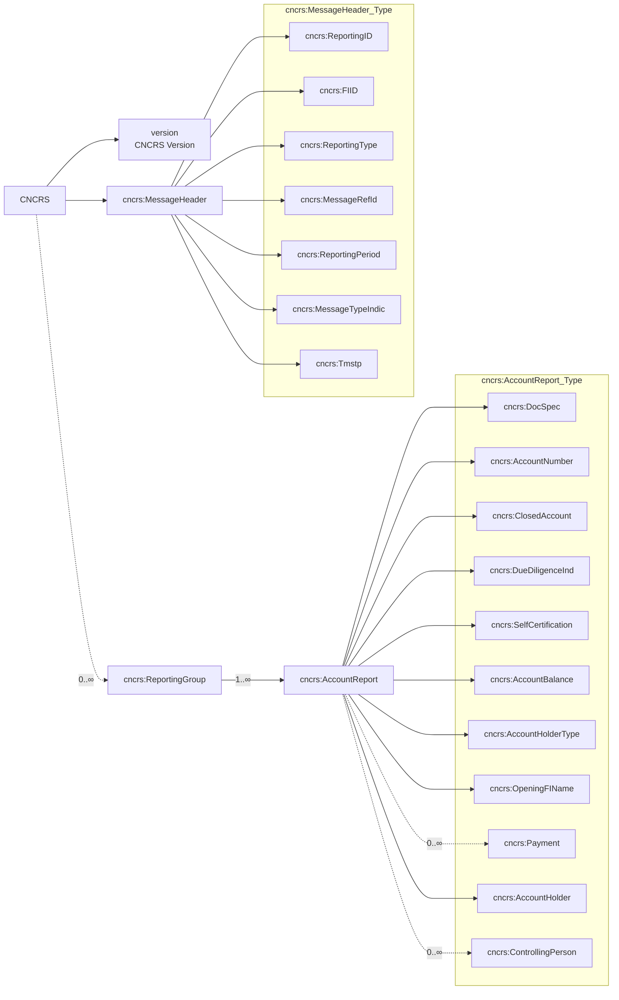
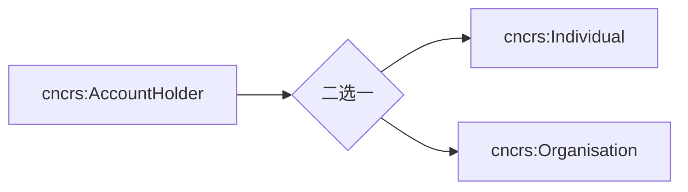
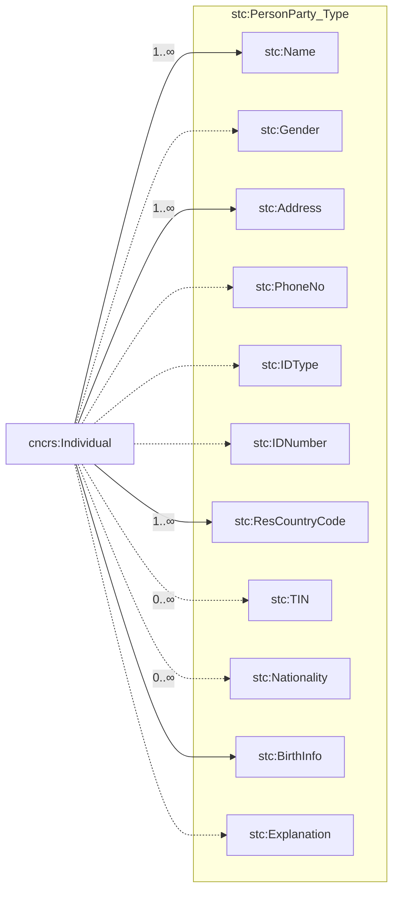
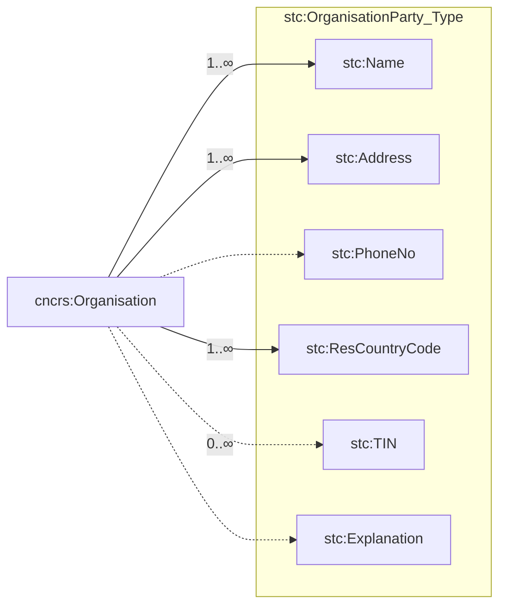
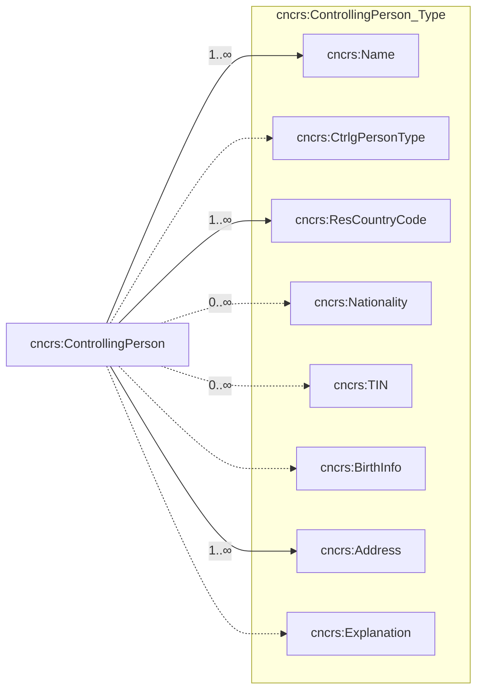
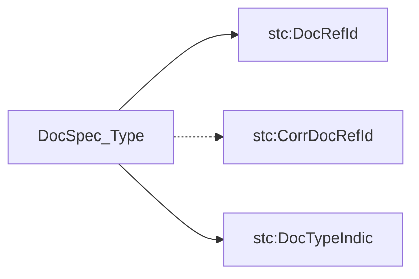
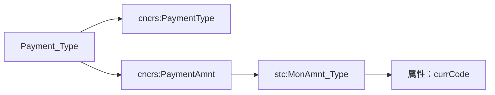
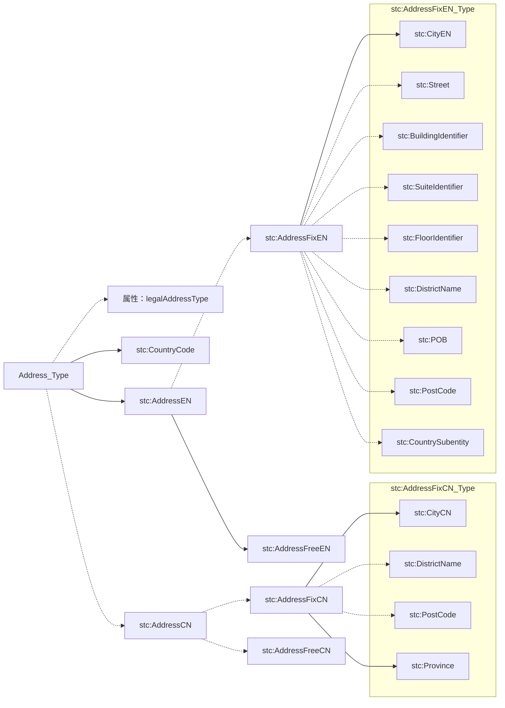
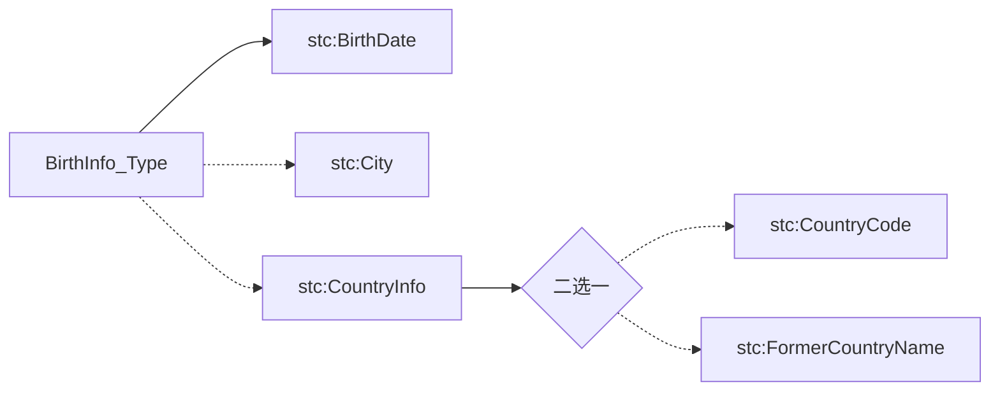

# 非居民金融账户涉税信息报送接口规范 V4.0 — 原文

## 基本信息

| 项目 | 内容 |
|------|------|
| 来源 | 中国人民银行科技司，银科技〔2025〕17号 |
| 文档全名 | 银行业存款类金融机构非居民金融账户涉税信息报送接口规范 |
| 版本号 | V4.0 |
| 发布日期 | 2025年7月9日 |
| 印发机构 | 中国人民银行科技司 |
| 获取日期 | 2026-06-01 |
| 源格式 | PDF 扫描版 → OCR 转换 |
| 可更新页面 | [[03-实体/非居民金融账户涉税信息报送系统]] |

> 说明：源 PDF 为扫描版，本文件由 OCR 转换生成；表格和少数字符请以原 PDF 为准。OCR 识别错误已尽可能修复，但仍可能存在少量偏差。

---

## 通知正文

**中国人民银行（科技司）**

银科技〔2025〕17号

### 中国人民银行科技司关于印发《银行业存款类金融机构非居民金融账户涉税信息报送接口规范V4.0》的通知

中国人民银行上海总部金融服务二部科技处，各省、自治区、直辖市及计划单列市分行科技处；各政策性银行、国有大型商业银行、股份制商业银行（信息）科技部：

总行组织清算总中心修订形成《银行业存款类金融机构非居民金融账户涉税信息报送接口规范V4.0》，请遵照执行。

请人民银行各分支机构科技处将该接口规范转发给辖区内银行业金融机构。

联系人：成方金科 张海滨 18801235501 / 清算总中心 张弦 18817519395

附件：银行业存款类金融机构非居民金融账户涉税信息报送接口规范 V4.0

**中国人民银行科技司**

2025年7月9日

抄送：支付司、清算总中心、成方金科公司、成方金信公司。

---

## 接口修订说明

| 序号 | 章节 | 调整内容 |
|------|------|----------|
| 1 | 2.4.1 | 修改明确报告年度。 |
| 2 | 2.7.1 | 增加错误编码 FC0001（解密失败）。 ReportingPeriod 规定报送数据不局限于前一年度数据，但每一年数据需单独生成报告。 账户记录重复错误编码修改为 RC1103，同时账户记录重复错误由文件级错误修改为记录级错误。 个人账户持有人（Individual）中性别（Gender）由强制修改为可选。 个人账户持有人（Individual）中纳税人识别号（TIN）由可选修改为强制。 个人账户持有人（Individual）中出生信息（BirthInfo）由可选修改为强制。 机构账户持有人（Organisation）中纳税人识别号（TIN）由可选修改为强制。 控制人信息（ControllingPerson）中纳税人识别号（TIN）由可选修改为强制。 |
| 3 | 2.7.1 | 增加"如果账户持有人类别为 CRS101，应同时报送该账户持有人的非居民控制人信息"的说明。 增加有关消极非金融机构的控制人判定标准的说明。 增加有关个人账户持有人（Individual）、机构账户持有人（Organisation）和控制人信息（ControllingPerson）中地址（Address）的说明。 增加有关个人账户持有人（Individual）、机构账户持有人（Organisation）和控制人信息（ControllingPerson）中纳税人识别号（TIN）的说明。 |
| 4 | 2.7.3 | stc:BirthInfo-Type 中 CountryInfo 由强制变为可选。 stc:Address-Type 中英文详细地址（AddressFreeEn）长度由 500 修改为 200。 stc:Address-Type 中中文详细地址（AddressFreeCn）长度由 500 修改为 200。 |
| 5 | 2.8 | 修改图例。包括个人账户持有人、机构账户持有人、控制人信息和通用类型 stc:BirthInfo-Type。 |
| 6 | 2.7.1 | 增加有关账号（AccountNumber）"账号应与客户知晓的卡号一致，以便客户在其税收居民国申报相关信息"的解释说明。 |
| 7 | 2.7.3 | 修改 stc:Payment-Type 报送类型，增加金额口径说明。 |

---

## 目录

| 章节 | 标题 | 页码 |
|------|------|------|
| 1 | 前言 | 1 |
| 2 | 数据交换规范 | 2 |
| 2.1 | 数据交换方式 | 2 |
| 2.2 | 安全设计 | 2 |
| 2.3 | 报文概述 | 2 |
| 2.4 | 非居民金融账户涉税信息数据报文元素通用要求 | 3 |
| 2.4.1 | 银行发送批量报文的报文头及报文体描述 | 3 |
| 2.4.2 | 银行接收批量报文的报文头及报文体描述 | 5 |
| 2.4.3 | 银行发送回执报文的报文头及报文体描述 | 7 |
| 2.5 | 禁止字符 | 9 |
| 2.6 | 命名空间 | 9 |
| 2.7 | 报文信息描述 | 10 |
| 2.7.1 | 非居民金融账户涉税信息报文元素定义说明 | 10 |
| 2.7.2 | 非居民金融账户涉税信息报文校验结果报文元素定义说明 | 24 |
| 2.7.3 | 数据类型说明 | 26 |
| 2.8 | 结构图例 | 38 |
| 2.8.1 | 总体结构 | 38 |
| 2.8.2 | 消息头 | 39 |
| 2.8.3 | 账户信息 | 39 |
| 2.8.4 | 账户持有人 | 40 |
| 2.8.5 | 个人账户持有人 | 40 |
| 2.8.6 | 机构账户持有人 | 41 |
| 2.8.7 | 控制人信息 | 41 |
| 2.8.8 | 通用类型 stc:DocSpec-Type | 42 |
| 2.8.9 | 通用类型 stc:MonAmnt-Type | 42 |
| 2.8.10 | 通用类型 stc:Payment-Type | 42 |
| 2.8.11 | 通用类型 stc:NamePerson-Type | 43 |
| 2.8.12 | 通用类型 stc:NameOrganisation-Type | 43 |
| 2.8.13 | 通用类型 stc:Address-Type | 44 |
| 2.8.14 | 通用类型 stc:TIN-Type | 44 |
| 2.8.15 | 通用类型 stc:BirthInfo-Type | 45 |

---

## 1 前言

为贯彻落实《非居民金融账户涉税信息尽职调查管理办法》（国家税务总局、财政部、中国人民银行、中国银行业监督管理委员会、中国证券监督管理委员会、中国保险监督管理委员会公告 2017 年第 14 号公布），履行非居民金融账户涉税信息自动交换国际义务，规范银行业存款类金融机构（以下简称银行）非居民金融账户涉税信息报送工作，特制定本规范。本规范是在人民银行统一数据交换接口规范约束下，对人民银行与银行之间有关非居民金融账户涉税信息数据交换方法、规则的描述。

文档的主要读者：银行人员。

---

## 2 数据交换规范

### 2.1 数据交换方式

1. 银行应通过 TLQ 消息中间件方式实现与人民银行间非居民金融账户涉税信息数据的交换。
2. 银行应选用 TongLINK/Q V8.1 版本，所有银行应复用接入全国集中银行账户管理系统所使用的节点号。
3. 非居民金融账户涉税信息数据报文为批量报文。

### 2.2 安全设计

非居民金融账户涉税信息数据报文原文为 XML 格式，其余内容参照《中国人民银行办公厅关于发布〈全国集中银行账户管理系统接入接口规范-个人银行账户部分〉的通知》（银办发〔2016〕168 号）中"安全设计"章节。

### 2.3 报文概述

支持的报文清单：

**银行端发送报文清单：**

| 报文类别 | 描述 | 报文种类 |
|----------|------|----------|
| cams.013.001.01 | 非居民金融账户涉税信息报文 | 批量报文 |
| cams.002.001.01 | 接收反馈报文回执 | 回执报文 |
| cams.014.001.01 | 非居民金融账户涉税信息报文校验结果（人行校验）回执 | 回执报文 |
| cams.015.001.01 | 非居民金融账户涉税信息报文校验结果（税总校验）回执 | 回执报文 |

**银行端接收报文清单：**

| 报文类别 | 描述 | 报文种类 |
|----------|------|----------|
| cams.006.001.01 | 接收反馈报文 | 批量报文 |
| cams.016.001.01 | 非居民金融账户涉税信息报文校验结果（人行校验） | 批量报文 |
| cams.017.001.01 | 非居民金融账户涉税信息报文校验结果（税总校验） | 批量报文 |

数据交换过程中，数据交换文本语法必须为 Extensible Markup Language (XML) 1.0，各报文原文文件需采用 UTF-8 编码规范。

### 2.4 非居民金融账户涉税信息数据报文元素通用要求

#### 2.4.1 银行发送批量报文的报文头及报文体描述

**报文类型：**

| 位置 | 中文名称 | 是否是必须项 | 取值说明 |
|------|----------|:----------:|----------|
| msgType | 消息类型 | Y | TlqMsgInfo.FILE-MSG |

**报文头：**

| 序号 | 所属位置 | 中文名称 | 英文标示 | 长度 | 是否必须 | 值说明 |
|:---:|----------|----------|----------|:---:|:---:|--------|
| 1 | msgName | 报文标识号 | smsgid | 20 | Y | 银行系统简称（4位）+16位 Sequence |
| 2 | msgName | 版本号 | Smsgver | 4 | Y | 填写 v001 |
| 3 | msgName | 发送方节点号 | ssrcnode | 4 | Y | 人民银行下发给银行的4位节点号 |
| 4 | msgName | 接收方节点号 | sdesnode | 4 | Y | 人民银行的4位节点号 |
| 5 | msgName | 报文类型 | stype | 15 | Y | 参见 2.3 |
| 6 | UsrContext | 发送方应用 | ssapp | 4 | Y | 银行系统简称（4位） |
| 7 | UsrContext | 接收方应用 | sgapp | 4 | Y | CAMS |
| 8 | UsrContext | 报文参考号 | smsgref | 20 | N | 无分片填写 20 个 0；有分片填写第一个报文的 id |
| 9 | UsrContext | 业务数据日期 | sdatatime | 8 | Y | 当前业务日期格式（yyyyMMdd） |
| 10 | UsrContext | 报文发送方法人金融机构编码 | ssrcbankcode | 14 | Y | 发送方法人机构的14位金融机构编码 |
| 11 | UsrContext | 报文分片序号 | sfilenum | 3 | Y | 无分片填写 000 |
| 12 | UsrContext | 报文文件总分片数 | sfiletot | 3 | Y | 无分片填写 000 |

**报文体：**

| 位置 | 中文名称 | 是否是必须项 | 取值说明 |
|------|----------|:----------:|----------|
| msgContent | 报文体内容 | Y | 文件名规则：`<报文类型><前缀><金融机构注册码><报告年度><顺序编号>.dat` 报文类型：不含符号"."，如报文类型为 `cams.001.001.02`，则此处应为 `cams00100102`。 前缀：2位英文字母，代表文件类型。银行端发送的数据报文前缀为 `RE`。 金融机构注册码：发送报文的各银行总行14位金融机构编码，如数据报送方式为代报，则应填写代报银行的金融机构编码。例如某村镇银行由其发起行代报数据，则应填写发起行总行的金融机构编码。 报告年度：YYYY（执行报送数据动作的年度，如2018年报送2017年的数据，则该报告年度填写2018。如果2021年补报2017年的数据，则报告年度填写2021。） 顺序编号：9位，第1位区分账户尽职调查规则，存量账户尽职调查规则用 P 表示，新开账户尽职调查规则用 N 表示，后8位为顺序号，从00000001开始编号，同一银行发送的报文中，P 和 N 各自的顺序号不能重复（可以出现 N00000001 和 P00000001 的情况）。 文件名中不包括 `<>` 字符。 例：`cams01300101REC12345678901232018N00000001.dat` |

#### 2.4.2 银行接收批量报文的报文头及报文体描述

**报文类型：**

| 位置 | 中文名称 | 是否是必须项 | 取值说明 |
|------|----------|:----------:|----------|
| msgType | 消息类型 | Y | TlqMsgInfo.FILE-MSG |

**报文头：**

| 序号 | 所属位置 | 中文名称 | 英文标示 | 长度 | 是否必须 | 值说明 |
|:---:|----------|----------|----------|:---:|:---:|--------|
| 1 | msgName | 报文标识号 | smsgid | 20 | Y | 银行系统简称（4位）+16位 Sequence；如有前序报文，则需与前序报文标识号一致 |
| 2 | msgName | 版本号 | Smsgver | 4 | Y | 填写 v001 |
| 3 | msgName | 发送方节点号 | ssrcnode | 4 | Y | 人民银行的4位节点号 |
| 4 | msgName | 接收方节点号 | sdesnode | 4 | Y | 人民银行下发给银行的4位节点号 |
| 5 | msgName | 报文类型 | stype | 15 | Y | 参见 2.3 |
| 6 | UsrContext | 发送方应用 | ssapp | 4 | Y | CAMS |
| 7 | UsrContext | 接收方应用 | sgapp | 4 | Y | 银行系统简称（4位） |
| 8 | UsrContext | 报文参考号 | smsgref | 20 | Y | 无分片填写 20 个 0；有分片填写第一个报文的 id |
| 9 | UsrContext | 业务数据日期 | sdatatime | 8 | Y | 当前业务日期格式（yyyyMMdd） |
| 10 | UsrContext | 报文发送方金融机构编码 | ssrcbankcode | 14 | Y | 发送方法人机构的14位金融机构编码 |
| 11 | UsrContext | 报文分片序号 | sfilenum | 3 | Y | 无分片填写 000 |
| 12 | UsrContext | 报文文件总分片数 | sfiletot | 3 | Y | 无分片填写 000 |

**报文体：**

| 位置 | 中文名称 | 是否是必须项 | 取值说明 |
|------|----------|:----------:|----------|
| msgContent | 报文体内容 | Y | 文件名规则： 1. 非居民金融账户涉税信息报文校验结果（人行校验）及非居民金融账户涉税信息报文校验结果（税总校验）结果报文命名规则：`<报文类型><前缀><金融机构注册码><报告年度><顺序编号>.dat`。 报文类型不含符号"."。 前缀：2位英文字母，银行端接收的校验结果报文前缀为 `AC`。 金融机构注册码：接收报文的各银行总行14位金融机构编码。 报告年度：YYYY。 顺序编号：该反馈报文与前序报文顺序编号一致。 例：如银行发送的新数据报告报文名为 `cams01300101REC12345678901232018N00000001.dat`，则人民银行校验结果反馈报文报文名为 `cams01600101ACC12345678901232018N00000001.dat`。 2. 接收反馈报文命名规则：在前序报文文件名加 `rr` 后缀。如前序报文文件名为 `cams01300101REC12345678901232018N00000001.dat`，则接收反馈报文文件名为 `cams01300101ACC12345678901232018N00000001rr.dat`。 |

#### 2.4.3 银行发送回执报文的报文头及报文体描述

**报文类型：**

| 位置 | 中文名称 | 是否是必须项 | 取值说明 |
|------|----------|:----------:|----------|
| msgType | 消息类型 | Y | TlqMsgInfo.BUF-MSG |

**报文头：**

| 序号 | 所属位置 | 中文名称 | 英文标示 | 长度 | 是否必须 | 值说明 |
|:---:|----------|----------|----------|:---:|:---:|--------|
| 1 | msgName | 报文标识号 | smsgid | 20 | Y | 银行系统简称（4位）+16位 Sequence；如有前序报文，则需与前序报文标识号一致 |
| 2 | msgName | 版本号 | Smsgver | 4 | Y | 填写 v001 |
| 3 | msgName | 发送方节点号 | ssrcnode | 4 | Y | 人民银行下发给银行的4位节点号 |
| 4 | msgName | 接收方节点号 | sdesnode | 4 | Y | 人民银行的4位节点号 |
| 5 | msgName | 报文类型 | stype | 15 | Y | 参见 2.3 |
| 6 | UsrContext | 发送方应用 | ssapp | 4 | Y | 银行系统简称（4位） |
| 7 | UsrContext | 接收方应用 | sgapp | 4 | Y | CAMS |
| 8 | UsrContext | 报文参考号 | smsgref | 20 | N | 无分片填写 20 个 0；有分片填写第一个报文的 id |
| 9 | UsrContext | 业务数据日期 | sdatatime | 8 | Y | 当前业务日期格式（yyyyMMdd） |
| 10 | UsrContext | 报文发送方金融机构编码 | ssrcbankcode | 14 | Y | 发送方法人机构的14位金融机构编码 |
| 11 | UsrContext | 报文分片序号 | sfilenum | 3 | Y | 无分片填写 000 |
| 12 | UsrContext | 报文文件总分片数 | sfiletot | 3 | Y | 无分片填写 000 |

**报文体：**

| 位置 | 中文名称 | 是否是必须项 | 取值说明 |
|------|----------|:----------:|----------|
| msgContent | 报文体内容 | N | 回执报文不需要报文体 |

---

### 2.5 禁止字符

以下字符和字符组合不得使用：

| 字符 | 字符组合 |
|------|----------|
| `&` | `--` |
| `<` | `/*` |
| | `&#` |

以下字符可以使用，但必须使用转义字符，否则反馈格式错误：

| 字符 | 转义字符 |
|------|----------|
| `>` | `&gt;` |
| `'` | `&apos;` |
| `"` | `&quot;` |

### 2.6 命名空间

| 前缀 | 命名空间 | 描述 |
|------|----------|------|
| `stc` | `http://aeoi.chinatax.gov.cn/crs/stctypes/v1` | 通用类型，例如姓名、地址等。 |
| `cncrs` | `http://aeoi.chinatax.gov.cn/crs/cncrs/v1` | 包括所有数据类型和数据元素。 |
| `res` | `http://aeoi.chinatax.gov.cn/crs/res/v1` | 包括反馈报文中所有元素。 |

---

### 2.7 报文信息描述

#### 2.7.1 非居民金融账户涉税信息报文元素定义说明

> 本节定义主报文（cams.013.001.01）的 XML 元素。命名空间为 `cncrs`，部分元素引用 `stc` 通用类型。

**（一）根元素与消息头（序号 1-10）**

| 序号 | 元素 | 命名空间 | 父节点 | 类型 | 长度 | 制约性 | 描述 | 错误代码及描述 |
|:---:|------|----------|--------|------|:---:|:---:|------|----------------|
| 1 | CNCRS | cncrs | — | — | — | 强制 | XML 版本 version="1.0"，需规定 stc 和 cncrs 命名空间。报文中各元素需按 2.7.1 和 2.7.3 顺序排列。 | FC0000：文档结构错误 FC0001：解密失败 |
| 2 | MessageHeader | cncrs | CNCRS | — | — | 强制 | 包含报送信息金融机构的系统用户账号、法人金融机构注册码、报告类型、序列号、报告期、数据类型、报告生成时间。 | FC0210：缺少MessageHeader元素 |
| 3 | ReportingGroup | cncrs | CNCRS | — | — | 强制/可选 | 包含一个或多个账户的具体信息。无数据申报可不报告该组数据，其他情况必须报告。 | FC0309：当数据类型为CRS703时报送ReportingGroup元素 FC0310：缺少ReportingGroup元素 |
| 4 | ReportingID | cncrs | MessageHeader | string | 14x | 强制 | 系统用户账号（银行法人金融机构编码），固定长度。当数据报送方式为代报时，应填写被代报银行法人金融机构编码。 | FC0401：ReportingID长度不正确 FC0402：ReportingID格式不正确 FC0403：ReportingID金融机构不存在 FC0404：ReportingID金融机构状态不正常 FC0406：非法人金融机构编码 FC0410：缺少ReportingID元素 |
| 5 | FIID | cncrs | MessageHeader | string | 14x | 强制 | 金融机构注册码（银行法人金融机构编码），固定长度。代报时填写被代报银行法人金融机构编码。 | FC0501：FIID长度不正确 FC0502：FIID格式不正确 FC0503：FIID金融机构不存在 FC0504：FIID金融机构状态不正常 FC0505：ReportingID与FIID不一致 FC0510：缺少FIID元素 |
| 6 | ReportingType | cncrs | MessageHeader | string | 5x | 强制 | 取值固定为"CRS"。 | FC0602：ReportingType格式不正确 FC0610：缺少ReportingType元素 |
| 7 | MessageRefId | cncrs | MessageHeader | string | 29x | 强制 | 文件名第13-41位。例：文件名为`cams01300101REC12345678901232018N00000001.dat`，则MessageRefId为`REC12345678901232018N00000001`。 | FC0701：MessageRefId长度不正确 FC0702：MessageRefId格式不正确 FC0703：MessageRefId与文件名13-41位不一致 FC0704：所属公历年度不正确 FC0710：缺少MessageRefId元素 |
| 8 | ReportingPeriod | cncrs | MessageHeader | date | — | 强制 | 所报送数据所属公历年度，每个报告（报文）应仅包含一个年度的数据。格式为"YYYY-12-31"。例：2021年报送2020年数据，填写2020-12-31。补报2019年数据应单独生成报告，ReportingPeriod填写2019-12-31。 | FC0802：ReportingPeriod格式不正确 FC0803：所属公历年度不正确 FC0810：缺少ReportingPeriod元素 |
| 9 | MessageTypeIndic | cncrs | MessageHeader | string | 6x | 强制 | 取值： CRS701：新数据 CRS702：修改和删除数据 CRS703：无数据申报 当为CRS703时不应有ReportingGroup，否则报文中必须包括ReportingGroup。 | FC0902：MessageTypeIndic格式不正确 FC0910：缺少MessageTypeIndic元素 |
| 10 | Tmstp | cncrs | MessageHeader | dateTime | — | 强制 | 报告生成时间。 | FC1002：Tmstp格式不正确 FC1010：缺少Tmstp元素 |

**（二）账户报告（序号 11-22）**

| 序号 | 元素 | 命名空间 | 父节点 | 类型 | 长度 | 制约性 | 描述 | 错误代码及描述 |
|:---:|------|----------|--------|------|:---:|:---:|------|----------------|
| 11 | AccountReport | cncrs | ReportingGroup | — | — | 强制 | 账户的具体信息。可重复（1至无穷）。同一开户银行法人、同一报告年度的两个记录的账号和账户持有人名称都相同时为重复记录。 | RC1103：账户记录重复 FC1110：缺少AccountReport元素 |
| 12 | DocSpec | cncrs | AccountReport | DocSpec_Type | — | 强制 | 账户记录标识信息。 | RC1210：缺少DocSpec元素 |
| 13 | AccountNumber | cncrs | AccountReport | string | 32x | 强制 | 账号或者类似信息，1-32位。账号应与客户知晓的卡号或账号一致，以便客户在其税收居民国申报相关信息。 | RC1301：AccountNumber长度不正确 RC1310：缺少AccountNumber元素 |
| 14 | ClosedAccount | cncrs | AccountReport | boolean | — | 强制 | true：账户已注销；false：正常户。首次报送时，2017年6月30日（含）前已经销户的非居民金融账户信息无需报送；2017年7月1日（含）之后销户的需报送。 | RC1402：ClosedAccount格式不正确 RC1410：缺少ClosedAccount元素 |
| 15 | DueDiligenceInd | cncrs | AccountReport | string | 1x | 强制 | 账户类别：P：存量账户（按《管理办法》第十四条）；N：新开账户（按《管理办法》第十五条）。 | RC1502：DueDiligenceInd格式不正确 RC1503：文件名顺序编号首字母与DueDiligenceInd不一致 RC1510：缺少DueDiligenceInd元素 |
| 16 | SelfCertification | cncrs | AccountReport | boolean | — | 强制 | 是否取得自证声明。true：已取得；false：未取得。 | RC1602：SelfCertification格式不正确 RC1610：缺少SelfCertification元素 |
| 17 | AccountBalance | cncrs | AccountReport | stc:MonAmnt_Type | — | 强制 | 账户余额，小数点后两位数字。注销账户余额报0.00。如果为负值，则按0.00报送。 | RC1702：格式不正确 RC1703：账户已注销但余额不为0 RC1704：账户余额为负值 RC1710：缺少AccountBalance元素 |
| 18 | AccountHolderType | cncrs | AccountReport | string | 6x | 强制 | 取值： CRS100：个人账户 CRS101：有非居民控制人的消极非金融机构 CRS102：非居民机构，不包括消极非金融机构 CRS103：非居民消极非金融机构，但没有非居民控制人。 既是中国税收居民又是其他国家（地区）税收居民的情形，按照非居民报送。如果账户持有人类别为CRS101，应同时报送该账户持有人的非居民控制人信息。 | RC1802：AccountHolderType格式不正确 RC1810：缺少AccountHolderType元素 |
| 19 | OpeningFIName | cncrs | AccountReport | string | 14x | 强制 | 开户银行金融机构编码。 | RC1901：OpeningFIName长度不正确 RC1902：OpeningFIName格式不正确 RC1903：OpeningFIName金融机构不存在 RC1910：缺少OpeningFIName元素 |
| 20 | Payment | cncrs | AccountReport | stc:Payment_Type | — | 可选 | 账户收入。无Payment元素，表示该账户在该报告年度未取得应报送收入。可重复（0至无穷）；当年度合计收益为负数或0.00时，不得报送。 | — |
| 21 | AccountHolder | cncrs | AccountReport | — | — | 强制 | 账户持有人信息。 | RC2110：缺少AccountHolder元素 |
| 22 | ControllingPerson | cncrs | AccountReport | — | — | 强制/可选 | 控制人信息。当AccountHolderType为CRS101时为强制；否则为可选。可重复（0至无穷）。消极非金融机构的控制人根据《非居民金融账户涉税信息尽职调查管理办法》第十三条判定。 | RC2203：AccountHolderType为CRS101但未报送ControllingPerson RC2204：AccountHolderType为CRS101以外报送了ControllingPerson |

**（三）个人账户持有人 - Individual（序号 23-35）**

| 序号 | 元素 | 命名空间 | 父节点 | 类型 | 长度 | 制约性 | 描述 | 错误代码及描述 |
|:---:|------|----------|--------|------|:---:|:---:|------|----------------|
| 23 | Individual | cncrs | AccountHolder | — | — | 强制/可选 | 个人账户持有人信息。当AccountHolderType为CRS100时为强制，且报文中不得包括Organisation和ControllingPerson。 | RC2303：AccountHolderType为CRS100但未报送Individual RC2304：AccountHolderType为CRS100但报送了Organisation和ControllingPerson |
| 24 | Organisation | cncrs | AccountHolder | — | — | 强制/可选 | 机构账户持有人信息。当AccountHolderType为CRS100以外时为强制，且报文中不得包括Individual。 | RC2403：AccountHolderType为CRS100以外但报送了Individual RC2404：AccountHolderType为CRS100以外但未报送Organisation |
| 25 | Name | stc | Individual | stc:NamePerson_Type | — | 强制 | 姓名。可重复（1至无穷）。 | RC2510：缺少Name元素 |
| 26 | Gender | stc | Individual | string | 1x | 可选 | M：男；F：女；N：未说明性别。 | RC2602：Gender格式不正确 |
| 27 | Address | stc | Individual | stc:Address_Type | — | 强制 | 地址。应为其税收居民国的现居地址，如果没有现居地址可以填报邮寄地址。可重复（1至无穷）。 | RC2710：缺少Address元素 |
| 28 | PhoneNo | stc | Individual | string | 20x | 可选 | 联系电话。 | RC2801：PhoneNo长度不正确 RC2802：PhoneNo格式不正确 |
| 29 | IDType | stc | Individual | string | 5x | 可选 | 身份证件类型。格式：3位英文字母+2位阿拉伯数字。取值：ACC01第一代居民身份证、ACC02第二代居民身份证、ACC03临时身份证、ACC04中国护照、ACC05户口簿、ACC06村民委员会证明、ACC07学生证、ACC15港澳居民来往内地通行证、ACC16台湾居民来往大陆通行证、ACC17外国人永久居留证、ACC18边民出入境通行证、ACC19外国护照、ACC20其他。 | RC2902：IDType格式不正确 |
| 30 | IDNumber | stc | Individual | string | 30x | 可选 | 身份证件号码。第一代居民身份证和临时身份证可为15位或18位；第二代身份证必须为18位。 | RC3001：IDNumber长度不正确 RC3002：IDNumber格式不正确 |
| 31 | ResCountryCode | stc | Individual | string | 3x | 强制 | 税收居民国（地区）代码。格式：3位大写英文字母。参照《全国集中银行账户管理系统接入接口规范-个人银行账户部分》附表3国籍（地区）代码，其中ANT、XKD、XLE、ZZZ不得上报。可重复（1至无穷）。报送CRS信息时税收居民国不能仅为中国（CHN）。 | RC3102：ResCountryCode格式不正确 RC3110：缺少ResCountryCode元素 |
| 32 | TIN | stc | Individual | stc:TIN_Type | — | 强制 | 账户持有人在其税收居民国（地区）的纳税人识别号。如果税收居民国不发放纳税人识别号，可在此处填写开户证件号码。不能提供纳税人识别号的情况应占较少比例。日本、韩国、西班牙、中国香港、新加坡、美国等国家（地区）所有自然人都拥有纳税人识别号必须报送。根西、泽西等地可将社保号作为纳税人识别号。详情可参考 http://www.chinatax.gov.cn/chinatax/aeoi_index.html。可重复（0至无穷）。 | RC3210：缺少TIN元素 |
| 33 | Explanation | stc | Individual | string | 1000x | 强制/可选 | 如果客户表示未能获取纳税人识别号，填报客户说明的具体原因，中英文均可。如新增数据中没有填写TIN，则该项目为强制。 | RC3301：Explanation长度不正确 RC3302：Explanation格式不正确 RC3310：缺少Explanation元素 |
| 34 | Nationality | stc | Individual | string | 3x | 强制 | 国籍。格式：3位大写英文字母。参照《全国集中银行账户管理系统接入接口规范-个人银行账户部分》附表3国籍（地区）代码，其中ANT、XKD、XLE、ZZZ不得上报。可重复（1至无穷）。 | RC3402：Nationality格式不正确 RC3410：缺少Nationality元素 |
| 35 | BirthInfo | stc | Individual | stc:BirthInfo_Type | — | 强制 | 出生信息。 | RC3510：缺少BirthInfo元素 |

**（四）机构账户持有人 - Organisation（序号 36-41）**

| 序号 | 元素 | 命名空间 | 父节点 | 类型 | 长度 | 制约性 | 描述 | 错误代码及描述 |
|:---:|------|----------|--------|------|:---:|:---:|------|----------------|
| 36 | Name | stc | Organisation | stc:NameOrganisation_Type | — | 强制 | 机构名称。可重复（1至无穷）。 | RC3610：缺少Name元素 |
| 37 | Address | stc | Organisation | stc:Address_Type | — | 强制 | 地址。应为其税收居民国的现居地址，如果没有现居地址可以填报邮寄地址。可重复（1至无穷）。 | RC3710：缺少Address元素 |
| 38 | PhoneNo | stc | Organisation | string | 20x | 可选 | 联系电话。 | RC3801：PhoneNo长度不正确 RC3802：PhoneNo格式不正确 |
| 39 | ResCountryCode | stc | Organisation | string | 3x | 强制 | 税收居民国（地区）代码。格式：3位大写英文字母。参照附表3国籍（地区）代码，ANT、XKD、XLE、ZZZ不得上报。可重复（1至无穷）。 | RC3902：ResCountryCode格式不正确 RC3910：缺少ResCountryCode元素 |
| 40 | TIN | stc | Organisation | stc:TIN_Type | — | 强制 | 账户持有人在其税收居民国（地区）的纳税人识别号。除非账户持有人无居民国纳税人识别号，否则金融机构必须收集报送。如果税收居民国不发放纳税人识别号，可在此处填写开户证件号码。可重复（0至无穷）。 | RC4010：缺少TIN元素 |
| 41 | Explanation | stc | Organisation | string | 1000x | 强制/可选 | 如果客户表示未能获取纳税人识别号，填报客户说明的具体原因，中英文均可。如新增数据中没有填写TIN，则该项目为强制。 | RC4101：Explanation长度不正确 RC4102：Explanation格式不正确 RC4110：缺少Explanation元素 |

**（五）控制人信息 - ControllingPerson（序号 42-49）**

| 序号 | 元素 | 命名空间 | 父节点 | 类型 | 长度 | 制约性 | 描述 | 错误代码及描述 |
|:---:|------|----------|--------|------|:---:|:---:|------|----------------|
| 42 | Name | cncrs | ControllingPerson | stc:NamePerson_Type | — | 强制 | 控制人姓名。可重复（1至无穷）。 | RC4210：缺少Name元素 |
| 43 | CtrlgPersonType | cncrs | ControllingPerson | string | 6x | 可选 | 控制人类型。格式：3位英文字母+3位阿拉伯数字。取值：CRS801法人控制人-所有权、CRS802法人控制人-其他、CRS803法人控制人-高管人员、CRS804信托-委托人、CRS805信托-受托人、CRS806信托-监察人、CRS807信托-受益人、CRS808信托-其他控制人、CRS809其他-等同于委托人、CRS810其他-等同于受托人、CRS811其他-等同于监察人、CRS812其他-等同于受益人、CRS813其他-等同于其他控制人。 | RC4302：CtrlgPersonType格式不正确 |
| 44 | Nationality | cncrs | ControllingPerson | string | 3x | 可选 | 国籍。3位大写英文字母。参照附表3国籍（地区）代码，ANT、XKD、XLE、ZZZ不得上报。可重复（1至无穷）。 | RC4402：Nationality格式不正确 |
| 45 | Address | cncrs | ControllingPerson | stc:Address_Type | — | 强制 | 地址。应为其税收居民国的现居地址，如果没有现居地址可以填报邮寄地址。可重复（1至无穷）。 | RC4510：缺少Address元素 |
| 46 | ResCountryCode | cncrs | ControllingPerson | string | 3x | 强制 | 税收居民国（地区）代码。如果账户持有人拥有多重税收居民身份，应分多个ResCountryCode元素报送。报送CRS信息时税收居民国不能仅为中国（CHN）。参照附表3国籍（地区）代码，ANT、XKD、XLE、ZZZ不得上报。可重复（1至无穷）。 | RC4602：ResCountryCode格式不正确 RC4610：缺少ResCountryCode元素 |
| 47 | TIN | cncrs | ControllingPerson | stc:TIN_Type | — | 强制 | 控制人在其税收居民国（地区）的纳税人识别号。如果税收居民国不发放纳税人识别号，可在此处填写开户证件号码。不能提供纳税人识别号的情况应占较少比例。详情可参考 http://www.chinatax.gov.cn/chinatax/aeoi_index.html。可重复（0至无穷）。 | RC4710：缺少TIN元素 |
| 48 | Explanation | stc | ControllingPerson | string | 1000x | 强制/可选 | 如果客户表示未能获取纳税人识别号，填报客户说明的具体原因。如新增数据中没有填写TIN，则该项目为强制。 | RC4801：Explanation长度不正确 RC4802：Explanation格式不正确 RC4810：缺少Explanation元素 |
| 49 | BirthInfo | cncrs | ControllingPerson | stc:BirthInfo_Type | — | 强制/可选 | 出生信息。新开账户：强制；存量账户：如果确实无法获取信息的可以选择，但应为少数情况。 | RC4910：缺少BirthInfo元素 |

---

#### 2.7.2 非居民金融账户涉税信息报文校验结果报文元素定义说明

> 校验结果报文（cams.016/cams.017）使用 `res` 命名空间。

| 序号 | 元素 | 命名空间 | 父节点 | 类型 | 长度 | 制约性 | 描述 |
|:---:|------|----------|--------|------|:---:|:---:|------|
| 1 | CNCRS | res | — | — | — | 强制 | XML版本version="1.0"，res命名空间：xmlns="http://aeoi.chinatax.gov.cn/crs/res/v1" |
| 2 | MessageHeader | res | CNCRS | — | — | 强制 | 与该反馈报文的前序报文一致 |
| 3 | ResultGroup | res | CNCRS | — | — | 强制 | 反馈结果 |
| 4 | ReportingID | res | MessageHeader | string | 14x | 强制 | 与该反馈报文的前序报文一致 |
| 5 | FIID | res | MessageHeader | string | 14x | 强制 | 与该反馈报文的前序报文一致 |
| 6 | MessageRefId | res | MessageHeader | string | 29x | 强制 | 与该反馈报文的前序报文一致 |
| 7 | Tmstp | res | MessageHeader | dateTime | — | 强制 | 该反馈报文的生成时间。格式为"YYYY-MM-DDTHH:mm:ss" |
| 8 | ResultType | res | ResultGroup | — | 1x | 强制 | 结果类型 |
| 9 | FErrCode | res | ResultGroup | string | 6x | 强制/可选 | 如果结果类型为F，则必须包括FErrCode；如果为F以外，则不能包括FErrCode。可重复（0至无穷）。 |
| 10 | AccountErrReport | res | ResultGroup | — | — | 强制/可选 | 如果结果类型为R，则必须包括AccountErrReport；否则不能包括。 |
| 11 | RecordErr | res | AccountErrReport | — | — | 强制 | 可重复（0至无穷） |
| 12 | DocRefId | res | AccountErrReport | string | 29x | 强制 | 账户记录编号 |
| 13 | RErrCode | res | AccountErrReport | string | 6x | 强制 | 账户记录错误代码，可重复（1至无穷） |

---

#### 2.7.3 数据类型说明

> 本节定义通用数据类型（stc 命名空间）。这些类型被主报文引用，定义各复杂元素的子结构和约束。

**stc:DocSpec_Type（账户记录标识）**

| 序号 | stc 类型 | 元素 | 属性 | 类型 | 长度 | 制约性 | 描述 | 错误代码及描述 |
|:---:|----------|------|------|------|:---:|:---:|------|----------------|
| 1 | stc:DocSpec_Type | DocRefId | — | string | 29x | 强制 | 账户记录编号，不得重复。格式：CN+4位年度信息+14位银行法人金融机构编码+9位数字序列号。例如 CN2017XXXXXXXXXXXXXX000000001。年度信息应与ReportingPeriod一致。代报时填写被代报银行法人金融机构编码。 | RS0101：DocRefId长度不正确 RS0102：DocRefId格式不正确 RS0103：DocRefId已存在 RS0104：年度信息与ReportingPeriod不一致 RS0110：缺少DocRefId元素 |
| 2 | | CorrDocRefId | — | string | 29x | 强制/可选 | 被修改或被删除的账户记录编号。新增文件不得包括此字段。 | RS0201-RS0207（见下方详述） |
| 3 | | DocTypeIndic | — | string | 2x | 强制 | 取值：R1新增数据、R2修改账户记录、R3删除账户记录。当MessageTypeIndic为CRS701时DocTypeIndic为R1；当MessageTypeIndic为CRS702时DocTypeIndic为R2或R3。 | RS0302：DocTypeIndic格式不正确 RS0303：DocTypeIndic与MessageTypeIndic对应关系不正确 RS0310：缺少DocTypeIndic元素 |

> **CorrDocRefId 完整错误代码**：RS0201长度不正确、RS0202格式不正确、RS0203本年度不存在、RS0204新增数据不报送该项目、RS0205修改/删除数据需报送、RS0206若CorrDocRefId对应数据为R3则不得再次被修改/删除、RS0207若对应数据不为R3且曾被修改，则不得修改/删除。

**stc:MonAmnt_Type（金额类型）**

| 序号 | stc 类型 | 属性 | 类型 | 长度 | 制约性 | 描述 | 错误代码及描述 |
|:---:|----------|------|------|:---:|:---:|------|----------------|
| 4 | stc:MonAmnt_Type | currCode | string | 30x | 强制 | 货币代码：3位大写英文字母。取值见ISO 4217。 | RS0401：MonAmnt_Type长度不正确 RS0402：MonAmnt_Type格式不正确或其属性currCode格式不正确 |

**stc:Payment_Type（收入类型）**

| 序号 | stc 类型 | 元素 | 类型 | 长度 | 制约性 | 描述 | 错误代码及描述 |
|:---:|----------|------|------|:---:|:---:|------|----------------|
| 5 | stc:Payment_Type | PaymentType | string | 6x | 强制 | 收入类型。取值：CRS501股息、CRS502利息、CRS503销售或者赎回总收入、CRS504其他。对于收益不是"利息"的账户（比如自营理财），可将卖出（赎回）总收入按照CRS503类型报送。 | RS0502：PaymentType格式不正确 RS0510：缺少PaymentType元素 |
| 6 | | PaymentAmnt | stc:MonAmnt_Type | — | 强制 | 收入金额，小数点后两位数字。当收入类型为CRS503时，金额为全年卖出（赎回）的累计总额。 | RS0602：PaymentAmnt格式不正确 RS0610：缺少PaymentAmnt元素 |

**stc:NamePerson_Type（个人姓名类型）**

| 序号 | stc 类型 | 元素 | 属性 | 类型 | 长度 | 制约性 | 描述 | 错误代码及描述 |
|:---:|----------|------|------|------|:---:|:---:|------|----------------|
| 7 | stc:NamePerson_Type | — | nameType | — | — | 可选 | nameType为姓名类型。取值：OECD202个人姓名、OECD203别名、OECD204昵称、OECD205亦称作(aka)、OECD208出生姓名。 | RS0702：nameType格式不正确 |
| 8 | | LastName | — | string | 100x | 强制 | 法定英文（拼音）姓。身份证件只有中文的，填写拼音。 | RS0801-0810 |
| 9 | | MiddleName | — | string | 100x | 可选 | 英文中间名。可重复（0至无穷）。 | RS0901-0902 |
| 10 | | FirstName | — | string | 100x | 强制 | 法定英文（拼音）名。如果法定姓名是单名，不区分姓和名，则在FirstName中填写"NFN"，在LastName中填写该单名。 | RS1001-1010 |
| 11 | | NameCN | — | string | 100x | 强制/可选 | 中文姓名，使用中文姓名开户的必须填报。 | RS1101-1102 |
| 12 | | PrecedingTitle | — | string | 200x | 可选 | 例如：His Excellency, Estate of the Late等。 | RS1201-1202 |
| 13 | | Title | — | string | 200x | 可选 | 例如：Mr, Dr, Ms, Herr等。可重复（0至无穷）。 | RS1301-1302 |
| 14 | | NamePrefix | — | string | 200x | 可选 | 例如：de, van, von等。 | RS1401-1402 |
| 15 | | GenerationIdentifier | — | string | 200x | 可选 | 例如：Jr, Third等。可重复（0至无穷）。 | RS1501-1502 |
| 16 | | Suffix | — | string | 200x | 可选 | 例如：PhD, VC, QC等。可重复（0至无穷）。 | RS1601-1602 |
| 17 | | GeneralSuffix | — | string | 200x | 可选 | 例如：Deceased, Retired等。 | RS1701-1702 |

**stc:NameOrganisation_Type（机构名称类型）**

| 序号 | stc 类型 | 元素 | 属性 | 类型 | 长度 | 制约性 | 描述 | 错误代码及描述 |
|:---:|----------|------|------|------|:---:|:---:|------|----------------|
| 18 | stc:NameOrganisation_Type | — | nameType | — | — | 可选 | 取值：OECD205亦称作(aka)、OECD206虚拟名称(dba)、OECD207法定名称。 | RS1802：nameType格式不正确 |
| 19 | | OrganisationNameEN | — | string | 200x | 强制 | 英文名称，只有中文名没有官方英文名的填写拼音。 | RS1901-1910 |
| 20 | | OrganisationNameCN | — | string | 200x | 强制/可选 | 中文名称，使用中文名称开户的必须填报，没有中文名称的可不填写。 | RS2001-2010 |

**stc:Address_Type（地址类型）**

| 序号 | stc 类型 | 元素 | 属性 | 类型 | 长度 | 制约性 | 描述 | 错误代码及描述 |
|:---:|----------|------|------|------|:---:|:---:|------|----------------|
| 21 | stc:Address_Type | — | legalAddressType | — | — | 可选 | 地址类型。取值：OECD301居住地址或办公地址、OECD302居住地址、OECD303办公地址、OECD304注册地址、OECD305其他。 | RS2102：legalAddressType格式不正确 |
| 22 | | CountryCode | — | string | 3x | 强制 | 国家代码。3位大写英文字母。参照附表3，ANT、XKD、XLE、ZZZ不得上报。 | RS2202/RS2210 |
| 23 | | AddressEN | — | — | — | 强制 | 英文地址，包括固定格式和自由格式。新开账户必须同时填报固定格式和自由格式地址。存量账户可以选择只填报自由格式。 | RS2310 |
| 24 | | AddressCN | — | — | — | 可选 | 中文地址，包括固定格式和自由格式。 | — |
| 25 | | AddressFreeEN | — | string | 200x | 强制 | 英文详细地址，中国境内地址可填写拼音。AddressFreeEN是AddressFixEN的补充信息。已经填报了AddressFixEN的，也必须在AddressFreeEN中填报完整的地址信息。 | RS2501-2510 |
| 26 | | AddressFixEN | — | — | — | 强制/可选 | 新开账户强制，存量账户可选。 | RS2610 |
| 27 | | CityEN | — | string | 200x | 强制/可选 | 所在城市。中国境内地址填写直辖市、地级市或县级市拼音，境外地址填写英文。 | RS2701-2710 |
| 28 | | Street | — | string | 200x | 可选 | 街道。 | RS2801-2802 |
| 29 | | BuildingIdentifier | — | string | 100x | 可选 | 楼号。 | RS2901-2902 |
| 30 | | SuiteIdentifier | — | string | 100x | 可选 | 房门号。 | RS3001-3002 |
| 31 | | FloorIdentifier | — | string | 100x | 可选 | 楼层。 | RS3101-3102 |
| 32 | | DistrictName | — | string | 200x | 可选 | 区。 | RS3201-3202 |
| 33 | | POB | — | string | 50x | 可选 | 邮箱。 | RS3301-3302 |
| 34 | | PostCode | — | string | 10x | 可选 | 邮编。 | RS3401-3402 |
| 35 | | CountrySubentity | — | string | 200x | 可选 | 中国境内地址填写省/自治区/直辖市拼音，境外填写相应。 | RS3501-3502 |
| 36 | | AddressFreeCN | — | string | 200x | 可选 | 中文详细地址。 | RS3601-3602 |
| 37 | | AddressFixCN | — | — | — | 可选 | 中文固定格式地址。 | — |
| 38 | | Province | — | string | 6n | 强制/可选 | 省级行政区划代码，6位阿拉伯数字，采用每年12月民政部发布的"中华人民共和国县以上行政区划代码"。如果存在AddressFixCN则Province为强制。 | RS3802-3810 |
| 39 | | CityCN | — | string | 6n | 强制/可选 | 地市级行政区划代码。如果存在AddressFixCN则CityCN为强制。 | RS3902-3910 |
| 40 | | DistrictName（CN） | — | string | 6n | 可选 | 县级行政区划代码。 | RS4002-4003 |
| 41 | | PostCode（CN） | — | string | 10x | 可选 | 邮编。 | RS4101-4102 |

**stc:TIN_Type（纳税人识别号类型）**

| 序号 | stc 类型 | 属性 | 类型 | 长度 | 制约性 | 描述 | 错误代码及描述 |
|:---:|----------|------|------|:---:|:---:|------|----------------|
| 42 | stc:TIN_Type | issuedBy | string | 200x | 可选 | 表示发放识别号的国家（地区）代码。3位大写英文字母，参照附表3，ANT、XKD、XLE、ZZZ不得上报。 | RS4201-4202 |
| | | inType | — | — | — | 固定填写"TIN" | |

**stc:BirthInfo_Type（出生信息类型）**

| 序号  | stc 类型             | 元素                | 类型     |  长度  |  制约性  | 描述                                               | 错误代码及描述                                                                         |
| :-: | ------------------ | ----------------- | ------ | :--: | :---: | ------------------------------------------------ | ------------------------------------------------------------------------------- |
| 43  | stc:BirthInfo_Type | BirthDate         | date   |  —   |  强制   | 出生日期。格式：YYYY-MM-DD。出生日期应在合理范围内，不得早于1900年或晚于当前年份。 | RS4302：BirthDate格式不正确 RS4303：出生日期不合理（早于1900年或晚于当前日期） RS4310：缺少BirthDate元素 |
| 44  |                    | City              | string | 200x |  可选   | 出生城市。中国境内城市填写拼音，境外地址城市英文名称。                      | RS4401-4402                                                                     |
| 45  |                    | CountryInfo       | —      |  —   |  可选   | 若填写此项，则CountryCode和FormerCountryName填写其中一项。      | —                                                                               |
| 46  |                    | CountryCode       | string |  3x  | 强制/可选 | 出生国代码。3位大写英文字母，参照附表3，ANT、XKD、XLE、ZZZ不得上报。        | RS4602-4610                                                                     |
| 47  |                    | FormerCountryName | string | 200x | 强制/可选 | 出生国在标准定义范围内无法填写代码的，在本字段中填写出生国英文名称。               | RS4701-4702                                                                     |

---

### 2.8 结构图例

> 图例：实线表示主结构或必填关系，虚线表示可选关系；边上的 `0..∞`、`1..∞` 表示可重复次数；"二选一"表示 choice 结构。

#### 2.8.1 总体结构

#### 2.8.4 账户持有人选择结构

#### 2.8.5 个人账户持有人（Individual）

#### 2.8.6 机构账户持有人（Organisation）

#### 2.8.7 控制人信息（ControllingPerson）

#### 2.8.8 stc:DocSpec_Type

#### 2.8.10 stc:Payment_Type

#### 2.8.13 stc:Address_Type

#### 2.8.15 stc:BirthInfo_Type

---

## 勘误 / 版本差异

无。本文件为首个录入版本（V4.0）。

## 处理记录

- 2026-06-01：OCR 转录。修复了多处 OCR 断行、错字（如"账尸"→"账户"、"禾改"→"修改"、"Rit Ht A"→取值列表修复、"LF «"→"可重复"等）。少数 OCR 碎片已标注省略（"..."）。核心数据表（2.7.1 的 49 个元素、2.7.2 的 13 个校验元素、2.7.3 的 47 个数据类型元素）已完整转录。
