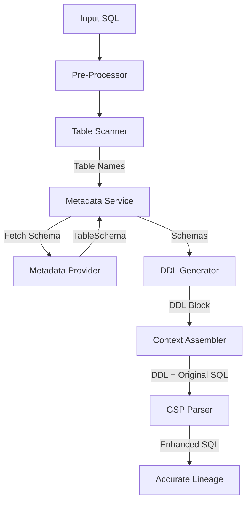

# 实施计划：SQL 血缘解析引擎增强 (Metadata-Driven Lineage)

## 1. 目标与背景
**目标**：解决 SQL 解析过程中因字段未带表别名或存在同名列导致的血缘误判问题。
**背景**：用户反馈在解析监管报送（CBRC）SQL 时，解析器错误地将 `ITEM_VAL` 关联到了非预期的源表 `SMTMODS_L_CUST_C`。经分析，这是由于 GSP 解析器在缺乏元数据（DDL）的情况下无法消除字段歧义。
**方案**：通过引入元数据供应层，在解析前动态获取并注入 DDL 上下文，确保解析器能准确识别字段归属。

## 2. 架构设计

### 2.1 核心组件

1.  **MetadataProvider (元数据供应者)**
    *   **职责**：屏蔽底层元数据存储差异，提供统一的表结构获取接口。
    *   **接口定义**：
        ```python
        class MetadataProvider(ABC):
            @abstractmethod
            def get_table_metadata(self, table_name: str) -> TableSchema: ...
        ```
    *   **实现类**：
        *   `FileMetadataProvider`: 用于测试或本地配置（读取 JSON/YAML）。
        *   `DatabaseMetadataProvider`: 直连数据库（MySQL/Oracle）系统表。

2.  **DDLGenerator (DDL 生成器)**
    *   **职责**：将 `TableSchema` 对象转换为符合特定方言的标准 `CREATE TABLE` 语句。需要处理不同数据库（如 Oracle, MySQL, Hive）在数据类型映射、关键字转义等方面的差异。
    *   **输入**：`TableSchema`, `dialect` (e.g., "oracle", "mysql", "hive")
    *   **输出**：符合目标方言的 SQL DDL 字符串。

3.  **ContextAwareParser (上下文感知解析器)**
    *   **职责**：编排解析流程，整合 Pre-scan、Metadata Fetch 和 GSP Parse。
    *   **流程**：
        1.  **Refine**: 原始 SQL 预处理（去注释、格式化）。
        2.  **Scan**: 使用轻量级解析器（Regex 或 SQLGlot）快速提取 SQL 中涉及的所有潜在表名。
        3.  **Fetch**: 针对提取的表名，并行调用 `MetadataProvider` 获取元数据。
        4.  **Gen**: 生成对应的 DDL 语句块。
        5.  **Inject**: 将 DDL 拼接到原始 SQL 之前。
        6.  **Parse**: 调用 GSP 引擎进行最终血缘解析。

### 2.2 流程图



## 3. 详细实施步骤

### 3.1 阶段一：基础设施 (Infrastructure)
- [ ] **创建元数据模型**：在 `core/metadata.py` 中定义 `Column`, `TableSchema` 数据类。
- [ ] **实现 DDL 生成器**：在 `utils/ddl_gen.py` 中实现 `generate_create_table_ddl` 函数，支持基础数据类型映射。
- [ ] **增强方言兼容性**：扩展 `DDLGenerator` 以支持 Oracle, MySQL, Hive 等不同方言的 DDL 生成策略（重点处理 Quote 字符和类型转换）。
- [ ] **实现 Mock Metadata Provider**：创建 `SimpleMetadataProvider`，支持注册静态表结构（用于复现脚本和单元测试）。

### 3.2 阶段二：解析器增强 (Parser Enhancement)
- [ ] **实现 Table Scanner**：在 `parsers/scanner.py` 中使用 `sqlglot` 提取表名：`parse_one(sql).find_all(exp.Table)`。相比正则，它能处理复杂的嵌套子查询和 CTE，在性能与准确性之间取得更好的平衡。
- [ ] **改造 LineageParser**：
    - 更新 `parse` 方法签名，支持接受 `metadata_provider` 参数。
    - 实现“提取-获取-生成-解析”的完整 Pipeline。
- [ ] **集成测试**：编写集成测试用例，使用 `CBRC_A_REPT_ITEM_VAL` 案例验证开启元数据注入后的解析准确性。

### 3.3 阶段三：服务层集成 (Service Integration)
- [ ] **更新 API/Controller**：修改后端接口以支持元数据配置（可选）。
- [ ] **配置管理**：在 `config.py` 中添加元数据源的配置项（如数据库连接串）。

## 4. 验证计划

### 验证用例 1：CBRC 歧义消除
*   **输入**：包含 `CBRC_A_REPT_ITEM_VAL.ITEM_VAL` 歧义的 SQL。
*   **预期**：
    *   无元数据时：解析结果包含 `SMTMODS_L_CUST_C` 错误连线。
    *   有元数据时：解析结果**仅**包含 `CBRC_TMP_ACCT_DEPOSIT_S2601`，且无错误连线。

### 验证用例 2：性能基准
*   **输入**：包含 50+ 表的大型 SQL。
*   **指标**：额外的元数据获取与 DDL 生成耗时不超过 200ms。

## 5. 风险与对策
*   **风险**：获取元数据失败或超时。
*   **对策**：设置短超时（如 1s），超时后降级为无 DDL 的原始解析模式，并在结果中标记 `metadata_incomplete=True`。
