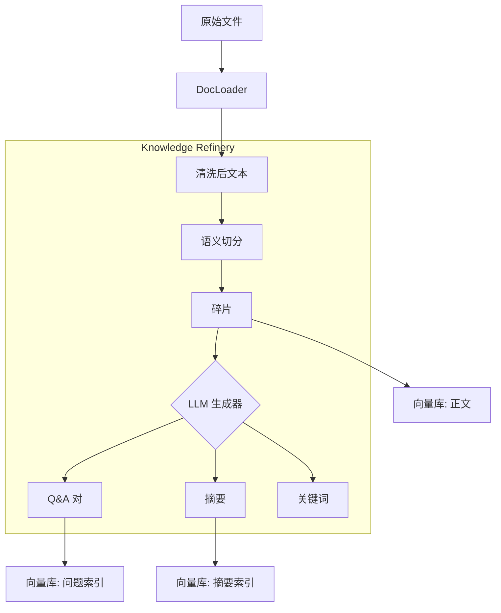

# 知识工程：构建专业级监管知识库

## 1. 核心理念：从“存文档”升级为“存知识”
传统的 RAG 只是简单地将文档切片入库，检索精度往往受限于切片质量。专业级知识库需要进行**知识工程 (Knowledge Engineering)** 处理。

## 2. 知识加工流水线 (Refinery Pipeline)

我们建议引入一个中间层 `refiner`，在 `Load` 和 `Vectorize` 之间对数据进行**深度加工**。

### A. 智能清洗 (Cleaning) - *已部分实现*
*   **去噪**: 去除页眉、页脚、版权声明、乱码。
*   **结构化**: 将表格还原为 Markdown，将无结构文本还原为段落。
*   **脱敏 (PII)**: 识别并替换敏感信息（人名、身份证号）。

### B. 语义切分 (Semantic Chunking)
*   **按语义切分**: 不再机械地按 500 字切分。而是根据标题 (Header)、段落 (Paragraph) 进行切分，保证每个 Chunk 是一个完整的语义单元。
*   **父子索引 (Parent-Child)**: 大的文档切成小块（Child）用于搜索，但返回时返回包含上下文的父块（Parent）。

### C. 知识增强 (Enrichment) - *核心差异化竞争力*
这是一般 RAG 和专业 RAG 的分水岭。
1.  **Q&A 生成 (Synthetic Q&A)**:
    *   利用 LLM 为每个文档块生成 3-5 个潜在问题。
    *   **存问题，找答案**。用户提问时，匹配的是“生成的问题”，匹配度极高。
    *   *Example*: 文档：“G01报表统计各项贷款余额...”，生成问题：“G01报表的统计范围包括什么？”
2.  **自动摘要 (Summarization)**:
    *   为长文档生成摘要索引。用户搜概略信息时命中摘要。
3.  **关键词提取 (Keyword Extraction)**:
    *   提取实体（如“CBRC”、“流动性风险”），作为元数据过滤条件。

## 3. 架构设计

## 4. 实施路线图

1.  [x] **L1: 基础清洗** (OCR纠错, 表格转MD)
2.  [x] **L2: 语义增强** (实现 `Refiner` 类，集成 Q&A 生成)
3.  [ ] **L3: 混合检索** (实现关键词 + 向量混合检索)
4.  [ ] **L4: 评估体系** (引入 Ragas 对知识库质量打分)

## 5. 建议下一步
优先实现 **L3: 混合检索**。
