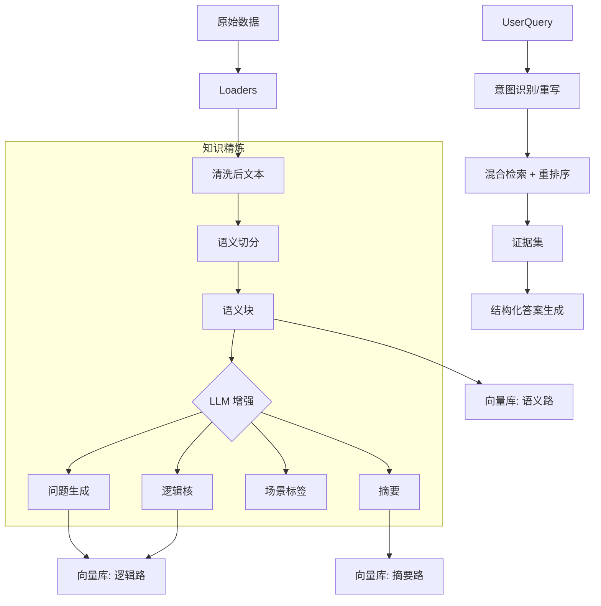

# 全息 RAG + 知识工程一体化方案（结合当前实现）

## 1. 背景与目标
在数据量有限或结构复杂的场景下，传统 RAG 往往出现“检索不精准、回答不够有建设性”的问题。本方案将“知识工程 + 全息数据增强 + 混合检索 + 结构化生成”整合为一体化架构，目标是：
- **精准**：命中用户真实意图，答案基于证据可追溯。
- **建设性**：输出可执行的建议或操作路径，同时明确边界与风险。
- **可治理**：可评估、可迭代，形成长期优化闭环。

## 2. 当前项目实现现状（映射到模块）
- **数据加载**：`DocLoader` / `SqlLoader` 支持文档、SQL、Excel、OCR；支持归档文件递归加载。
- **知识增强**：`KnowledgeRefiner` 已实现 Q&A 生成与逻辑核抽取，并区分语义路与逻辑路。
- **索引与检索**：`VectorStoreService` 已实现双路向量 + BM25 的混合检索，使用 Parent-Child 架构。
- **LLM 服务**：`LLMChainService` 可从后端拉取模型配置并记录 token 使用。
- **查询接口**：`/api/rag/query` 已返回检索结果，但当前回答生成仍是占位逻辑。

## 3. 关键差距（影响“精准 + 建设性”）
1. **回答生成缺失**：`QAService` 目前返回 “Retrieval Only”，缺少结构化生成与证据绑定。
2. **清洗逻辑弱化**：`DocLoader` 清洗流程部分被跳过，噪声文本影响检索质量。
3. **BM25 召回粒度粗**：目前为全局索引，缺乏按 `collection` 或元数据过滤的能力。
4. **参数与评分不透明**：`k` 未真正使用，返回的分数为模拟值，影响调参与评估。
5. **父子文档语义未完全分离**：父文档可能已被切分，导致上下文不完整。

## 4. 目标架构总览

## 5. 知识加工流水线（Refinery）
### 5.1 智能清洗（Cleaning）
- 去噪：页眉页脚、版权声明、乱码、重复段落。
- 结构化：表格转 Markdown；无结构文本按段落修复。
- 脱敏：敏感字段替换（姓名、账号、身份证等）。

### 5.2 语义切分（Semantic Chunking）
- 基于标题、段落和结构边界进行切分，避免机械长度切分。
- 保留父文档完整上下文，并对父文档生成子块用于检索。

### 5.3 全息增强（Enrichment）
- Q&A 自动生成（3-5 个即可，提升意图匹配）。
- 逻辑核抽取（为什么与怎么做）。
- 场景标签与关键词提取，用于过滤与路由。
- 生成摘要索引，优化“概览类问题”。

## 6. 检索与召回策略
### 6.1 双路向量 + 关键词混合检索
- **语义路**：回答“是什么”。
- **逻辑路**：回答“为什么、怎么做”。
- **BM25**：锁定专有名词与法规编号。
- **Ensemble 权重**：以 BM25 为高权重基础，语义与逻辑路为补充。

### 6.2 元数据过滤与路由
- 关键字段：`collection_name`, `report_code`, `doc_type`, `effective_date`, `owner_dept`。
- 意图识别后进行路由：例如“SQL 解释”路由至 SQL/血缘知识。

### 6.3 二阶段重排序（Rerank）
- 使用 Cross-Encoder 或 BGE-reranker 对 Top-N 进行重新排序，提高精度。

### 6.4 父子文档策略
- 检索使用子块，返回使用父块上下文。
- 父块应保持完整语义单元，不被过度切分。

## 7. 答案生成策略（建设性输出）
### 7.1 结构化回答模板
- **结论**：直接回答问题核心。
- **证据要点**：列出关键证据并引用来源。
- **建议/操作步骤**：可执行动作，标注证据或经验推断。
- **风险与边界**：指出适用范围与不确定性。
- **澄清问题**：当信息不足时提出具体补充项。

### 7.2 证据绑定与可解释性
- 每条关键结论必须对应证据来源；无证据的建议必须标注“经验推断”。
- 返回结构中显式输出来源与相似度。

### 7.3 Answerability Check
- 低置信回答触发“澄清问题优先”，避免误导。
- 基于检索结果覆盖率判断是否生成“建设性建议”。

## 8. 接口规范（建议标准化）
### 8.1 查询接口
- **Endpoint**: `POST /api/rag/query`
- **输入**: `query`, `k`, `collection_names`
- **输出**:
  - `answer`: 结构化回答（模板格式）
  - `results`: 证据列表（内容、来源、score、元数据）
  - `tags`: 场景标签
  - `confidence`: 置信度（建议新增）

### 8.2 入库接口
- **Endpoint**: `POST /api/rag/ingest`
- **参数**: `collection_name`, `filenames`, `enable_qa_generation`

## 9. 评估与运营
- **离线评估**：RAGAS + 自建评测集（50-100 条典型问题）。
- **在线监控**：命中率、召回率、用户满意度、低置信占比。
- **反馈闭环**：低置信问答进入补充知识池或标注队列。

## 10. 实施路线图（结合当前进度）
1. **L1 清洗与结构化**：已部分实现，但需恢复/强化清洗流程。
2. **L2 语义增强**：已实现 Q&A + 逻辑核生成。
3. **L3 混合检索优化**：完善 BM25 分库/过滤、引入 rerank。
4. **L4 评估体系**：引入 RAGAS 与在线监控指标。
5. **L5 结构化生成**：补齐回答生成、证据绑定与澄清问题逻辑。

## 11. 建议落地改造清单（短期优先）
- **QAService**：接入真实 LLM 生成与结构化输出。
- **DocLoader**：恢复清洗流程（OCR、表格修复、去噪）。
- **VectorStoreService**：BM25 按 collection 或 metadata 过滤；输出真实分数。
- **Query API**：启用 `k` 参数；增加 `confidence` 字段。
- **Parent-Child**：确保父块完整上下文，子块独立检索。

## 12. 预期价值
- **精准度提升**：多路召回 + rerank + 元数据过滤。
- **建设性增强**：结构化输出与证据绑定。
- **可运营性提高**：标准化评估与闭环优化。
